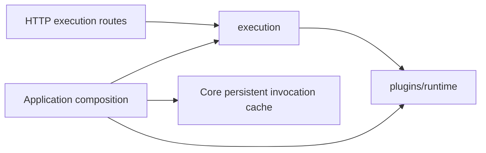

# Execution ownership

This package owns graph execution inside the API application. HTTP endpoints,
response models, and `RunResultPresenter` stay in `v1/routes/executions`.

| Module | Responsibility |
| --- | --- |
| `requests.py` | Durable run requests, graph-to-request conversion, and request validation. |
| `events.py` | Execution status and progress event contracts. |
| `models.py` | Compiled plans, prepared executions, and execution results. |
| `preflight.py` | Check submitted inputs and saved context before compilation. |
| `compiler.py` | Resolve nodes, releases, contracts, and graph edges into a plan. |
| `run_graph.py` | Coordinate preparation, nested runs, and sandbox cleanup. |
| `coordinator.py`, `node_execution.py`, `edge_values.py` | Schedule nodes, execute them, and resolve edge values. |
| `manager.py`, `admission.py`, `control.py` | Own run lifecycle, capacity, queue dispatch, events, and cancellation. |
| `history.py` | Persist and browse saved-graph execution history and recover queued work. |
| `materializations.py` | Validate and retain graph-output materializations. |
| `errors.py` | Preserve execution failure context across nested runs. |

Plugin admission, Docker execution, artifact staging, and egress live in
`grafy_api.plugins.runtime`. The portable persistent invocation-cache adapter
lives in `grafy_core.runtime.persistent_invocation_cache`, beside its core cache
contract. Application composition wires these owners together.

Queued recovery stores request JSON. Moving a model must preserve field names,
aliases, validation, and serialized values. The HTTP models module re-exports the
same request and event classes for existing Python clients; internal execution
code imports them directly from this package.

Remaining dependencies are explicit. Artifact access still uses the artifact
route service, module lookup still uses the catalog adapter, and the manager
still publishes through the collaboration hub. Their ownership and shared
transport-model cleanup remain separate audit items.

## Verify a package move

Run execution, API/client, and architecture tests. Compare OpenAPI with the
pre-change schema and exercise queued recovery, cancellation, and materialization.
Build both API and core wheels from clean generated build directories and inspect
their contents. Setuptools can retain deleted modules in an old `build/` directory;
a successful build alone does not prove that retired paths are absent.
