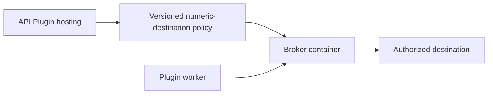

# Plugin egress broker

This application accepts the versioned numeric-destination policy from API
Plugin hosting and relays authorized HTTP, HTTPS, and PostgreSQL traffic. It
uses only the Python standard library. It has no API or core package dependency.

`src/grafy_plugin_egress_broker.py` owns policy parsing, bounded connections,
relaying, readiness, and command parsing. The wheel provides the
`grafy-plugin-egress-broker` command. The Docker image copies this same file to
`/opt/grafy/bin/grafy-plugin-egress-broker`, preserving the command path used by
API hosting. The image builds without installing the API or a Python package.



See [Docker deployment instructions](../../infra/docker/README.md#build-and-pin-the-first-party-egress-broker)
for the image build and digest configuration. Run the application contracts and
host integration unit tests from the repository root:

```sh
uv run pytest -q tests/unit/plugin_egress_broker tests/unit/api/test_plugin_egress.py tests/unit/api/runtime/test_plugin_docker_egress.py
```
