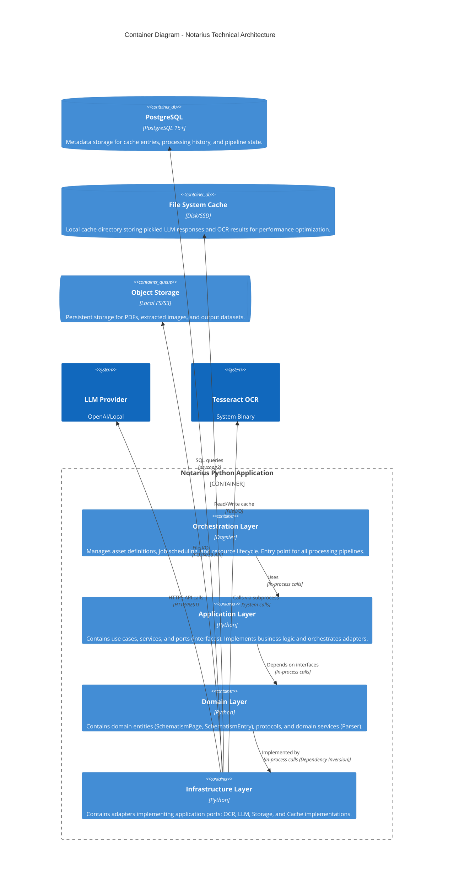
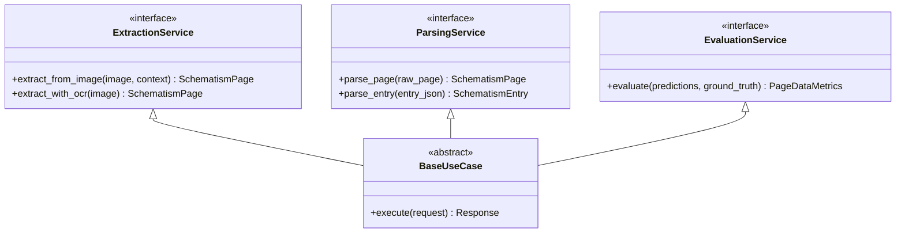
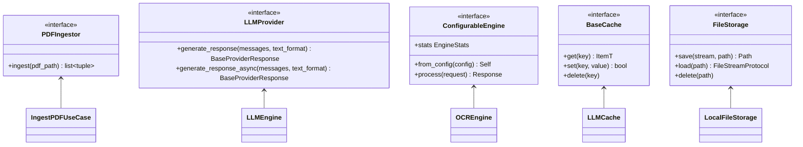
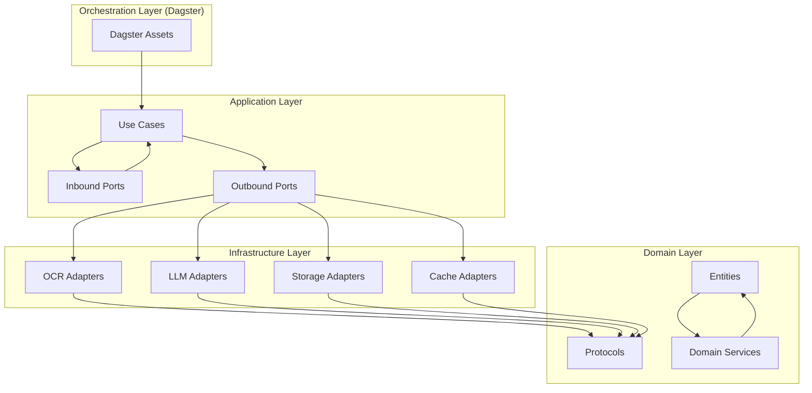
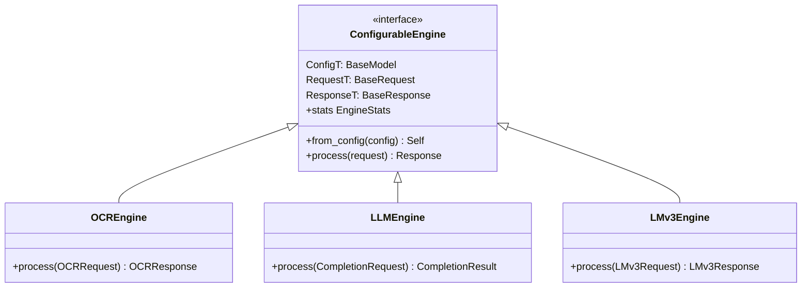
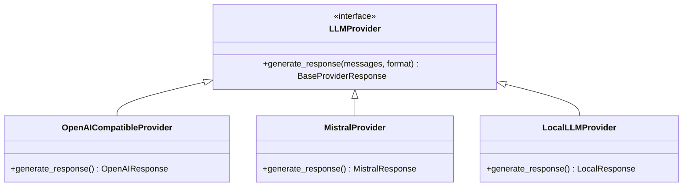
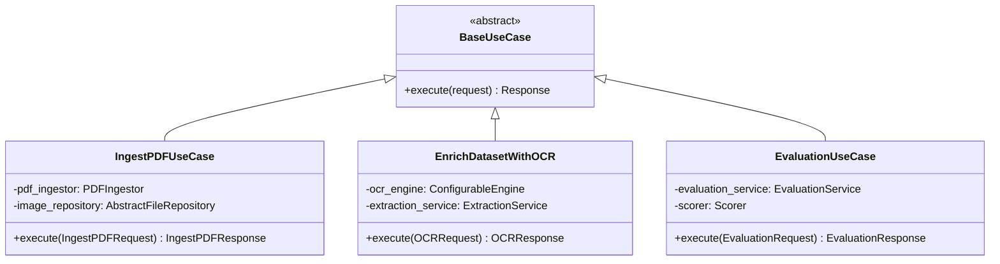
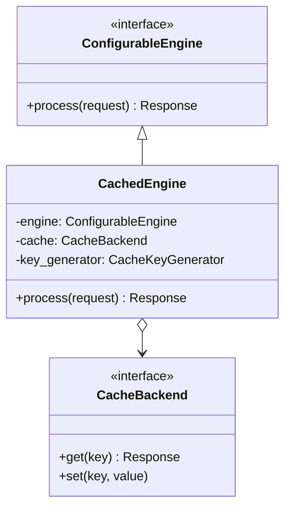
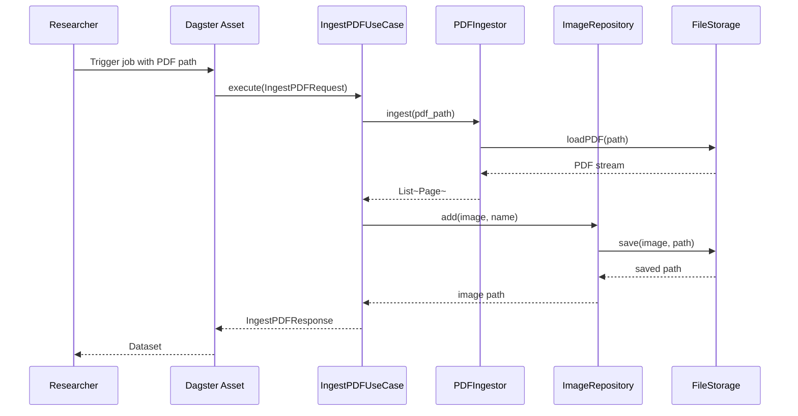
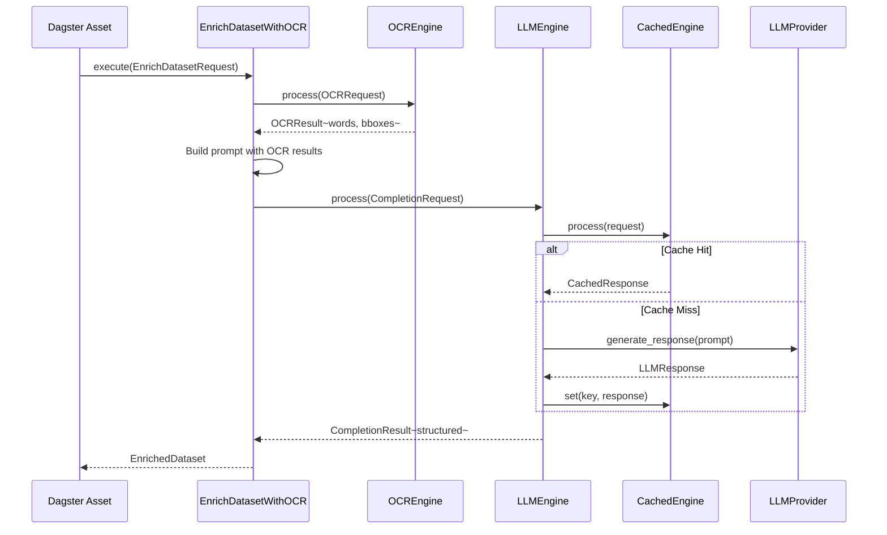

# Notarius Architecture Documentation

This document describes the Notarius system architecture using the C4 model, focusing on Context (C1), Container (C2), and Component (C3) diagrams. Notarius is a Historical Schematism Indexing & Extraction Engine built with a Hexagonal (Ports & Adapters) architecture pattern.

---

## 1. System Context (C1)

The System Context diagram shows the overall system scope and how it interacts with users and external systems.

```mermaid
C4Context
    title System Context Diagram - Notarius Historical Schematism Indexing

    Person_Ext(Researchers, "Historical Researchers", "Researchers at the Centre for Medieval Studies who need to extract and index data from historical schematism documents.")
    Person_Admin(Dagster, "Dagster Scheduler", "Automated scheduling system for batch processing pipelines.")

    System_Notarius(Notarius, "Notarius Engine", "Historical Schematism Indexing & Extraction Engine. Extracts structured data (deanery, parish, dedication, building material) from historical church documents using OCR, LayoutLMv3, and LLMs.")

    System_Ext_LLM(LLM Providers, "LLM APIs", "External LLM services (OpenAI-compatible, local models) for structured extraction and entity recognition.")
    System_Ext_Storage(Object Storage, "File Storage", "Persistent storage for PDFs, images, and extracted datasets.")
    System_Ext_DB(PostgreSQL, "PostgreSQL", "Metadata storage for tracking processed documents, cache entries, and pipeline state.")

    Rel(Researchers, Notarius, "Uploads PDFs", "HTTPS/REST")
    Rel(Dagster, Notarius, "Triggers batch jobs", "gRPC/HTTP")
    Rel(Notarius, LLM Providers, "Sends extraction prompts", "HTTPS")
    Rel(Notarius, Object Storage, "Reads/writes files", "Local/S3")
    Rel(Notarius, PostgreSQL, "Stores metadata", "SQL")
```

### C1 Description

| Element | Description |
|---------|-------------|
| **Researchers** | Primary users who upload historical schematism PDFs and receive structured extraction results. They interact with the system through Dagster job triggers or direct API calls. |
| **Dagster Scheduler** | Orchestration layer that schedules and runs batch processing pipelines for large-scale document processing. |
| **Notarius Engine** | Core application handling PDF ingestion, OCR processing, LayoutLMv3 inference, and LLM-based structured extraction. |
| **LLM Providers** | External large language model services used for complex entity extraction and validation tasks. Supports OpenAI-compatible APIs and local models. |
| **Object Storage** | File-based storage for input PDFs, intermediate images, and output datasets. |
| **PostgreSQL** | Relational database for persistent metadata storage including cache entries, pipeline state, and processing history. |

### C1 Relationships

1. **Researchers → Notarius**: Upload PDF documents and configure extraction parameters
2. **Dagster → Notarius**: Trigger automated batch processing jobs
3. **Notarius → LLM Providers**: Send extraction prompts for structured data extraction
4. **Notarius → Object Storage**: Read source PDFs, write extracted images and results
5. **Notarius → PostgreSQL**: Store processing metadata, cache entries, and pipeline state

---

## 2. Container Diagram (C2)

The Container diagram shows the high-level technical building blocks of the Notarius system.



### C2 Description

| Container | Responsibility | Technology |
|-----------|----------------|------------|
| **Orchestration Layer** | Dagster-based pipeline orchestration. Defines assets, jobs, and resources. Wires dependencies at runtime. | Dagster, Python |
| **Application Layer** | Implements use cases (ingestion, inference, evaluation), defines ports (interfaces), and contains application services. | Python, beartype |
| **Domain Layer** | Core domain entities (SchematismPage, SchematismEntry), protocols (BaseRequest, BaseResponse), and domain services (Parser). Pure business logic. | Python, Pydantic |
| **Infrastructure Layer** | Concrete implementations of application ports: OCR engines, LLM providers, storage adapters, and cache backends. | Python, pdfplumber, torch |
| **Object Storage** | Persistent file storage for PDFs, images, and datasets. | Local filesystem or S3-compatible |
| **File System Cache** | High-performance cache for LLM responses and OCR results using pickle serialization. | Disk/SSD |
| **PostgreSQL** | Structured metadata storage for pipeline state, cache metadata, and processing history. | PostgreSQL 15+ |

### C2 Key Technical Decisions

1. **Python 3.12** as the runtime with beartype for compile-time type checking
2. **Dagster** for orchestration enabling asset-based workflows and resource management
3. **Hexagonal Architecture** allowing infrastructure components to be swapped without changing core logic
4. **Dual Caching** strategy with filesystem cache (LLM responses) and PostgreSQL (metadata)
5. **Local Tesseract** for OCR with option to use cloud vision APIs

### C2 Technology Stack

| Category | Technologies |
|----------|--------------|
| **ML/OCR** | Tesseract, LayoutLMv3, PyTorch, Transformers |
| **LLM** | OpenAI, Compatible APIs, Llama.cpp |
| **Storage** | PostgreSQL, Local Filesystem, S3-compatible |
| **Orchestration** | Dagster |
| **Type Safety** | beartype, Pydantic |
| **Data Processing** | Pandas, Polars, pdfplumber, PyMuPDF |

---

## 3. Component Diagram (C3)

The Component diagram shows the internal structure of the Notarius application, organized by hexagonal architecture layers.

```mermaid
C4Component
    title Component Diagram - Notarius Hexagonal Architecture

    Container_Boundary(app, "Notarius Application", "Python") {
        
        Component(orchestration_assets, "Dagster Assets", "Python", "Entry points for pipelines. Wire dependencies via resource parameters.")
        Component(orchestration_jobs, "Dagster Jobs", "Python", "Job definitions combining assets into executable pipelines.")
        Component(orchestration_resources, "Resources", "Python", "Configurable resources (OCREngine, LLMEngine, Storage) injected into assets.")
        
        Component_Boundary(app_layer, "Application Layer") {
            Component(use_cases, "Use Cases", "Python", "Business workflow orchestration: IngestPDFUseCase, EnrichDatasetWithOCR, EvaluationUseCase.")
            Component(app_services, "Application Services", "Python", "Processors, Builders, Scorers implementing core business logic.")
            
            Component_Boundary(ports, "Ports (Interfaces)") {
                Component(inbound_ports, "Inbound Ports", "Python", "Primary/Driver ports: ExtractionService, ParsingService, EvaluationService.")
                Component(outbound_ports, "Outbound Ports", "Python", "Secondary/Driven ports: PDFIngestor, LLMProvider, ConfigurableEngine, BaseCache, FileStorage.")
            }
        }
        
        Component_Boundary(domain_layer, "Domain Layer") {
            Component(domain_entities, "Entities", "Python", "Domain models: SchematismPage, SchematismEntry, ChatMessage, PageContext.")
            Component(domain_protocols, "Protocols", "Python", "Interfaces: BaseRequest[T], BaseResponse[T], FileStreamProtocol.")
            Component(domain_services, "Domain Services", "Python", "Domain logic: Parser for data normalization.")
        }
        
        Component_Boundary(infra_layer, "Infrastructure Layer") {
            Component(ocr_adapters, "OCR Adapters", "Python", "Implementations: OCREngine (Tesseract), PDFPlumberIngestor.")
            Component(llm_adapters, "LLM Adapters", "Python", "Implementations: OpenAICompatibleProvider, LLMEngine, LLMCache.")
            Component(lmv3_adapters, "LMv3 Adapters", "Python", "Implementations: LMv3Engine for layout-aware extraction.")
            Component(storage_adapters, "Storage Adapters", "Python", "Implementations: LocalFileStorage, ImageRepository.")
            Component(cache_adapters, "Cache Adapters", "Python", "Implementations: PickleCache[T], CachedEngine decorator.")
        }
    }

    Rel(orchestration_assets, use_cases, "Creates and executes")
    Rel(orchestration_resources, outbound_ports, "Implements")
    Rel(use_cases, inbound_ports, "Implements")
    Rel(use_cases, outbound_ports, "Uses (Dependency Injection)")
    Rel(app_services, inbound_ports, "Implements")
    Rel(domain_entities, domain_protocols, "Uses")
    Rel(domain_services, domain_entities, "Operates on")
    Rel(outbound_ports, infra_adapters, "Implemented by")
    Rel(ocr_adapters, domain_protocols, "Depends on")
    Rel(llm_adapters, domain_protocols, "Depends on")
    Rel(storage_adapters, domain_protocols, "Depends on")
```

### C3 Layer Descriptions

#### 3.1 Orchestration Layer

The orchestration layer serves as the entry point for all processing pipelines. It uses Dagster to define assets and jobs, with resources providing configured instances of infrastructure adapters.

| Component | Responsibility | Location |
|-----------|----------------|----------|
| **Dagster Assets** | Entry points decorated with `@dg.asset`. Accept resource parameters for dependency injection. | `src/notarius/orchestration/assets/` |
| **Dagster Jobs** | Define executable pipelines by combining assets. Support configurable run parameters. | `src/notarius/orchestration/jobs/` |
| **Resources** | Configurable Dagster resources (OCREngine, LLMEngine, Storage) lifecycle-managed by Dagster. | `src/notarius/orchestration/resources/` |

#### 3.2 Application Layer

The application layer contains business workflow orchestration through use cases and defines the ports (interfaces) that infrastructure adapters must implement.

##### Inbound Ports (Primary/Driver Ports)

Inbound ports define what the application offers—the external API contracts that orchestration and other consumers can use.



##### Outbound Ports (Secondary/Driven Ports)

Outbound ports define external dependencies the application needs—these are implemented by the infrastructure layer.



#### 3.3 Domain Layer

The domain layer contains pure business logic with no dependencies on other layers. It defines entities, protocols, and domain services.

| Component | Description | Key Classes |
|-----------|-------------|-------------|
| **Entities** | Domain models representing core business concepts | `SchematismPage`, `SchematismEntry`, `PageContext`, `ChatMessage` |
| **Protocols** | Type-safe interfaces using Python Protocol pattern | `BaseRequest[T]`, `BaseResponse[T]`, `FileStreamProtocol` |
| **Domain Services** | Pure business logic operations | `Parser` (normalizes and maps extracted data) |

#### 3.4 Infrastructure Layer

The infrastructure layer contains concrete implementations of all outbound ports. These are the "adapters" in the Ports & Adapters pattern.

| Adapter Type | Implementations | Port Implemented |
|--------------|-----------------|------------------|
| **OCR** | `OCREngine` (Tesseract), `PDFPlumberIngestor` | `ConfigurableEngine`, `PDFIngestor` |
| **LLM** | `LLMEngine`, `OpenAICompatibleProvider`, `MistralProvider` | `LLMProvider` |
| **LayoutML** | `LMv3Engine` (LayoutLMv3 model) | `ConfigurableEngine` |
| **Storage** | `LocalFileStorage`, `ImageRepository` | `FileStorage`, `AbstractFileRepository` |
| **Cache** | `PickleCache[T]`, `LLMCache`, `CachedEngine` (decorator) | `BaseCache` |

### C3 Dependency Flow

The architecture enforces **strict inward-pointing dependencies** following the hexagonal pattern:



**Dependency Rules:**
1. **Orchestration → Application**: Assets create and execute use cases
2. **Application → Domain**: Application depends on domain protocols and entities
3. **Infrastructure → Domain**: Adapters depend on domain protocols (not the other way around)
4. **Domain has NO dependencies** on application or infrastructure layers

---

## 4. Key Design Patterns

### 4.1 Generic Engine Pattern

The `ConfigurableEngine` pattern provides a consistent interface for all ML/OCR engines:



### 4.2 Port/Adapter Pattern

Each outbound port has multiple adapters that can be swapped:



### 4.3 Use Case Pattern

Use cases follow the Command Handler pattern with constructor injection:



### 4.4 Caching Decorator Pattern

The `CachedEngine` decorator transparently adds caching to any engine:



---

## 5. Data Flow Examples

### 5.1 PDF Ingestion Flow



### 5.2 Structured Extraction Flow



---

## 6. File Structure Reference

```
src/notarius/
├── domain/                          # Domain Layer
│   ├── entities/                    # Domain models
│   │   ├── schematism.py           # SchematismPage, SchematismEntry
│   │   ├── completions.py          # BaseProviderResponse
│   │   └── messages.py             # ChatMessage
│   ├── protocols.py                # BaseRequest, BaseResponse, FileStreamProtocol
│   └── services/parser.py          # Parser domain service
│
├── application/                     # Application Layer
│   ├── ports/
│   │   ├── inbound/                # Primary ports (services)
│   │   │   ├── extraction_service.py
│   │   │   ├── parsing_service.py
│   │   │   └── evaluation_service.py
│   │   └── outbound/               # Secondary ports (external dependencies)
│   │       ├── pdf_ingestor.py
│   │       ├── llm_provider.py
│   │       ├── engine.py           # ConfigurableEngine
│   │       ├── cache.py
│   │       └── storage.py
│   ├── use_cases/                  # Use case implementations
│   │   ├── use_case.py             # BaseUseCase
│   │   ├── ingestion/
│   │   │   └── ingest_documents_from_pdf.py
│   │   └── inference/
│   │       ├── enrich_dataset_with_ocr.py
│   │       ├── enrich_dataset_with_lmv3_predictions.py
│   │       └── enrich_dataset_with_ocr_using_llm.py
│   └── services/                   # Application services
│       ├── processors/
│       ├── scoring/
│       └── builders/
│
├── infrastructure/                  # Infrastructure Layer
│   ├── ocr/
│   │   └── engine_adapter.py       # OCREngine
│   ├── llm/
│   │   ├── providers/
│   │   │   └── openai_provider/
│   │   │       └── adapter.py      # OpenAICompatibleProvider
│   │   └── engine_adapter.py       # LLMEngine
│   ├── ml_models/
│   │   └── lmv3/
│   │       └── engine_adapter.py   # LMv3Engine
│   ├── pdf/
│   │   └── pdfplumber_ingestor.py  # PDFPlumberIngestor
│   ├── persistence/
│   │   └── storage/
│   │       └── local.py            # LocalFileStorage, ImageRepository
│   └── cache/
│       └── adapters/
│           ├── ocr.py              # OCRAttributeValueCache
│           ├── llm.py              # LLMCache
│           └── lmv3.py             # LMv3Cache
│
├── orchestration/                   # Orchestration Layer (Dagster)
│   ├── assets/
│   │   ├── extract/
│   │   │   └── ingest.py           # raw__pdf__dataset asset
│   │   ├── transform/
│   │   │   └── predict.py          # Prediction assets
│   │   └── load/
│   │       └── export.py           # Export assets
│   ├── jobs/                       # Job definitions
│   │   └── prediction.py
│   ├── resources/                  # Configurable resources
│   │   ├── base.py
│   │   ├── storage.py
│   │   └── engines.py
│   └── defs/                       # Dagster definitions
│       ├── dev.py
│       └── definitions.py
│
├── schemas/                        # Configuration and data schemas
│   ├── configs/                    # Pydantic config models
│   └── data/                       # Data schemas
│
└── shared/                         # Shared utilities
    ├── constants.py
    ├── utils/
    └── logger.py
```

---

## 7. Adding New Components

### 7.1 Adding a New LLM Provider

1. **Create adapter** in `src/notarius/infrastructure/llm/providers/<name>/adapter.py`
2. **Implement** `LLMProvider` port interface
3. **Register** in provider factory if applicable
4. **No changes** needed to domain or application layers

### 7.2 Adding a New Storage Backend

1. **Create adapter** in `src/notarius/infrastructure/persistence/storage/`
2. **Implement** `FileStorage` port interface
3. **Configure** in Dagster resources
4. **Swap** at runtime without code changes

### 7.3 Adding a New Use Case

1. **Define port** in `src/notarius/application/ports/inbound/` if new capability needed
2. **Create use case** in `src/notarius/application/use_cases/`
3. **Wire** in Dagster asset with required adapters
4. **Add tests** using mocked ports

---

## 8. Architecture Summary

Notarius implements a **clean hexagonal architecture** with these key characteristics:

| Principle | Implementation |
|-----------|----------------|
| **Dependency Inversion** | Domain layer has no dependencies; infrastructure depends on domain protocols |
| **Explicit Ports** | Inbound and outbound ports clearly define layer boundaries |
| **Swappable Adapters** | Infrastructure adapters can be replaced without affecting core logic |
| **Testability** | Ports enable mocking of external dependencies for unit testing |
| **Orchestration** | Dagster provides clear entry points and resource management |
| **Type Safety** | beartype and Pydantic ensure compile-time type checking |

### Benefits Achieved

1. **Flexibility**: Easy to swap LLM providers, storage backends, or OCR engines
2. **Testability**: Core logic can be tested with mocked adapters
3. **Maintainability**: Clear separation of concerns per layer
4. **Extensibility**: New capabilities added via new adapters, not modification
5. **Deployability**: Dagster orchestration enables both local development and production deployment

---

*Document generated: January 2026*
*Architecture version: 1.0*
