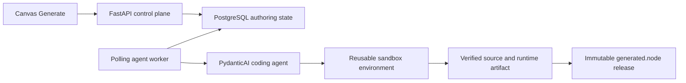
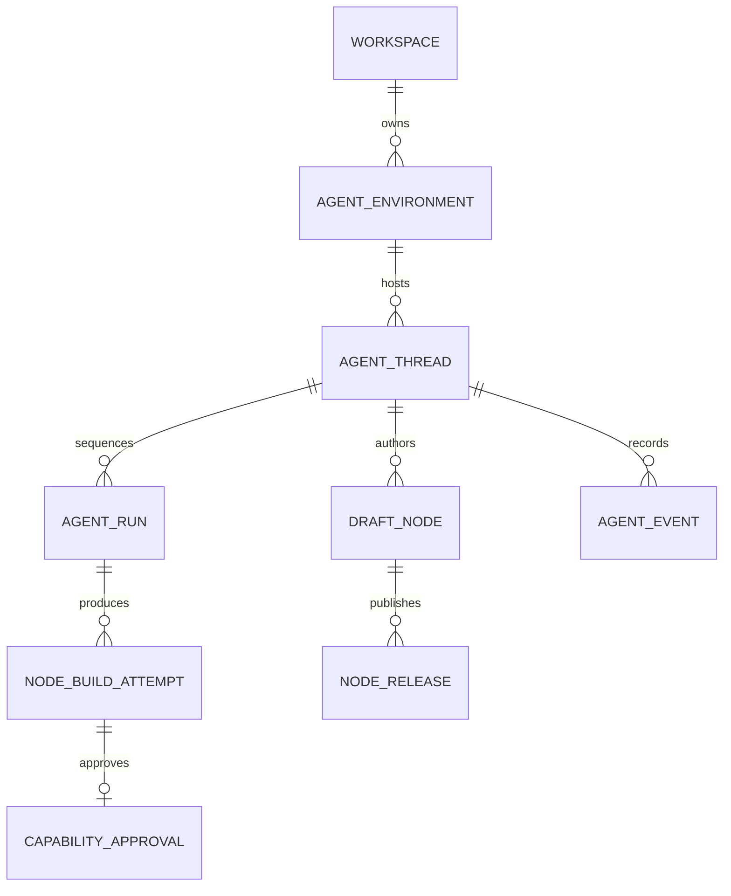
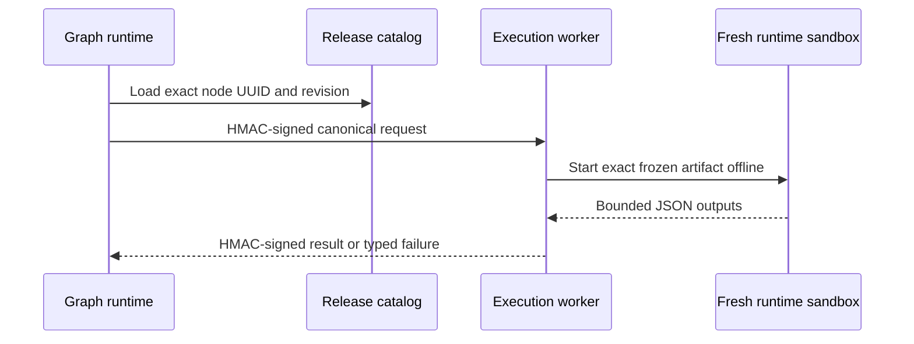
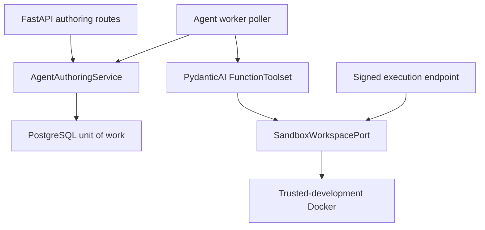

# Agent-authored nodes

- **Status:** Working prototype
- **Date:** 2026-08-16
- **Audience:** Engineers implementing canvas generation, agent authoring,
  sandbox environments, publication, and generated-node execution
- **Document type:** Explanation — implemented architecture and boundaries
- **Related:** [workspace plugins](workspace-plugins/README.md) (intended
  Plugin identity and canvas islands),
  [node discovery interaction](node-discovery-interaction.md),
  [backend architecture](backend-architecture.md),
  [realtime Workbench collaboration](workbench-realtime-collaboration.md)

## Summary

Grafy lets an editor end a port drag on empty canvas, choose **Generate**, and
describe the missing behavior in natural language. The API immediately creates
and connects a durable, non-runnable draft. A database-leased worker later runs
a PydanticAI coding agent in a reusable sandbox environment. The agent writes
real Python, manages a node-local `uv` project, and proposes an exact tested
bundle for human review. Publication turns that bundle into an immutable,
revisioned node release.

Generated nodes are not imported into FastAPI and are not registered through
Python plugin discovery. Both drafts and releases use the database-backed
operator identity `generated.node.<node UUID>@<revision>`. The graph compiler
resolves an exact published release from PostgreSQL for each run and delegates
its execution to an isolated worker. A new release therefore becomes available
without restarting the API.

That one-off identity is the implemented prototype. The intended grouping is a
uv-managed **Plugin** that can hold one node or many; see
[workspace plugins](workspace-plugins/README.md).



The prototype implements one generated node at a time from the canvas, plus
same-thread iteration over one or more existing drafts. Natural-language
composition of a whole graph, a shared `GraphToolService`, and a FastMCP
adapter over those graph functions are later work.

## Product interaction

### Generate from a port

1. The user drags an effective typed port onto empty canvas.
2. Contextual discovery offers **Generate a new node**, even when no installed
   catalog node is compatible.
3. The user supplies a prompt and either selects an environment and existing
   thread or creates a thread in that environment.
4. In one database unit of work, the server persists the draft, run, build,
   first event, graph node, and connecting edge.
5. The response returns immediately. The graph now contains a catalog-visible
   draft node with `runnable: false`.
6. A worker claims the run asynchronously. Closing the browser does not cancel
   it; cancellation is an explicit operation.
7. The browser follows durable, sequenced events over SSE and can reconnect
   with `Last-Event-ID` or `after_sequence`. The SSE endpoint itself polls the
   event table and emits heartbeats when there is no new state.
8. When verification succeeds, the user reviews the source, tests, lockfile,
   manifest, and requested runtime limits, then separately approves and
   publishes the build.

The browser's port description is not trusted as the contract. The server
loads the authorized collaborative graph head and current node registry, then
derives the anchor's direction, artifact type, shape, collection mode,
projection, conversion path, and plug. The generated manifest must preserve
that connected port.

### Iterate in the same thread

A thread is permanently bound to one environment and may own several draft
nodes. A follow-up run may target one or more of those drafts, so the agent can
reuse prior files, locked environments, and bounded durable conversation
context. Each target still has an independent project and build attempt.

Moving the conversation to another environment means creating a new thread.
The implementation does not silently replace the filesystem underneath an
existing thread.

## Durable model and identity



PostgreSQL stores environments, threads, drafts, runs, build attempts, ordered
events, capability approvals, and releases. A thread records the user request
and bounded lifecycle/tool progress needed to continue work; the prototype does
not claim to persist a provider-native model session or every raw model token.

### Generated node identity

The draft UUID is also the stable logical node UUID. Its operator id is:

```text
generated.node.<draft UUID>
```

Before the first publication, its proposed operator version is `1`. After
revision `n` is published, a follow-up build is authored as proposed revision
`n + 1`. Draft catalog entries remain non-runnable. Published catalog entries
become runnable only when their manifest fits the supported runtime contract
and the isolated execution worker is configured.

Graphs always pin an exact `(node UUID, revision)`. Publishing revision 1 makes
the already placed identity executable. Publishing a later revision atomically
promotes the selected graph node from `@n` to `@n + 1`; other graph instances
remain pinned to their existing release.

### Runs and build attempts

An agent run is the worker-owned unit and may target several drafts. A build
attempt is the per-draft result within that run. Their implemented lifecycles
are distinct:

```text
run:   queued -> claimed -> running -> awaiting_approval -> completed
       queued | awaiting_approval -> cancelled
       claimed | running -> cancelling -> cancelled
       running + expired lease -> interrupting -> interrupted
       claimed | running -> failed

build: queued -> preparing -> coding -> testing -> awaiting_approval -> published
       queued | preparing | coding | testing -> failed | cancelled
       awaiting_approval -> superseded
```

A build records its prompt, manifest, capabilities, digests, immutable artifact
references, and terminal failure. Revisions are created only by publication;
rerunning the agent creates a new build attempt, not a mutable release.

## Reusable environments and dependencies

An agent environment is a workspace-scoped logical development filesystem
backed by a sandbox provider. One thread has one environment, while an
environment can retain several threads and node projects. The database permits
only one active writer run per environment.

Every node has a separate project directory:

```text
workspace/nodes/<draft-node-id>/
    pyproject.toml
    uv.lock
    .venv/
    node.json
    src/node.py
    tests/
```

This is the mutable authoring workspace, not the publication source of truth.
Sharing the provider environment and package cache makes follow-up work fast,
while the separate project, lockfile, and virtual environment prevent two
generated nodes from sharing one mutable dependency graph.

Those directories are dependency and reproducibility boundaries, not security
boundaries: bounded argv commands run in the shared environment and can address
other paths available to that sandbox. Exact clean-room reconstruction, digest
verification, and human review remain the publication trust boundary.

The agent changes Python dependencies only through typed `uv` tools. Package
resolution and `uv sync --locked` may reach the profile's configured Python
package index. Tests and ordinary commands run with network access blocked.
Runtime execution never resolves or installs dependencies.

The current environment profile combines a provider-specific immutable base
identity with its resource and network policy digest. Trusted-development Docker
uses a configured image. Native OS-package installation, arbitrary package
indexes, and user-provided base images are not implemented by this slice.

## Coding agent and tools

The coding agent is a PydanticAI `Agent` backed by a configured
OpenRouter model. It receives the current request, target draft ids, and bounded
history reconstructed from durable runs and events. It calls an in-process
sequential `FunctionToolset`; it does not call Grafy's own MCP or HTTP API.

The implemented node-authoring tools are:

- bounded file read, write, and exact-text patch under an assigned node project;
- bounded argv execution with blocked network access;
- validated `uv add`, `uv lock`, `uv sync --locked`, and locked `pytest`;
- capability proposal; and
- release proposal after the current lock, sync, and test steps have passed.

Every file mutation invalidates the agent's local validation state. The agent
must rerun lock, sync, and tests after its last change before it can propose a
release. Tool calls carry the run lease and fencing token to the durable
control service, so a stale worker cannot finalize a build.

Graph editing tools are deliberately absent from this toolset. The canvas
creates the initial node and edge through the collaboration command API; a
general graph-composition agent comes later.

## PostgreSQL work queue, concurrency, and recovery

There is no message broker in this prototype. PostgreSQL is both the control
plane and the durable work queue.

- Workers poll provisionable environments, cancelling/interruption work,
  expired running leases, and claimable runs in bounded batches.
- PostgreSQL claims use row locks with `FOR UPDATE SKIP LOCKED`; SQLite is only
  a single-worker development fallback.
- A partial unique index permits at most one active run per environment, and a
  second partial index permits at most one active build per draft.
- A claim has a renewable lease token and monotonically increasing fencing
  token. Every state-changing worker operation verifies both.
- An expired claim may be reclaimed. An expired running lease is first moved
  to `interrupting`; the worker must revoke and verify provider execution
  before the database releases the environment writer.
- Cancellation follows the same two-phase rule: record intent and revoke the
  lease, kill and reap provider execution, then confirm `cancelled`.
- Source archives use immutable, digest-addressed storage and are checked again
  against the database fence before a release proposal is finalized.

This lets multiple workers serve concurrent clients without sharing a writable
environment. Global and per-workspace admission budgets, broker-backed wakeups,
and automatic scheduling across provider capacity are not yet implemented.

## Verification, review, and publication

The authoring environment is never trusted as the published artifact. A
successful proposal passes this pipeline:

```mermaid
flowchart LR
    Export["Export reviewed files"] --> Test["Disposable test workspace"]
    Test --> Verify["Lock check, locked sync, tests"]
    Verify --> Destroy["Destroy test workspace"]
    Destroy --> Runtime["Second clean runtime workspace"]
    Runtime --> Freeze["Exact sync, rehash, freeze artifact"]
    Freeze --> Review["Human review and capability approval"]
    Review --> Publish["Immutable DB release"]
```



1. The worker exports only `pyproject.toml`, `uv.lock`, `node.json`, `src/`, and
   `tests/`, then validates their archive shape and digests.
2. A disposable provider workspace imports those exact bytes. It runs
   `uv lock --check` without network, `uv sync --locked --no-build` with
   package-index-only network, and tests with network blocked.
3. The worker terminates every test process and destroys that entire workspace,
   including its virtual environment. A second clean workspace then imports the
   exact reviewed archive, repeats the lock check and wheel-only locked sync, but
   never runs agent-authored tests. It re-exports and verifies the exact source
   digest before freezing. Test code and source-distribution build hooks therefore
   cannot alter the published interpreter or installed packages.
4. The provider freezes an immutable runtime artifact whose identity includes
   the source digest, runtime image digest, and environment-profile digest. The
   lease fence marker is removed before the snapshot is taken.
5. Grafy persists the source, lock, test, implementation, build, runtime image,
   profile, and runtime-artifact digests. The review API revalidates these
   values and presents curated files and diffs.
6. Capability approval is tied to the exact build and capability digest.
   Publication creates an append-only `(workspace, node UUID, revision)`
   release and records actor, thread, environment, build, and approval
   provenance.

The durable source archive and release record are authoritative. The reusable
development filesystem can be discarded and recreated; execution uses the
frozen verified artifact, not the live authoring directory.

## Published execution

At graph compilation time, `generated.node.<UUID>@<revision>` is recognized as
a generated-node reference. The compiler loads that exact workspace release
from the database, validates its manifest and canonical build digest, and
constructs a dynamic typed Grafy node. This bypasses the static plugin registry,
which is why FastAPI does not need a restart.



The request includes a unique invocation id, workspace and graph-run context,
the exact node revision, canonical build document, build digest, and JSON
inputs. The API and worker authenticate canonical request and response bytes
with a shared HMAC key, enforce timestamp skew, bind signatures to the request
id, and reject request replay in the worker process.

For each invocation, the worker verifies the stored runtime-artifact identity,
creates a fresh isolated workspace from it, applies approved resource ceilings,
forces blocked network access with no secrets, and runs
`.venv/bin/python -I`. The runner bounds input, output, wall time, and process
creation, validates JSON output, terminates the session, and destroys the
ephemeral workspace. It does not invoke `uv`, install packages, or start a
per-node HTTP server.

## Capability boundary in the prototype

The domain model can describe outbound HTTPS origins, named secret references,
object-store scopes, and runtime resource limits. The executable prototype
supports only the runtime-limit portion.

A release proposal is rejected if `node.json` requests any outbound origin,
secret reference, or object-store access. The graph compiler and execution
worker repeat the same fail-closed check. This means a generated node can use
third-party Python packages that were locked during the build, but it cannot
yet make the runtime API call from the motivating example.

Supporting that example requires a separate least-privilege egress proxy,
request and response budgets, DNS/IP revalidation, scoped secret resolution,
and audit. Those capabilities must not be implemented by opening general
network access inside the node sandbox.

## Ports, adapters, and provider status

The application layer owns the authoring lifecycle and exposes narrow ports for
persistence, source storage, coding agents, clean-room verification, sandbox
workspaces, and generated-release execution. Framework and provider code stays
at the edges.



The Docker adapter is named `docker-trusted-development` and requires explicit
opt-in. It creates one reusable container per environment, defaults to blocked
egress, runs validated `uv` commands in a short-lived helper container with
bridge networking, uses a lease-fence marker for execution identity, and freezes
verified images for runtime use. It is not a production security boundary.

The in-memory adapter exists for deterministic behavioral tests. No other
sandbox providers are integrated in this prototype.

## Graph integration

Draft creation and its initial edge are accepted as one collaboration command
batch in the same database unit of work as the authoring state. This prevents a
durable draft without its graph placement, or a graph placeholder without an
authoring run. Server-side anchor resolution prevents the browser from forging
the connected type contract.

Publication of revision 1 uses the draft's reserved identity. Later
publication combines release creation and a compare-and-set graph operator
promotion in one unit of work. Collaborators receive the accepted command
through the existing graph room; a stale editor receives a conflict instead of
silently overwriting a newer graph revision.

## Implemented prototype scope

- Generate and immediately connect a non-runnable draft from a supported port.
- Create and reuse provider-backed environments and durable threads.
- Queue initial and follow-up runs through PostgreSQL polling.
- Author real Python with PydanticAI file, process, dependency, and release
  tools.
- Preserve one independent `uv` project and virtual environment per node.
- Recover claims with leases, fencing, and verified provider revocation.
- Verify exact source in a clean sandbox and freeze an offline runtime artifact.
- Review, approve, publish, catalog, compile, and execute exact immutable
  generated-node revisions without restarting FastAPI.

## Later work and non-goals

- Whole-graph natural-language composition from the canvas.
- A shared `GraphToolService` used by both a PydanticAI graph toolset and a
  FastMCP adapter. FastMCP is not part of the current node-authoring path.
- Runtime outbound HTTPS, secret resolution, and object-store capabilities.
- Global/workspace scheduling budgets and broker-backed worker wakeups.
- Automatic cross-environment thread migration.
- Native OS packages, custom user images, and arbitrary package indexes.
- Executing unpublished drafts or importing generated Python into FastAPI.
- Automatic capability approval or publication.
- Public marketplace distribution of generated releases.
- Treating validation, AST filtering, dependency scans, or a trusted local
  container as a substitute for an operating-system isolation boundary.
