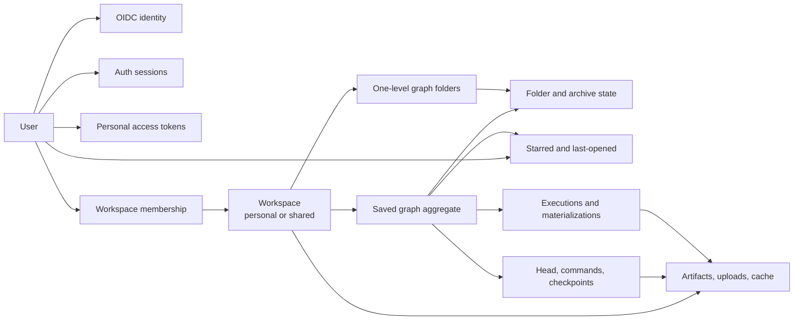

# Authentication and workspace tenancy

- **Status:** Accepted; Phase 0–6 implemented; Phase 7 operator release gate open
- **Date:** 2026-08-06
- **Audience:** Engineers changing identity, persistence, API, Workbench,
  collaboration, execution, MCP, or deployment
- **Document type:** Technical design explanation and reference
- **Related:** [Authenticated workspace ADR](../adr/0003-authenticate-users-and-scope-collaboration-to-workspaces.md),
  [server-authoritative collaboration ADR](../adr/0002-server-authoritative-workbench-collaboration.md),
  [realtime collaboration design](workbench-realtime-collaboration.md),
  [implementation plan](../plans/authentication-workspace-refactor.md), and
  [product vocabulary](../../CONTEXT.md)

## Summary

This design adds application identity, workspace tenancy, and continuing
authorization to Grafy. The implementation through Phase 6 matches this
contract; Phase 7 still needs live SSH/OIDC and backup/restore operator
rehearsal before calling the refactor release-ready.

The design makes these decisions:

1. Grafy uses `User`, `Workspace`, and `WorkspaceMembership`. A shared
   workspace is the product's team or organization boundary; there is no second
   team aggregate and no per-graph ACL in the first delivery.
2. FastAPI is the OpenID Connect relying party. The browser receives an opaque,
   revocable server session rather than an identity-provider token.
3. Every graph belongs to exactly one workspace. Independently addressed graph,
   execution, artifact, upload, cache, and collaboration data carries that
   workspace scope from persistence through runtime execution.
4. Workspace roles provide default capabilities, but the server authorizes the
   specific operation using current membership when it is handled.
5. Browser HTTP, WebSocket, and SSE use the same-origin session. First-delivery
   MCP uses **stateless Streamable HTTP** at `/mcp` with a workspace-bound
   personal access token and the same application workflows; every request is
   authenticated independently and no process-global caller token is retained.
6. Authentication or room admission is not continuing authority. Revocation
   and role changes affect ordinary requests immediately and terminate
   long-lived transports.
7. Sharing an existing graph copies one exact synchronized collaborative head
   into another workspace. It does not move or copy secrets, runtime history,
   artifacts, uploads, or cache capabilities.

## Goals

- Give every browser and MCP operation a stable, auditable application user.
- Let users keep private graphs and collaborate in shared workspaces.
- Prevent UUIDs, storage keys, command ids, and cached results from crossing a
  workspace boundary.
- Make Viewer, Editor, and Owner behavior consistent across REST, WebSocket,
  SSE, Workbench controls, background execution, and MCP.
- Make logout, user disablement, token revocation, membership removal, and role
  change take effect without waiting for a deployment restart.
- Preserve the collaboration design's durable head, immutable checkpoint,
  shared execution, and one-API-owner decisions.
- Migrate the current `local` data without inventing a fake human owner.

## Non-goals

- Local passwords, password reset, or application-owned MFA.
- Public registration, invitation email, SAML, SCIM, or identity-provider group
  synchronization.
- Per-graph guests, public links, or exceptions to workspace membership.
- Moving a graph and its dependent state between workspaces.
- Sharing the browser-local Artifact Viewer document.
- Multiple API owners, replicas, or a distributed graph-room broker.
- Giving an unrelated Streamlit application access to Grafy sessions,
  cookies, tokens, or workspace data.
- Workspace deletion in the first delivery. Graph deletion remains an
  owner-only workflow; bulk workspace destruction needs a separate lifecycle.

## Conceptual model



The workspace is the only tenant identity. A user id records who performed an
operation; it does not own the graph. A workspace slug is a mutable browser
routing alias; it is not a database, cache, room, or authorization key.

## Vocabulary and identity boundaries

### User

An internal application identity with a stable UUID, active or disabled state,
and bounded profile fields. Email and display name are presentation data and do
not determine authorization or automatically link identities.

### OIDC identity

The exact `(issuer, subject)` pair asserted by one configured OpenID Connect
provider and mapped to one User. The pair is unique. A changed email does not
create or merge an account.

### Workspace

The tenant, sharing boundary, and owner of graphs and workspace resources.

- A `personal` workspace has one owner and accepts no additional members.
- A `shared` workspace has one or more members and always retains an owner.

There is no local workspace kind or bootstrap workspace. A new OIDC identity
creates a personal workspace. Shared workspaces are created by authenticated
users, or by a deployment-configured verified-email-domain grant that adds
membership after the OIDC user exists.

“Team” and “organization” are product-language synonyms for a shared
workspace. They do not introduce additional aggregates.

The graph browser may present a personal Workspace as **My graphs** and a shared
Workspace as a Team save/share location. That presentation does not create a
new owner or weaken the Workspace boundary.

### Graph organization

A `GraphFolder` is one-level organization inside exactly one Workspace. A null
folder is `Unfiled`; folders never nest. `GraphOrganization` stores shared
folder assignment and archive lifecycle metadata beside, not inside, the
collaborative graph document. `UserGraphState` stores starred and last-opened
activity for one `(user_id, workspace_id, graph_id)` and is never shared graph
state or an authorization grant. See
[graph browser organization](graph-browser-organization.md) for the API and
read-model contract.

### Workspace membership

The retained relation between one User and one Workspace, with a Viewer,
Editor, or Owner role, active or revoked state, and a monotonically changing
authorization version. Removal sets `revoked_at` instead of deleting attribution
history; re-adding the User reactivates the same relation and advances its
version. The version helps invalidate long-lived observations, but it is not a
bearer capability.

### Workspace access

A short-lived application value derived from the current active user,
membership, role, and requested workspace. It supplies effective capabilities
for one operation. It is loaded again for every durable mutation.

### Actor context

Audit attribution containing the User id and a non-secret credential public
identifier. It does not contain the session secret, PAT, mutable role, or a
permanent authorization decision. Background work receives immutable actor and
workspace ids, never a browser request or bearer credential.

### OIDC login transaction

A single-use, short-lived server record for state, nonce, PKCE verifier, return
path, expiry, and consumption. Its verifier and other sensitive values are
encrypted or irreversibly digested according to how callback validation uses
them. It is not a user session.

### Auth session

The browser credential created after a valid OIDC callback. The browser holds a
random opaque cookie; the database stores only a lookup id, secret digest,
session-bound CSRF state, timestamps, and revocation state.

### Personal access token

A random opaque bearer credential created by a User for one Workspace with
explicit scopes and expiry. The plaintext appears once at creation. The
database stores only a public prefix, secret digest, ownership, scopes, expiry,
last use, and revocation state.

### Graph-room session

One ephemeral WebSocket connection for one browser tab or device. It has a
server-assigned room-session id and presentation metadata. It is neither an
AuthSession nor an identity or authorization grant.

### MCP transport session

First delivery uses **stateless** Streamable HTTP, so there is no server-side
MCP transport session that carries caller identity or authorization across
requests. Any SDK-local protocol bookkeeping is never an identity. Every MCP
request independently resolves the current PAT, User, WorkspaceMembership, and
scopes.

## Workspace ownership invariants

A workspace owns every graph created in it. The graph aggregate transitively
owns its revisions, collaborative head, command journal, checkpoint mappings,
idempotency tombstones, node-secret bindings, execution history,
materializations, and active-execution slot.

Artifacts, uploads, storage objects, and invocation-cache entries are owned
directly by a workspace because multiple graphs in that workspace may refer to
them. Their provenance may name a graph, node, revision, or execution without
changing ownership.

The following invariants apply:

- Removing a member never reparents or deletes workspace data.
- A command actor or execution starter is attribution, not ownership.
- No graph child can be moved independently into another workspace.
- Folder assignment cannot cross workspaces, and deleting a folder unfiles its
  graphs rather than deleting or moving them.
- Archive is graph lifecycle metadata; Starred and Recent are current-user
  projections and do not alter shared graph state.
- Every independently queried repository operation requires `workspace_id`.
- SQL predicates include workspace scope; a global UUID lookup followed by a
  Python permission check is not the ordinary path.
- A graph module, pinned output, artifact sequence, nested map/layer reference,
  upload, secret binding, or cache hit must belong to the same workspace.
- Command replay and idempotency lookup occur only after current workspace
  authorization. Knowledge of an id never reveals a foreign record.

Representative repository contracts are:

```text
saved_graphs.get(workspace_id, graph_id)
saved_graphs.get_revision(workspace_id, graph_id, revision)
saved_graphs.get_folder(workspace_id, folder_id)
saved_graphs.get_user_state(workspace_id, graph_id, user_id)
saved_graphs.list_accessible(user_id)  # joins current active memberships
artifacts.get(workspace_id, artifact_id)
executions.get(workspace_id, execution_id)
invocation_cache.get(workspace_id, key_sha256)
collaboration.get_head(workspace_id, graph_id)
```

## Roles and capabilities

Roles are defaults translated by one application policy. API and protocol
responses expose effective capabilities so React does not duplicate role
interpretation. The server remains authoritative.

| Capability | Viewer | Editor | Owner |
| --- | :---: | :---: | :---: |
| List/open graphs and checkpoints | yes | yes | yes |
| Star/unstar graphs and record personal recent activity | yes | yes | yes |
| View artifacts, history, materializations, and active execution | yes | yes | yes |
| Join a graph room and publish bounded presence | yes | yes | yes |
| Create graphs and copy a graph into the workspace | no | yes | yes |
| Submit graph commands and create checkpoints | no | yes | yes |
| Manage graph folders and archive/restore graphs | no | yes | yes |
| Start or cancel graph execution | no | yes | yes |
| Publish a Plugin release into the workspace | no | no | yes |
| Publish a Module release into the workspace library | no | yes | yes |
| Deprecate or withdraw a Module from the workspace library | no | no | yes |
| Configure or remove node secrets | no | no | yes |
| Delete a graph | no | no | yes |
| Manage workspace members | no | no | yes |
| Rename a shared workspace | no | no | yes |

PAT scopes further restrict, but never expand, current membership. Initial PAT
scopes do not include member management, node-secret management, or workspace
administration.

## Browser authentication

### Login flow

1. The browser requests the OIDC login-start endpoint with an application-local
   return path.
2. FastAPI creates a short-lived OIDC login transaction, generates state,
   nonce, and PKCE S256 material, stores only the required digests/encrypted
   verifier, sets a host-only `Secure`, `HttpOnly`, `SameSite=Lax` transaction
   cookie scoped to `/api/v1/auth/oidc`, and redirects to the configured provider.
3. The callback resolves the transaction and validates exact issuer, signature,
   allowed algorithm, audience and authorized party where applicable, time
   claims, state, nonce, PKCE verifier, expiry, and single use.
4. FastAPI maps exact `(issuer, subject)` to OidcIdentity. For a new identity it
   creates User, personal Workspace, and Owner membership atomically.
5. FastAPI creates a fresh opaque AuthSession and redirects only to the
   validated application-local return path.
6. Provider tokens are discarded after identity mapping unless a later
   accepted feature genuinely needs a provider API.

The application never merges users by email and never accepts a callback
issuer, return URL, or public origin from untrusted forwarded headers.

### Session cookie and CSRF

Production session cookies are host-only, `Secure`, `HttpOnly`,
`SameSite=Lax`, `Path=/`, and have no `Domain`. Sessions have finite idle and
absolute expiry and rotate after authentication. Logout and administrative
revocation invalidate the database row.

Unsafe cookie-authenticated HTTP requests require both:

- an exact allowed `Origin`; and
- a session-bound CSRF token in `X-CSRF-Token`.

CORS is not CSRF protection. Authentication endpoints and validation errors do
not echo codes, verifiers, session values, or submitted secrets.

### Public endpoints

Only process health, OIDC login start, and the exact callback are public.
Health does not reveal users, workspaces, provider metadata, bootstrap state,
or schema details. Every resource endpoint fails closed when authentication or
authorization state cannot be loaded.

Login start and callback failures are rate limited, outstanding transactions
per browser are bounded, and expired or consumed transactions are cleaned up on
a fixed schedule. Abuse controls do not log submitted protocol values or claims.

Development and acceptance tests use a configured OIDC provider or protocol-
level test issuer. There is no trusted-user header, anonymous workspace, or
authentication-disable mode.

## Personal access tokens

A User creates a PAT only in a Workspace they currently belong to. Requested
scopes must be a subset of both the allowed PAT scope set and the User's current
role capabilities. The returned token has a recognizable public prefix and at
least 256 random secret bits.

For every request, the server verifies:

1. token digest, expiry, and revocation;
2. active User;
3. current WorkspaceMembership;
4. intersection of PAT scopes and current role capabilities; and
5. operation-specific permission.

Bearer requests do not use cookies or CSRF. A request presenting both browser
cookie and bearer authentication is rejected rather than silently selecting an
identity.

Membership removal revokes that user's PATs for the affected workspace in the
same transaction. A role change that leaves an existing PAT's scopes outside the
member's remaining capabilities likewise revokes those PATs before commit. User
disablement revokes all of that user's sessions and PATs in one transaction.
Revoked PATs are not revived when membership is later restored.

The first delivery accepts PAT authentication at `/mcp` and the Plugin
publication CLI. Browser `/v1`
resource routes use the AuthSession cookie; broad REST API-token access requires
a separate use case and threat-model update.

## HTTP authorization order and errors

Workspace API paths use stable Workspace UUIDs. Browser routes may retain
`/workspaces/{workspace_slug}/...`, but the authenticated web shell resolves the
slug to a permitted UUID before calling the API.

The browser `/v1` boundary takes its Workspace UUID from the route. The `/mcp`
boundary derives its Workspace only from the PAT and rejects workspace identity
as a tool argument. Both perform these steps:

1. authenticate the credential allowed for that surface;
2. reject ambiguous authentication;
3. load active User;
4. resolve the route Workspace or token Workspace and current membership;
5. require the operation capability;
6. load the resource with workspace and resource ids in the same query; and
7. invoke the typed application workflow with actor and workspace context.

Responses use:

- `401` for missing, invalid, expired, or revoked authentication;
- `404` when the caller is not a member or the resource belongs to another
  workspace, so existence is not disclosed;
- `403` when a member lacks an operation capability;
- `404` for an absent resource inside an authorized workspace;
- `409` for revision, room epoch, collaboration sequence, or idempotency
  conflicts; and
- `422` for structurally invalid bounded input.

Errors preserve safe operation and resource context without including
credentials, secret-bearing input, provider responses, or foreign resource
existence.

## Authenticated graph rooms

### Admission

The browser opens the workspace-and-graph WebSocket through the same HTTPS
origin. Before accepting it, FastAPI validates:

- the AuthSession cookie and active User;
- exact WebSocket `Origin`;
- current WorkspaceMembership;
- graph ownership in that Workspace; and
- `view_graph` capability.

Authentication material never appears in a WebSocket URL or message. The
server assigns the room-session id, bounded display name, and palette color.
The client cannot claim another user, role, capability, email, avatar URL, or
arbitrary style.

`room.ready` contains the stable user, workspace, and graph identities,
room-session id, effective capability snapshot, authorization version,
collaborative head, checkpoint metadata, participants, presence, and permitted
active-execution summary.

### Continuing authority and races

Admission authorizes observation only at that moment. Every graph command,
checkpoint, execution start/cancel, complete replacement, graph copy, secret
mutation, and delete reloads current WorkspaceAccess in the same unit of work
that commits the operation.

Membership and credential mutations publish an in-process post-commit
invalidation to the room and SSE registries. A role change closes affected room
connections and requires a fresh join for a new capability snapshot. Loss of
view access closes the room with `access_revoked`, removes presence, and causes
the browser to purge graph, execution, artifact, and personal graph caches.

The database transaction resolves a revocation race:

- if the protected command commits first, it remains an accepted audited
  operation; or
- if revocation commits first, the command's current-access check rejects it.

Heartbeat revalidation covers expiry, out-of-band changes, or a lost
invalidation notification.

### SSE observation

Execution GET and SSE authorize the workspace and graph before returning state.
SSE heartbeat revalidates the AuthSession and membership so a revoked user does
not retain an indefinite stream. Network interruption remains reconnectable;
`401`, lost membership, and removed view capability do not enter a generic
retry loop.

### Workspace switching

A voluntary graph or workspace switch flushes any private field draft, resolves
the in-flight command, drains or explicitly discards the local queue, leaves
the room, clears presence and workspace cache generations, and then navigates.
Already accepted graph commands are durable and are never undone by switching.

Forced revocation or sign-out does not wait for local confirmation. Security
clearing wins over preserving a now-unauthorized confirmed graph. Commands and
request generations are bound to user, workspace, graph, and room epoch and are
never replayed in another scope.

## Collaboration persistence and authorization

Every collaboration identity includes workspace scope:

```text
head:                 (workspace_id, graph_id)
accepted sequence:    (workspace_id, graph_id, room_epoch, sequence)
command idempotency:  (workspace_id, graph_id, command_id)
checkpoint mapping:   (workspace_id, graph_id, room_epoch, sequence)
active execution:     (workspace_id, graph_id)
execution request:    (workspace_id, graph_id, request_id)
```

User-originated commands require non-null actor attribution. System migration
or recovery uses an explicit actor kind rather than an unexplained nullable
user. The server does not trust actor, workspace, role, or authorization version
from a command payload.

Authorization is checked at three boundaries:

1. command acceptance, including authority for every referenced upload,
   artifact, module graph, materialization, or binding;
2. checkpoint creation, where references are revalidated for the graph's
   workspace; and
3. execution preflight, where every input must remain executable under a
   server-created workspace execution capability.

An accepted historical command is not authority to revive a deleted or foreign
reference.

## Node secrets

Node secrets are workspace-owned graph capabilities. Viewers and Editors may
observe bounded configured or unconfigured status and Editors may run a graph
using configured secrets, but only Owners may configure or remove them. No role
may retrieve plaintext through an API.

Secret mutation uses protected HTTP, exact workspace and graph, expected room
epoch and synchronized sequence, and a coordinated checkpoint transaction. A
stale head is rejected before encrypted storage changes.

An Editor may edit or checkpoint a graph so a secret binding becomes inactive.
That action does not physically delete Owner-managed encrypted rows. Physical
removal requires `manage_secrets` or graph deletion. The room broadcasts only a
bounded invalidation after a secret mutation; authorized clients refetch status
without receiving the value.

## Shared execution

Starting a saved-graph execution requires Editor access to the exact
synchronized head. The application creates or reuses its checkpoint, acquires
the workspace-and-graph active slot, records workspace and initiating actor,
performs preflight, and starts the immutable revision.

The execution worker receives a server-created capability bound to workspace,
graph, revision, and execution id. It never receives the initiating browser
session or PAT. If the starter later leaves the workspace, an already accepted
execution may finish, while that former member immediately loses observation
and cancellation access. Current Editors and Owners retain cancellation
authority.

Execution history, active-state GET, SSE, materializations, outputs, nested
modules, pins, and artifacts use the same workspace. Unsaved diagnostic runs
are also assigned to the active workspace even without a saved graph id.

## Sharing by copying an exact head

To share a personal graph, the User chooses a shared destination Workspace. The
request carries source Workspace and Graph ids plus expected room epoch and
collaboration sequence. The application requires source view and destination
create permission and rejects a moved source head.

The target uses the normal new-graph bootstrap transaction and receives a new
Graph id, room epoch, sequence 1, checkpoint revision 1, target workspace, and
creator attribution. It copies only the exact source head name and authoring
document.

It does not copy:

- encrypted secrets or configured state;
- source command journal, receipts, tombstones, or presence;
- executions, history, active slot, or materializations;
- invocation-cache entries;
- uploads, artifacts, storage capabilities, or provenance.

The copy rejects or explicitly clears cross-workspace upload, artifact, pinned
output, module-graph, and nested-resource references. A future linked share
requires a separate grant and revocation design.

## Command journal, idempotency, audit, and logs

These stores have distinct sensitivity and retention contracts:

| Store | Purpose | Allowed content |
| --- | --- | --- |
| Operational command journal | Short reconnect replay and operational recovery | Authorized semantic payload; protected like the complete graph document |
| Idempotency tombstone | Prevent command/request reuse after payload compaction | Workspace, graph, id, stable actor, epoch/sequence, outcome, and versioned server-keyed HMAC; no command values |
| Security audit record | Attribute security-relevant outcomes | Explicit actor kind; stable actor and non-secret credential reference for authenticated events; workspace/graph/resource ids, operation kind, safe target ids, outcome, and safe error code. Unauthenticated events never copy submitted identity. |
| Structured logs and traces | Operate the service | Bounded metadata only; never journal payload or user-entered configuration |

A plain digest of low-entropy configuration can be a guessing oracle. Persisted
command and request digests use a server-keyed HMAC. HMAC key material is
sensitive state and is supplied through protected deployment configuration.

Presence payloads are neither journaled nor copied into audit records. Display
names and colors are presentation; stable User ids provide attribution.
Historical UI may render a removed user as “former member” without exposing an
email or requiring current membership.

The first delivery exposes no user-facing audit-query API. Audit storage is an
operator security boundary with explicit retention and backup handling; it is
not a substitute for the workspace-visible graph history.

## Streamable HTTP MCP

Production MCP is HTTP, not stdio. First delivery mounts FastMCP's **stateless**
Streamable HTTP ASGI application at `/mcp` under the same FastAPI authority and
single API owner. It is not published on a separate unauthenticated port and
does not call the API with an ambient process credential or a process-global
caller token.

Before implementation, an integration gate verifies the pinned FastMCP 3.4.0
and MCP 1.28.1 versions can provide the required mount, lifespan, request-header
access, concurrent per-request actor isolation without retained caller identity,
and gateway prefix behavior. An incompatible pin is upgraded explicitly; it is
not hidden behind a global shim.

For each request, the API authority:

1. extracts and validates the workspace-bound PAT;
2. loads active User, current membership, and effective scopes;
3. constructs request-scoped actor and workspace operations; and
4. invokes the same graph, catalog, collaboration, and execution application
   workflows used by browser transports.

The token and Workspace are not tool arguments. Authorization is never retained
in a process-global HTTP client, lifespan dictionary, MCP session id, log, or
tool error. MCP uses no cookie and no CSRF.

PAT revocation, user disablement, membership removal, role loss, or scope loss
fails closed on the next request because authorization is re-resolved per
request and affected PATs are revoked in the membership or user transaction.

MCP is a real non-WebSocket live-head consumer. Its read contract returns room
epoch, head sequence, checkpoint sequence and revision, and the complete
authorized head. Authoring submits an exact semantic command or a deliberately
safe complete replacement through the collaboration application. A committed
mutation publishes to browser rooms after commit; it never overwrites an
uncheckpointed checkpoint document behind collaborators.

## API and gateway shape

Internal FastAPI routes use `/v1`. The browser sees one HTTPS origin through a
loopback-bound gateway:

| Public path | Destination |
| --- | --- |
| `/` and static assets | Next.js web |
| `/api/v1/...` | FastAPI `/v1/...` after stripping `/api` |
| `/mcp` | FastMCP Streamable HTTP mounted by FastAPI |

The gateway preserves WebSocket Upgrade, disables response buffering for SSE,
and sets timeouts longer than transport heartbeats. API, database, and storage
services are not published directly.

The public OIDC callback is
`https://<configured-host>:<port>/api/v1/auth/oidc/callback`. The complete URL
must exactly match provider registration, while its origin must equal
`GRAFY_PUBLIC_ORIGIN`. The browser must trust the TLS certificate for that
hostname even when SSH forwards the gateway port.

## Persistence model

### Identity tables

- `users`
- `oidc_identities`
- `oidc_login_transactions`
- `workspaces`
- `workspace_memberships`
- `auth_sessions`
- `personal_access_tokens`
- `security_audit_events`

Important constraints include unique `(issuer, subject)`, unique workspace
slug, membership uniqueness, role and workspace-kind choices, token/session
lookup and expiry indexes, one-use login state, one personal owner,
retained membership revocation/version state, protection against removing the
last shared-workspace owner, and bounded audit-event indexes for
actor, workspace, operation, and retention.

### Workspace-scoped data

Add workspace identity to independently addressed data, including:

- saved graphs and durable executions;
- artifacts and staged uploads;
- invocation cache;
- collaborative heads and commands;
- execution request idempotency and active slots.

Graph-child tables such as revisions, materializations, and node secrets either
carry workspace id with a composite foreign key or are reachable only through a
workspace-qualified graph parent. Direct APIs and repositories never omit the
workspace predicate.

Storage paths for new data use a workspace namespace. Existing object keys may
remain in place after database backfill because authorization is controlled by
workspace-qualified database records, not by path secrecy.

## Migration and bootstrap

### Identity and workspace foundation

Create the identity tables and one deterministic shared Workspace with slug
`local`. The migration does not invent a User or credential. An operator writes
one exact issuer/subject bootstrap mapping; the matching first valid OIDC login
atomically creates the User and personal Workspace and grants Owner membership
in `local`.

### Existing-resource tenancy

Add nullable workspace columns, backfill legacy graph and resource data to
`local`, rebuild composite constraints and indexes, and then make required
workspace columns non-null. Partition invocation cache by
`(workspace_id, key_sha256)` and persist uploads as workspace records rather
than reusable filesystem names.

### Collaboration tables

Only after tenancy exists, add workspace-qualified collaborative heads,
command journal, idempotency tombstones, checkpoint mappings, execution request
records, and active-execution constraints. Initialize each existing graph head
once from its latest checkpoint. Accepted collaboration mutations write their
metadata-only `security_audit_events` row in the same transaction.

### Operational requirements

SQLite batch rebuilds need working disk space for old and replacement tables,
indexes, WAL or rollback journal, and a verified backup. Migration is a
maintenance-window operation. Back up database, data root, uploads, local
object storage, encryption and HMAC keys, and migration metadata; restore the
backup into scratch storage before changing production data.

Do not run a pre-tenancy binary against the migrated database. A full rollback
restores database and data-root backup together. Collaboration rollback first
drains commands, checkpoints every head, verifies head and checkpoint sequence
equality, and closes rooms.

## Frontend integration

The authenticated Next.js workspace layout resolves User, workspace slug,
stable Workspace id, membership, and capabilities before mounting Workbench.
Workbench remounts when user, Workspace, or Graph changes.

Frontend requirements include:

- same-origin `/api` requests and no browser bearer token;
- workspace- and actor-scoped SWR keys or complete cache reset on identity
  change;
- no automatic retry loop for `401` or `403`;
- a real Viewer canvas mode with mutation callbacks and shortcuts disabled;
- session-expired, permission-changed, access-revoked, and ordinary network
  states with different recovery behavior;
- user/workspace/graph keys for Artifact Viewer persistence; and
- exact pending-command drain or discard behavior before voluntary navigation.

The UI consumes capabilities for presentation but cannot authorize an action.

## Sensitive state and observability

Sensitive state includes OIDC code and provider tokens, state, nonce, PKCE
verifier, session and CSRF secrets, PATs, node-secret values, encryption/HMAC
keys, one-time URLs, and any serializable object carrying them.

Sensitive values are excluded from ordinary model dumps, repr, validation
errors, exception details, logs, traces, command audit, presence, execution
announcements, and MCP errors. A sentinel test proves the exclusion across all
boundaries.

Safe metrics include authentication outcomes by bounded reason, active sessions,
workspace and role counts, room connections, command outcomes by kind,
revocation closures, SSE reconnects, MCP requests by tool/outcome, cache hits by
workspace, and migration counts. Metrics do not include email, subject, command
payload, graph configuration, filenames, URLs, artifact metadata, or progress
text.

## Failure behavior

| Failure | Required behavior |
| --- | --- |
| OIDC state, nonce, issuer, audience, signature, PKCE, time, or replay failure | Deny login, consume or invalidate unsafe transaction state, and return a bounded error without provider payload |
| Provider metadata/JWK temporarily unavailable | Use only an unexpired validated cache; otherwise fail closed |
| Session expired or revoked | Return `401`; stop protected retries and require a new login |
| User disabled | Revoke sessions and PATs in one transaction, close long-lived browser transports, deny future requests including MCP |
| Role changed | Close room and SSE as applicable; revoke workspace PATs whose scopes exceed the member's remaining capabilities in the same membership transaction; require a fresh browser authorization snapshot |
| Workspace membership removed | Revoke that user's workspace-bound PATs in the same transaction, conceal resources, close browser transports, remove presence, and purge client caches |
| Foreign resource UUID or command id | Behave as not found without revealing existence or idempotency outcome |
| Command races revocation | Whichever transaction commits first determines whether the command is accepted or rejected |
| PAT revoked | Reject the next MCP request and close retained transport state for that credential |
| Running execution starter removed | Continue the already accepted workspace execution; former member loses observation/cancel access |
| Graph copied across workspace | Sanitize or reject foreign references; never preserve source runtime capability |

## Verification contract

The linked implementation plan owns the complete test matrix. Security-critical
acceptance includes:

- OIDC issuer/audience/signature/algorithm/time/state/nonce/PKCE and replay
  tests;
- session rotation, expiry, logout, user disablement, CSRF, and Origin tests;
- PAT hash, expiry, revocation, scope/membership intersection, and concurrent
  MCP actor isolation tests;
- parameterized two-workspace IDOR tests for every graph-derived resource;
- role tests across REST, room commands, checkpoint, run/cancel, secrets,
  delete, membership, and read-only Workbench behavior;
- WebSocket and SSE revocation-race and heartbeat revalidation tests;
- cross-workspace module, upload, artifact, pin, cache, and nested-reference
  rejection tests;
- exact-head graph-copy sanitization and source-deletion independence tests;
- migration from the current schema with realistic rows and guarded rollback;
- sentinel-secret tests across serialization, protocol, errors, audit, logs, and
  traces; and
- two-browser Owner/Editor/Viewer collaboration and removal journeys.

## Open decisions before implementation

- Exact provider issuer, client registration, allowed algorithms, and callback
  registration for the SSH-forwarded HTTPS hostname.
- Idle and absolute AuthSession lifetimes, PAT maximum lifetime, and cleanup
  schedules.
- OIDC login transaction, command-journal payload, and security-audit event
  retention.
- Whether owner-added users must have completed first login or whether a later
  invitation workflow may reserve an identity safely.
- Initial participant, graph-size, WebSocket-message, presence-rate, and MCP
  request/concurrency limits under the first-delivery stateless transport.
- Exact dependency version needed for mounted stateless Streamable HTTP MCP
  after the SDK compatibility gate.

These choices may tune limits and operations. They do not change the central
User, Workspace, membership, OIDC session, workspace-scoped resource, or HTTP
MCP decisions.
