# Backend Architecture Reference

> Technical documentation for the Grafy backend: package structure, dependency
> flows, and structural diagrams. This document complements the product
> vocabulary in `CONTEXT.md` and the interaction plan in
> `docs/workbench-interaction-plan.md`. It describes the *current* committed
> backend as built — not a target architecture. Plugin registration,
> publication, and isolated freezes are described further in
> [plugin unification](plugin-unification.md).

- **Audience:** contributors who need to know where code lives, how services are
  composed, and which dependencies may legally exist between packages.
- **Scope:** `apps/api`, `apps/mcp`, `libs/core`, `libs/persistence`,
  `libs/storage`, and `plugins/*`. The Next.js frontend (`apps/web`) is covered
  only at its HTTP boundary.

---

## 1. Overview

Grafy is a node-first workbench for building and running typed artifact
graphs. The backend is a Python monorepo (managed by `uv`) organized as a
**hexagonal / ports-and-adapters architecture** with one clean composition root.

The backend has three execution and authoring surfaces over the same domain:

1. **FastAPI HTTP API** (`apps/api`) — the primary REST surface under `/v1`,
   consumed by the Next.js workbench and by agent clients over REST.
2. **FastMCP Streamable HTTP server** (`apps/mcp`) — agent graph-discovery and
   collaboration-aware authoring tools, mounted at `/mcp` on the API process.
3. **Plugin releases** — serialized System releases visible globally and
   Workspace releases visible only to their owner. A release contributes exact
   node, artifact, conversion, and runtime contracts to the effective catalog.
   Published Modules remain a separate catalog entry kind.

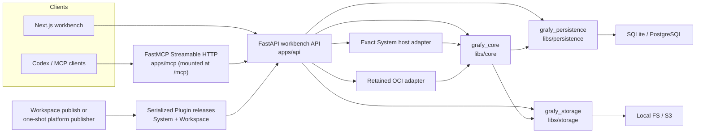

---

## 2. Package inventory and ownership

| Package | Path | Responsibility |
| --- | --- | --- |
| `grafy_api` | `apps/api/src/grafy_api` | FastAPI app, `/v1` routes, exact release admission and host loading, runtime composition, HTTP adapters. |
| `grafy_mcp` | `apps/mcp/src/grafy_mcp` | Stateless FastMCP Streamable HTTP tools; request-scoped PAT actor context. |
| `grafy_core` | `libs/core/src/grafy_core` | Domain aggregates, ports, application services, runtime primitives, Plugin and producer-neutral artifact contracts, Module boundaries. |
| `grafy_persistence` | `libs/persistence/src/grafy_persistence` | Async SQLAlchemy repositories, unit-of-work adapters, ORM mappings, Alembic schema. |
| `grafy_storage` | `libs/storage/src/grafy_storage` | Local and S3-compatible object stores. |
| `grafy_workbench` | `libs/workbench` | App-owned builtin families: arithmetic, image, sequence, text, schema, and table. |
| `grafy_plugin_llm` | `plugins/llm` | OpenAI-compatible Chat Completions node and deterministic prompt-message construction. |
| `grafy_plugin_ocr` | `plugins/ocr` | OCR page node; Tesseract adapter. |
| `grafy_plugin_gis` | `plugins/gis` | WGS84 vector sources, georeferenced raster scans, OGC WFS/WMS integration, map-layer recipes. |
| `grafy_plugin_sql` | `plugins/sql` | Parameterized statement artifacts, PostgreSQL batch executor, DuckDB join executor. |

### Dependency direction (hexagonal)

The core is the architectural center. Concrete infrastructure (SQLAlchemy, S3,
provider SDKs) lives behind ports and is wired only at composition time.

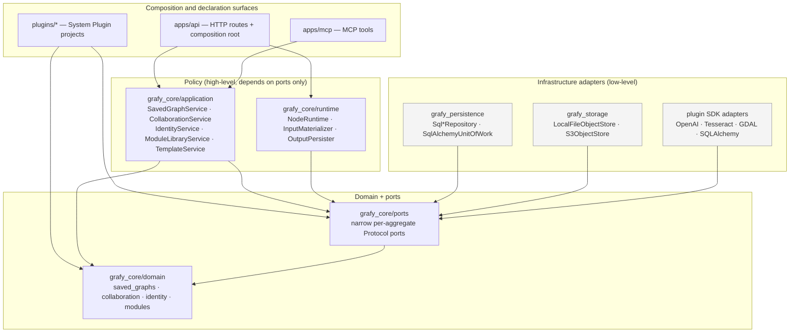

Rule: **dependency arrows point inward toward the domain.** No port, domain, or
application module imports a concrete infrastructure type (`SqlAlchemy*`,
`LocalFileObjectStore`, SDK clients). All concrete construction happens in
composition roots (`apps/api/src/grafy_api/main.py` and
`services/composition.py`).

---

## 3. Composition root and application assembly

The FastAPI app is built in `apps/api/src/grafy_api/main.py`. During lifespan
it constructs every service from concrete adapters, binds them to
`app.state`, and tears them down once.

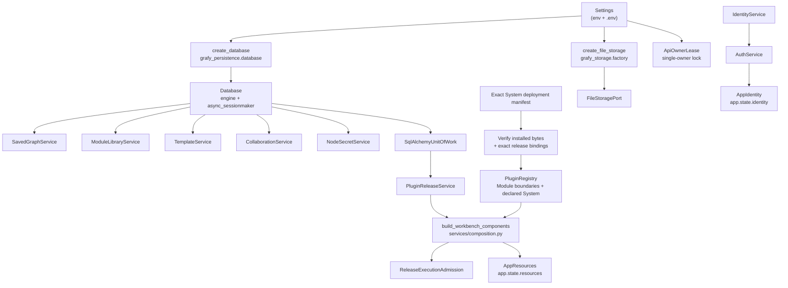

**Key construction points** (all in `apps/api`):

- **API lifespan** (`main.py`) always registers the host-owned Module boundary
  operators. If `GRAFY_SYSTEM_PLUGIN_DEPLOYMENT_MANIFEST` is configured, it
  verifies the declared installed distribution bytes and exact release bindings,
  imports only those declared targets, installs them, and freezes the registry.
  With no manifest it freezes a Module-only registry; there is no package scan or
  host fallback.
- **`build_workbench_components`** (`services/composition.py`) is the workbench
  composition root: it builds resolvers/writers from the registry, the
  `NodeRuntime`, compiler, one caller-owned `ReleaseExecutionAdmission`, the
  in-process and retained-OCI adapters, and the run/execution/artifact/
  materialization services.
- **`app.state`** holds two dataclasses — `AppIdentity` (auth) and
  `AppResources` (workbench services) — fetched via `get_identity(app)` and
  `get_resources(app)`.

---

## 4. HTTP request lifecycle (REST)

A typical `/v1` request flows through middleware, the route handler, an
application service, and finally a persistence unit-of-work.

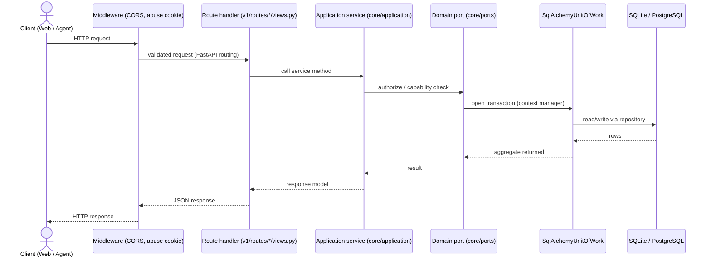

Exception handling is centralized: `NotFoundError` → 404,
`CapabilityDeniedError` → 403, `UserDisabledError` → 401,
`IdentityInvariantError` → 409, and `RequestValidationError` is special-cased for
the OIDC login/callback flows (abuse control + rate limiting).

---

## 5. MCP dependency flow

`apps/mcp` is deliberately independent: it imports no FastAPI routes,
persistence, storage, or plugin implementations. The API process mounts it at
`/mcp` and injects a **request-scoped** caller binding.

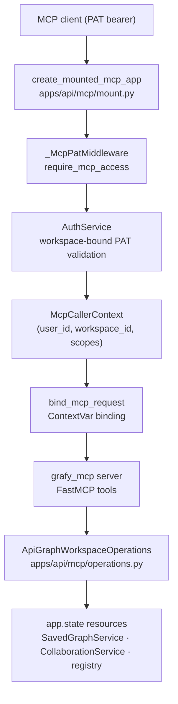

- **PAT scoping:** effective permission is `token scope ∩ current membership`.
- **Stateless:** each request binds a fresh caller context; the `Authorization`
  header is never retained in process-global state.
- **Boundary rule:** `grafy_mcp` never imports FastAPI routes, persistence,
  storage, or plugin implementations; it talks only through
  `GraphWorkspaceOperations` provided by the API package.

---

## 6. Plugin release and catalog dependency flow

The effective Workspace catalog is assembled from persisted exact selections:
global System releases, releases owned by the requested Workspace, and
published Modules as a separate entry kind. Serialized release contracts are
the catalog authority. The frozen `PluginRegistry` owns loaded host runtime
implementations only; it is not the complete catalog.

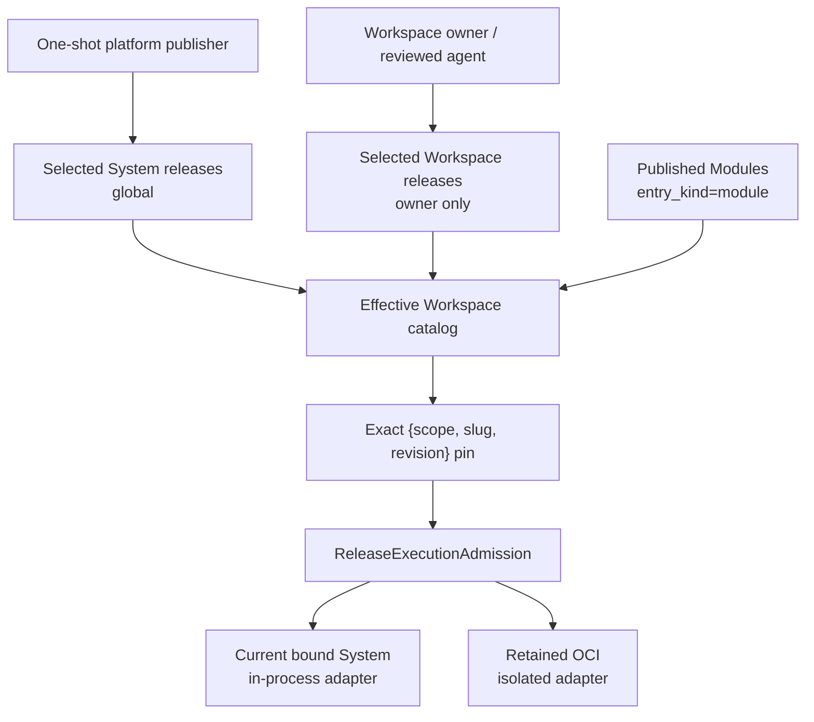

**Declaration path** — each `Plugin` project declares:
- `node(...)` / `function_node(...)` → `NodeRegistration`
- `register_artifact_type(...)` → `ArtifactTypeSpec`
- `register_resolver(...)` / `register_writer(...)` → runtime factories

Publication freezes those declarations into an immutable serialized contract.
Artifact conversions are a separate deployment-owned map in
`grafy_core.canonical_conversions`; the compiler resolves exact edge keys only
from that immutable map. Release-declared conversion references are publishable
only when their key, version, endpoints, and title exactly match a canonical
entry, and the effective catalog exposes each canonical conversion once rather
than assigning it to a Plugin release.
Workspace publication is owner-authorized and isolated-only. System staging is
a separate platform/CI authority, runs candidate verification in a one-shot
publisher sandbox, retains OCI for every release, and never implies promotion.
Catalog and compilation pass selection and exact revocation facts to the same
deployment admission object. Deprecated and withdrawn families stay visible
but are disabled for new insertion; retained exact pins may still run. Revoked
exact releases remain identifiable but are denied with reason `revoked`.

The generic host package scanner and legacy origin compatibility fields have
been removed. Exact deployment bindings and the retained isolated runtime are
the only Plugin execution identities. See [Slice 12](../plans/workspace-plugins/12-compatibility-cutover.md)
and [ADR 0004](../adr/0004-unify-system-and-workspace-plugin-releases.md).

---

## 7. Graph execution dependency flow

Execution is a pipeline: **preflight → exact resolution and admission → compile
→ run through the selected adapter → persist**.

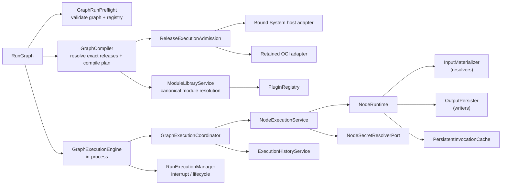

**Node execution steps:**
1. `InputMaterializer` resolves each input `ArtifactRef` to a Python value using
   the resolver registrations contributed by the exact loaded System Plugins.
2. `NodeRuntime` runs the node `run(context, config, inputs)` and checks the
   invocation cache policy.
3. `OutputPersister` writes produced artifacts via registered `ArtifactOutputWriter`
   instances.
4. `PersistentInvocationCache` stores content-addressed invocation results.

**Execution engine** (satisfies `GraphExecutionEngine`):
- `InlineExecutionEngine` — runs in-process; MAP items run concurrently,
  bounded by `map_max_concurrency` (default 4).

---

## 8. Persistence architecture

`grafy_persistence` implements every core port with a `Sql*Repository` and
exposes a unit-of-work facade. Alembic (`infra/db/migrations`) is the **only**
schema authority; SQLAlchemy ORM mappings (`orm.py`) are derived from the
`schema.py` table definitions.

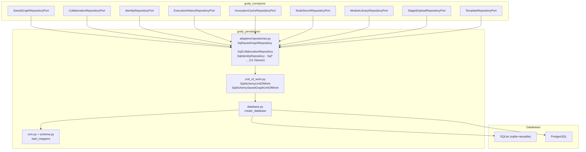

**Unit-of-work pattern:** `SqlAlchemyUnitOfWork` is an async context manager that
opens an `AsyncSession`, exposes the repositories its caller needs, commits on
success, and rolls back on failure. `SqlAlchemySavedGraphUnitOfWork` additionally
exposes the saved-graph repositories required by `SavedGraphService`.

---

## 9. Object storage dependency flow

`grafy_storage` exposes the `FileStoragePort` from core and provides two
adapters selected by `storage_backend` in settings (`local` | `s3`).

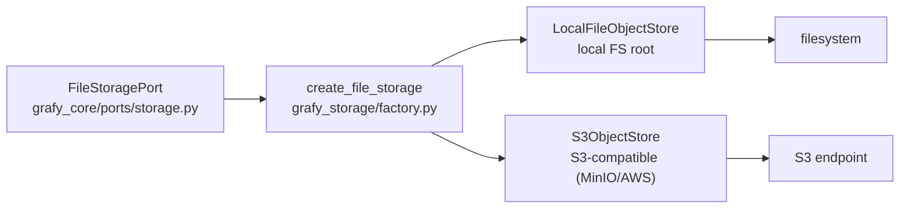

Artifacts and uploads are written through `FileStoragePort`, never through a
concrete store — so swapping local for S3 changes only the factory call in
`main.py`.

---

## 10. Deployment / infrastructure

`infra/docker/compose.yaml` orchestrates the production topology: an nginx
gateway, the API container, the web container, and a shared volume. Keycloak
provides OIDC.

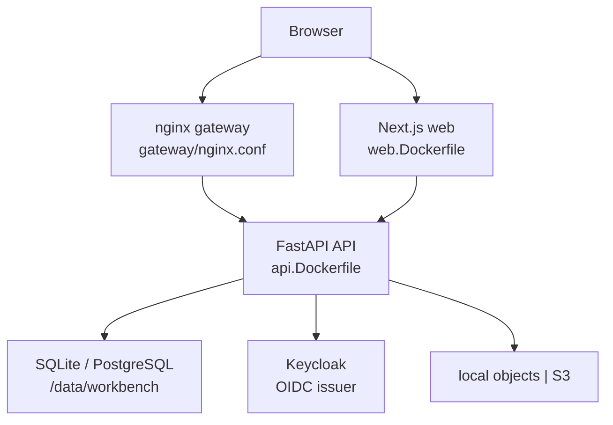

**Collaboration assumption:** the API runs **one Uvicorn process with one worker**
(`WEB_CONCURRENCY: "1"`), acquires an exclusive workspace lock at startup
(`GRAFY_REQUIRE_SINGLE_API_OWNER=true`), and relies on the graph-room hub for
in-process WebSocket collaboration.

---

## 11. Structural diagram: application services

The application layer is one cohesive service per aggregate/actor.

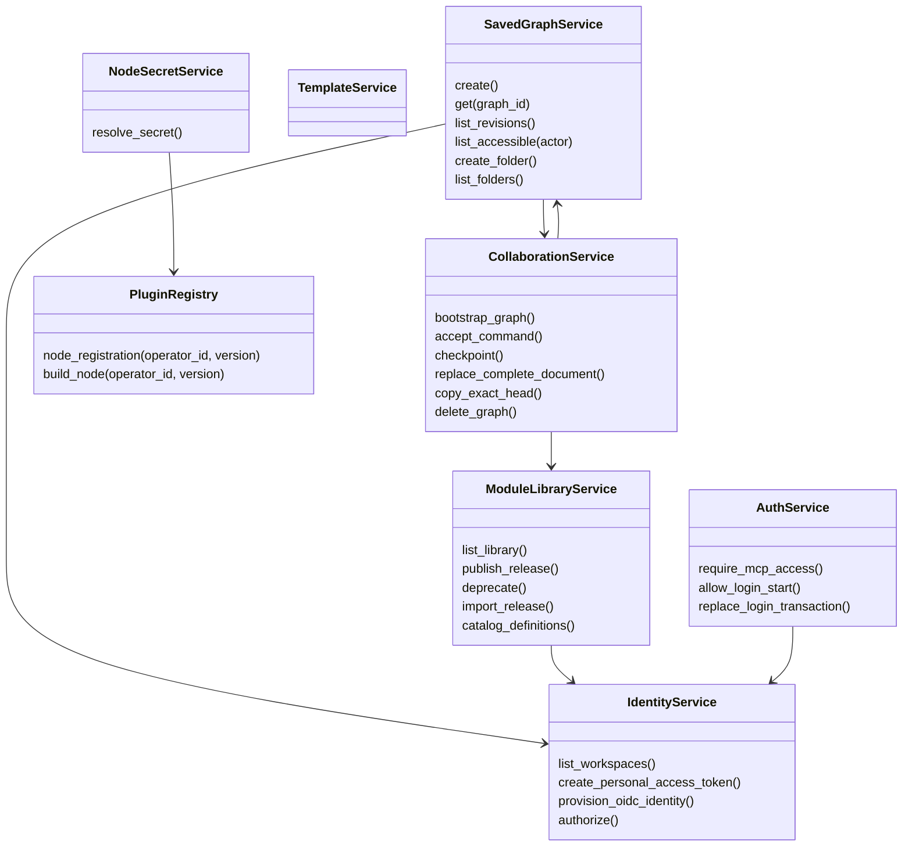

---

## 12. Runtime structural diagram

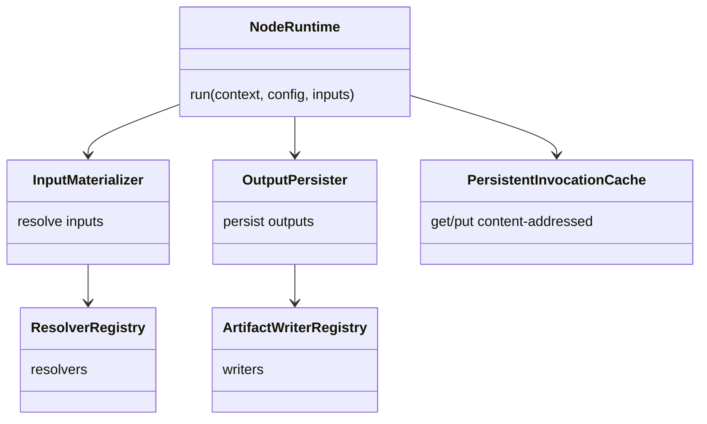

---

## 13. Dependency rules (enforcement)

These are the import constraints the codebase is designed around; new code should
preserve them.

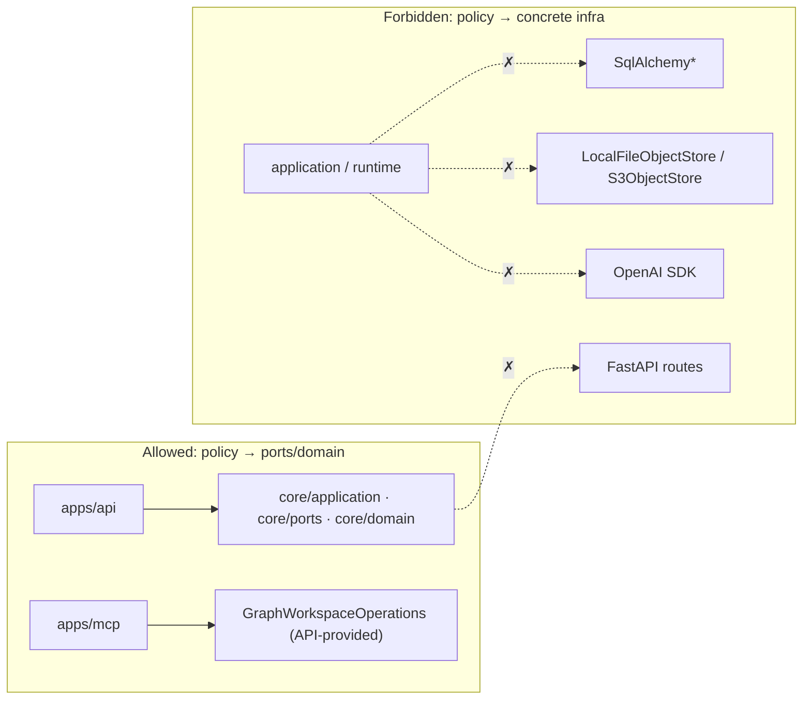

- **Core never imports FastAPI, SQLAlchemy, storage stores, or SDK clients.**
- **`grafy_mcp` never imports FastAPI routes, persistence, storage, or plugin
  implementations.**
- **Concrete construction lives only in composition roots** (`main.py`,
  `composition.py`, `factory.py`).
- **Ports are narrow and per-aggregate** (ISP); `UnitOfWorkPort` facades expose
  only the repositories the caller needs.
- **Plugins are the extension mechanism** (OCP): new nodes/artifact types are
  added by installing a plugin, not by modifying core.

---

## 14. Test coverage map

Tests live under `tests/` and are colocated with the units they protect.
See `pytest.ini` and `pyproject.toml` for the strict-basedpyright + ruff + pytest
toolchain.

| Area | Location | What it protects |
| --- | --- | --- |
| Unit | `tests/unit` | Domain aggregates, ports, runtime, plugin registry. |
| API | `apps/api` (pytest) | Route handlers, auth, collaboration, execution. |
| Integration | `tests/` | Repository/UoW adapters, storage, end-to-end HTTP. |

---

## 15. References

- `CONTEXT.md` — product vocabulary and active scope.
- `docs/workbench-interaction-plan.md` — interaction and runtime decisions.
- `docs/adr/0002-server-authoritative-workbench-collaboration.md` — collaboration authority.
- `docs/adr/0003-authenticate-users-and-scope-collaboration-to-workspaces.md` — auth/tenancy.
- `docs/design/authentication-and-workspace-tenancy.md` — identity & tenancy design.
- `SOLID_REVIEW.md` — SOLID audit of the backend scope.
