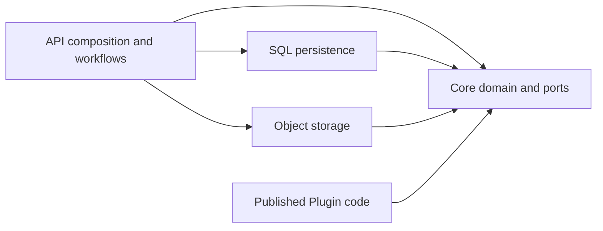
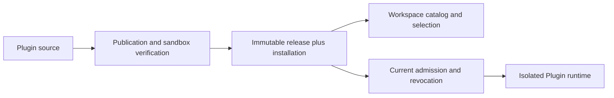
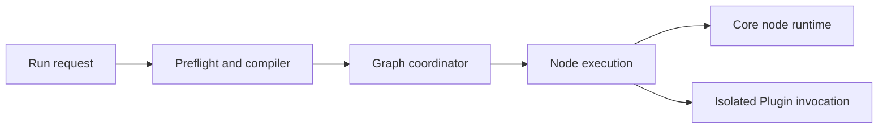

# Backend architecture reference

This reference describes current source ownership. Product vocabulary lives in
[CONTEXT.md](../../CONTEXT.md), and architectural decisions live in
[docs/adr](../adr/). In particular, [ADR 0007](../adr/0007-builtin-families-are-application-code.md)
supersedes the historical host-eligible Plugin execution model.

## Packages and dependency direction

| Owner | Responsibility |
| --- | --- |
| `apps/api/src/grafy_api` | HTTP and room transport, application composition, graph execution, Plugin publication and isolated hosting. |
| `apps/mcp/src/grafy_mcp` | MCP tools through an injected graph-workspace operations contract. |
| `apps/plugin-egress-broker/src/grafy_plugin_egress_broker.py` | Standalone restricted HTTP egress broker executable. |
| `libs/core/src/grafy_core` | Domain models, application workflows, ports, node runtime, artifact contracts, portable cache and storage readers. |
| `libs/persistence/src/grafy_persistence` | SQL repositories, transaction adapters, table metadata, database setup, System cutover and baseline persistence operations. |
| `libs/storage/src/grafy_storage` | Local and S3 object-store adapters. |
| `libs/workbench/src/grafy_workbench` | Application-owned builtin families: arithmetic, image, sequence, text, schema, and table. |
| `plugins/{gis,llm,ocr,sql}` | Independently published Plugin implementations and their provider-specific dependencies. |
| `libs/client/src/grafy_client` | Python HTTP client contracts and operations. |

Core defines ports; persistence and storage implement them. Core does not import
those concrete adapters, API, FastAPI, SQLAlchemy, or published Plugin packages.
API composition constructs the adapters. Published Plugins do not import each
other or host application implementations.

These arrows denote imports, not the order of runtime calls. A core workflow can
call a port implemented by persistence without importing persistence.

## Composition and lifecycle

`grafy_api.main.create_app` registers transport and configures lifespan. Lifespan
loads `BuiltinNodeCatalog` using the deployment build digest, selects storage
through `grafy_api.storage.configured_file_storage`, constructs domain services,
and optionally starts the Docker Plugin runtime.

`services/composition.py` builds `WorkbenchComponents`, including compilation,
execution, artifact reads, catalog, and runtime dependencies. `AppResources`
retains that bundle rather than copying its fields. `AppIdentity` owns the
identity and authentication services. Request dependencies retrieve these typed
resources; domain services receive their dependencies directly.

Shutdown closes the graph-room hub, execution manager, optional Plugin runtime,
and artifact HTTP client in that order. The API's owner lease and database
lifecycle remain in `main.py`. In-memory room coordination requires the configured
single API owner; multiple workers are not an interchangeable deployment mode.

## HTTP, authentication, and collaboration

`v1/routes/<feature>/views.py` owns request handling and HTTP error translation.
Route-local models describe transport. Route files need not contain application
services merely to satisfy a directory template.

Authentication's cookie, OIDC, PAT, and abuse-handling code remains under
`v1/routes/auth`. Workspace transport models belong to `v1/routes/workspaces`;
legacy auth imports remain explicit compatibility aliases. Core identity policy
and transaction-local workspace authorization live in `grafy_core.application.identity`.
Graph workflows authorize through that shared policy, including ordered checks
for cross-workspace copies.

Core `CollaborationService` owns head commands and checkpoints. Shared
`application/graph_creation.py` stages the saved graph, revision, head, and initial
checkpoint for creation workflows. Saved graphs, Modules, and Templates retain
their own workflows and identities.

`grafy_api.realtime` owns the room hub and post-commit publishing. The publisher
receives its dependencies instead of finding request resources. HTTP/WebSocket
adapters remain under collaboration routes.

`graph_contracts.py` owns graph transport compatibility. Legacy heads expose
flattened nodes/edges/presentation and the `plugin_release` alias. The opt-in
`GET /v1/workspaces/{workspace_id}/graphs/{graph_id}/head/document` exposes
collaboration metadata plus canonical `SavedGraphDocument`, whose node field is
`plugin_release_pin`. Existing command/checkpoint responses and room protocol v1
retain the legacy head shape. See the [migration decision](../plans/backend-cleanup/graph-transport-migration.md).

## MCP

API-owned `mcp/mount.py` authenticates workspace-bound PAT requests and binds a
request-scoped caller. `mcp/operations.py` implements the operations interface
used by the independent MCP package. MCP does not import API routes, persistence,
object storage, or Plugin implementations. Token scope and current workspace
membership both constrain access.

## Builtins, Plugin releases, and catalog

Builtins are application code. They execute in process and identify by builtin
kind and deployment build digest. They have no Plugin release pin. Published
Plugins execute in isolated workers; System and Workspace describe installation
scope, not different execution mechanisms.

`plugins/publication` owns source handling, authoring, verification sandboxing,
OCI publication, and publication orchestration. `plugins/profiles.py` owns runtime
profile definitions. `plugins/runtime` owns exact-release admission, Docker
invocation, artifact staging, sandbox settings, and egress policy. The standalone
egress broker is packaged separately from API.

Historical deployment manifests, bindings, and loader implementations live under
`plugins/compatibility`. Root-level historical module names are aliases for
supported operator imports. They are not active graph runtime dependencies.
Persistence-specific System cutover and baseline operations live in
`grafy_persistence.system_cutover` and `system_baseline`.

`grafy_api.catalog.CatalogSnapshot` owns catalog assembly from builtin declarations,
exact release facts, selection/revocation state, and Module library results.
Release, installation, and selection remain separate concepts.
`InstalledPluginRelease` exposes its release and installation explicitly.
`PluginRegistry` retains immutable family declarations and lookup indexes.
Canonical artifact conversions remain deployment-owned in core; release metadata
must agree with those conversion contracts.

## Graph execution

`grafy_api.execution` owns preparation, compilation, scheduling, cancellation,
queue lifecycle, history, materialization, and node execution. HTTP endpoints and
`RunResultPresenter` remain under execution routes. The route model module keeps
compatibility aliases for durable requests and events. See the
[execution ownership reference](../../apps/api/src/grafy_api/execution/README.md).

Preflight resolves immutable exact-release contracts for reuse during compilation.
Selection and revocation are mutable: compilation reads current admission facts
rather than caching them in that immutable preparation map. Saved-graph and
nested-Module paths share request conversions while selecting their own topology.

`GraphExecutionCoordinator` schedules graph work; `NodeExecutionService` executes
nodes; core `NodeRuntime` owns node-level materialization, invocation, and output
persistence. These are different responsibilities. Edge projection reads artifact
rows through the core artifact unit-of-work port, then preserves exact-reference
checks, projection, conversion order, and provenance. It does not use the HTTP
artifact reader.

The core persistent invocation-cache adapter shares cache semantics with the node
runtime. Queued recovery depends on stable request serialization. MAP ordering,
cancellation, nested execution, and materialization each have behavioral tests.
System revocation and cutover fence both durable queue rows and transient activity
markers. Transient activity is registered before preparation and removed after task
cleanup. Startup only clears stale markers with exclusive ownership and confirmed
Plugin orphan cleanup; otherwise it retains them and refuses startup. End-to-end
execution/revocation and recovery proofs remain open in the cleanup plan.

## Artifact contracts, reads, and infrastructure

`grafy_api.artifact_availability` resolves exact references and batches storage
presence checks for application workflows. Each operation loads fresh state.
Availability is weaker than cache content-integrity validation; do not substitute
one for the other. HTTP summaries, content responses, GIS tile/render handling,
and the WMS client remain in the artifact transport service.

Core owns producer-neutral stored contracts, including spatial payloads, styles,
map references, and feature metadata. GIS public aliases reuse those contracts.
API models retain explicit compatibility differences where required response
fields or historical reader acceptance differ from producer validation. GDAL,
provider calls, and raw raster upload inputs remain in GIS.

Core `spatial_storage` shares feature-page reconstruction and canonical byte/hash
validation. `stored_models` shares typed stored-model reads. Format-specific table
and collection readers retain their own manifest/chunk semantics.

`grafy_api.node_secrets` and `staged_uploads` own their application workflows.
Storage adapters only implement object IO. Sensitive capabilities and secret
resolution must remain explicit at those workflow boundaries.

## Persistence and deployment

`grafy_persistence.adapters.repositories` and `grafy_persistence.schema` are
packages grouped into identity, graphs, artifacts, execution, plugins, and library.
`schema/base.py` owns shared metadata; the schema package loads the tables, and
`orm.py` maps them. `column_types.py` owns shared Pydantic/enum SQL conversion.
Alembic revisions under `infra/db/migrations` govern deployed schema changes.

Transaction adapters open task-local sessions and expose the repositories required
by each port. Writes commit explicitly. Context exit rolls back on error and
closes the session; it does not implicitly commit success. Core in-memory runtime
adapters preserve task isolation, cloning, and rollback for supported local use.

Docker definitions under `infra/docker` compose the gateway, API, web, and optional
PostgreSQL, Keycloak, and Plugin runtime services. Local and S3 object stores are
alternative adapters. Plugin egress has its own executable and Docker definition;
it does not require importing the API application.

## Enforcement and verification

`tests/unit/architecture/test_import_boundaries.py` enforces package dependency
rules and compatibility export identity. Execution and Plugin runtime scans
resolve absolute and relative Python imports, forbid HTTP route/framework imports
and historical host loaders, and keep Plugin hosting independent of graph
execution. Shared application owner checks cover realtime, graph contracts,
artifact availability, node secrets, and staged uploads. Static checks do not
claim to sandbox arbitrary dynamic imports.

Behavior lives in `tests/unit/api`, `tests/unit/core`, `tests/unit/client`, and the
feature suites under `tests/integration`. Frontend tests are colocated with their
TypeScript consumers. Schema comparison, generated client consistency, and
extracted-wheel checks protect contracts that directory checks cannot prove.

Remaining work and per-batch evidence live in the
[backend cleanup checklist](../plans/backend-cleanup/README.md). Graph transport
migration, remaining revocation/recovery proofs, and final broad verification remain open;
this reference records current ownership, not completion of those tasks.
