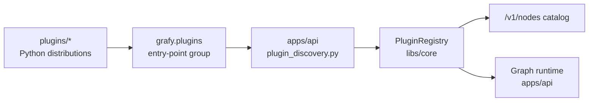

# Plugin Development Guide

> How to structure a Grafy plugin when adding new functionality. Read this
> before creating a new `plugins/*` package or adding operators to an existing
> one. It describes the *current* committed structure as built — the contracts
> and conventions the codebase already enforces. The intended unification with
> agent-authored, isolated Plugins is
> [plugin unification](plugin-unification.md).

- **Audience:** contributors adding nodes, artifact types, conversions,
  resolvers, or writers to Grafy.
- **Scope:** `libs/core` plugin contracts, `plugins/*` packages, and how the API
  discovers and installs them. Frontend work is out of scope.

---

## 1. Overview

Grafy is a **typed artifact-graph workbench**. A plugin is an independently
packaged Python distribution that contributes one or more of these runtime
capabilities into a shared catalog:

- **Nodes** — executable operators that consume artifact inputs and produce
  artifact outputs.
- **Artifact types** — typed data shapes (payload schemas) that flow through
  graph edges.
- **Artifact conversions** — deterministic transforms between compatible
  artifact types.
- **Resolvers** — read-side adapters that materialize an artifact from storage.
- **Writers** — write-side adapters that persist an artifact to storage.

The host (the API process) discovers plugins by scanning a single entry-point
group, validates collisions, freezes the catalog, and exposes everything through
`/v1/nodes`. Plugins never talk to the host directly — they only depend on the
core contracts in `libs/core`.



---

## 2. Package layout

Every plugin follows the same shape. The `plugins/ocr` package is the smallest
working example; `plugins/gis` is the richest.

```
plugins/<name>/
  pyproject.toml                     # distribution metadata + entry point
  src/grafy_plugin_<name>/
    __init__.py                      # re-export the Plugin singleton
    declaration.py                   # Plugin(slug=..., title=...) singleton
    plugin.py                        # registration: nodes, artifacts, conversions
    artifacts.py                     # ArtifactTypeSpec constants
    models.py                        # pydantic payload models
    nodes.py                         # Node classes + function_node implementations
    persistence.py                   # custom resolvers/writers (if not InlineModel)
    <domain>.py                      # optional: provider/executor adapters (e.g. gdal.py)
    py.typed                          # PEP 561 marker for typed consumers
```

### 2.1 `pyproject.toml`

The distribution must declare its dependency on `grafy-core` and expose the
`Plugin` singleton through the `grafy.plugins` entry-point group:

```toml
[project]
name = "grafy-plugin-my-plugin"
version = "0.1.0"
requires-python = "==3.12.9"
dependencies = ["grafy-core", "pydantic"]

[project.entry-points."grafy.plugins"]
my_plugin = "grafy_plugin_my_plugin.plugin:MY_PLUGIN"

[tool.uv.sources]
grafy-core = { workspace = true }

[tool.setuptools]
package-dir = {"" = "src"}

[tool.setuptools.packages.find]
where = ["src"]
```

The entry-point name (`my_plugin`) must be unique across installed plugins; the
host rejects duplicates at install time. Add the plugin to the workspace
members, `[tool.uv.sources]`, and an optional dependency group in the root
`pyproject.toml` so it ships with the monorepo.

### 2.2 `declaration.py`

Declare exactly one `Plugin` singleton per package. The **slug is
namespaced** — external plugins use `external.<name>` (the host marks
entry-point plugins `external`; plugins cannot self-assign origin):

```python
from grafy_core.plugins import Plugin

MY_PLUGIN = Plugin(slug="external.my_plugin", title="My Plugin")
```

The slug must be stable — it is the identity used across the catalog and in
saved graphs. Never rename it after graphs reference its operators.

### 2.3 `plugin.py`

The registration surface. It imports the `_NODE_MODULES`, calls the
decorators/register methods on the singleton, and re-exports it:

```python
from grafy_core.artifacts import Artifact
from grafy_core.runtime.persistence import InlineModelOutputWriter
from grafy_core.runtime.resolvers import InlineModelResolver

from grafy_plugin_my_plugin import nodes
from grafy_plugin_my_plugin.artifacts import RESULT
from grafy_plugin_my_plugin.declaration import MY_PLUGIN
from grafy_plugin_my_plugin.models import ResultPayload

_NODE_MODULES = (nodes,)

MY_PLUGIN.register(
    Artifact(
        spec=RESULT,
        resolver=lambda context: InlineModelResolver(
            source=RESULT.key, target=ResultPayload, uow=context.uow
        ),
        writer=lambda context: InlineModelOutputWriter(
            artifact_type=RESULT.key, model=ResultPayload, uow=context.uow
        ),
    )
)

__all__ = ["MY_PLUGIN"]
```

`plugin.py` is intentionally thin — it *registers*, it does not *implement*.
Keep the registration readable: each `register(...)` call is one capability.
Node modules are imported (not registered) here; the `@node`/`@function_node`
decorators inside them attach themselves to the singleton at import time.

### 2.4 `__init__.py`

Re-export only the singleton so consumers import `from grafy_plugin_x import X`:

```python
from grafy_plugin_my_plugin.plugin import MY_PLUGIN

__all__ = ["MY_PLUGIN"]
```

---

## 3. Registering nodes

There are two ways to add a node, chosen by how much state it needs.

### 3.1 `function_node` — stateless operators (preferred)

Use for nodes that need only config + inputs and no external adapter. The
decorator validates the async signature, resolves type hints, and builds a
contract from the annotated `NodeConfig` / `NodeInput` / `NodeOutput` models:

```python
from typing import Annotated
from grafy_core.artifacts import NodeConfig, NodeInput, NodeOutput
from grafy_core.nodes import InPort, OutPort
from grafy_core.plugins import NodeCachePolicy

from grafy_plugin_my_plugin.artifacts import RESULT
from grafy_plugin_my_plugin.declaration import MY_PLUGIN

class UpperConfig(NodeConfig):
    text: StrictStr = Field(description="Text to uppercase.")

class UpperInput(NodeInput):
    pass

class UpperOutput(NodeOutput):
    result: Annotated[ResultPayload, OutPort(RESULT), Field(description="Uppercased text.")]

@MY_PLUGIN.function_node(
    operator_id="my_plugin.upper",
    version=1,
    title="Uppercase text",
    cache_policy=NodeCachePolicy.EXACT,
)
async def upper_text(config: UpperConfig, inputs: UpperInput) -> UpperOutput:
    """Uppercases the input text."""
    return UpperOutput(result=ResultPayload(text=config.text.upper()))
```

### 3.2 `node` — class nodes with an explicit factory

Use when the node needs an adapter (provider client, executor, storage), an
explicit constructor, or a secret resolver. The factory receives a
`PluginRuntimeContext` and returns a fully constructed node:

```python
from typing import final, override
from grafy_core.nodes import Node, NodeExecutionContext
from grafy_core.plugins import PluginRuntimeContext, NodeCachePolicy

def build_execute_node(context: PluginRuntimeContext) -> "ExecuteNode":
    return ExecuteNode(executor=MyExecutor(), node_secrets=context.node_secrets)

@MY_PLUGIN.node(
    operator_id="my_plugin.execute",
    version=1,
    title="Execute thing",
    factory=build_execute_node,
    cache_policy=NodeCachePolicy.NEVER,
)
@final
class ExecuteNode(Node[ExecuteConfig, ExecuteInput, ExecuteOutput]):
    """Runs one batch of work."""

    def __init__(self, *, executor: MyExecutor, node_secrets: NodeSecretResolverPort) -> None:
        self._executor = executor
        self._node_secrets = node_secrets

    @override
    async def run(self, context: NodeExecutionContext, config: ExecuteConfig, inputs: ExecuteInput, /) -> ExecuteOutput:
        ...
```

**Class-node rules:**

- Annotate the base `Node[Config, Input, Output]` with the three models — the
  contracts are derived from them in `__init_subclass__`.
- Mark the class `@final` and `@override` the `run` method.
- `run` is called *concurrently* under MAP execution. Keep invocation-local
  mutable state inside the call, not on `self`.
- The factory is required when the node has a non-trivial constructor; the
  registry raises `PluginRegistrationError` if a no-arg construction fails.
- Use `context.progress(...)` for bounded, user-visible progress text.

### 3.3 Naming and versioning

- `operator_id` is a **globally unique, stable** string, namespaced by plugin:
  `sql.statement.raw`, `gis.features.to_table`. It is part of the identity of
  saved graphs — never reuse or rename it.
- `version` is a positive integer. Bump it when the node's *contract* changes
  incompatibly (config model, input/output ports). A new version is a new
  operator; old graphs keep resolving to the old version.
- `title` must be a non-empty human-readable name; `description` is taken from
  the node/function docstring automatically.

---

## 4. Node contracts (ports)

Inputs and outputs are pydantic models carrying artifact ports via `Annotated`
metadata:

- **`InPort(artifact_type, variadic=False, instance_plugs=False)`** — marks an
  input field as consuming an artifact type. Set `variadic=True` for list
  inputs; set `instance_plugs=True` when each list item gets its own plug.
- **`OutPort(artifact_type)`** — marks an output field as producing an artifact
  type.

```python
class QueryInput(NodeInput):
    statements: Annotated[
        list[SqlStatement],
        InPort(SQL_STATEMENT, variadic=True, instance_plugs=True),
        Field(min_length=1, description="Statements executed in saved plug order."),
    ]

class QueryOutput(NodeOutput):
    results: Annotated[list[SqlResult], OutPort(SQL_RESULT), Field(description="One result per statement.")]
```

**Contract rules:**

- Models must subclass `NodeConfig`, `NodeInput`, `NodeOutput` and set
  `model_config = ConfigDict(extra="forbid")` — unknown fields are rejected.
- Port artifact types must be **installed** — the registry's `freeze()` rejects
  any node referencing an artifact type that isn't installed.
- Use `ArtifactRef` / `ArtifactRefSequence` when a node passes a reference
  through rather than materializing it.
- Keep config validation in pydantic validators (`field_validator`,
  `model_validator`) so errors surface at binding time, not execution time.

---

## 5. Registering artifact types

Declare an `ArtifactTypeSpec` constant in `artifacts.py`. The payload schema is
derived from a pydantic model's JSON schema:

```python
from grafy_core.artifacts import ArtifactFieldProjection, ArtifactTypeKey, ArtifactTypeSpec

RESULT = ArtifactTypeSpec(
    key=ArtifactTypeKey("my_plugin.result", 1),
    title="Result",
    payload_schema=ResultPayload.model_json_schema(),
    field_projections=(
        ArtifactFieldProjection(path=("table",), target=TABLE_DATA.key, title="Table"),
    ),
)
```

**Artifact-type rules:**

- `key.id` is globally unique and namespaced (`sql.statement`,
  `gis.feature_collection`); `schema_version` is a positive integer. Bump the
  version on incompatible payload changes.
- `field_projections` declare which nested fields are *other* artifact types.
  The registry expands and validates projections during `freeze()` — every
  projection target must be installed, paths must be unique, and scalar targets
  must not collide across the catalog.
- The registry derives automatic projections for `string`/`integer` scalar
  leaves when they match a canonical scalar artifact type — keep payload
  schemas declarative so this derivation stays predictable.

---

## 6. Registering conversions

A conversion is a deterministic transform between two installed artifact types:

```python
from grafy_core.conversions import ArtifactConversion, ArtifactConversionKey

def _to_upper(value: LowerPayload) -> UpperPayload:
    return UpperPayload(text=value.text.upper())

LOWER_TO_UPPER = ArtifactConversion(
    key=ArtifactConversionKey("my_plugin.lower_to_upper", 1),
    source=LOWER.key,
    target=UPPER.key,
    source_type=LowerPayload,
    target_type=UpperPayload,
    title="Uppercase",
    convert=_to_upper,
)

MY_PLUGIN.register_artifact_conversion(LOWER_TO_UPPER)
```

Conversions participate in the host's runtime-type compatibility check during
`freeze()`. Keep `source_type`/`target_type` precise so the host can prove that
conversion chains compose.

---

## 7. Resolvers and writers

Resolvers (read-side) and writers (write-side) adapt an artifact to and from
storage. For simple pydantic-payload artifacts, use the core `InlineModel`
adapters — no custom code needed (see §2.3). For artifacts with custom storage
(GeoJSON, rasters, large collections), implement them in a `persistence.py`
module and register factory lambdas:

```python
MY_PLUGIN.register_resolver(lambda context: FeatureResolver(uow=context.uow, storage=context.storage))
MY_PLUGIN.register_writer(lambda context: FeatureWriter(storage=context.storage, uow=context.uow, bucket=context.bucket))
```

Factories receive a `PluginRuntimeContext` and return one adapter. Keep
resolver/writer logic out of `plugin.py` — put it in `persistence.py` and keep
`plugin.py` declarative.

---

## 8. Secrets

Nodes that need secrets (passwords, API keys) declare `NodeSecretInput`s on the
registration. The secret is resolved at runtime through
`NodeSecretResolverPort` — the node never sees the stored value, only the
resolved one:

```python
@MY_PLUGIN.node(
    operator_id="my_plugin.execute",
    version=1,
    title="Execute",
    factory=build_execute_node,
    secret_inputs=(
        NodeSecretInput(
            name="password",
            title="Password",
            description="Write-only password for the account.",
            config_dependencies=("host", "port", "database", "username"),
        ),
    ),
)
@final
class ExecuteNode(Node[ExecuteConfig, ExecuteInput, ExecuteOutput]):
    def __init__(self, *, executor: MyExecutor, node_secrets: NodeSecretResolverPort) -> None:
        self._executor = executor
        self._node_secrets = node_secrets

    @override
    async def run(self, context, config, inputs, /) -> ExecuteOutput:
        password = await self._node_secrets.resolve_secret(
            workspace_id=context.workspace_id,
            graph_id=context.secret_graph_id,
            graph_revision=context.secret_graph_revision,
            node_id=context.node_id,
            name="password",
            dependencies={...},
        )
        ...
```

**Secret rules:**

- `name` must match `[a-z][a-z0-9_]*` (≤255 chars); `config_dependencies` must
  reference fields that exist on the node's config model — the registry
  validates this at registration.
- Resolve secrets through the port only; never store secret material in the
  payload/artifact.

---

## 9. Cache policy

Every node declares a `NodeCachePolicy`:

- `NEVER` (default) — provider, upload, secret, and wrapper nodes. Use when the
  node cannot supply a stable identity for its side effects.
- `EXACT` — deterministic built-ins that can prove a stable key (same config,
  inputs, bindings).

Choose `EXACT` only when the node is provably deterministic and side-effect
free. Cache entries store only digests and artifact refs — never secret
material.

---

## 10. Dependency rules

The dependency flow is strict and one-directional:

```
plugins/*  ──►  libs/core   ──►  (host: apps/api)
```

- Plugins depend on **`grafy-core` only**. Never import from `apps/api`,
  `apps/mcp`, `libs/persistence`, or `libs/storage` — those are host concerns.
- The host (`apps/api`) must have **no hard dependency** on any plugin package
  (OCR/LLM/GIS/SQL are optional). It discovers plugins via entry points at
  runtime and installs them as `external`.
- Reuse generic artifact types from core operators (`TABLE_DATA`, `PROMPT_MESSAGE`,
  `JSON_SCHEMA`, scalar types) instead of re-declaring equivalents. Artifact
  types are shared vocabulary across the catalog.
- Keep adapters (providers, executors, GDAL clients) in their own submodules
  (`mistral.py`, `gdal.py`, `sqlalchemy.py`) so `plugin.py` stays declarative and
  third-party imports are isolated.

---

## 11. Validation and tests

Each plugin ships a `tests/unit/plugins/` suite that installs its singleton into
a fresh `PluginRegistry`, freezes it, and asserts the declared contributions:

```python
registry = PluginRegistry()
registry.install(TABLES, origin=PluginOrigin.BUILTIN)
registry.install(SQL, origin=PluginOrigin.EXTERNAL)
registry.freeze()
context = PluginRuntimeContext(workspace=..., uploads_dir=..., storage=..., uow=..., bucket=...)
```

Every plugin must pass a registration test that verifies:

- `slug` / `title` are correct.
- The declared node keys match `plugin.nodes`.
- The artifact types and conversions are installed and the registry freezes
  without `PluginRegistrationError`.
- A `pyproject.toml` metadata test asserts the entry-point group matches.

---

## 12. Checklist for adding a plugin

- [ ] New `plugins/<name>/` package with the layout in §2.
- [ ] `pyproject.toml` declares `grafy-core` dependency and a unique
      `grafy.plugins` entry point.
- [ ] One `Plugin` singleton with a stable `external.<name>` slug.
- [ ] Node models subclass `NodeConfig`/`NodeInput`/`NodeOutput` with
      `extra="forbid"`; ports use `InPort`/`OutPort` with installed artifact types.
- [ ] Artifact types are namespaced, versioned, and declared in `artifacts.py`.
- [ ] Resolvers/writers either use `InlineModel` adapters or live in
      `persistence.py` with `plugin.py` staying declarative.
- [ ] Secrets use `NodeSecretInput` + `NodeSecretResolverPort`; cache policy
      is explicit (`NEVER` unless provably `EXACT`).
- [ ] Plugin imports only `grafy-core`; host has no hard dependency on it.
- [ ] Workspace members, `[tool.uv.sources]`, and optional-dependency group
      updated in root `pyproject.toml`.
- [ ] Registration + entry-point tests pass in `tests/unit/plugins/`.
- [ ] Registry freezes cleanly: no slug/operator/artifact/conversion collisions.
