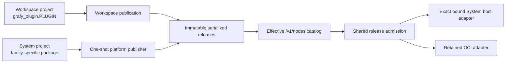

# Plugin Development Guide

> How to structure a Grafy plugin when adding new functionality. Read this
> before creating a new `plugins/*` package or adding operators to an existing
> one. It describes the *current* committed structure as built — the contracts
> and conventions the codebase already enforces. The implemented replacement
> for Workspace-authored code (publish a verified freeze into a Workspace
> catalog) is [plugin unification](plugin-unification.md).
>
> This guide describes the shared declaration surface for System and Workspace
> Plugin projects. The accepted architecture is the immutable release model in
> [ADR 0004](../adr/0004-unify-system-and-workspace-plugin-releases.md).
> System host packages load only through an exact deployment manifest. Package
> installation alone never makes a Plugin executable in the API process.

- **Audience:** contributors adding nodes, artifact types, conversions,
  resolvers, or writers to Grafy.
- **Scope:** `libs/core` Plugin contracts, System projects under `plugins/*`,
  Workspace projects under configured authoring roots, and their publication
  boundaries. Frontend work is out of scope.

---

## Start with an ordinary function

For one input and one output, the whole node can be one decorated function:

```python
from grafy_core.artifact_contracts import TEXT_VALUE

from grafy_plugin_my_plugin.declaration import MY_PLUGIN

MY_PLUGIN.register_artifact_type_dependency(TEXT_VALUE)

@MY_PLUGIN.callable_node(
    operator_id="my_plugin.upper",
    version=1,
    title="Uppercase text",
    output_name="text",
)
def upper_text(text: str) -> str:
    return text.upper()
```

`text` is a graph input. The returned string is a graph output named `text`.
The function remains directly callable as `upper_text("hello")`.

---

## 1. Overview

Grafy is a **typed artifact-graph workbench**. A Plugin is an independently
locked project whose immutable release contributes one or more of these
capabilities to an effective Workspace catalog:

- **Nodes** — executable operators that consume artifact inputs and produce
  artifact outputs.
- **Artifact types** — typed data shapes (payload schemas) that flow through
  graph edges.
- **Artifact conversions** — deterministic transforms between compatible
  artifact types.
- **Resolvers** — read-side adapters that materialize an artifact from storage.
- **Writers** — write-side adapters that persist an artifact to storage.

Workspace owners and reviewed coding agents publish isolated-only Workspace
releases. A separate one-shot platform/CI publisher stages System releases,
including retained OCI artifacts and explicit distribution/execution policy;
stage and promotion are distinct operations. `/v1/nodes` combines selected
System releases, selected releases owned by the requested Workspace, and
published Modules (`entry_kind=module`).

After the API image installs immutable System project paths, run
`grafy plugin build-system-deployment --output <path>` inside that image (or
add `--slug <slug> --revision <revision>` for one candidate). The producer
rebuilds each inventory project's deterministic source archive, verifies its
SHA-256 and `uv.lock` digest against the staged release, then fingerprints the
installed distribution and verifies its loader catalog. The resulting host
binding therefore proves both the staged source identity and the exact bytes
loaded by that image; the retained-OCI guest loader manifest remains a separate
artifact.



---

## 2. Package layout

System and Workspace projects share the same conceptual files. System projects
use a family-specific import package because an exact current release may be
loaded by the deployment; Workspace projects use the fixed `grafy_plugin`
package because they execute only through the isolated adapter.

```
plugins/<name>/
  pyproject.toml                     # distribution metadata
  uv.lock                            # exact dependency lock
  src/grafy_plugin_<name>/
    __init__.py                      # re-export the Plugin singleton
    declaration.py                   # Plugin(slug=..., title=...) singleton
    plugin.py                        # registration: nodes, artifacts, adapters
    artifacts.py                     # ArtifactTypeSpec constants
    models.py                        # pydantic payload models
    nodes.py                         # callable_node functions and advanced nodes
    persistence.py                   # custom resolvers/writers (if not InlineModel)
    <domain>.py                      # optional: provider/executor adapters (e.g. gdal.py)
    py.typed                          # PEP 561 marker for typed consumers
```

### 2.1 `pyproject.toml`

The project declares `grafy-core`, owns an exact lock, and exports one Plugin
singleton from its package. Projects do not declare generic Plugin entry points:

```toml
[project]
name = "grafy-plugin-my-plugin"
version = "0.1.0"
requires-python = "==3.14.*"
dependencies = ["grafy-core==0.1.0", "pydantic"]

[tool.setuptools]
package-dir = {"" = "src"}

[tool.setuptools.packages.find]
where = ["src"]
```

Repository System projects are excluded from the root uv workspace. Each owns
its lock and a vendored exact SDK wheel, and must construct without local source
overrides:

```bash
cd plugins/my-plugin
uv lock --no-sources --find-links wheels
uv sync --locked --no-sources --find-links wheels
```

Path dependencies may not escape a publishable snapshot. The root development
environment may depend on System project paths for integration tests, but that
does not participate in the project's independent lock. Python package and
distribution names are loader metadata, never catalog identity.

### 2.2 `declaration.py`

Declare exactly one `Plugin` singleton per package with a stable family slug:

```python
from grafy_core.plugins import Plugin

MY_PLUGIN = Plugin(slug="my-plugin", title="My Plugin")
```

The slug must be stable — it is the identity used across the catalog and in
saved graphs. Never rename it after graphs reference its operators.

### 2.3 `plugin.py`

The registration surface. It imports the `_NODE_MODULES`, calls the
decorators/register methods on the singleton, and re-exports it:

```python
from grafy_core.artifacts import Artifact
from grafy_core.runtime.persistence import InlineModelOutputWriter
from grafy_core.runtime.resolvers import InlineModelResolver

from grafy_plugin_my_plugin import nodes
from grafy_plugin_my_plugin.artifacts import RESULT
from grafy_plugin_my_plugin.declaration import MY_PLUGIN
from grafy_plugin_my_plugin.models import ResultPayload

_NODE_MODULES = (nodes,)

MY_PLUGIN.register(
    Artifact(
        spec=RESULT,
        resolver=lambda context: InlineModelResolver(
            source=RESULT.key, target=ResultPayload, uow=context.uow
        ),
        writer=lambda context: InlineModelOutputWriter(
            artifact_type=RESULT.key, model=ResultPayload, uow=context.uow
        ),
    )
)

__all__ = ["MY_PLUGIN"]
```

`plugin.py` is intentionally thin — it *registers*, it does not *implement*.
Keep the registration readable: each `register(...)` call is one capability.
Node modules are imported, not registered, here. The `@callable_node`,
`@function_node`, and `@node` decorators inside them attach their nodes to the
singleton at import time.

### 2.4 `__init__.py`

Re-export only the singleton so consumers import `from grafy_plugin_x import X`:

```python
from grafy_plugin_my_plugin.plugin import MY_PLUGIN

__all__ = ["MY_PLUGIN"]
```

---

## 3. Registering nodes

Start with `callable_node`. Use the model-based decorators when the node has
multiple outputs, no output, or runtime construction requirements.

### 3.1 `callable_node` for ordinary functions

`callable_node` turns an ordinary typed Python function into a node. Positional
parameters become graph inputs. Keyword-only parameters become node config.
The return value becomes one graph output named `result` unless you set
`output_name`.

```python
from typing import Annotated
from pydantic import Field
from grafy_core.plugins import NodeCachePolicy

from grafy_plugin_my_plugin.declaration import MY_PLUGIN

@MY_PLUGIN.callable_node(
    operator_id="my_plugin.greet",
    version=1,
    title="Greet",
    output_name="text",
    cache_policy=NodeCachePolicy.EXACT,
)
def greet(
    name: str,
    *,
    prefix: Annotated[str, Field(min_length=1)] = "Hello",
) -> str:
    """Greet one person."""
    return f"{prefix}, {name}"
```

The decorated object remains the original function. `greet("Ada")` returns
`"Hello, Ada"` in ordinary Python code. Grafy builds runtime config, input, and
output models for validation and protocol transport. Config and input parsing
keep the existing node-model behavior. Return values receive strict output
validation. The generated model names are stable for each `operator_id` and
`version`.

The signature controls the generated node contract:

| Function declaration | Generated node contract |
| --- | --- |
| Positional parameter | Required graph input |
| Positional parameter with `None` default | Optional graph input |
| Keyword-only parameter | Config field |
| Keyword-only default | Config default |
| First positional `NodeExecutionContext` | Injected execution context, not a graph input |
| Return annotation | One output named by `output_name`, or `result` by default |

Grafy infers `scalar.text@1` for `str` and `scalar.integer@1` for `int`.
`list[str]` and `list[int]` produce sequence-shaped ports for the same artifact
types. Register those artifact type dependencies explicitly on the Plugin:

```python
from grafy_core.artifact_contracts import TEXT_VALUE

MY_PLUGIN.register_artifact_type_dependency(TEXT_VALUE)
```

For a custom artifact, pair its Python type with `InPort` or `OutPort`:

```python
from typing import Annotated
from grafy_core.nodes import InPort, OutPort

def summarize(
    table: Annotated[Table, InPort(TABLE_DATA)],
) -> Annotated[TableSummary, OutPort(TABLE_SUMMARY)]:
    ...
```

The annotations select contracts. They do not register artifact types or
dependencies. Register a Plugin-owned artifact and its persistence adapters,
or register a dependency on a producer-neutral core artifact type.

Use normal Python defaults and `Annotated[..., Field(...)]` constraints for
config. Grafy checks each default against its annotation during registration,
and generated config models also validate defaults. Put constraints in
`Annotated`; a `Field` object cannot be the parameter default. Aliases are not
supported because function parameter names are graph contract names. A graph
input may have only a nullable `None` default. Grafy rejects other positional
defaults because upstream edges, not Python defaults, supply graph values.

Both synchronous and asynchronous functions are supported. Grafy runs a
synchronous function in a worker thread so it does not block the event loop.
Task cancellation cannot stop Python code already running in that thread. The
isolated Plugin process owns the hard termination boundary.

Use `NodeExecutionContext` only as the exact first positional annotation when
the function needs progress or execution identity:

```python
from grafy_core.nodes import NodeExecutionContext

async def label(context: NodeExecutionContext, text: str) -> str:
    await context.progress("Labeling text")
    return text
```

`callable_node` intentionally has one output. Use `function_node` for multiple
outputs or no output. Use `function_node` or `node` when explicit model classes
make a complex contract easier to read. Callable nodes accept named parameters,
not `*args` or `**kwargs`. They also reject generator functions and nullable,
tuple, dictionary, or `NodeOutput` return annotations.

### 3.2 `function_node` for explicit models

`function_node` derives a node contract from `NodeConfig`, `NodeInput`, and
`NodeOutput` models. It is the advanced form for explicit model ownership,
multiple outputs, and output-free operations:

```python
from typing import Annotated
from grafy_core.artifact_contracts import TEXT_VALUE, TextValue
from grafy_core.artifacts import NodeConfig, NodeInput, NodeOutput
from grafy_core.nodes import InPort, OutPort

class UpperConfig(NodeConfig):
    enabled: bool = True

class UpperInput(NodeInput):
    text: Annotated[TextValue, InPort(TEXT_VALUE)]

class UpperOutput(NodeOutput):
    result: Annotated[TextValue, OutPort(TEXT_VALUE)]

@MY_PLUGIN.function_node(
    operator_id="my_plugin.upper",
    version=1,
    title="Uppercase text",
)
async def upper_text(config: UpperConfig, inputs: UpperInput) -> UpperOutput:
    value = inputs.text.value.upper() if config.enabled else inputs.text.value
    return UpperOutput(result=TextValue(value=value))
```

### 3.3 `node` for an explicit factory

Use when the node needs an adapter (provider client, executor, storage), an
explicit constructor, or a secret resolver. The factory receives a
`PluginRuntimeContext` and returns a fully constructed node:

```python
from typing import final, override
from grafy_core.nodes import Node, NodeExecutionContext
from grafy_core.plugins import PluginRuntimeContext, NodeCachePolicy

def build_execute_node(context: PluginRuntimeContext) -> "ExecuteNode":
    return ExecuteNode(executor=MyExecutor(), node_secrets=context.node_secrets)

@MY_PLUGIN.node(
    operator_id="my_plugin.execute",
    version=1,
    title="Execute thing",
    factory=build_execute_node,
    cache_policy=NodeCachePolicy.NEVER,
)
@final
class ExecuteNode(Node[ExecuteConfig, ExecuteInput, ExecuteOutput]):
    """Runs one batch of work."""

    def __init__(self, *, executor: MyExecutor, node_secrets: NodeSecretResolverPort) -> None:
        self._executor = executor
        self._node_secrets = node_secrets

    @override
    async def run(self, context: NodeExecutionContext, config: ExecuteConfig, inputs: ExecuteInput, /) -> ExecuteOutput:
        ...
```

**Class-node rules:**

- Annotate the base `Node[Config, Input, Output]` with the three models — the
  contracts are derived from them in `__init_subclass__`.
- Mark the class `@final` and `@override` the `run` method.
- `run` is called *concurrently* under MAP execution. Keep invocation-local
  mutable state inside the call, not on `self`.
- The factory is required when the node has a non-trivial constructor; the
  registry raises `PluginRegistrationError` if a no-arg construction fails.
- Use `context.progress(...)` for bounded, user-visible progress text.

### 3.4 Naming and versioning

- `operator_id` is a **globally unique, stable** string, namespaced by plugin:
  `sql.statement.raw`, `gis.features.to_table`. It is part of the identity of
  saved graphs — never reuse or rename it.
- `version` is a positive integer. Bump it when the node's *contract* changes
  incompatibly (config model, input/output ports). A new version is a new
  operator; old graphs keep resolving to the old version.
- `title` must be a non-empty human-readable name; `description` is taken from
  the node/function docstring automatically.

---

## 4. Node contracts (ports)

`function_node` and `node` inputs and outputs are pydantic models carrying
artifact ports through `Annotated` metadata. `callable_node` uses the same
metadata directly on function parameters and the return annotation.

- **`InPort(artifact_type, variadic=False, instance_plugs=False)`** — marks an
  input field as consuming an artifact type. Set `variadic=True` for list
  inputs; set `instance_plugs=True` when each list item gets its own plug.
- **`OutPort(artifact_type)`** — marks an output field as producing an artifact
  type.

```python
class QueryInput(NodeInput):
    statements: Annotated[
        list[SqlStatement],
        InPort(SQL_STATEMENT, variadic=True, instance_plugs=True),
        Field(min_length=1, description="Statements executed in saved plug order."),
    ]

class QueryOutput(NodeOutput):
    results: Annotated[list[SqlResult], OutPort(SQL_RESULT), Field(description="One result per statement.")]
```

**Contract rules:**

- Explicit models must subclass `NodeConfig`, `NodeInput`, `NodeOutput` and set
  `model_config = ConfigDict(extra="forbid")` — unknown fields are rejected.
- Port artifact types must be **installed** — the registry's `freeze()` rejects
  any node referencing an artifact type that isn't installed.
- Use `ArtifactRef` / `ArtifactRefSequence` when a node passes a reference
  through rather than materializing it.
- Keep config validation in pydantic validators (`field_validator`,
  `model_validator`) so errors surface at binding time, not execution time.

---

## 5. Registering artifact types

Declare an `ArtifactTypeSpec` constant in `artifacts.py`. The payload schema is
derived from a pydantic model's JSON schema:

```python
from grafy_core.artifacts import ArtifactFieldProjection, ArtifactTypeKey, ArtifactTypeSpec

RESULT = ArtifactTypeSpec(
    key=ArtifactTypeKey("my_plugin.result", 1),
    title="Result",
    payload_schema=ResultPayload.model_json_schema(),
    field_projections=(
        ArtifactFieldProjection(path=("table",), target=TABLE_DATA.key, title="Table"),
    ),
)
```

**Artifact-type rules:**

- `key.id` is globally unique and namespaced (`sql.statement`,
  `gis.feature_collection`); `schema_version` is a positive integer. Bump the
  version on incompatible payload changes.
- `field_projections` declare which nested fields are *other* artifact types.
  The registry expands and validates projections during `freeze()` — every
  projection target must be installed, paths must be unique, and scalar targets
  must not collide across the catalog.
- The registry derives automatic projections for `string`/`integer` scalar
  leaves when they match a canonical scalar artifact type — keep payload
  schemas declarative so this derivation stays predictable.

---

## 6. Using canonical conversions

Artifact conversions are deployment-owned canonical behavior. A Plugin does
not own a conversion merely because it produces or consumes one endpoint, and
the compiler never resolves conversion callables from `PluginRegistry`.

The effective catalog exposes the immutable entries from
`grafy_core.canonical_conversions`. Graph edges store only the exact conversion
key and version. Adding a new canonical conversion is therefore a core and
deployment change: declare its producer-neutral endpoints and callable in that
module, update the versioned compatibility snapshot test, and use a new version
whenever its contract or implementation changes.

Plugin release manifests may carry a canonical conversion reference for
inspection compatibility, but publication accepts it only when key, version,
source, target, and title exactly match the deployment-owned entry. Prefer no
release declaration when the Plugin merely uses the conversion. Configurable,
lossy, or domain-significant transforms remain ordinary visible nodes.

---

## 7. Resolvers and writers

Resolvers (read-side) and writers (write-side) adapt an artifact to and from
storage. For simple pydantic-payload artifacts, use the core `InlineModel`
adapters — no custom code needed (see §2.3). For artifacts with custom storage
(GeoJSON, rasters, large collections), implement them in a `persistence.py`
module and register factory lambdas:

```python
MY_PLUGIN.register_resolver(lambda context: FeatureResolver(uow=context.uow, storage=context.storage))
MY_PLUGIN.register_writer(lambda context: FeatureWriter(storage=context.storage, uow=context.uow, bucket=context.bucket))
```

Factories receive a `PluginRuntimeContext` and return one adapter. Keep
resolver/writer logic out of `plugin.py` — put it in `persistence.py` and keep
`plugin.py` declarative.

---

## 8. Secrets

Nodes that need secrets (passwords, API keys) declare `NodeSecretInput`s on the
registration. The secret is resolved at runtime through
`NodeSecretResolverPort` — the node never sees the stored value, only the
resolved one:

```python
@MY_PLUGIN.node(
    operator_id="my_plugin.execute",
    version=1,
    title="Execute",
    factory=build_execute_node,
    secret_inputs=(
        NodeSecretInput(
            name="password",
            title="Password",
            description="Write-only password for the account.",
            config_dependencies=("host", "port", "database", "username"),
        ),
    ),
)
@final
class ExecuteNode(Node[ExecuteConfig, ExecuteInput, ExecuteOutput]):
    def __init__(self, *, executor: MyExecutor, node_secrets: NodeSecretResolverPort) -> None:
        self._executor = executor
        self._node_secrets = node_secrets

    @override
    async def run(self, context, config, inputs, /) -> ExecuteOutput:
        password = await self._node_secrets.resolve_secret(
            workspace_id=context.workspace_id,
            graph_id=context.secret_graph_id,
            graph_revision=context.secret_graph_revision,
            node_id=context.node_id,
            name="password",
            dependencies={...},
        )
        ...
```

**Secret rules:**

- `name` must match `[a-z][a-z0-9_]*` (≤255 chars); `config_dependencies` must
  reference fields that exist on the node's config model — the registry
  validates this at registration.
- Resolve secrets through the port only; never store secret material in the
  payload/artifact.

---

## 9. Cache policy

Every node declares a `NodeCachePolicy`:

- `NEVER` (default) — provider, upload, secret, and wrapper nodes. Use when the
  node cannot supply a stable identity for its side effects.
- `EXACT` — deterministic System nodes that can prove a stable key (same config,
  inputs, bindings).

Choose `EXACT` only when the node is provably deterministic and side-effect
free. Cache entries store only digests and artifact refs — never secret
material.

---

## 10. Dependency rules

The dependency flow is strict and one-directional:

```
Plugin project  ──►  libs/core contracts
publisher/API  ──►  serialized release + core ports
```

- For Grafy-internal imports, Plugins depend on **`grafy-core` only**. Never
  import from `apps/api`, `apps/mcp`, `libs/persistence`, or `libs/storage` —
  those are host concerns.
- Serialized contracts, not imports or registry membership, determine catalog
  visibility. The API may load a deployment-declared System implementation only
  for an exact host binding; every System release still retains OCI.
- Reuse producer-neutral artifact types from core contract modules such as
  `grafy_core.artifact_contracts`, `grafy_core.image_contracts`,
  `grafy_core.prompt_contracts`, `grafy_core.schema_contracts`, and
  `grafy_core.table_contracts` instead of importing another Plugin's
  implementation package or re-declaring equivalents.
- Keep adapters (providers, executors, GDAL clients) in their own submodules
  (`openai_compatible_sdk.py`, `gdal.py`, `sqlalchemy.py`) so `plugin.py` stays
  declarative and third-party imports are isolated.

---

## 11. Validation and tests

Each Plugin ships owning tests that construct its singleton, validate the
declaration, and verify the serialized release contract without relying on
ambient host discovery. Transitional host packages separately verify their
exact deployment binding:

```python
from grafy_core.domain.plugin_releases import PluginCatalogManifest

catalog = PluginCatalogManifest.from_plugin(MY_PLUGIN)
assert catalog.slug == MY_PLUGIN.slug
```

Every Plugin must pass declaration and freeze tests that verify:

- `slug` / `title` are correct.
- The declared node keys match `plugin.nodes`.
- Artifact types, dependencies, canonical conversion references, ports, and
  portable bundle contracts serialize without identity or collision errors.
- Publication inspection reproduces the same exact serialized contract from the
  frozen source and lock.

---

## 12. Checklist for adding a plugin

- [ ] New System `plugins/<name>/` project or Workspace authoring-root project
      with the shared layout in §2.
- [ ] `pyproject.toml` declares `grafy-core`; `uv.lock` and the exact SDK-wheel
      supply rule are committed.
- [ ] One `Plugin` singleton with a stable family slug.
- [ ] Ordinary one-output functions use `callable_node`; multiple-output,
      output-free, or explicit-model contracts use `function_node` or `node`.
- [ ] Custom artifact parameters and returns use `InPort`/`OutPort` with
      registered artifact types or dependencies.
- [ ] Artifact types are namespaced, versioned, and declared in `artifacts.py`.
- [ ] Resolvers/writers either use `InlineModel` adapters or live in
      `persistence.py` with `plugin.py` staying declarative.
- [ ] Secrets use `NodeSecretInput` + `NodeSecretResolverPort`; cache policy
      is explicit (`NEVER` unless provably `EXACT`).
- [ ] Plugin imports only `grafy-core`; host has no hard dependency on it.
- [ ] Repository System projects remain excluded from the root uv workspace and
      construct from their own exact lock and vendored SDK wheel; Workspace
      projects remain self-contained under their configured authoring root.
- [ ] Declaration, frozen inspection, and owning runtime tests pass.
- [ ] Serialized inspection is clean: no slug/operator/artifact collisions,
      non-canonical conversion references, or incomplete dependency contracts.

## System host-loader boundary

The checked-in System inventory owns the stable distribution name and loader
target. Deployment tooling binds that target to one exact release and installed
distribution digest. API startup imports only targets named by that exact
manifest; it never scans installed packages. Plugin scope, distribution,
execution policy, and capabilities remain platform-owned release metadata, not
attributes inferred from Python packaging.
