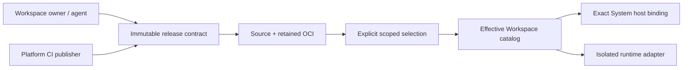

# Plugin unification (System and Workspace releases)

- **Status:** Scoped release identity implemented; unified System catalog,
  runtime policy, package convergence, and compatibility cutover in progress.
- **Date:** 2026-08-24
- **Audience:** Engineers changing plugin discovery, catalog identity, CLI,
  agent authoring, or isolated execution
- **Document type:** Explanation — intended architecture and boundaries
- **Related:** [plugin development](plugin-development.md) (first-party System
  authoring and transitional host adapter),
  [unified releases ADR](../adr/0004-unify-system-and-workspace-plugin-releases.md),
  [modules conceptual model](modules-conceptual-model.md),
  [backend architecture](backend-architecture.md),
  [product vocabulary](../../CONTEXT.md)
- **Implementation plan:**
  [Workspace Plugin feature slices](../plans/workspace-plugins/README.md)

## Summary

A **Plugin** is a uv-managed project (`pyproject.toml`, `uv.lock`, typed nodes,
tests, artifact contracts, and runtime registrations). Execution trusts an
immutable release, never a mutable working tree. Workspace projects export
`grafy_plugin.PLUGIN`; co-installed System distributions use a family-specific
package named by platform-owned loader metadata. The Python import name is not
catalog identity.

One release module serves two publication authorities. A Workspace owner or
coding agent publishes an owner-scoped, isolated-only release. A one-shot
platform/CI publisher stages a global System release with explicit distribution
and execution policy. Both retain exact source, contract, lock, protocol,
profile, capability, and OCI identities. Graphs pin the operator and
`{scope, slug, revision}` independently.

The current exact System release may use a deployment-bound in-process fast
path only when loaded bytes match its baked host binding. Historical System
releases and every Workspace release use retained OCI. Catalog, compiler, and
the defensive Docker boundary share one deployment-owned release admission;
an exact revocation is always denied as `revoked`. Host code is imported only
from an exact deployment manifest; absent configuration is Module-only.

A **Module** stays a published subgraph. It is not a Plugin.

## Shared release lifecycle

`grafy plugin publish <directory> --slug <slug>` now authenticates with a
Workspace-bound PAT and derives both the Workspace and publishing User from
that credential. `grafy plugin publish <directory> --slug <slug> --global
--sandbox-image <image>` uses a scoped platform token instead:

1. Requires the directory to be below a configured Plugin root and to contain
   its own `pyproject.toml`, `uv.lock`, source, and tests.
2. Resolves the directory canonically, rejects symlinks, special files,
   traversal, escaping paths, and oversized trees before snapshotting, and
   stages the accepted files into a private directory.
3. Builds a deterministic source archive from the staged bytes (stable
   ordering independent of filesystem enumeration) **before any Plugin code
   runs**, then unpacks that exact archive for verification. Tests and
   inspection therefore consume an unpacked copy of the frozen bytes, never
   the mutable working copy.
4. Runs `uv lock --check` and a locked sync against the frozen snapshot,
   rejecting `[tool.uv.sources]` path dependencies that resolve outside the
   snapshot; then runs the Plugin's locked tests and catalog inspection. The
   existing Workspace command sanitizes the subprocess environment but is not
   a filesystem or network sandbox. System candidates run these steps in the
   Docker-isolated one-shot publisher before promotion; the online API never
   imports a working copy or receives platform publication authority.
5. Stores the digest-addressed source archive under the garbage-collectable
   `plugin-releases/` namespace, builds and stores the immutable OCI runtime
   artifact, and appends an append-only `plugin_releases` row whose descriptor
   references independent digests: source, inspected contract, runtime profile,
   invocation protocol, capabilities, lock, and runtime image.
   The source archive itself contains no generated release metadata, so image
   digests can never feed back into source digests. Publishing identical
   inputs is idempotent; changed inputs advance the Plugin release revision.

The immutable objects form a one-way chain: working copy → source archive +
source digest → inspected contract + contract digest → OCI image + image digest
→ release descriptor referencing those digests.

The contract digest covers declared contract bytes only. A field that holds the
empty value it was declared with leaves the digest, so a catalog parsed with
fields added after the bytes were persisted digests the same as those bytes.
`PLUGIN_CONTRACT_DIGEST_FIELD_ROLES` in `grafy_core.domain.plugin_releases`
classifies every defaulted contract field, and the classification test fails
when a defaulted field is added without a role. Declared extension claims and
non-default confirmation rules stay in the digest. Releases published before the
empty defaults were dropped keep their own digest form, which
`plugin_contract_digest_matches` still accepts.

6. Overlays the current release in `GET /v1/workspaces/{id}/nodes`, including
   Plugin-owned artifact types and function-node contracts.

Catalog nodes carry an exact `{scope, slug, revision}` pin and derived
readiness. A release is
runnable only when its immutable image, invocation protocol, runtime profile,
capabilities, and complete artifact contract are supported by the deployment.
The selector disables unsupported or revoked releases with a stable reason;
deprecated and withdrawn families stay visible but cannot be newly inserted,
while their retained exact pins may continue to run. Insertion of a runnable
Plugin writes its exact scoped release pin into the graph.
`examples/plugin-notes` is the executable authoring, publication, Table-bundle,
and offline Docker fixture.

The coding-agent commands `scaffold`, `reserve`, `review`, `publish-reviewed`,
and `release-reservation` add a fenced pre-publish workflow without adding a
second release path. A standalone database registration aggregate remains
unnecessary: first publish establishes `(Workspace, slug)`, while the local
reservation owns only exclusive access to one Workspace-namespaced working
copy. System selection is deliberately separate. Global publication never
means promotion, and current is an exact pointer rather than the highest
revision.



## What closed this

The missing piece was not “how the agent writes Python.” It was **how a
directory becomes a revisioned catalog entry without loading it into FastAPI**.

Review and publication are that seam. Human publication and reviewed-agent
publication converge before tests, inspection, image construction, policy, and
the append-only release transaction. Diffs answer only “how does this verified
freeze differ from revision N?” They never invent revision N+1 or retarget
graph pins.

## Working copy vs freeze

The **working copy** is the directory you open in Cursor. It is not
authoritative for execution.

The **freeze** is the immutable artifact Grafy stores (source archive + locked
runtime image, keyed by digest). Graph runs trust the freeze.

A checkout from Grafy and a git clone of the same project are both working
copies. Publish always hashes exact bytes.

## Plugin roots (deploy config)

A deployment config allowlists **roots** — directories where Plugins may live.
It is not the catalog.

```toml
[[plugin_roots]]
path = "./examples"
path = "./plugins"
path = "./.grafy-artifacts/workspace-plugins"
```

Relative paths resolve from the process working directory (normally the
deployment or project root), not from the target Workspace's data directory.
The coding agent does not discover arbitrary host paths; it receives the
deterministic `<authoring-root>/<workspace-id>/<slug>` project directory. Roots prevent
scaffold, reserve, review, or publish from pointing at `/` or a secrets volume.

Catalog membership comes from persisted selections. A root on the API host
does not make a Plugin visible. Only System scope is global; Workspace scope is
limited to its exact owner.

## Reservation, not registration

The first successful publish establishes `(Workspace, slug)`. Before agent
publication, an exclusive mode-`0600` reservation file fences Workspace, actor,
session, path, current source digest, reviewed source digest, and reviewed base
revision. It is deployment-local control state excluded from the source freeze;
it neither imports Python nor creates a catalog identity or graph pin.

The runtime profile remains deployment policy (`python-uv` today), never
Plugin source or agent-selected metadata.

## Publish lifecycle

Human `grafy plugin publish` and agent `grafy plugin publish-reviewed` use the
same verification pipeline:

1. Confirm the tree is under an allowlisted Plugin root for this Workspace
   and that the inspected `grafy_plugin.PLUGIN` slug matches the publish
   target and any established `(Workspace, slug)` identity.
2. Snapshot the source, lock-check, locked sync, required tests, inspection —
   all against the frozen snapshot, never the working copy.
3. Freeze the source archive, build the deployment-owned runtime profile, and
   store both digest-addressed artifacts in the object bucket (S3 or local).
4. Insert append-only **revision N** (monotonic). Same digest as revision N
   → no new row.
5. Require an active owner with `publish_plugin` before untrusted tests/builds
   and again at the release transaction. Reviewed-agent publication also
   requires exact source and release-head fences. The first executable runtime
   approves only an empty capability set, so the agent has no policy side door.

After publish, `GET /v1/workspaces/{id}/nodes` lists Plugin `notes` and its
nodes (`notes.table.summarize@1`, …) from that release row, not from the host
registry. The compiler resolves those operator ids from
the Workspace release and executes the freeze offline.

`runnable` is derived from the complete release. The current runtime supports
canonical inline scalar JSON, release-owned inline JSON contracts, and the
portable `table.data@1` bundle. Missing images, old invocation protocols,
unsupported profiles/capabilities, and unknown artifact formats remain visible
but disabled with a stable reason.

## Diffs

`grafy plugin review` verifies the frozen candidate and compares its archive to
the last retained freeze. It returns a bounded unified diff plus lock, node,
artifact, capability, and profile change flags.

Do **not** watch the folder and auto-publish. That is “track latest”: dirty
agent sessions, leftover files, and silent pin movement. Graphs stay on exact
Plugin release N until someone explicitly selects retained release N+1.

## Typing, types, and dependencies

Nodes use the same `function_node` surface in every Plugin project: Pydantic models,
`InPort` / `OutPort`. Catalog **NodeSpec** is derived from those contracts in
the freeze, without importing the package into FastAPI.

Dependencies on Table or GIS are complete exact artifact contracts
(`table.data@1` plus schema, materialized shape, projections, exports, and
`table-bundle@1`), not `grafy-plugin-gis` in `pyproject.toml`. A key/version
alone cannot prove compatibility.

Python wheels live in the Plugin’s `uv.lock` and are installed only at freeze.
Native tools (GDAL) are **named profiles**: ops-pinned image digests, never
`apt` in the sandbox, never a user Dockerfile. Graph run stays
`--network none`. `uv` talks only to the deployment’s package index.

The versioned Grafy Plugin SDK (`grafy-core`) is supplied as a wheel, never a
monorepo-relative path dependency: examples vendor it under `wheels/` and pin
it through `[tool.uv.sources]`, and deployments that build their own SDK
wheel expose it to the publisher through `UV_FIND_LINKS`. Publication rejects
any path dependency resolving outside the frozen snapshot.

A Plugin may declare new artifact types. Release-owned canonical inline JSON
models can use the existing inline writer shape inside the isolated runtime.
A Pillow `Image` (or any host-unknown Python object) is not executable until a
portable bundle contract exists and the host explicitly supports it. Another
Plugin cannot consume a custom type by importing its owner; it must
independently support the same stable wire contract.

Every coding-agent-authored node lands in an ordinary Plugin, even if the
family has one node. The scaffold uses a stable caller-selected slug; it never
mints a synthetic generated-node namespace.

## Catalog overlays

| Entry | Visibility | Exact identity |
| --- | --- | --- |
| System Plugin release | Every Workspace | `{system, slug, revision}` |
| Workspace Plugin release | Owning Workspace | `{workspace, slug, revision}` |
| Module release | Owning Workspace library | `graph.module.{id}@{revision}` |

No synthetic agent overlay exists. Scope and System distribution replace
origin as authoritative facts; Module uses a separate entry kind. Unknown
saved operators use generic inert compatibility rendering and remain
non-runnable until explicitly mapped to a verified release.

Cross-Workspace reuse is later and copy-by-value (like Module import): freeze
bytes into the destination Workspace as its own release, no live link.

## Execution

Graph execution stays the API process's scheduler, but the release adapter is
chosen only after exact resolution and shared admission. A current,
host-eligible System release with an exact deployment binding may use the
loaded implementation. Every other admitted release follows: retained OCI →
one hardened `--network none` sandbox per `(top-level execution scope, exact
Plugin release)` → fresh `.venv/bin/python -I` child and invocation scratch per
scalar call → destroy at scope exit. No `uv`, image pull, or package
installation occurs at graph run.

## What not to do

- Generic Python package entry points for Plugins.
- Import a working copy into the API host registry.
- Auto-create revisions from filesystem watchers.
- Put teammate writer/resolver code on the API `sys.path`.
- Treat `docker-trusted-development` as a production isolation boundary.
  Profiles and verified publication do not replace a later hardened runtime.

## Current migration boundary

```text
transitional host package → staged System release + OCI → exact host binding
Workspace project         → verified freeze             → Workspace release
coding agent              → reserve/review              → same Workspace publish
saved graph               → verified baseline map       → exact scoped pins
```

Host packages are inert until an exact deployment manifest names their loader
target and installed-byte digest. A future Canvas authoring surface must call
the existing reservation, review, publication, and exact-pin boundaries rather
than introduce synthetic catalog nodes or a mutable execution path.
