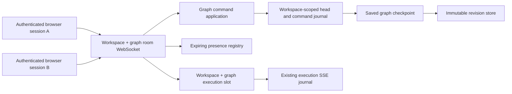
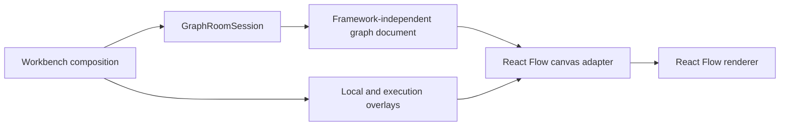

# Realtime Workbench collaboration rework

- **Status:** Accepted; Phase 0–6 implemented; Phase 7 operator release gate open
- **Date:** 2026-08-05
- **Audience:** Engineers changing the Workbench, saved-graph persistence, or graph execution
- **Document type:** Technical design explanation
- **Related:** [Workbench feature architecture](../adr/0001-workbench-feature-architecture.md),
  [collaboration ADR](../adr/0002-server-authoritative-workbench-collaboration.md),
  [authentication and workspace ADR](../adr/0003-authenticate-users-and-scope-collaboration-to-workspaces.md),
  [authentication and workspace tenancy design](authentication-and-workspace-tenancy.md),
  [product vocabulary](../../CONTEXT.md)

## Summary

This document defines realtime collaboration for one saved graph across
multiple browser sessions. Collaborators should see each other's cursors,
selections, editing activity, and live node movement. Durable graph changes
should converge without whole-document save conflicts. A graph execution and
its activity bar should be visible to every session viewing that graph.

The design makes these decisions:

1. A saved graph has one server-authoritative collaboration room keyed by
   stable workspace id and graph id.
2. Clients submit semantic graph commands over a workspace-and-graph-scoped
   WebSocket. The server validates, orders, and atomically persists every
   accepted command as the next collaboration sequence on a durable
   collaborative graph head.
3. Cursor position, remote selection, editing activity, and drag previews are
   ephemeral presence. They never create graph revisions.
4. React Flow remains the canvas renderer, not the canonical graph document.
5. One workspace-owned saved graph may have at most one queued, running, or
   cancelling execution. The room advertises that execution to every authorized
   session.
6. Existing per-execution Server-Sent Events remain the source of live node
   status and progress. The room supplies graph-level execution discovery.
7. Saved graph revisions remain immutable checkpoints for execution,
   materializations, modules, and history. Starting a run first checkpoints the
   exact collaborative graph sequence and then executes that revision. Later
   edits do not change the running plan or its materialized outputs.
8. The first delivery continues to assume one owning API process. Horizontal
   API ownership remains out of scope until execution leases, shared replay,
   cancellation routing, and shared room publication exist.

This is an accepted design for the collaboration rework; parts of the live
codebase may still be mid-migration toward this contract.

## Motivation

The current Workbench is a coherent single-user feature, but its state shape is
not a safe realtime collaboration seam:

- [`Workbench.tsx`](../../apps/web/src/features/workbench/ui/Workbench.tsx)
  owns browser-local node and edge arrays and applies React Flow changes
  directly.
- [`WorkflowNodeData`](../../apps/web/src/features/workbench/canvas/types.ts)
  combines serializable node configuration with derived bindings, execution
  results, progress, secret status, and callback functions.
- [`useSavedGraphLifecycle.ts`](../../apps/web/src/features/workbench/ui/useSavedGraphLifecycle.ts)
  saves one complete document with an expected revision. A concurrent save
  returns `409` and leaves reconciliation to the user.
- [`execution-plan.ts`](../../apps/web/src/features/workbench/model/execution-plan.ts)
  derives the submitted execution fragment from React Flow-shaped client state.
- [`useRunExecution.ts`](../../apps/web/src/features/workbench/ui/useRunExecution.ts)
  learns the execution id only after its own start request and owns the visible
  execution state for that browser.
- [`RunExecutionManager`](../../apps/api/src/grafy_api/execution/manager.py)
  and its event replay journal live in one API process.

The current optimistic revision rule remains valuable. Collaboration should
move conflict resolution from a whole-document `PUT` to meaningful graph
commands rather than remove revision safety.

## Goals

- Two or more sessions opening the same saved graph converge on the same
  durable document.
- Collaborators see remote cursors, selections, live node drag previews, and a
  small indication of what another session is editing.
- Every durable user gesture is structurally validated before it is accepted.
  Commands that create or change execution semantics also use the live node
  registry, while safe edits continue to preserve nodes whose plugins are
  temporarily unavailable.
- Reconnection is deterministic and does not duplicate accepted commands.
- Collaboration heads and checkpoints always preserve the saved-document
  structural contract: unique identities, existing endpoints, plug ownership,
  and one edge per plug. Registry-aware authoring commands continue to enforce
  typed ports, projections, conversion paths, collection modes, generic
  bindings, and cycle policy when the affected contracts are available. As
  today, a structurally valid incomplete or dormant draft may remain
  unexecutable until Run preflight succeeds. Stored unsupported nodes and their
  incident edges remain lossless until registrations return or a user removes
  them.
- All sessions can discover the same active execution and authoritative
  lifecycle, then reconstruct current node status and observe best-effort live
  progress, cancellation, and terminal outcome.
- Execution history and materialized outputs continue to identify one exact
  saved graph checkpoint revision, not a transient collaboration sequence.
- Secrets, secret values, artifact payloads, and other sensitive runtime state
  never enter the graph command journal or presence messages.
- The migration can be delivered in independently testable phases without
  maintaining two canonical frontend graph models.

## Non-goals

- Offline-first authoring or indefinite offline command queues.
- Character-level collaborative text editing inside configuration fields.
- A general CRDT framework or arbitrary JSON Patch interface.
- Multiple concurrent executions for one saved graph.
- Sharing a collaborator's viewport, open drawers, dialogs, or other private
  interface state.
- Sharing in-viewer selection/filter/highlight activity in the first delivery.
  Structural Artifact Viewer documents (viewers, links, bindings) are shared on
  the collaborative head.
- Multi-process graph-room or execution ownership in the first delivery.
- Designing login, account recovery, organization administration, invitations,
  or workspace billing. Those flows belong to the related authentication and
  workspace design. This document does define the actor, workspace,
  capabilities, and revocation contract required by collaboration.

## Vocabulary

These design-specific terms should be added to `CONTEXT.md` when the accepted
vocabulary pass is scheduled.

### Graph room

The transient server-owned coordination context for sessions currently viewing
one saved graph in one workspace. It is keyed by stable
`(workspace_id, graph_id)`, publishes accepted collaboration sequences,
presence, and active execution discovery, and is not the durable source of
truth for the graph document.

### Collaborative graph head

The latest durable authoring document for one workspace-scoped graph room,
identified by workspace id, graph id, room epoch, and a monotonic server
sequence. Accepted commands update this head automatically. The head may be
newer than the latest immutable saved graph revision.

### Graph command

One semantic, atomic authoring gesture submitted by a session. Examples include
moving nodes, changing one configuration field, connecting two ports, or
removing a node with its incident edges. An accepted graph command advances the
collaboration sequence exactly once.

### Graph checkpoint

An immutable saved graph revision created from one exact collaborative graph
head sequence. Checkpoints remain the identity used by execution, graph
modules, execution history, and revision-scoped materialized outputs.

### Actor

The authenticated user on whose behalf a production command, checkpoint,
execution, or other protected operation is attempted. The server derives the
actor from the authenticated request and workspace membership; the client
never supplies authoritative actor identity.

### Auth session

The revocable server-side browser session established after OIDC login. Its
opaque cookie can outlive several graph-room connections, but its cookie and
server-side identifiers never enter graph documents, commands, presence, or
browser-persisted Workbench state. MCP uses a workspace-bound personal access
token over first-delivery **stateless** Streamable HTTP instead; that per-
request MCP credential resolution is neither an `AuthSession` nor an identity.

### Graph room session

One live WebSocket connection to one workspace-scoped graph room. A
`GraphRoomSession` has a server-assigned room-session id and bounded
presentation metadata. It represents one tab or device for presence and
backpressure; it is not an actor, auth session, workspace membership, or
authorization boundary.

### Capability snapshot

The server-derived effective capabilities and authorization version returned
for an actor in a workspace and graph. The UI uses the snapshot to expose only
permitted behavior, but every protected operation is authorized again when it
is handled. The snapshot is therefore presentation input, not a bearer
capability or continuing authority.

### Presence

Bounded, expiring information used only to explain a collaborator's current
interaction: cursor position, selection, editing activity, and drag preview.
Presence is best effort and is never persisted in a saved graph.

### Active graph execution

The one queued, running, or cancelling execution currently owned by a saved
graph. It identifies the exact graph revision, scope, requested nodes, starter,
and execution id.

## State ownership

Collaboration depends on preserving the difference between durable graph state,
ephemeral observation, runtime state, and private interface state.

| State | Owner | Persistence | Shared between sessions |
| --- | --- | --- | --- |
| Graph name, nodes, positions, configuration, plugs, artifact-type bindings, edges, projections, conversions, collection modes, routes, node layout | Workspace-scoped collaborative graph head | Durable head snapshot and command log | Yes, to actors with graph view capability |
| Immutable execution/module document | Saved graph checkpoint | Saved graph revision | Yes |
| Cursor, remote selection, editing activity, soft claim, drag preview | Workspace-scoped graph room session | No; expires | Yes, to authorized room participants |
| Execution id, revision, scope, starter, lifecycle | Execution manager and history | Lifecycle summary is durable for saved runs | Yes |
| Active node, current per-node status, latest bounded progress | Retained execution manager record | Process memory; retained only while the record lives | Yes, through observation snapshot and SSE |
| Node progress event | Execution event journal | No; bounded replay only | Yes |
| Materialized node outputs | Materialization store | Exact graph revision | Yes, only on a matching revision |
| Viewport, zoom, local selection, open library, drawers, dialogs, pending connection route, field draft, in-flight command, pending command queue | Graph room session | No | No |
| Artifact Viewer structural document (viewers, positions/layout/mode, links, bindings) | Workspace-scoped collaborative graph head | Durable head snapshot and command log (`replace_presentation`, `move_artifact_viewers`) | Yes, to actors with graph view capability |
| In-viewer selection, filter/highlight/focus activity | Graph room session | No | No |
| Secret values | Encrypted node-secret store | Protected server storage | Never |
| Secret configured/unconfigured metadata | Node-secret module | Workspace-scoped server state | Authorized clients refetch after a bounded invalidation; values remain excluded |

The saved graph definition already excludes callbacks, selection, viewport,
execution results, and progress. The collaboration model retains that contract
instead of serializing the current React Flow node object.

Personal persistence must never use only a workspace slug and graph id.
Ephemeral browser state (viewport, local selection, in-viewer interaction) is
keyed by stable `(user_id, workspace_id, graph_id)` when persisted at all,
cleared on sign-out, actor change, or view revocation, and re-keyed only after
an authorized new-graph bootstrap succeeds. Device-wide preferences such as
theme may remain outside that graph-sensitive key. Artifact Viewer structure is
not stored in browser localStorage; it lives only on the shared collaborative
head / saved graph presentation.

## Target architecture



The graph room is a coordination module, not the persistence source of truth.
It publishes an accepted command only after the collaborative-head transaction
commits. If publication fails, the durable head still wins and reconnecting
clients receive its latest complete snapshot.

### Frontend dependency direction



The framework-independent graph document is the only durable frontend graph
state. The canvas adapter combines it with local selection, callback functions,
compatibility metadata, presence previews, and execution overlays. React Flow
change events are translated into graph commands rather than applied directly
to the durable document.

This would complete the follow-up debt recorded in ADR 0001: the canonical graph
contract moves inward only by replacing the React Flow-shaped contract, not by
duplicating it.

## Collaboration sequence and checkpoint model

Collaboration ordering and saved graph revision are different concepts:

- The collaboration sequence orders automatically persisted authoring commands.
- The saved graph revision identifies an immutable checkpoint used by
  execution, modules, history, and materialized outputs.

This distinction preserves the existing exact-revision contract. Reusing saved
graph revision as a pointer-event or configuration-edit clock would create a
complete immutable graph snapshot for every gesture and would continuously
make exact materializations ineligible.

Every accepted durable graph command advances the collaboration sequence
exactly once. The server performs these steps in one transaction:

1. Deduplicate the client command id for this `(workspace_id, graph_id)` across
   room epochs.
2. Lock or compare the current collaborative head sequence.
3. Load the current head and read the command-specific expected prior value or
   digest when that command uses compare-and-set conflict handling.
4. Check those preconditions against the latest head.
5. Apply the semantic command to a copy of the head document.
6. Validate the resulting saved-graph-shaped document.
7. Increment the collaboration sequence and persist the new head snapshot.
8. Record the operational command for idempotency and replay, and write a
   separate metadata-only security audit event.
9. Commit.
10. Publish the accepted command and new sequence to the graph room.

High-frequency interactions do not advance either durable clock until their
meaningful gesture commits:

- Cursor updates are presence.
- Node positions while a pointer is down are drag previews.
- A node drag commits one `move_nodes` command and advances the collaboration
  sequence once when the gesture ends.
- Configuration typing is committed on blur or after a bounded debounce, not
  once per keystroke.
- Compound gestures such as binding a generic artifact type and creating its
  edge commit atomically as one command.

The interface distinguishes synchronization from checkpointing:

- **Unsynchronized draft** means a private field draft has not yet become a
  command.
- **Synchronizing** means a durable command is awaiting its receipt or ordered
  broadcast.
- **Draft saved** means the confirmed collaborative head contains every local
  command.
- **Checkpoint rN** identifies the immutable saved graph revision represented
  by a particular head sequence.
- **Reconnect to synchronize changes** means the browser has unacknowledged
  changes and cannot currently reach the graph room.

The current Save action becomes **Create checkpoint** or retains the Save label
with explicit checkpoint wording. Starting an execution automatically creates
or reuses a checkpoint for the exact synchronized head sequence before the run
is accepted.

`beforeunload` and graph-navigation protection remains while a private field
draft, an in-flight durable command, or the pending durable-command queue is
non-empty. Run and Checkpoint first flush every field draft to a command and wait
until the confirmed sequence includes it; they cannot proceed against the older
confirmed value.
There is no normal whole-document conflict dialog during a connected session.

### Checkpoint transaction

A checkpoint identifies one exact
`(workspace_id, graph_id, room_epoch, collaboration_sequence)`.
The server performs the following work in one application-owned unit of work;
it must not commit the saved-graph replacement independently from the head and
checkpoint mapping:

1. locks the saved-graph row and collaborative-head row in a fixed order;
2. verifies that the requested sequence is still the synchronized head;
3. validates the complete head through the saved graph aggregate, preserving
   structurally valid incomplete drafts and dormant plugin nodes; registry-backed
   validation applies only where the affected installed contract is available;
4. replaces the saved graph using the head's `checkpoint_revision` as the
   compare-and-set value;
5. reconciles node-secret references through the existing saved-graph workflow
   without treating an editor's graph checkpoint as authority to delete an
   owner-managed stored secret;
6. appends the normal immutable saved graph revision;
7. records the sequence-to-revision checkpoint mapping;
8. advances `checkpoint_revision` and `checkpoint_sequence` on the collaborative
   head without changing its collaboration sequence; and
9. commits once.

This requires restructuring the current independently committing saved-graph
service path so checkpoint coordination can perform its aggregate and secret
logic inside the caller-owned unit of work. Any failure rolls back every item
above.

The checkpoint must be atomic with respect to another checkpoint or external
complete-document replacement. A second request for an already checkpointed
unchanged sequence returns the existing saved revision.

Removing or changing a secret-backed node can stop that graph revision from
referencing a secret, but physical deletion of an owner-managed secret is a
separate `manage_secrets` operation. An editor who may edit and checkpoint a
graph cannot acquire that capability indirectly through checkpoint
reconciliation.

### Persistence additions

The existing `saved_graphs` row and `saved_graph_revisions` snapshots remain the
checkpoint source of truth. Add a durable collaborative head containing, at
minimum:

- workspace id;
- graph id;
- room epoch;
- current collaboration sequence;
- checkpoint saved revision used by the next checkpoint compare-and-set;
- checkpoint collaboration sequence;
- current graph name and complete saved-graph-shaped document;
- updated timestamp.

The collaborative-head row, checkpoint mapping, command journal,
idempotency tombstone, graph-room registry, and active-execution slot all use
stable `(workspace_id, graph_id)` scope and verify that the graph belongs to that
workspace. A globally unique graph id may remain an implementation convenience,
but no collaboration lookup or uniqueness constraint may silently drop the
workspace boundary.

The collaboration migration initializes every existing graph head from its
current saved revision, with a new room epoch, collaboration sequence zero,
checkpoint sequence zero, and checkpoint revision equal to the current
revision. The migration is idempotent, and production access fails closed if a
post-migration graph is missing its required head.

New-graph bootstrap is the only special sequence transition. The server starts
from the defined empty draft at sequence zero, applies the first semantic command
as sequence 1, and in one transaction writes the workspace-owned graph,
immutable revision 1, collaborative head, checkpoint mapping
`(sequence 1, revision 1)`, command journal entry, and idempotency receipt.
Failure leaves none of them behind.

Add a command journal containing, at minimum:

- workspace id, graph id, and room epoch;
- workspace-and-graph-wide unique command id;
- server-keyed HMAC and key version for the canonical semantic command;
- accepted collaboration sequence;
- graph-room session id and authenticated actor id;
- accepted authorization version;
- command kind;
- authorized semantic command payload needed for replay and recovery;
- acceptance timestamp.

The command id is an idempotency key within one stable
`(workspace_id, graph_id)` across room epochs. A retry of an accepted command
returns its original epoch and sequence and never applies the command again; if
that epoch is no longer current, the response also requires head rehydration.
An unaccepted command from an obsolete epoch is rejected and must not be
silently reapplied under the new epoch. The operational journal is protected
like the complete graph document. It must not contain secret values, decrypted
credentials, artifact payloads, presigned URLs, or execution progress.

The durable collaborative head is the current authoring source of truth. Saved
graph revisions are immutable checkpoints. The command journal supports
idempotency, short reconnect replay, and operational recovery; reconnect may
always fall back to the complete head snapshot. Security audit records are a
separate metadata-only store and never copy the semantic payload. Retention or
compaction may be designed after measuring command volume, but a minimal
deduplication tombstone containing workspace id, graph id, command id, a
server-keyed command HMAC and key version, actor id, accepted epoch, sequence,
and outcome must remain for the workspace-owned graph's lifetime. Payload
retention may be shorter than tombstone retention. The tombstone key includes
workspace id, graph id, and command id. Reusing an id with a different command
returns the stable `idempotency_mismatch` error.

The existing saved-graph read and revision-history endpoints continue to return
checkpoint documents. They must never pair an uncheckpointed collaborative-head
document with the latest checkpoint revision. The browser obtains the live head
from `room.ready`. Authenticated MCP over stateless Streamable HTTP and other
non-WebSocket automation are real live-head consumers, so expose a distinct
workspace-scoped HTTP head-snapshot read that returns the room epoch, head
sequence, checkpoint sequence/revision, and complete head without implying that
it joined presence.

Graph-list navigation may expose head name, head sequence, and checkpoint
sequence as explicitly named draft metadata so a durable rename is discoverable
before checkpointing. It must not overload the checkpoint document's `name` and
`revision` fields with values from different versions.

### Mutations outside the room

Graph create, complete-document replace, and delete routes cannot bypass
collaboration coordination. The authenticated MCP deployment uses stateless
Streamable HTTP as defined by the authentication and workspace design. Its
delegated actor and workspace context are authorized on every tool call; MCP
request authentication is not a graph-room session and does not publish
presence.

MCP and other automation read the explicit live-head HTTP representation before
authoring and submit semantic commands through the workspace-scoped HTTP
command application surface with the observed room epoch, head sequence, and an
idempotency key. Accepted HTTP commands use the same transaction and publish to
connected graph-room sessions after commit. Full-document MCP replacement
remains available for compatibility, but it follows the epoch-reset rules below
rather than overwriting an uncheckpointed live head.

The existing complete-document replacement remains revision checked:

- it still requires the expected saved graph revision;
- it is rejected when the collaborative head has uncheckpointed commands,
  because replacing only the checkpoint would silently discard the room's
  durable draft;
- when the head is fully checkpointed, a successful replacement stores one
  normal immutable revision, starts a new room epoch from that revision, and
  causes connected sessions to rehydrate;
- a stale replacement remains a `409` rather than attempting a generic merge.

Complete replacement is one workspace-and-graph-scoped epoch-reset transaction,
not an ordinary command in the old epoch. It locks the saved graph and
collaborative head in the same order as checkpointing, writes the revision,
initializes the replacement head, and commits once before publication. The new
head has collaboration sequence zero, checkpoint sequence zero, and its new
saved revision as `checkpoint_revision`.
Delete atomically removes or tombstones the
head and prevents new commands before the room is closed. A legacy delete is
rejected while the head is uncheckpointed; a collaboration-aware delete carries
the expected room epoch and sequence and explicitly confirms discarding the
durable head. Delete is also rejected while an execution is queued, running, or
cancelling; the caller must cancel and await terminal state first. Delete and
execution start lock the graph/active slot in a defined order so a race commits
only one outcome. The active slot is keyed by stable workspace id and graph id.
Creation requires `create_graph` in the target workspace, uses the sequence-1
bootstrap transaction, and does not create an untracked or blank revision.

The existing full-document create request maps to a bootstrap
`replace_complete_document` command, so current HTTP and MCP creators receive
the same sequence-1, revision-1 transaction rather than a bypass.

This keeps existing automation valid while ensuring room participants cannot
silently continue from an obsolete graph.

## Graph command model

Commands describe product gestures, not storage patches. The command module
owns their preconditions, validation, and conflict behavior.

Initial command families should cover:

- rename graph;
- add, duplicate, remove, or move nodes;
- update node configuration or node layout;
- add, remove, or reorder an instance input plug;
- bind or reset a node artifact-type variable;
- add, update, route, enable, disable, or remove an edge;
- update Schema Builder fields and their owned input plugs atomically;
- replace the complete document for compatibility with existing HTTP/MCP
  authoring.

Do not expose a generic property-path mutation command. It would require every
caller to understand the complete saved-graph shape and would move invariants
out of the module that owns them.

Commands that can safely manipulate stored unsupported nodes, such as moving or
removing them, validate structural identity without requiring a live plugin.
Creating connections, changing typed transport, or modifying registered
configuration remains registry validated. Registry drift must not silently
delete preserved graph content.

### Command envelope

A client message has a versioned envelope. The exact generated types may change
during implementation, but the information and behavior are required.

```json
{
  "protocol_version": 1,
  "type": "graph.command.submit",
  "command_id": "29cf19aa-1497-4fbf-98a8-9f93855c9178",
  "room_epoch": "4b0af20d-17c9-4612-a8ce-516881c8c3fc",
  "observed_sequence": 42,
  "command": {
    "kind": "move_nodes",
    "positions": [
      { "node_id": "ocr", "x": 320, "y": 160 }
    ]
  }
}
```

The reliable room broadcast carries the authoritative room epoch, sequence,
semantic command, and actor presentation metadata:

```json
{
  "protocol_version": 1,
  "type": "graph.command.accepted",
  "command_id": "29cf19aa-1497-4fbf-98a8-9f93855c9178",
  "room_epoch": "4b0af20d-17c9-4612-a8ce-516881c8c3fc",
  "sequence": 43,
  "actor": {
    "actor_id": "9f724fff-6687-4d2f-814e-fc05ab102f72",
    "display_name": "Ada",
    "color": "indigo"
  },
  "graph_room_session_id": "f28bcc1d-1512-46ef-884f-88fe94e182d1",
  "command": {
    "kind": "move_nodes",
    "positions": [
      { "node_id": "ocr", "x": 320, "y": 160 }
    ]
  }
}
```

The submitting connection separately receives a command receipt. A receipt is
also the response to an idempotent retry and is never rebroadcast:

```json
{
  "protocol_version": 1,
  "type": "graph.command.receipt",
  "command_id": "29cf19aa-1497-4fbf-98a8-9f93855c9178",
  "outcome": "accepted",
  "accepted_room_epoch": "4b0af20d-17c9-4612-a8ce-516881c8c3fc",
  "accepted_sequence": 43,
  "current_room_epoch": "4b0af20d-17c9-4612-a8ce-516881c8c3fc",
  "current_sequence": 43,
  "deduplicated": false,
  "requires_head_rehydration": false
}
```

The route and authenticated graph-room session supply workspace id, graph id,
actor id, graph-room session id, and effective authorization. Those values are
not trusted command-envelope fields. Production command handling rejects a
request without an authenticated actor and reauthorizes `edit_graph` before
deduplication or application.

The server stores a versioned, server-keyed HMAC of the canonical semantic
command with the command id. A plain digest of low-entropy configuration would
be a guessing oracle. The same id and same command return the original receipt;
the same id with a different command returns `idempotency_mismatch`. Receipt and
broadcast may arrive in either order, so clients correlate by command id and
apply only the ordered broadcast to the confirmed document.

The canonical HMAC input covers the server-derived workspace id, graph id, actor
id, original room epoch, observed sequence, semantic command, and command-
specific preconditions. `graph.command.resolve` carries the command id plus
those original submit fields but never applies them; its workspace, graph, and
actor again come from the authenticated route. It exists only to resolve an
acknowledgement lost across a room-epoch reset: a matching tombstone owned by the
same actor returns the original receipt, a mismatched HMAC returns
`idempotency_mismatch`, and an unknown id returns
`obsolete_epoch_uncommitted`. Another actor cannot use a guessed command id to
retrieve that receipt.

Rejected commands carry a stable error code, the operation and target context,
and the current epoch and sequence. They preserve the original cause in server
logs without returning sensitive payloads.

### Conflict policy

Conflict behavior belongs to each semantic command. There is no universal
last-writer-wins rule.

| Command category | Policy against a newer collaborative head |
| --- | --- |
| Move nodes | Accept against the latest document when every node still exists; the last accepted move wins. Presence makes simultaneous dragging visible. |
| Add node or edge | Revalidate against the latest document; reject duplicate ids or invalid current topology. |
| Remove node or edge | Treat an already absent target as an acknowledged no-op; removing a node still removes incident edges atomically. |
| Change name, configuration field, layout, or edge transport | Carry the expected prior value or canonical digest in the command. Rebase when it still matches the latest head; reject `field_conflict` when another accepted command changed the same target. |
| Reorder plugs | Require the expected ordered plug ids; reject when membership or order changed. |
| Compound structural gesture | Apply all parts or none after validating the latest document. |
| Replace complete document | Require an exact current revision; never merge automatically. |

On rejection the client replaces its confirmed document with the server
snapshot, reapplies only still-pending commands that remain valid, and reports
the affected operation in plain language. It must not silently discard a
configuration conflict.

### Optimistic client behavior

The browser keeps an authoritative confirmed document and may render that
document with its own pending commands applied optimistically. Each session
sends at most one durable command at a time. Later local commands remain in a
short in-memory queue until the previous command is accepted or rejected. The
initial client queue cap is 32 commands; reaching it pauses durable authoring and
shows **Waiting to synchronize** until the queue drains.

Every accepted broadcast is applied exactly once to the confirmed document in
collaboration-sequence order. Matching a local `command_id` removes that command
from the pending queue; remote acceptance updates the confirmed document; the
remaining pending commands are revalidated and their optimistic projection is
then recalculated. Acknowledgement and broadcast delivery order must not cause a
local command to be applied twice. A receipt confirms durability but does not
mutate the confirmed document; if its matching broadcast does not arrive within
a bounded interval, the browser refreshes the full head snapshot. A snapshot in
the same epoch whose sequence covers the receipt retires that pending command.

An uncommitted configuration-field draft is browser-private state keyed by node
and semantic field. A remote accepted value does not silently erase an active
draft. If commit conflicts, the browser retains the draft for retry or copy,
shows the confirmed value and conflict, and requires an explicit retry when an
automatic rebase would be unsafe.

Remote accepted commands are applied strictly in collaboration-sequence order
within one room epoch. A missing sequence, changed epoch, protocol mismatch,
or unrecoverable command application error causes a full head snapshot refresh.
Full snapshot recovery is the correctness path; incremental replay is an
optimization.

### Capability-derived Workbench behavior

Workspace roles provide defaults, while the protocol and UI consume the
effective capability snapshot so a future custom grant does not require another
canvas mode.

| Default role | Collaboration behavior |
| --- | --- |
| Owner | View and publish bounded presence; create, copy, edit, checkpoint, execute, and cancel; manage workspace membership and graph sharing; manage stored secrets; delete graphs. |
| Editor | View and publish bounded presence; edit, checkpoint, execute, and cancel; create or copy a graph only into a workspace where the actor also has `create_graph`. An editor cannot manage sharing, physically delete owner-managed secrets, or delete the graph. |
| Viewer | View the confirmed head and permitted checkpoints, execution state, history, artifacts, and collaborators; publish bounded presence when `publish_presence` is granted; pan, zoom, select, and inspect locally without submitting durable graph commands. |

`view_graph`, `publish_presence`, `edit_graph`, `checkpoint_graph`,
`create_graph`, `execute_graph`, `cancel_execution`, `manage_secrets`,
`delete_graph`, and `manage_sharing` remain independently enforceable. The
server reauthorizes the specific capability for every operation; the role name
is never accepted as proof.

Viewer mode is a real read-only canvas mode. It disables React Flow node
dragging and connection creation, graph and configuration inputs, mutation
keyboard shortcuts, delete actions, command dispatch, Checkpoint, Run, Cancel,
secret controls, and sharing controls as dictated by capabilities. It does not
merely hide Save. Local pan, zoom, selection, and inspection remain available.
Structural Artifact Viewer edits still require `edit_graph` and mutate the
collaborative head like other graph commands.

## Graph room protocol

### Connection

The authenticated workspace route resolves the auth session, actor, stable
workspace id, membership, and graph visibility before the Workbench joins a
room. A workspace slug is a mutable routing alias, never a room, persistence,
cache, or authorization key. After the graph has a durable id, the browser
connects to the workspace-and-graph-scoped WebSocket. The handshake validates
the auth session and `Origin`, verifies that the graph belongs to the resolved
workspace, and requires `view_graph` before accepting the connection. The
server then assigns a new graph-room session id.

The initial `room.ready` message contains:

- protocol version;
- stable workspace id and graph id;
- server-derived actor id and bounded actor presentation;
- server-assigned graph-room session id, distinct from the auth session;
- effective capability snapshot and monotonic authorization version;
- current room epoch and collaboration sequence, checkpoint saved revision and
  checkpoint sequence, graph name, and complete collaborative head document;
- current participants and presence;
- active execution summary, if one exists;
- node registry version or compatibility marker needed by the client.

The client treats `room.ready` as the boundary for mounting that graph's
confirmed document and keys the Workbench generation by actor id, workspace id,
graph id, and graph-room session id. A late HTTP, SSE, or WebSocket callback from
an earlier generation cannot update the new workspace or graph. `401`, `403`,
and concealed or missing `404` join failures remain distinct from a reconnectable
network interruption.

The blank `/workspaces/{workspace_slug}/graphs/new` route has no room. Its first
durable authoring gesture requires `create_graph` in the resolved workspace and
uses the HTTP bootstrap transaction described above. The response returns the
stable workspace id, graph id, room epoch, sequence 1, checkpoint sequence 1,
revision 1, and command receipt; the client changes the canonical URL and then
joins its room. A later product decision may require naming before creation,
but collaboration must never use `new` as a shared room identity.

### Delivery and backpressure

- Accepted graph commands are reliable because their state is persisted before
  broadcast.
- Presence is best effort and may be dropped under backpressure.
- Command messages and presence messages have separate size and rate limits.
- The server sends an application heartbeat; a session that misses the expiry
  window is removed from presence.
- Slow sessions are disconnected and recover from a full snapshot rather than
  retaining an unbounded send queue.
- Message payloads use a protocol version. An incompatible client receives a
  specific close reason and must reload.

### Reconnection

After a network interruption:

1. The server expires the old session's presence.
2. The browser reconnects and receives the latest complete head snapshot,
   room epoch, sequence, checkpoint revision, checkpoint sequence, actor,
   capability snapshot, and authorization version.
3. Only when actor, stable workspace, graph, and room epoch are unchanged and
   `edit_graph` remains authorized are commands with no receipt resubmitted with
   the same command ids. The server deduplicates committed ids and evaluates
   genuinely uncommitted commands against the latest head and sequence.
4. If the room epoch or authenticated scope changed, or edit capability was
   removed, the browser sends `graph.command.resolve` for each unknown outcome
   where still authorized rather than submitting an obsolete command envelope.
5. An original receipt proves the command committed; the client rehydrates the
   current head. `obsolete_epoch_uncommitted` proves it did not commit, after
   which the client revalidates the underlying gesture against the replacement
   snapshot and asks for user resolution when unsafe.
6. The browser restores only its local viewport and private interface state.
7. If an execution is active, the browser subscribes to its existing SSE
   stream.

Once disconnected, the browser lets the active pointer or input gesture finish
but accepts no further durable gestures. It preserves already-created in-flight
and queued commands while the graph view remains mounted, disables Run and
Checkpoint, and shows **Unsynchronized**. Offline editing beyond that queue is
not supported; the UI must not imply those changes are durably safe.

### Capability changes and revocation

Membership, graph sharing, or role changes increment the server-owned
authorization version. After the membership transaction commits, the room hub
closes every affected connection with `permissions_changed`; it does not update
authorization in place. A still-authorized browser must rejoin and receive a
fresh capability snapshot and authorization version before resuming protected
traffic. Handling-time authorization remains authoritative if the close races
an in-flight operation.

On a role-change close:

1. The browser stops durable gestures, cancels active drag or connection
   previews, and stops dispatching its queue.
2. An in-flight command already committed before the authorization change
   remains accepted. A command not yet authorized is rejected with a stable
   permission outcome. An ambiguous command id is resolved after the fresh join
   without resubmitting the command under obsolete capabilities.
3. The browser rebuilds from the newly authorized confirmed head without unsent
   optimistic commands. It may retain a private field draft only as explicitly
   copyable text while `view_graph` remains, labels it unsent, and never
   automatically replays it after a later upgrade.
4. The remounted canvas and controls reflect the newly derived capabilities,
   including read-only Viewer behavior.

When `view_graph` is revoked, the server removes the graph-room session from
presence and closes it with the stable `access_revoked` reason. The client does
not apply the normal network-failure behavior of leaving the confirmed graph
visible: it aborts related HTTP/SSE work, clears the graph document, execution
and artifact references, purges actor/workspace/graph-scoped caches and personal
graph state, and navigates to a safe authorized workspace route without a local
confirmation that could retain the revoked data.

Auth-session expiry is distinct from permission revocation. It pauses protected
traffic and locks the workspace behind reauthentication. A renewed session for
the same actor performs a fresh authorized join and resolves outstanding command
ids; signing in as a different actor purges the old actor's graph and personal
state and never replays the old actor's drafts or commands.

### Leaving a graph or switching workspace

A voluntary graph or workspace switch first flushes the active field draft,
waits for every in-flight receipt and matching accepted sequence or covering
snapshot, and drains the queued commands. It then leaves the room, clears its
presence and workspace-scoped request/cache generation, navigates, and mounts
the destination only after its authenticated `room.ready`.

If synchronization cannot complete, ordinary switching offers **Stay and
retry** or an explicit **Discard local pending work and switch** action. The
discard path removes private drafts and optimistic commands; it does not undo an
already committed server command. A forced access revocation, account change,
or sign-out cannot be held open indefinitely by pending work and follows the
security-clearing behavior above.

Field drafts, unsent queued commands, and browser request generations never
carry across an AuthSession boundary. Durable command ids, receipts, and
idempotency records are bound to actor id, stable workspace id, graph id, and
room epoch; after reauthentication the same actor may query them only to resolve
an in-flight outcome, not to resubmit an obsolete envelope. Nothing carries or
replays into another workspace, graph, room epoch, or actor.

## Presence and cursors

Presence should explain collaborators without becoming another graph model.
It is keyed by graph-room session id, not actor id, so two tabs or devices for
one actor remain independently expiring cursors. Participant UI may group those
sessions under the server-derived actor presentation and show a session count.
Publishing presence requires `publish_presence`; viewing a graph does not by
itself grant another outbound channel.

A presence update may contain:

- cursor position in React Flow graph coordinates;
- selected node ids and, when useful, selected edge ids;
- an activity kind such as `moving_nodes`, `editing_node`, or `connecting`;
- the ids of nodes or edges involved in that activity;
- live node positions for a drag preview;
- a monotonically increasing session-local presence sequence.

It must not contain:

- node configuration values;
- secret names paired with values or any secret input;
- artifact payloads or complete run inputs;
- progress messages copied from execution events;
- viewport dimensions or other unnecessary device data;
- arbitrary user-provided HTML, CSS, image URLs, or colors.

### Cursor behavior

- Broadcast at most approximately 20 cursor updates per second.
- Convert pointer coordinates to graph coordinates before sending them. Each
  recipient uses its own viewport transform when rendering the remote cursor.
- Stop broadcasting when the pointer leaves the canvas.
- Expire cursor and activity presence after a short server-owned TTL.
- Use server-assigned display colors and bounded names.
- Keep email addresses, role names, arbitrary avatar URLs, and client-provided
  styles out of presence. Actor profile changes refresh bounded presentation
  through the server.
- Hide only the local graph-room session's own remote-cursor rendering; another
  tab belonging to the same actor remains a distinct remote session.

### Selection and editing activity

Remote selection is an annotation. It never changes the recipient's React Flow
selection or keyboard-command target.

Editing activity is a soft claim, not a lock. If two sessions edit the same
field, the graph-command conflict policy decides the result. A future hard lock
requires evidence that soft claims and field conflicts are insufficient.

### Node dragging

Dragging has two paths:

1. Presence publishes transient node positions so collaborators see smooth
   movement.
2. Pointer release submits one durable `move_nodes` command.

If the final command is rejected because a node was deleted, the drag preview
disappears and the confirmed document wins. Disconnecting mid-drag likewise
removes the preview without changing the saved graph.

## Shared graph execution

Execution status is server-owned shared state. The browser that presses Run has
no special ownership of observation.

### Start contract

The collaborative Workbench should start saved-graph execution through a
workspace-and-graph-scoped request containing:

- stable workspace id resolved by the route;
- graph id from the route;
- expected room epoch and synchronized head sequence;
- execution scope: all, selected, or selected with dependencies;
- requested node ids for a selected scope;
- a client request id for idempotency.

The client request id is unique per `(workspace_id, graph_id)` and persists with
execution history.
The server stores a versioned, server-keyed HMAC covering the server-derived
workspace id, graph id, actor id, submitted room epoch, head sequence, scope,
and canonical requested node ids. Retrying the same id and same request as the
same actor returns the original execution, including after terminal state or
process restart. Reusing the id with different request data returns
`idempotency_mismatch`. The idempotency record remains for the workspace-owned
graph's lifetime.
The coordinator resolves this record before current-head and active-slot checks,
so a true retry cannot turn into a later `head_moved` or active-run conflict.

The client does not submit Run while it has a private field draft, a pending
durable command, or a confirmed-sequence gap. It flushes drafts and waits until
the confirmed document includes them. The server requires the submitted epoch
and sequence to equal the current head. It atomically creates or reuses the
checkpoint for that head sequence, then loads the exact saved graph revision,
derives the execution fragment and upstream pins, performs preflight, and starts
it. The collaborative client must not submit a second copy of the complete graph
as the source of truth.

A `head_moved` rejection refreshes the room state but does not automatically
retry Run. In particular, a selected-scope dependency closure may have changed;
the user confirms the new selection and starts a new request.

Requested node ids are copied into immutable execution scope. They never change
local or remote React Flow selection in any session.

The existing generic execution request may remain for compatibility and
diagnostics, but the production Workbench should use the workspace-and-graph-scoped start
contract. For the first release, synchronous `POST /v1/runs` is changed to
draft/diagnostic-only and rejects saved graph context. No endpoint may execute a
saved graph without acquiring its active slot and producing a discoverable
execution id.

### One active execution

Queued, running, and cancelling are active states. Starting another execution
for the same `(workspace_id, graph_id)` returns a conflict containing the
existing active execution summary. The caller attaches to that execution
instead of creating another.
Exact idempotent request retries are resolved before this conflict rule and
return their original execution.

Enforce this in both the execution application module and persistence. A
database uniqueness rule for active saved-graph executions prevents duplicate
runs from concurrent requests even before multi-process execution is supported.
The rule applies to every top-level API path that starts and persists an
execution attributed to a saved graph, including the existing generic execution
endpoint; routing around the graph room must not bypass it. Internal immutable
saved-module invocations remain children of their owning top-level run and do
not acquire an independent graph-active slot.

Queued history creation, active-slot acquisition, and the unique client request
id commit together. Durable terminal transition and slot release likewise
commit together, and the room announces terminal state only after that commit.
Startup recovery marks an abandoned execution failed and releases its slot in
one transaction.

Terminal executions release the graph immediately. Execution history remains
append-only, and repeated runs continue to create distinct execution ids.

### Discovery and observation

The graph room announces:

- execution accepted and queued;
- lifecycle changes relevant to the activity bar;
- whether the current collaborative head remains compatible with execution
  overlays from the checkpoint;
- terminal state and the revision that completed;
- removal from the active slot.

It does not duplicate every node progress event. Once a client learns the
execution id, it subscribes to the existing
`/v1/executions/{execution_id}/events` SSE stream. The ordinary execution GET is
authoritative while its in-process manager record is retained, and polling
remains the active-run fallback when SSE is unavailable. Graph-scoped durable
execution history is the terminal source after restart or manager eviction
unless GET is extended to reconstruct saved executions from that history.

SSE connect/reconnect, execution GET, and polling authorize the authenticated
actor against the execution's stable workspace and graph. Removing
`view_graph` closes observation and prevents reconnect; removing only execute or
cancel capability does not hide an execution the actor may still view. Browser
transport uses the same-origin auth session defined by the authentication
design, treats `401` and `403` as auth state changes rather than retryable
network errors, and guards every event with the current actor/workspace/graph
request generation.

A session joining halfway through a run receives the active execution in
`room.ready`, fetches its current observation snapshot, and then subscribes to
SSE after the snapshot's sequence. The retained-manager GET contract must be
extended to return the current lifecycle, active node, per-node status, latest
bounded progress, terminal results when available, and the exact observation
sequence represented by that snapshot.

The bounded journal exposes its earliest and latest retained sequences. When a
requested SSE cursor predates the window, the server emits an explicit
`replay_truncated` control event rather than silently beginning with a gap. The
client then refetches the observation snapshot and resumes after its sequence.
If enough events are produced between snapshot GET and SSE connection to cause
another gap, the same loop remains correct. Complete progress history is not
required; current per-node state is.

The server computes the overlay-compatibility flag by comparing the exact
submitted execution plan with the plan the current head would derive for the
same scope. The comparison includes operator identity and version,
configuration, plugs, artifact-type bindings, and enabled edge transport
semantics. It excludes graph name, canvas position, node chrome layout,
selection, presence, and other non-execution state. This server-owned projection
prevents late joiners and different frontend versions from independently
guessing whether checkpoint overlays are safe.

### Activity bar

Every session derives the same authoritative execution facts for its activity
bar:

- starter presentation identity;
- execution id;
- exact graph revision;
- run scope and requested selection;
- queued, running, cancelling, or terminal state;
- active top-level node;
- current overlay-compatibility flag;
- whether the execution lifecycle is cancellable;
- bounded, safe terminal error context.

The wording may differ for accessibility or viewport size, but the underlying
execution state is shared. The cancel action is still authorized for the current
actor, so viewers may see the same execution without receiving the same control.

The latest progress summary, SSE or polling transport errors, and cancellation
request errors are best-effort browser-local observations and may differ between
sessions. They never overwrite the shared lifecycle state.

Only the execution portion of the activity bar is shared. Synchronization,
reconnection, rejected local commands, in-viewer interaction status, and other
browser-local status remain local. The Workbench composes those local facts with
the shared execution summary using an explicit display priority; it does not
broadcast one browser's incidental UI status to the room.

### Editing while a run is active

The graph remains editable during execution. The execution continues against
its checkpoint revision.

Execution observation and materialization eligibility use different guards:

- The activity bar follows execution id and remains visible regardless of later
  graph edits.
- Node status/progress overlays may follow stable node ids only while the
  server-provided overlay-compatibility flag is true. Graph name, canvas
  position, node chrome layout, selection, and presence do not make that flag
  false.
- Run outputs become current materialization pins only for the exact saved
  graph revision recorded by the execution.

If saved revision 42 is running while collaborators advance the collaborative
head from sequence 80 to sequence 86:

- the activity bar continues to show `running r42`;
- the newer head does not paint any r42 node status when its derived execution
  plan differs from the r42 submitted plan;
- execution history records r42;
- materialized outputs remain keyed to r42;
- a user may inspect the execution detail without making it a current output
  for the newer uncheckpointed head or a later checkpoint;
- another execution cannot start until r42 becomes terminal.

This would replace the current behavior where a local fingerprint change can
make the initiating hook stop applying events while other sessions know nothing
about the run.

### Cancellation

Cancellation is a shared server command. All sessions observe `cancelling` and
the eventual terminal state while they retain graph view capability. The
current actor requires `cancel_execution`; Owner and Editor receive it by
default, while Viewer does not. Execute and cancel remain independent effective
capabilities and are reauthorized when handled.

## Frontend rework

### Deep graph document module

Create one framework-independent Workbench graph document module under
`features/workbench/model`. It should own:

- the serializable `GraphDocument` value;
- pure application of accepted graph commands;
- command construction for meaningful authoring gestures;
- command-specific precondition evaluation;
- durable fingerprinting only where compatibility still requires it;
- conversion between API saved-graph models and the internal document.

Its test surface is the same surface used by local gestures and remote accepted
commands. Do not add one helper per constructor or property update; keep the
semantic command and its invariant in the owning module.

### React Flow adapter

The canvas segment should own conversion from the graph document to renderer
nodes and edges. It may add:

- registry-derived node specifications and compatibility;
- React callbacks;
- local selection;
- input-plug bindings and mapped-input derivations;
- presence decoration and drag previews;
- execution and materialization overlays;
- renderer styles and handle ids.

None of those values should be written back to the graph document unless a user
gesture creates a graph command.

The adapter owns browser-local selection and local drag positions. React Flow
position changes during a drag update only that overlay;
`onNodeDragStop` submits one `move_nodes` command containing every moved selected
node. Remote selections remain decorations and never set the local `selected`
flag. A remote drag preview never replaces a node position currently dragged
locally; the confirmed or optimistic document position wins after local drag
completion, rejection, deletion, or preview expiry.

### Graph-room session module

A browser-facing collaboration module should own:

- WebSocket connection, protocol version, heartbeat, and reconnect;
- current actor id, stable workspace id, graph id, graph-room session id,
  capability snapshot, authorization version, and request generation;
- current confirmed room epoch, collaboration sequence, checkpoint revision,
  checkpoint sequence, and server head snapshot;
- one in-flight durable command and its pending queue;
- accepted/rejected command reconciliation;
- local presence throttling and remote presence expiry;
- active execution discovery;
- capability downgrade, view revocation, auth-session expiry, and graceful or
  explicit-discard graph/workspace switching;
- synchronization state exposed to the Workbench.

This complexity earns one explicit module. It should not be spread across node,
edge, header, activity-bar, and persistence hooks.

The graph-room session module owns `confirmedDocument` and derives
`optimisticDocument` by folding the valid in-flight and pending commands over it.
The graph model supplies pure operations but owns no socket, sequence, queue, or
reconnect lifecycle.

### Execution modules

Separate the current execution hook responsibilities:

- execution initiation validates local synchronization and sends a workspace-and-graph-scoped
  start or cancel request;
- execution observation attaches to the active execution discovered from the
  room, manages SSE plus polling reconciliation, and produces revision-scoped
  overlays;
- activity-bar rendering consumes observation state and owns no network
  lifecycle.

### Current module disposition

| Current module | Proposed disposition |
| --- | --- |
| `ui/Workbench.tsx` | Retain as feature composition; remove direct durable graph mutation and execution-stream ownership. |
| `ui/useSavedGraphLifecycle.ts` | Replace normal manual-save lifecycle with collaboration synchronization; retain route/open/delete concerns only where they remain cohesive. Delete the obsolete conflict workflow. |
| `ui/useRunExecution.ts` | Split initiation from workspace-and-graph-scoped observation; preserve proven SSE parsing, polling, cancellation reconciliation, and progress batching. |
| `canvas/types.ts` | Keep renderer contracts; move durable graph and runtime overlay state apart. |
| `canvas/saved-graph.ts` | Move canonical saved-document hydration/serialization inward or reduce it to a real canvas adapter. Do not keep two graph representations. |
| `model/graph-authoring.ts` | Reuse its deterministic connection policies behind semantic graph commands. Remove React Flow dependencies when the canonical document moves inward. |
| `model/execution-plan.ts` | Move saved-revision execution planning to the server; retain only local selection UX and preflight hints that improve responsiveness. |
| `lib/api/workbench.ts` | Retain the concrete same-origin authenticated HTTP/SSE adapter and add a concrete, versioned workspace-and-graph-scoped collaboration WebSocket adapter. Treat auth failures separately from network retries. |
| `canvas/artifact-viewer.ts` | Keep its document browser-local and key it by stable user, workspace, and graph ids; reconcile personal viewer links after every confirmed command or snapshot replacement. Missing workflow sources leave a disconnected viewer rather than deleting private layout. On first graph creation, re-key local viewer state only after authorized bootstrap under the document-generation guard; clear it on view revocation, sign-out, or actor change. |

## Backend rework

### Graph command application

Add one collaboration application module that owns both the accepted-command
transaction and checkpoint coordination. The WebSocket route, existing HTTP
create/replace/delete routes, and MCP callers must coordinate through this
module rather than mutating an unrelated head.

The command path uses the saved-graph-shaped domain value and registry policies
to validate the collaborative head without creating a saved revision. The
checkpoint path uses the existing saved-graph aggregate,
repository/unit-of-work seam, immutable revision snapshots, and node-secret
reconciliation. Both paths return typed accepted or rejected results with graph
and operation context.

### Graph room hub

Add an API-host module for active WebSocket sessions and ephemeral presence.
This is browser coordination and does not belong in the core domain or saved
graph aggregate.

The hub owns:

- sessions grouped by stable workspace id and graph id;
- presence TTL and presentation metadata;
- bounded per-session outbound queues;
- publication after graph-command commit;
- active execution discovery publication;
- shutdown and graph-deletion close behavior.

One in-process hub is a deliberate first adapter. Do not introduce a broker
adapter before a second API owner is actually supported.

### Execution ownership

Extend saved-graph execution start with:

- an idempotent client request id;
- initiator metadata that is safe to show and audit;
- an atomic one-active-execution invariant per stable workspace id and graph id;
- graph-room publication after transitions;
- workspace-and-graph-scoped discovery of the active execution.

Keep the existing sequenced event journal, SSE heartbeat, bounded replay,
polling fallback, terminal response, durable history, and exact
materializations. Extend the retained execution record and GET presenter with a
sequence-consistent current per-node observation snapshot, and make replay-window
truncation explicit.

### Initial deployment constraint

The current manager, event journal, cancellation routing, and startup recovery
assume one owning API process. On startup, unfinished durable executions are
marked failed. Starting a second API owner would therefore be unsafe.

The collaboration rollout must enforce exactly one FastAPI application process:
one replica and one Uvicorn or Gunicorn worker. Feature enablement requires a
deployment-level singleton assertion; a second process must fail startup or
leave graph rooms and saved-graph execution disabled. Horizontal ownership
requires a separate accepted design covering:

- execution and graph-room owner leases or heartbeats;
- shared command and room publication;
- shared event replay or owner-aware routing;
- cancellation intent routing;
- recovery scoped to expired owners rather than every active row;
- connection draining during deployment.

Adding another WebSocket or SSE endpoint alone does not solve those concerns.

## Identity, authorization, and sensitive state

The related authentication and workspace design owns login and membership. In
production, every collaboration, HTTP, SSE, and MCP operation requires a
server-derived authenticated actor in one stable workspace. The current `local`
workspace slug is only a route label. There is no anonymous or hidden local user
fallback; development uses the same configured OIDC identity contract.

Authorize these capabilities independently even when Owner, Editor, and Viewer
roles provide their default bundles:

- view graph and participant presence;
- publish bounded presence;
- create or copy a graph in a workspace;
- submit durable graph commands;
- create a checkpoint;
- start execution;
- cancel execution;
- manage node secrets;
- delete the graph;
- manage graph sharing and workspace membership.

Node-secret values continue to use their protected HTTP boundary and never
become graph commands or WebSocket messages. Configure and remove requests carry
the expected workspace, graph, room epoch, and synchronized sequence and require
`manage_secrets`. The server validates the declaration and value, creates or
reuses a checkpoint for that exact head, and stores or removes the encrypted
secret against the resulting saved-graph contract in one coordinated workflow.
A stale head is rejected before touching secret storage. An editor checkpoint
may remove a graph reference but cannot physically delete an owner-managed
secret. After a secret commit, the room announces only a bounded invalidation;
each authorized actor refetches workspace-scoped configured status through
protected HTTP. The status is bounded metadata; the secret value is never
disclosed.

The server assigns trusted actor identity to accepted commands and executions.
A client must not be allowed to claim another actor id or arbitrary display
style.

Security requirements:

- Authorize each graph command, execution start/cancel, secret mutation,
  checkpoint, replacement, and delete at handling time; WebSocket admission is
  not continuing edit authority. Apply capability changes and view revocation
  using the deterministic room behavior defined above.
- Validate the WebSocket `Origin` against configured allowed origins; HTTP CORS
  middleware does not authorize a WebSocket handshake.
- Validate every WebSocket message with bounded Pydantic models.
- Cap message bytes, selected ids, dragged nodes, and update frequency.
- Never log complete command or presence payloads by default.
- Log workspace id, graph id, command id, actor/graph-room-session id, command
  kind, accepted collaboration sequence, checkpoint revision when relevant,
  outcome, and safe error code.
- Continue storing secret values only through the explicit encrypted
  node-secret module.
- Keep secret values, credentials, artifact payloads, presigned URLs, and
  one-time URLs out of command, presence, exception, trace, and audit data.
- Treat execution progress as bounded display text under the existing live
  execution event contract.
- Maintain an automated sentinel-secret test proving that snapshots, commands,
  presence, execution announcements, protocol errors, and captured logs never
  contain the configured value.

## Failure behavior

| Failure | Required behavior |
| --- | --- |
| WebSocket interruption | Keep confirmed document visible, mark synchronization unavailable, expire remote presence, and reconnect with a full snapshot. |
| Auth session expired | Stop commands and observation, lock the workspace behind reauthentication, and perform a fresh join. Resolve pending ids only for the same actor; purge rather than replay after an actor change. |
| Role or capabilities changed | Close with `permissions_changed`, stop protected traffic, resolve the in-flight outcome under handling-time authorization, and perform a fresh authorized join. Rebuild without unsent optimistic commands and retain at most explicitly copyable private draft text when view access remains. |
| View capability revoked | Close with `access_revoked`, clear presence and all actor/workspace/graph-sensitive client state, abort HTTP/SSE work, and navigate to a safe authorized workspace route. Do not leave the confirmed graph visible. |
| Voluntary graph or workspace switch cannot synchronize | Stay and retry by default; switch only after drain or explicit discard of local pending work. Never replay it in the destination scope. |
| Command acknowledgement lost | In the same epoch, retry the same command id; the server returns the original receipt when already committed. After an epoch change, use dedup-only `graph.command.resolve`, rehydrate, and never submit the obsolete envelope. |
| Command rejected | Restore confirmed server state, preserve unrelated pending commands, and show operation/target context. |
| Presence update dropped | No retry is required; a later update supersedes it. |
| Slow collaborator | Drop presence first, then disconnect and require snapshot recovery before allowing unbounded buffering. |
| API restart | Durable collaborative heads, commands, and checkpoint revisions survive; all presence disappears; browsers reconnect and receive head snapshots. Existing startup execution recovery remains authoritative. |
| SSE network interruption | Keep the shared execution visible, poll its snapshot, and reconnect to bounded event replay. A `401` or `403` follows auth-expiry or revocation behavior instead of retrying. |
| Graph edited during execution | Keep showing the execution's checkpoint revision; retain compatible live observation but never make its materializations current for another revision. |
| Graph deleted | Close its room with a stable reason, clear presence, stop accepting commands, purge graph-sensitive client state, and navigate clients away. A remote deletion has already committed and cannot wait for local confirmation. |
| Registry changes | Revalidate on the server; force a snapshot/registry refresh when the protocol compatibility marker changes. |

Errors must retain the attempted operation, workspace id, graph id, actor id,
relevant node or edge id, expected/current authorization version, epoch and
sequence, checkpoint revision when relevant, and original server cause where
safe.

## Migration plan

### Phase 1: Extract the canonical graph document

Keep current HTTP save behavior while replacing React Flow as the canonical
document.

Deliverables:

- framework-independent graph document under `model`;
- pure semantic command application;
- React Flow adapter with explicit drag start/move/stop callbacks and local
  selection, drag, draft-field, and runtime overlays added at render time;
- existing saved graph round-trip and authoring behavior preserved;
- `Workbench.tsx` no longer directly implements every durable mutation.

Exit criteria:

- existing saved graphs round-trip byte-semantically through the new document;
- local graph commands pass behavioral tests;
- no callback, selection, execution, progress, or secret value serializes into
  the document;
- real pointer drag, connection, deletion, and configuration editing still
  work in the browser.

### Phase 2: Establish authenticated workspace scope

Implement the related authentication and workspace design before introducing
durable collaboration state. Resolve every browser, HTTP, SSE, and future MCP
operation to the same authenticated actor and stable workspace model; add Owner,
Editor, and Viewer defaults, effective capability checks, workspace-aware
routing/cache keys, opaque browser sessions, and workspace-bound PATs. Do not
add an anonymous `local` or hidden-user development fallback.

Exit criteria:

- workspace slugs resolve to stable ids before graph access, and graph ownership
  is enforced by stable workspace id;
- production graph reads and mutations require an authenticated actor and
  enforce effective capabilities at handling time;
- browser caches and Artifact Viewer persistence are scoped by stable user,
  workspace, and graph ids and clear on sign-out, actor change, or revocation;
- Owner, Editor, and Viewer behavior matches the capability matrix, including a
  real read-only canvas and Owner-only protected secret configuration/removal;
- workspace-bound PAT issuance and revocation exist for the later Streamable
  HTTP MCP transition, without adding a second authentication authority;
- HTTP/SSE auth expiry, role change, membership removal, and workspace switching
  have deterministic integration coverage before room-specific closure behavior
  is added in Phase 4.

### Phase 3: Add transactional graph commands

Add backend command models, durable collaborative head, idempotency journal,
metadata-only security audit writes, atomic collaboration-sequence persistence,
checkpoint workflow, explicit live-head HTTP read and semantic-command HTTP
surface, and command-specific conflict policy. Coordinate current complete-
document replacement with the same module.

The linked implementation plan transitions MCP after these application
contracts exist. That transition begins with a pinned FastMCP/MCP SDK
compatibility gate for mounted **stateless** Streamable HTTP, lifespan
composition, request-header access, concurrent per-request actor isolation
without a process-global caller token, and proxy behavior; it does not add a
stdio fallback.

Exit criteria:

- accepted commands increment collaboration sequence exactly once without
  creating a saved graph revision;
- retrying a command id is idempotent;
- invalid topology or stale conflicting fields do not persist;
- collaborative head and command journal commit atomically;
- an accepted command's metadata-only security audit event commits with the
  mutation, while rejected attempts record a bounded outcome without copying
  the submitted command or configuration;
- checkpointing one exact head sequence creates or reuses one saved graph
  revision and reconciles secret bindings;
- an Editor checkpoint may make a secret binding inactive but cannot physically
  delete the Owner-managed encrypted row;
- the migration initializes one head for every pre-existing graph and production
  access fails closed if one is missing; new graph creation commits revision 1
  with its head or rolls both back;
- the first `/new` gesture records one command at sequence 1 and maps that same
  document to checkpoint revision 1;
- failure injection and concurrent checkpoint-versus-replace tests leave no
  partial revision, mapping, head update, or secret reconciliation;
- the live-head HTTP read and semantic-command surface enforce the same
  workspace, actor, HMAC, sequence, and checkpoint contracts needed by the later
  mounted MCP transition.

### Phase 4: Add the graph room and automatic persistence

Add the WebSocket protocol, initial snapshot, reliable accepted-command
publication, client command queue, reconnect, and synchronization state. Show
sync state separately from the explicit checkpoint action.

Exit criteria:

- two sessions converge after interleaved edits;
- a reconnect never duplicates an accepted command;
- an external complete-document replacement is rejected while the head is
  uncheckpointed; a safe replacement starts a new epoch and resynchronizes both
  sessions;
- a safe HTTP or mounted-MCP epoch reset causes connected sessions to rehydrate
  once after commit;
- the browser stops accepting durable gestures while disconnected and warns for
  every private field draft, in-flight command, or queued command;
- one slow connection cannot grow an unbounded queue.

### Phase 5: Add presence

Add cursors, remote selections, activity, soft claims, and live drag previews.

Exit criteria:

- cursor rendering uses graph coordinates and remains correct under different
  local zoom and pan;
- drag previews are smooth but create only one accepted collaboration command
  on release and no checkpoint revision by themselves;
- disconnect and TTL remove presence without changing the graph;
- remote selection never changes local keyboard targets;
- presence payload tests reject sensitive or oversized data.

### Phase 6: Share graph execution

Add workspace-and-graph-scoped execution start, active-execution uniqueness,
graph-room discovery, and execution-compatibility-gated overlays. Split execution
initiation and observation in the frontend while retaining SSE and polling
behavior.

Exit criteria:

- a run started in one session appears in every session's activity bar;
- a new session joining mid-run discovers and observes it;
- simultaneous start requests create one execution and return the same active
  summary to the loser;
- retrying the same client request id returns the original execution;
- all sessions see cancellation and terminal outcome;
- a session joining after early events have fallen out of SSE replay still
  reconstructs current per-node status from the observation snapshot;
- cosmetic edits during a run retain its overlays, while an execution-plan edit
  removes node overlays without hiding the shared activity bar;
- execution history and materializations remain exact.

### Phase 7: Production deployment and scaling gate

This final collaboration phase is only the deployment and scaling gate; identity
and workspace authorization already exist from Phase 2 and are not reopened
here. Before enabling collaboration, verify that graph rooms, HTTP/SSE
execution, and stateless MCP Streamable HTTP all enforce that shared contract
and the full authenticated acceptance suite passes. Do not add another API
owner until a separate execution/room ownership design is implemented and
verified.

Feature enablement also asserts exactly one FastAPI application process: one
replica and one Uvicorn or Gunicorn worker. A second process must fail startup or
leave collaboration and saved-graph execution traffic disabled.

## Verification strategy

Tests should cross the same interfaces used by production callers.

### Model tests

- Every semantic command applies to a graph document and preserves invariants.
- Compound commands are atomic.
- Per-command stale-sequence policies accept safe rebases and reject real
  conflicts.
- Accepted remote commands applied in collaboration-sequence order converge.
- Execution overlays remain for a cosmetically different head but are ignored
  when the server marks its derived execution plan incompatible.
- Presence never mutates the durable document.

### Persistence and application tests

- Head, command-journal, checkpoint mapping, idempotency tombstone, graph-room
  publication, and active-execution slot keys include the stable workspace id;
  identical client ids in different workspaces cannot collide or leak results.
- Production command, checkpoint, execution, secret, replacement, delete, and
  live-head HTTP paths reject a missing authenticated actor and enforce their
  specific effective capability at handling time.
- Command id, sequence increment, collaborative head, and journal entry commit
  together without creating a checkpoint revision.
- An accepted command's metadata-only security audit event commits with the
  mutation; rejected outcomes never copy submitted semantic values into audit.
- Checkpoint sequence, saved graph row, immutable revision snapshot, and secret
  reconciliation commit as one coordinated workflow.
- Failure injection at each checkpoint and epoch-reset write rolls everything
  back; concurrent checkpoint and complete replacement serialize safely.
- The migration initializes exactly one head for every existing graph, and
  production access fails closed rather than lazily inventing a missing head;
  graph creation never leaves a graph without its initial head or vice versa.
- New-graph bootstrap produces sequence 1, checkpoint sequence 1, revision 1,
  one command journal entry, and one receipt in the same commit.
- Duplicate command ids with the same HMAC return the original result;
  different commands using the same id return `idempotency_mismatch`.
- Concurrent commands produce a deterministic accepted order.
- Complete-document replacement still returns `409` on stale revision.
- Saved-graph detail never pairs a head document with a checkpoint revision;
  list draft metadata carries explicit head/checkpoint sequences.
- Delete rejects an uncheckpointed head unless exact epoch/sequence discard is
  explicitly confirmed.
- Delete conflicts with an active execution, and a concurrent start-versus-delete
  transaction leaves either one live graph execution or one deleted graph,
  never orphaned execution history or materializations.
- Secret configure/remove checkpoints the exact synchronized head, rejects a
  stale head, and publishes no secret value. An Editor checkpoint may remove a
  graph reference but cannot physically delete an Owner-managed secret.
- Active-execution uniqueness survives concurrent start transactions.
- Every top-level saved-graph execution endpoint acquires the same active slot;
  diagnostic `/runs` rejects saved graph context, while internal module
  invocations do not acquire another slot.
- Duplicate execution request ids with the same canonical request return one
  execution and history row across restart; different request data using the
  same id returns `idempotency_mismatch`.
- Startup recovery releases the active execution invariant when it marks stale
  executions failed.
- Active execution GET returns a sequence-consistent per-node observation
  snapshot, and SSE reports a cursor older than its replay window explicitly.
- Command and execution audit metadata exclude sensitive values.
- Authenticated MCP over stateless Streamable HTTP reads explicit live-head
  metadata and uses the same workspace-scoped command/replace coordination; MCP
  request authentication never appears in presence.

### Protocol tests

- `room.ready` is complete and versioned, including stable workspace and graph
  ids, actor presentation, graph-room session id, capability snapshot,
  authorization version, head sequence, and checkpoint sequence.
- The WebSocket handshake rejects an invalid Origin, expired auth session,
  cross-workspace graph, or actor without `view_graph` before joining presence.
- Invalid, oversized, or unsupported messages close or reject with stable error
  context.
- Commands are published only after commit.
- Receipt-before-broadcast and broadcast-before-receipt both apply one command;
  a missing matching broadcast triggers snapshot recovery.
- Presence is rate-limited, expiring, and allowed to drop.
- Reconnect plus command retry does not duplicate commands or sequences.
- Mid-run join after journal eviction converges by snapshot plus
  `replay_truncated` recovery without inventing complete progress history.
- Graph deletion and protocol mismatch close sessions predictably.
- A role change closes with `permissions_changed`. A fresh join receives the new
  authorization version and capability snapshot; an Editor-to-Viewer change
  stops queue dispatch, resolves an in-flight command exactly once, discards
  unsent optimistic commands, and never auto-replays them after a later upgrade.
- View revocation closes with `access_revoked`, expires presence, and prevents
  HTTP, SSE, and WebSocket reattachment.
- Server and TypeScript protocol fixtures remain compatible.
- A late join with `head_sequence > checkpoint_sequence` renders a synchronized
  draft and does not mislabel the checkpoint as current.
- A changed room epoch rejects obsolete unaccepted envelopes;
  `graph.command.resolve` distinguishes accepted, unknown, and mismatched old
  command ids without applying an old command and requires rehydration.

### Browser acceptance tests

Use two independent browser contexts against the real Workbench:

1. Open the same graph in both contexts.
2. Add and configure a node in the first; verify it appears in the second.
3. Create a real pointer-drag connection in the second; verify the exact edge
   contract in the first.
4. Drag a node while both use different zoom levels; verify live preview and
   one durable final command sequence.
5. Show both remote cursors and independent selections.
6. Disconnect and reconnect one context; verify snapshot convergence and
   presence expiry.
7. Start a run in one context; verify the same activity bar and node status in
   the other.
8. Edit the graph during the run; verify the status bar keeps the old revision
   and execution-plan edits suppress node overlays.
9. Cancel from an authorized second context; verify both reach the same
   terminal state.
10. Repeat with only graph-name, position, and node-layout edits; verify the
    shared execution overlays remain visible.
11. Open the graph as an Owner, Editor, and Viewer; verify effective controls,
    a genuinely read-only Viewer canvas, bounded Viewer presence, and
    handling-time rejection if a forbidden request bypasses the UI.
12. Downgrade an Editor while it has a field draft, one in-flight command, and
    queued commands; verify the room closes with `permissions_changed`, the
    Viewer rejoins with a fresh capability snapshot, only already accepted work
    survives, private text is copyable but unsent, and no command replays after
    a later upgrade.
13. Revoke `view_graph`; verify the room closes, presence expires, graph and
    Artifact Viewer state are purged, execution observation stops, and the
    browser navigates to an authorized workspace route without retaining the
    canvas.
14. Open two tabs as the same actor; verify distinct graph-room session cursors
    grouped under one actor and self-suppression by room session rather than
    actor.
15. Switch workspace with a field draft, in-flight command, and queued command;
    verify drain-or-explicit-discard behavior and that late callbacks or command
    ids cannot affect the destination workspace.
16. Sign out and sign in as a different actor; verify graph caches, Artifact
    Viewer state, SSE, pending commands, and personal graph state do not cross
    actors.

Also cover typing a field and immediately invoking Run, Checkpoint, navigation,
or browser close: the value must be flushed and confirmed before the action,
or the user must receive an unsynchronized-change warning.

Remote deletion of a workflow source node prunes shared presentation links to
that node while leaving the viewer itself in place until a collaborator removes
it. In-viewer selection/activity stays personal and is not rebroadcast.

The pointer-drag connection test is mandatory because programmatic edge
insertion does not verify React Flow handle geometry or pointer behavior.

### Existing regression suites

Retain and extend:

- `apps/web/src/features/workbench/model/graph-authoring.test.ts`;
- `apps/web/src/features/workbench/model/execution-plan.test.ts` until planning
  moves server-side;
- `apps/web/src/features/workbench/canvas/saved-graph.test.ts`;
- `apps/web/src/features/workbench/ui/useSavedGraphLifecycle.test.ts` during its
  replacement;
- `apps/web/src/features/workbench/ui/useRunExecution.test.ts` during its split;
- `apps/web/src/lib/api/execution-events.test.ts`;
- `tests/unit/application/test_saved_graphs.py`;
- `tests/unit/api/test_saved_graphs.py`;
- `tests/unit/api/test_execution_manager.py`;
- `tests/unit/api/test_execution_history.py`;
- `tests/unit/architecture/test_import_boundaries.py`.

If collaboration becomes a new API capability slice, update the architecture
test's explicit route/service inventory in the same change so the dependency
direction remains enforced.

After changing HTTP signatures or registrations, regenerate and check the
OpenAPI client, construct the FastAPI app, run focused tests, and then run the
broader Python and web verification suites.

## Observability

Record metrics without command or presence payloads:

- connected graph rooms and sessions;
- command accepted, rejected, retried, and deduplicated counts by kind and safe
  error code;
- command transaction and acknowledgement latency;
- WebSocket reconnects, protocol mismatches, slow-session disconnects, and
  outbound queue depth;
- auth-session expiry, permission-change closes, view-revocation closes, and
  forbidden-operation counts by safe capability/error code;
- presence updates accepted and dropped;
- active-execution conflicts and idempotent start retries;
- SSE connections, reconnects, replay gaps, auth closes, and polling fallbacks;
- MCP Streamable HTTP live-head reads, command submissions, authorization
  failures, and epoch conflicts;
- collaboration sequences and checkpoints created per minute, plus head,
  command-journal, and revision-snapshot storage growth.

Structured logs should carry stable workspace id, graph id, authenticated actor
id, graph-room session id where applicable, authorization version,
command/request id, accepted collaboration sequence, checkpoint revision,
execution id, and outcome. They should not carry auth-session cookies or
tokens, secret values, complete node configuration, artifact payloads, or
progress text by default.

## Rollout and rollback

Gate the graph room and collaborative command path behind explicit deployment
configuration until the authenticated Owner/Editor/Viewer, revocation,
workspace-switch, and two-session acceptance suites pass.

During rollout:

- allow current read endpoints and generated contracts to remain compatible;
- migrate saved-graph callers from synchronous `/runs` to discoverable
  `/executions` before rejecting saved context on `/runs`;
- reject legacy `PUT` while an uncheckpointed collaborative head exists; when
  replacement is safe, start a new room epoch and broadcast the reset;
- prevent an old manual-save client from silently participating in a room
  without revision-aware replacement behavior;
- expose protocol version and collaboration capability during bootstrap;
- deploy authentication/workspace and collaboration database migrations before
  enabling the room;
- verify production rejects unauthenticated actors, has no anonymous local
  adapter, and serves WebSocket, SSE, and MCP Streamable HTTP through the
  configured authenticated proxy boundary;
- keep one API owner.

A release check starts a second configured application process and verifies it
cannot run global execution recovery or accept graph-room and saved-graph
execution traffic.

Rollback first places collaboration in read-only draining mode, rejects new
commands and secret writes, and waits for in-flight transactions. It then
checkpoints every head and verifies
`collaboration_sequence == checkpoint_sequence`, or blocks rollback with the
affected graphs listed. Only after that invariant holds does it close rooms,
disable collaboration, and return clients to the latest complete saved graph
revision. The collaboration tables may remain unused until the feature is
re-enabled.

## Alternatives considered

### Continue whole-document optimistic saves

Rejected for realtime editing. It protects data but turns every overlapping
session into a manual `409` recovery and cannot represent cursor or execution
presence.

### Use a general CRDT document

Not selected for the first delivery. The graph has semantic operations and
cross-object invariants that still require server validation. Offline editing
and character-level concurrent text are non-goals, so a CRDT would add merge,
persistence, and debugging machinery without removing the authoritative graph
command module.

Revisit this only if offline authoring or genuinely simultaneous rich-text
configuration becomes a product requirement.

### Send arbitrary JSON Patch operations

Rejected. Callers would need to know the complete storage shape, and compound
invariants such as generic binding plus edge creation would be fragile.

### Put all execution progress on the WebSocket

Rejected for the first delivery. The existing execution SSE adapter already
provides monotonic sequences, bounded replay, heartbeat, validation, and polling
fallback. The graph room only needs to make the active execution discoverable.

### Keep execution local to the starter

Rejected. Execution changes materializations and history for a shared graph and
is therefore shared server state.

### Allow concurrent executions

Rejected initially. The current activity bar and node overlays represent one
run, while concurrent scopes could contend for revision-scoped materialization
updates and cancellation attention. A future multi-run design would need a
queue/list interface and explicit output precedence.

### Add a broker abstraction immediately

Rejected for the initial one-owner deployment. Presence and room publication
have one adapter. A real second API owner would justify a shared coordination
seam together with execution leases and cancellation routing.

## Open product decisions

These choices do not block the architectural rework but must be resolved before
production rollout:

- Should immutable revisions receive user-visible checkpoint labels or remain
  automatic implementation history?
- How long should command payloads and audit records be retained after their
  replay value expires, while minimal deduplication tombstones remain for the
  workspace-owned graph's lifetime?
- Resolved: Artifact Viewer structural documents are shared presentation on the
  collaborative head; in-viewer selection/activity remains personal.
- What participant and graph-size limits define the first supported deployment?

## Acceptance of this proposal

This design and ADR 0002 are Accepted. Remaining follow-up:

1. Add Actor, AuthSession, GraphRoomSession, capability snapshot, graph room,
   graph command, presence, and active graph execution to `CONTEXT.md` using the
   definitions above and the related authentication/workspace vocabulary when
   the accepted vocabulary pass is scheduled.
2. Update ADR 0001 only if implementation discovers a real dependency conflict;
   the design would complete its recorded framework-independent graph
   follow-up rather than contradicting it.
3. Implement the phases in order and keep the compatibility path passing until
   the collaborative path has equivalent behavioral coverage.
