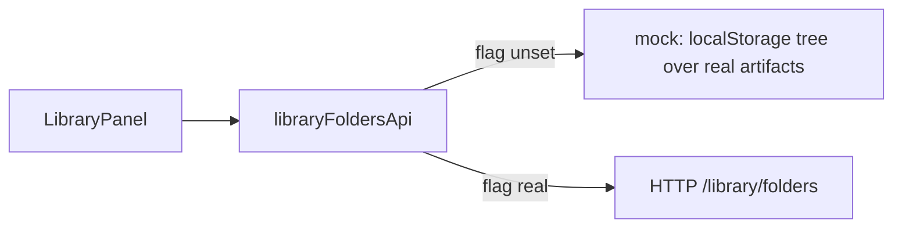

# Workbench side panel: the double sidebar

Status: implementation handoff for #79 and the drawer area that follows it.
Audience: whoever builds the next panel view.

## 1. The problem

The Workspace rail (`grafy-workspace-rail`) is a real column: fixed, flush to the
window edge, full height, `#FFF`/`#111` surface, 1px divider, 8×10px rows at 13px
type, uppercase 11px section labels.

The first Artifacts drawer was a Base UI `Drawer` popup portalled on top of the
canvas. It had its own surface, its own shadow, its own header height, a rounded
card edge, and it covered part of the canvas instead of taking space from it.
Next to the rail it looked like furniture from another house — the same widget
twice, agreeing about nothing.

Two things were missing at once:

1. **The pair.** A drawer that behaves like the second pane of one sidebar
   instead of an overlay parked in front of the canvas.
2. **The area.** `#79` asks for one Artifact Library tree today, and the same
   surface will carry Graph templates and whatever comes after. Building a
   one-off drawer per feature reproduces problem 1 forever.

## 2. The shape

```
window ────────────────────────────────────────────────────────────────────
┌──────────────┬───────────────────┬──────────────────────────────────────┐
│ Workspace    │  Workbench        │                                      │
│ rail         │  side panel       │   Canvas (gets the rest)             │
│ (app nav)    │  (work surface)   │                                      │
│              │                   │                                      │
│ fixed 200px  │  fixed 240–420px  │   shell = 100% − rail − panel        │
│ #FFF / #111  │  #FFF / #111      │   #FFF / #111 grid                   │
│ 1px divider  │  1px divider      │                                      │
└──────────────┴───────────────────┴──────────────────────────────────────┘
        └──────────── one continuous sidebar unit ────────────┘
```

The two columns are siblings that share a contract: same surface token, same
hairline divider, same row metrics, same hover and selection treatment, no
shadow. A shadow means "floating above the work"; a docked pane must never have
one.

The panel is **docked, not overlaid**: the canvas is a real neighbour and loses
width when the panel is open. Closed means not rendered, and the canvas takes
the space back.

```
   --grafy-rail-width        --grafy-side-panel-width
   ┌──────────┐              ┌─────────────┐
   │  rail    │              │   panel     │
───┴──────────┴──────────────┴─────────────┴──────────────────────────────
                                       ▲
                          resizer (240…420px, persisted, 360px first visit)
```

Position follows the rail through CSS custom properties on `:root`, the same
mechanism the rail already uses, so collapsing the rail slides the panel left
with it:

```
:root                        --grafy-side-panel-width: 0px
@media (min-width: 1100px)   --grafy-side-panel-width: 360px   /* first visit */
:root[data-side-panel=open]  --grafy-side-panel-width: var(--grafy-side-panel-expanded-width)
:root[data-side-panel=closed] --grafy-side-panel-width: 0px
```

Below `1100px` the docked column would starve the canvas, so the panel becomes
a slide-over with a backdrop and the shell stops reserving width.

## 3. Anatomy

```
┌───────────────────────────────┐
│ [▦ Artifacts] [▤ Templates]   │  view switcher · collapse ▸
├───────────────────────────────┤
│ ⊕ ⌕ filter the Library… ↕ ⬆   │  this view's tools: new folder · filter · sort · upload
├───────────────────────────────┤
│ ▾ 📁 Fieldwork            2  ⋯│  the user's folders, nested to any depth
│   ▾ 📁 September          1  ⋯│
│     ▾ 📁 Raw photos       1  ⋯│
│        ▣  core.png            │  artifact row: thumbnail, size, origin
│           2.6 MB · uploaded   │
│   ▸ 📁 Reports            0  ⋯│  an empty folder renders, and deletes
│ ▣  field-notes.txt         ⋯  │  an unfiled artifact sits at the root
├───────────────────────────────┤
│ core.png                      │  the tile under the browser: the artifact itself
│ /Fieldwork/September/Raw photos · file.png@1
│ ┌───────────────────────────┐ │
│ │   the image, or the head   │ │  image inline, text read from its URL,
│ │   of the text file         │ │  nothing forced through a download
│ └───────────────────────────┘ │
│ PROVENANCE                    │
│ uploaded · core.png           │
│ [Open original] [Execution…]  │
└───────────────────────────────┘
```

The toolbar is **per view**, not one shared strip: Artifacts offers new folder,
filter, sort and upload; Templates offers its own filter and create. Each view
owns the row under the tabs, which is why the switcher has no idea what a folder
is. `⋯` on a folder is new subfolder · rename · delete; on an artifact it is open
original · copy link. The row's own click still means fold or unfold.

## 4. The seam

The panel is one shell plus a fixed set of views:

```ts
type SidePanelView = {
  id: SidePanelViewId;      // "artifacts" | "templates"
  label: string;
  icon: LucideIcon;
  render: (context: SidePanelContext) => ReactNode;
};
```

`SIDE_PANEL_VIEWS` is a module-level array, not a registry. A view is a function
that receives `{ workspace, workspaceId, onOpenGraph, onOpenRun }`. Adding a
third view means adding one entry and one component; nothing else moves. There
is no registration API, no provider, no ordering protocol — see [R41].

The Artifacts view keeps its own data seam one level down:

```
libraryFoldersApi.listTree(workspaceId)
   → { folders: LibraryFolder[], items: PlacedLibraryItem[] }   folder_id null = root
              │
              ▼
  buildLibraryTree({folders, items, query, sort}) ──► LibraryTreeNode[]   (recursive)
              │
              ▼
  flattenLibraryRows(roots, {collapsed})  ──► the order the panel paints, and the order the keyboard walks
              │
              ▼
  LibraryRow (recursive, role=tree / treeitem)
```

`libraryFoldersApi` (`src/lib/api/library-folders.ts`) is the whole contract:
`listTree`, `createFolder`, `renameFolder`, `deleteFolder`, `moveFolder`,
`moveItems`, plus `LibraryFolderNotEmptyError`, `LibraryFolderCycleError` and
`LibraryFolderNameTakenError` for the rules a type cannot express.

**The backend for this does not exist yet.** Unless
`NEXT_PUBLIC_LIBRARY_FOLDERS_API=real`, the api resolves to
`library-folders.mock.ts`: the folder tree and artifact placements persist per
workspace in `localStorage`, while the artifacts themselves still come from the
real Library endpoint — real data in a made-up tree. Flipping the flag is the
whole migration, because the HTTP calls are already written against the routes
the server will expose. Nothing outside `src/lib/api` knows the mock is there.



## 5. Decisions

- **Docked over overlay.** The panel takes layout space. Overlay chrome is for
  transient context (Run history, dialogs); the Library is a standing work
  surface and must be laid out like one.
- **Tabs in the panel header, not a third column.** An activity-bar strip would
  push the canvas past 400px of chrome before the first node. A segmented switcher
  in the header keeps the unit two panes wide, which is what "double sidebar"
  means here.
- **Folders belong to the user, not to the artifact types.** This reverses the
  acceptance line in `#79` that had the tree derived from
  `images/tables/text/models/other`: five folders the user never made are not a
  filing system, they are a file format leaking into the interface. Folders are
  created, renamed, moved and deleted in the panel, nest to any depth, and an
  artifact with no folder sits at the root. Artifact type now picks only the row
  icon.
- **A folder deletes only when empty.** Emptying a folder is a visible, reversible
  act; deleting a subtree that holds someone's work is not. The API says so with
  `LibraryFolderNotEmptyError` and the row menu says "empty it first".
- **Moving a folder cannot make a cycle.** `moveFolder` rejects a parent that is
  the folder itself or one of its descendants.
- **The tree folds on its own state.** Each row renders its children with a plain
  conditional. Base UI's `Collapsible` reported a folder as *closing* at the
  moment it gained its first child, which hid the subfolder the user had just
  made; a tree this recursive is not worth an animation primitive.
- **A row click means the row, a control click means the control.** The `⋯` menu
  renders inside its row, so its items bubble through the row handler. Row
  handlers ignore anything under `button, [role="button"], [role="menu"],
  [role="menuitem"]`.
- **Every drop target accepts what it says it accepts.** The panel background is
  the root of the tree, so its `dragover` accepts uploads, artifacts and folders.
  `dragover` that never calls `preventDefault` means the `drop` never fires — an
  artifact could be dragged into a folder but never back out.
- **The tile under the browser previews the artifact.** An image renders inline,
  a text-ish artifact has its head read from the content URL, and the row states
  the path (`/Fieldwork/September · file.csv@1`) so location survives a deep tree.
- **The toolbar belongs to the view.** Artifacts and Templates each render their
  own tools under the tabs; the shell ships none.
- **Drag stays the contract.** Rows carry `application/x-grafy-artifact` through
  `writeArtifactDrop`; the drop still resolves the port row under the cursor with
  `document.elementsFromPoint`, skipping portals.
- **Keyboard first-class.** `role=tree` with `treeitem`, `aria-level`,
  `aria-expanded`; Arrow keys move, ArrowRight/Left expand and collapse, Home/End
  jump, Enter selects. A file browser you cannot walk with the keyboard is a demo.
- **Upload by click too.** Drag-and-drop alone excludes keyboard users; the
  header upload button posts the same two calls.
- **Collapse is total.** Closed = unmounted. A 40px sliver that is neither open
  nor closed is the worst of both.

## 6. Verification

- `npm --prefix apps/web test` — the folder mock and its rules, the recursive
  projection and filter, the panel (create, rename, fold, move, preview), the
  shell, and both views.
- `npm --prefix apps/web run typecheck`, `npm --prefix apps/web run lint`.
- `npm --prefix apps/web test:e2e` — the panel opens docked, takes width, folds
  and unfolds; a folder is created, nested, filled by drag, emptied and deleted;
  and a Library artifact drag still lands on an input port.
- Visual check at 1600px, 1280px, and 720px: the two columns must read as one
  surface at a glance; the canvas must not sit under the panel. StyleX errors and
  popup stacking only ever show up in a browser, so the browser is part of the
  check, not an optional extra.
