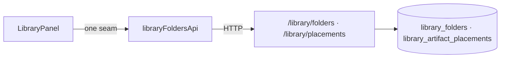

# Workbench side panel: the double sidebar

Status: implementation handoff for #79 and the drawer area that follows it.
Audience: whoever builds the next panel view.
Update (2026-09-30): the Templates tab is gone for now; the panel hosts the
Artifacts view alone. §3–§5 describe the panel as it is.

## 1. The problem

The Workspace rail (`grafy-workspace-rail`) is a real column: fixed, flush to the
window edge, full height, `#FFF`/`#111` surface, 1px divider, 8×10px rows at 13px
type, uppercase 11px section labels.

The first Artifacts drawer was a Base UI `Drawer` popup portalled on top of the
canvas. It had its own surface, its own shadow, its own header height, a rounded
card edge, and it covered part of the canvas instead of taking space from it.
Next to the rail it looked like furniture from another house — the same widget
twice, agreeing about nothing.

Two things were missing at once:

1. **The pair.** A drawer that behaves like the second pane of one sidebar
   instead of an overlay parked in front of the canvas.
2. **The area.** `#79` asks for one Artifact Library tree today, and the same
   surface will carry Graph templates and whatever comes after. Building a
   one-off drawer per feature reproduces problem 1 forever.

## 2. The shape

```
window ────────────────────────────────────────────────────────────────────
┌──────────────┬───────────────────┬──────────────────────────────────────┐
│ Workspace    │  Workbench        │                                      │
│ rail         │  side panel       │   Canvas (gets the rest)             │
│ (app nav)    │  (work surface)   │                                      │
│              │                   │                                      │
│ fixed 200px  │  fixed 240–420px  │   shell = 100% − rail − panel        │
│ #FFF / #111  │  #FFF / #111      │   #FFF / #111 grid                   │
│ 1px divider  │  1px divider      │                                      │
└──────────────┴───────────────────┴──────────────────────────────────────┘
        └──────────── one continuous sidebar unit ────────────┘
```

The two columns are siblings that share a contract: same surface token, same
hairline divider, same row metrics, same hover and selection treatment, no
shadow. A shadow means "floating above the work"; a docked pane must never have
one.

The panel is **docked, not overlaid**: the canvas is a real neighbour and loses
width when the panel is open. Closed means not rendered, and the canvas takes
the space back.

```
   --grafy-rail-width        --grafy-side-panel-width
   ┌──────────┐              ┌─────────────┐
   │  rail    │              │   panel     │
───┴──────────┴──────────────┴─────────────┴──────────────────────────────
                                       ▲
                          resizer (240…420px, persisted, 360px first visit)
```

Position follows the rail through CSS custom properties on `:root`, the same
mechanism the rail already uses, so collapsing the rail slides the panel left
with it:

```
:root                        --grafy-side-panel-width: 0px
@media (min-width: 1100px)   --grafy-side-panel-width: 360px   /* first visit */
:root[data-side-panel=open]  --grafy-side-panel-width: var(--grafy-side-panel-expanded-width)
:root[data-side-panel=closed] --grafy-side-panel-width: 0px
```

Below `1100px` the docked column would starve the canvas, so the panel becomes
a slide-over with a backdrop and the shell stops reserving width.

## 3. Anatomy

```
┌───────────────────────────────┐
│ Artifacts            ⊕  ⬆  │ ⇤ │  the view's title and tools · the shell's collapse
│ ⌕ Filter the Library…      ↕  │  filter · sort
├───────────────────────────────┤
│ ▾ 📂 Fieldwork            2  ⋯│  the user's folders, nested to any depth
│ │ ▾ 📂 September          1  ⋯│  a guide hangs each folder's contents
│ │ │ ▣  core.png                 │  artifact row: thumbnail, size, origin
│ │ │    2.6 MB · uploaded        │
│ │ ▸ 📁 Reports            0  ⋯│  an empty folder renders, and deletes
│ ▣  field-notes.txt            │  an unfiled artifact sits at the root
│                               │  the empty space below is the root: a drop target
├───────────────────────────────┤
│ core.png                    × │  the tile under the browser: the artifact itself
│ Library / Fieldwork / September · file.png@1 · 2.6 MB
│ ┌───────────────────────────┐ │
│ │   the image, or the head   │ │  image inline, text read from its URL,
│ │   of the text file         │ │  nothing forced through a download
│ └───────────────────────────┘ │
│ PROVENANCE                    │
│ uploaded · core.png           │
│ [Open original] [Execution…]  │
├───────────────────────────────┤
│ 5 artifacts · 3 folders       │  or "2 of 5 artifacts" under a filter
└───────────────────────────────┘
```

The header belongs to the view: Artifacts puts its title, new folder and upload
there, and the shell adds only its collapse button at the end. Filter and sort
sit on the row under it. `⋯` on a folder is new subfolder · rename · delete; on
an artifact it is open original · copy link. With a mouse the `⋯` stays hidden
until its row is hovered or keyboard-focused; on touch it is always there. The
row's own click still means fold or unfold.

## 4. The seam

The panel is one shell and one view. `WorkbenchSidePanel` owns where the panel
is (docked column or slide-over drawer), its width and the resizer, and hands
the view one control for its header:

```tsx
<LibraryPanel workspaceId={…} onOpenRun={…} headerEnd={<CollapseButton />} />
```

The rail's Artifacts item is the panel's only opener; see §5. The shell used
to host a tab strip with a Templates view beside Artifacts. That
tab was removed (2026-09-30) until Templates is ready to come back to the panel;
the `/templates` routes are untouched. A second view brings back a switcher in
the header, not a registry — see [R41].

The Artifacts view keeps its own data seam one level down:

```
libraryFoldersApi.listTree(workspaceId)
   → { folders: LibraryFolder[], items: PlacedLibraryItem[] }   folder_id null = root
              │
              ▼
  buildLibraryTree({folders, items, query, sort}) ──► LibraryTreeNode[]   (recursive, each node knows its parentId)
              │
              ▼
  flattenLibraryRows(roots, {collapsed})  ──► the order the keyboard walks, which is the order the tree paints
              │
              ▼
  LibraryTree (role=tree) → FolderRow / FileRow (treeitem)
```

| File | Holds |
| --- | --- |
| `LibraryPanel.tsx` | the data, every server call, the header, filter, drop region, notices and status line |
| `LibraryTree.tsx` | rows, row menus, rename, keyboard walking; rows read the tree's state from one context |
| `LibraryArtifactTile.tsx` | the tile, and the text preview that reads only the head of the bytes |
| `library-tree.ts` | the projection and the text helpers; pure |
| `library-drag.ts` | what a drag carries, read into one `LibraryDrop` the root and every row share |

`libraryFoldersApi` (`src/lib/api/library-folders.ts`) is the whole contract:
`listTree`, `createFolder`, `renameFolder`, `deleteFolder`, `moveFolder`,
`moveItems`, plus `LibraryFolderNotEmptyError`, `LibraryFolderCycleError` and
`LibraryFolderNameTakenError` for the rules a type cannot express.

**The server holds the tree.** Six routes under the workspace answer for it, on
the capability split the Library already used — `VIEW_ARTIFACTS` reads,
`EDIT_GRAPH` changes:

| Path under `/v1/workspaces/{workspace_id}` | Method | Says |
| --- | --- | --- |
| `/library/folders` | `GET` | every folder in this workspace |
| `/library/folders` | `POST` | make one under `parent_id`; null means root |
| `/library/folders/{folder_id}` | `PATCH` | rename |
| `/library/folders/{folder_id}` | `DELETE` | delete it, if it holds nothing |
| `/library/folders/{folder_id}/parent` | `PUT` | move it; a null parent means root |
| `/library/placements` | `PUT` | file these artifacts here, or unfile them |

`GET /library/artifacts` stamps every item with the `folder_id` it sits in, so
`listTree` is two requests — the folders, and the artifacts already filed. The
rows are `library_folders` (a `name_key` column keeps sibling names unique
whatever their case) and `library_artifact_placements`.

The three rules a signature cannot carry are refusals in the envelope every
failure in this API already returns, `{detail, code, error_id}`:
`library.folder_name_conflict` (409), `library.folder_not_empty` (409),
`library.folder_cycle` (422). `library-folders.ts` maps each code to the error
class the panel knows how to phrase and passes anything else through untouched.
The envelope carries no counts, so `LibraryFolderNotEmptyError` carries the
`folder_id` and the panel says what its own tree still holds.


```mermaid
graph LR
    A[LibraryPanel] -->|one seam| B[libraryFoldersApi]
    B -->|HTTP| C["/library/folders · /library/placements"]
    C --> D[("library_folders · library_artifact_placements")]
```

## 5. Decisions

- **Docked over overlay.** The panel takes layout space. Overlay chrome is for
  transient context (Run history, dialogs); the Library is a standing work
  surface and must be laid out like one.
- **Switch views in the panel header, not a third column.** An activity-bar
  strip would push the canvas past 400px of chrome before the first node. With
  one view there is no switcher at all; a tab strip of one tab is chrome that
  says nothing.
- **Folders belong to the user, not to the artifact types.** This reverses the
  acceptance line in `#79` that had the tree derived from
  `images/tables/text/models/other`: five folders the user never made are not a
  filing system, they are a file format leaking into the interface. Folders are
  created, renamed, moved and deleted in the panel, nest to any depth, and an
  artifact with no folder sits at the root. Artifact type now picks only the row
  icon.
- **A folder deletes only when empty.** Emptying a folder is a visible, reversible
  act; deleting a subtree that holds someone's work is not. The API says so with
  `LibraryFolderNotEmptyError` and the row menu says "empty it first".
- **Moving a folder cannot make a cycle.** `moveFolder` rejects a parent that is
  the folder itself or one of its descendants.
- **The tree folds on its own state.** Each row renders its children with a plain
  conditional. Base UI's `Collapsible` reported a folder as *closing* at the
  moment it gained its first child, which hid the subfolder the user had just
  made; a tree this recursive is not worth an animation primitive.
- **A row click means the row, a control click means the control.** The `⋯` menu
  renders in a portal, but React bubbles its events through the row anyway. The
  menu's wrapper stops clicks, keys and drags at the menu, so the row never
  sees them.
- **Every drop target accepts what it says it accepts.** The panel background is
  the root of the tree, so its `dragover` accepts uploads, artifacts and folders.
  `dragover` that never calls `preventDefault` means the `drop` never fires — an
  artifact could be dragged into a folder but never back out. A drop on an
  artifact row files into the folder that row sits in, and that folder lights up
  while the drag is over it.
- **A filter opens every folder.** A match folded away is a match hidden. While
  a filter is on, folds are its own and are forgotten with it; the remembered
  folds come back when it clears.
- **The tile under the browser previews the artifact.** An image renders inline,
  a text-ish artifact has only its head read from the content URL (an error
  response is never shown as the artifact's text), and the tile states where it
  is filed (`Library / Fieldwork / September · file.csv@1 · 1.0 KB`) so location
  survives a deep tree. × or Escape closes it; it never takes more than about
  half the column.
- **The tools belong to the view.** The view renders its own header row; the
  shell adds only collapse.
- **Drag stays the contract.** Rows carry `application/x-grafy-artifact` through
  `writeArtifactDrop`; the drop still resolves the port row under the cursor with
  `document.elementsFromPoint`, skipping portals.
- **Keyboard first-class.** `role=tree` with `treeitem`, `aria-level`,
  `aria-expanded`; Arrow keys move, ArrowRight/Left expand and collapse, Home/End
  jump, Enter selects or folds, F2 renames, Escape closes the tile, and a letter
  jumps to the next row that starts with it. A file browser you cannot walk with
  the keyboard is a demo.
- **Upload by click too.** Drag-and-drop alone excludes keyboard users; the
  header upload button posts the same two calls.
- **Collapse is total.** Closed means the contents are unmounted and the column
  is parked behind the rail, hidden and inert. A 40px sliver that is neither
  open nor closed is the worst of both.
- **It opens from the rail.** The rail's Graphs section carries an Artifacts
  item while a workbench is open (the workbench publishes `sidePanelOpen` and
  `toggleSidePanel` through `WorkbenchChromeContext`, the way it publishes
  Save). The canvas toolbar no longer has a panel button. On a phone the item
  sits in the navigation drawer, which closes as the panel's drawer opens.
- **It moves; it never blinks.** Docked, the column slides out from behind the
  rail while the canvas edge eases over on the same clock
  (`--grafy-side-panel-duration`, 200ms, and `--grafy-side-panel-ease`), and
  slides back when closed. The column's box stays mounted so it starts moving
  in the same frame as the canvas; its contents stay for the exit and then
  unmount. When the rail folds, the column's left edge follows it on the
  rail's clock, and the canvas follows too. The drawer slides in over a fading
  backdrop and follows a swipe. Motion is off on first paint, during a resize
  drag, and under `prefers-reduced-motion`.

## 6. Verification

- `npm --prefix apps/web test` — the refusal codes mapped to the panel's errors,
  the recursive projection and filter, the panel (create, rename, fold, move,
  preview, and a delete the server refuses), and the shell.
- `npm --prefix apps/web run typecheck`, `npm --prefix apps/web run lint`.
- `npm --prefix apps/web test:e2e` — the panel opens docked, takes width, folds
  and unfolds; a folder is created, nested, filled by drag, emptied and deleted;
  and a Library artifact drag still lands on an input port. The folder routes are
  answered inside Node by `e2e/library-folders-stub.ts`, which keeps the same
  three rules and belongs to one page, so no folder outlives the test that made
  it.
- Visual check at 1600px, 1280px, and 720px: the two columns must read as one
  surface at a glance; the canvas must not sit under the panel. StyleX errors and
  popup stacking only ever show up in a browser, so the browser is part of the
  check, not an optional extra.
