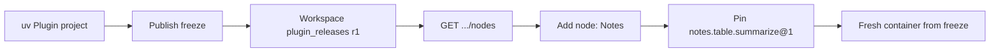

# Workspace Plugin catalog releases

- **Status:** Direction — not implemented
- **Date:** 2026-08-17
- **Parent:** [workspace-plugins](README.md)
- **Related:** [plugin unification](plugin-unification.md),
  [human authoring](human-authoring.md),
  [`examples/plugin-notes`](../../../examples/plugin-notes)

## Summary

Do not register Team Plugins through `grafy.plugins`. That would put them in
Add node with **no Plugin revision**, running **inside FastAPI**.

A Workspace Plugin release is a new catalog overlay, in the same family as
Module releases and generated-node releases.

## What the catalog is today

`GET /v1/workspaces/{id}/nodes` already merges three overlays:

| Overlay | Identity | Revision | Where it lives |
| --- | --- | --- | --- |
| Host `PluginRegistry` | `gis.features.to_table@1` | node `operator_version` only; the Plugin is unversioned | API process, entry points |
| Module library | `graph.module.{id}@{revision}` | yes | Workspace DB |
| Generated nodes | `generated.node.{uuid}@{revision}` | yes, per node | Workspace DB, fake plugin slug `generated.agent` |

`examples/plugin-notes` matches none of those. It wants **Plugin `notes`
revision 1** containing `notes.table.summarize@1` and
`notes.summary.render@1`. Generated `NodeRelease` cannot hold that: operator
ids must start with `generated.node.`.

## Intended wiring

1. **Persist a Plugin release** (new aggregate): Workspace, slug `notes`,
   revision `1`, freeze (source digest, lock digest, image digest, profile
   `python-uv`), declared types (`notes.table_summary@1`), node contracts,
   capability digest.
2. **Publish** is “freeze this tree + insert that row”, not “install a
   wheel.” Human: `grafy plugin publish examples/plugin-notes`. Agent: the
   same pipeline after review. Dev seed can publish the example into a
   Workspace without Generate.
3. **Catalog** reads those rows for the Workspace (like `list_releases`
   today). Emit `PluginSpecResponse(slug="notes", title="Notes",
   origin=workspace or agent, revision=1)` instead of stuffing everything
   under `generated.agent`. Each node is `NodeSpec`-shaped,
   `plugin_slug="notes"`.
4. **Compiler** resolves `notes.table.summarize@1` from that Workspace
   release, not from `PluginRegistry`. The stub HMAC-posts to the isolated
   runner, same as generated execution.
5. **Runnable** only when the freeze can actually run those ports. Today
   generated execution materializes JSON scalars. `table.data` needs ref-in /
   persist-out inside the sandbox. Until then, show the Plugin with
   `runnable: false`.

## What not to do

- Add `[project.entry-points."grafy.plugins"]` and `uv sync`. Catalog yes,
  revision no, isolation no.
- Import `NOTES` in `build_plugin_registry`. Same coupling.
- Mint two `generated.node.<uuid>` releases that wrap these functions. Wrong
  identity; the family and plugin-owned type disappear.

## First implementation slice

Catalog only: Plugin release row + catalog overlay + publish-from-directory
of `examples/plugin-notes` into one Workspace, `runnable: false`. Execution
of `table.data` through the freeze is the second slice.
