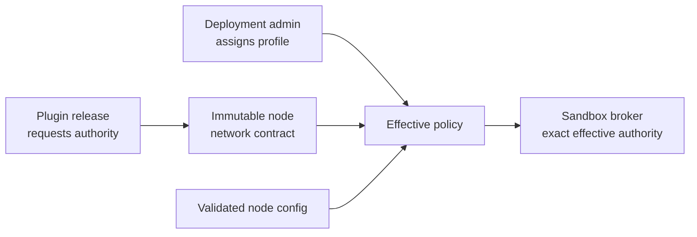
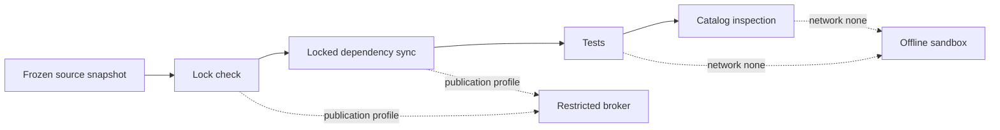

# Network Access Profiles

- **Status:** In progress — Phases 1 and 2 implemented (policy vocabulary,
  manifest loading, configured/curated execution); publication and
  agent-authoring planes are modeled but not yet enforced
- **Audience:** Grafy maintainers and implementation agents
- **Last updated:** 2026-09-01
- **Scope:** Hosted coding-agent authoring, Plugin publication, and isolated
  Plugin execution
- **Related architecture:**
  [Plugin unification](../../design/plugin-unification.md),
  [Plugin development](../../design/plugin-development.md),
  [backend architecture](../../design/backend-architecture.md), and
  [ADR 0004](../../adr/0004-unify-system-and-workspace-plugin-releases.md)

## 1. Decision summary

Grafy will model network access as a deployment-owned policy assigned to an
isolated environment. Executable code may declare the network authority it
needs, but it cannot grant that authority to itself.

Network policy applies independently to three planes:

1. **Agent authoring:** network available to a future Grafy-hosted coding agent
   while it edits a Plugin working copy.
2. **Publication:** network available while a frozen Plugin snapshot acquires
   locked dependencies. Tests and catalog inspection remain offline.
3. **Execution:** network available to an immutable Plugin release while a
   graph node runs.

Each plane selects a named `NetworkAccessProfile`. Network profiles are
orthogonal to Plugin runtime profiles such as `python-uv` or native GDAL and
Tesseract images. An administrator assigns profiles; Plugin source, graph
configuration, and coding-agent output cannot select or modify them.

The first execution profile that must be implemented is
`configured-public`. It allows a node to reach only public HTTPS origins
derived from config fields explicitly declared in the immutable node
contract. This makes configurable OpenAI-compatible endpoints and other
external-resource nodes work without granting general internet access.



The effective authority is always an intersection:

```text
release request
  ∩ assigned profile
  ∩ deployment hard limits
  ∩ invocation-derived destinations
= effective network policy
```

No input may widen a limit imposed above it.

## 2. Problem

The current isolated runtime treats `network.egress` as one broad capability.
When available, every HTTP destination in
`GRAFY_PLUGIN_HTTP_EGRESS_DESTINATIONS` is placed into the sandbox broker
policy. That behavior has two conflicting consequences:

- A narrow deployment list preserves a strong fail-closed boundary but makes a
  genuinely configurable provider URL fail for every origin not known at
  deployment time.
- A broad list makes configurable providers work but grants every networked
  node in that sandbox authority it may not need.

The same missing abstraction appears in Plugin publication. Locked dependency
acquisition currently runs in a network-enabled publisher container, while
tests and catalog inspection correctly run without network. The deployment
cannot express package-only network access or inspect the effective network
authority as a named policy.

OCI construction is a second dependency-download boundary. Restricting only
the publisher's initial `uv sync` would leave image construction able to fetch
dependencies through its own build network, so both paths must resolve the
same publication policy.

Grafy also has a working-copy workflow intended for coding agents, but Grafy
does not yet own or sandbox the agent process. If Grafy later hosts coding
agents, their setup and task network access must be explicit environment
policy rather than ambient host access.

## 3. Goals

This feature must:

- Preserve fail-closed execution when no network profile is assigned.
- Let an administrator choose understandable network profiles at deployment.
- Let nodes declare fixed or configuration-derived HTTP destinations without
  hard-coding operator identities in the API runtime.
- Support public OpenAI-compatible endpoints and other configured public APIs
  without an environment change for every origin.
- Support deployment-owned HTTPS services on exact IPv4 RFC1918 origins only
  through an explicitly assigned curated profile and optional immutable CA
  trust bundle.
- Preserve exact DNS-name, port, and numeric-address enforcement in isolated
  Plugin execution.
- Make requested, granted, and effective network authority independently
  inspectable.
- Provide an elevated, explicit option for workloads that genuinely require
  dynamically discovered public destinations.
- Apply the same vocabulary to execution, publication, and future hosted-agent
  environments while keeping their policies independent.
- Keep existing exact Plugin releases and graph pins interpretable during
  migration.
- Fail during admission or graph preflight when denial can be determined
  before starting a sandbox.

## 4. Non-goals

The first implementation will not:

- Permit loopback, link-local, cloud metadata, CGNAT, multicast, unspecified,
  reserved, or IPv6 ULA destinations.
- Permit dynamic private destinations or private access outside an exact
  deployment-owned curated origin.
- Inspect paths or HTTP methods inside end-to-end HTTPS CONNECT tunnels.
- Add TLS interception.
- Make credential-bearing or presigned URLs safe to store in graph config.
- Prove that an endpoint implements a specific application protocol.
- Make network-backed nodes deterministic or cacheable.
- Sandbox a coding agent that Grafy did not launch.
- Replace the separate `postgresql.egress` capability and its destination-
  specific raw TCP relay.
- Let Workspace owners or graph authors exceed the deployment administrator's
  network ceiling.

General private-network profiles, caller-selected CIDRs, and host-mediated HTTP
remain follow-up extensions.

## 5. Terminology

### 5.1 Plane

One lifecycle boundary where code may attempt network access:
`agent-authoring`, `publication`, or `plugin-execution`.

The existing serialized capability name `network.egress` continues to mean
proxy-mediated HTTP and HTTPS. It does not grant arbitrary TCP, UDP, raw
socket, or DNS authority. Protocols with different security boundaries retain
or receive separate capabilities, as `postgresql.egress` already does.

### 5.2 Origin

The normalized tuple of scheme, DNS hostname, and effective port. Paths,
queries, and fragments are not network authority.

```text
https://gateway.example/v1/chat?region=eu

origin = https://gateway.example:443
```

An origin always contains an explicit port in persisted and hashed policy.

### 5.3 Destination source

How a node obtains an origin:

- **Configured:** one or more node config fields declared in its immutable
  contract.
- **Dynamic:** selected by Plugin code while the invocation is running.

A fixed provider URL is represented as a configured field with a constrained
or constant schema. The runtime does not need a separate fixed-provider
special case.

### 5.4 Requested authority

The network capability and destination sources recorded in an immutable
Plugin release.

### 5.5 Granted authority

The named profile selected by deployment-owned admission policy for a plane
and Plugin release.

### 5.6 Effective policy

The immutable, normalized policy actually attached to one sandbox or
one-shot environment. Its canonical representation has a SHA-256 digest.

## 6. Product roles and authority

| Actor | May request | May grant | May widen deployment policy |
|---|---|---|---|
| Plugin author or coding agent | Capabilities and destination sources in source | Nothing | No |
| Graph author | Values for contract-declared config fields | Nothing | No |
| Workspace owner | Publish or select a reviewed Workspace release | Only if a later deployment policy delegates a bounded choice | No |
| Deployment administrator | Define profiles and assign them | All deployment-supported profiles | Yes, through managed configuration |
| Plugin runtime | Use its effective policy | Nothing | No |

Publication review must show a capability diff. Adding `network.egress`, adding
a configured URL field, or changing `dynamic_destinations` from false to true
is a security-relevant release change.

## 7. Policy model

### 7.1 Profile identity

A profile has a stable deployment-local name and exactly one plane. Its
identity is `(plane, name)`, so every plane may define a profile named
`offline`. A profile name is not Plugin source identity and is not written into
graph documents.

```text
NetworkAccessProfile
  name
  plane
  mode
  public_address_only
  allowed_origins
  limits
  policy_digest
```

The canonical digest covers every normalized setting that changes network
authority or resource limits. Display labels and descriptions do not affect
the digest.

### 7.2 Profile assignment

The deployment resolves one profile using this precedence:

1. Exact release assignment: scope, optional Workspace, slug, and revision.
2. Plugin-family assignment: scope, optional Workspace, and slug.
3. Scope default: System or Workspace.
4. Plane default.

An assignment that names an unknown profile is a startup error. Ambiguous
assignments at the same precedence are startup errors. Absence of an
assignment resolves to `offline`.

The assignment and normalized profile remain deployment-owned. New release
publication does not silently inherit more authority than its family
assignment already grants, and promotion must surface any newly requested
network capability.

### 7.3 Deployment manifest

Complex profile policy should live in a versioned TOML manifest rather than a
large collection of JSON-valued environment variables.

```dotenv
GRAFY_NETWORK_POLICY_MANIFEST=/etc/grafy/network-policy.toml
```

Illustrative schema:

```toml
schema_version = 1

[defaults]
agent_authoring = "offline"
publication = "dependencies"
plugin_execution = "offline"

[profiles.plugin-execution.configured-public]
mode = "configured-public"
public_address_only = true
https_only = true
max_origins_per_execution = 8
max_request_bytes = 67108864
max_response_bytes = 134217728
connect_timeout_seconds = 10
idle_timeout_seconds = 60

[profiles.plugin-execution.curated-apis]
mode = "curated"
public_address_only = true
https_only = true
allowed_origins = [
  "https://api.company.example:443",
  "https://data.example.org:443",
]

[profiles.plugin-execution.internal-provider]
mode = "curated"
public_address_only = false
https_only = true
allowed_origins = ["https://provider.internal.example:8443"]
ca_bundle_path = "/etc/grafy/internal-provider-ca.pem"

[profiles.publication.dependencies]
mode = "dependencies"
public_address_only = true
https_only = true
domain_sets = ["python-packages"]

[[assignments]]
plane = "plugin-execution"
scope = "system"
slug = "external.llm"
profile = "configured-public"

[[assignments]]
plane = "plugin-execution"
scope = "workspace"
profile = "offline"
```

Exact field names may follow existing Settings conventions, but the semantic
requirements and precedence above are normative.

Every plane has a built-in `offline` profile, so it need not be repeated in
the manifest.

### 7.4 Domain sets

A domain set is a deployment-owned named collection of exact HTTPS origins.
It exists to make common dependency registries manageable without accepting
wildcards in the broker protocol.

The first implementation should support a `python-packages` set containing the
exact registry and file-download origins required by the deployment's chosen
Python index. Administrators may replace or extend the set.

Domain sets are expanded to exact origins before policy hashing and sandbox
creation. A set name never reaches the broker.

## 8. Plane profiles

### 8.1 Plugin execution

| Mode | Effective destinations | Risk level |
|---|---|---|
| `disabled` | None | Low |
| `configured-public` | Public HTTPS origins extracted from declared config fields | Moderate |
| `curated` | Declared origins intersected with administrator origins | Moderate |
| `open-public` | Any public HTTPS origin requested at runtime | Elevated |

Requirements:

- `disabled` is the default for System and Workspace releases.
- `configured-public` rejects nodes that request dynamic destinations.
- `curated` never treats the administrator list as ambient authority. For new
  contracts, a destination must be both node-declared and administrator-
  allowed.
- `open-public` requires an immutable node contract with
  `dynamic_destinations=true` and an explicit deployment assignment.
- Assigning `open-public` to a configured-only node does not widen that node's
  request; it still receives only its configured origins.
- Every mode rejects non-public address space by default. Only a non-empty,
  exact `curated` Plugin-execution profile may opt into public plus IPv4
  RFC1918 resolution with `public_address_only = false`.
- An exact curated profile may provide `ca_bundle_path`. Grafy accepts only
  complete, valid X.509 `CERTIFICATE` PEM blocks, captures their bounded bytes
  and content digest when loading policy, includes that digest in profile and
  sandbox identity, and mounts the bundle read-only as the guest's
  `SSL_CERT_FILE`. The file is a complete trust bundle because it replaces the
  guest's default trust file; private keys and every other PEM block are
  rejected before a sandbox can be created.
- Remote configured destinations require HTTPS. Plain HTTP remains outside the
  production profile contract.

### 8.2 Publication

| Mode | Network during dependency acquisition | Tests and inspection |
|---|---|---|
| `offline` | None; vendored wheelhouse only | Offline |
| `dependencies` | Deployment package-domain sets | Offline |
| `custom-allowlist` | Package-domain sets plus exact admin origins | Offline |
| `open-public` | Any public HTTPS origin | Offline |

Publication networking applies only to lock validation and locked dependency
sync for the frozen source snapshot. The publisher passes no ambient secrets
or host credentials into those containers. Tests and catalog inspection always
run in fresh network-disabled containers, regardless of the selected
publication profile.

`open-public` publication is an elevated deployment choice. It does not make
test-time network access valid and does not waive lockfile, source-freeze, or
path-dependency checks.

### 8.3 Hosted coding-agent authoring

Grafy does not currently launch the coding agent that edits a reserved Plugin
working copy. This plane becomes enforceable only when Grafy owns the agent
container or virtual machine.

The future host must support independent setup and task profiles:

```text
HostedAgentEnvironment
  setup_network_profile
  task_network_profile
  environment_variables
  secret_bindings
  source_mount
  cache_policy
```

Recommended modes:

| Mode | Typical purpose |
|---|---|
| `offline` | Fully self-contained maintenance |
| `dependencies` | Install from approved registries during setup |
| `custom-allowlist` | Documentation and organization services |
| `open-public` | Broad research; elevated exfiltration and prompt-injection risk |

Setup access does not imply task access. Secrets are withheld by default.
Allowing both sensitive secrets and `open-public` network access must require a
separate elevated confirmation in any future administrator UI.

Until Grafy hosts the agent, its working-copy reservation and reviewed
publication fences remain useful, but the agent's own network policy belongs
to the environment that launched it.

## 9. Node and release contract

### 9.1 Registration model

Add a cohesive declaration beside existing secret and staged-upload inputs:

```python
@dataclass(frozen=True, slots=True)
class NodeHttpEgressInput:
    config_field: str


@dataclass(frozen=True, slots=True)
class NodeHttpEgressContract:
    configured_inputs: tuple[NodeHttpEgressInput, ...] = ()
    dynamic_destinations: bool = False
```

`NodeRegistration` and `PluginNodeContract` carry one
`NodeHttpEgressContract | None`.

Example:

```python
@LLM.node(
    operator_id="llm.openai_compatible.chat_completion",
    version=1,
    required_capabilities=(
        PluginRuntimeCapability.NETWORK_EGRESS,
        PluginRuntimeCapability.NODE_SECRETS,
    ),
    http_egress=NodeHttpEgressContract(
        configured_inputs=(
            NodeHttpEgressInput(config_field="base_url"),
        ),
    ),
)
class OpenAICompatibleNode(...):
    ...
```

Names are illustrative; the ownership and serialized behavior are normative.

### 9.2 Contract validation

Publication must reject a node contract when:

- `http_egress` is present without `network.egress`.
- `network.egress` is present without `http_egress` on a newly published
  contract.
- A configured field name is duplicated or absent from the config schema.
- A configured field cannot contain a URL string according to its schema.
- More than eight configured URL fields are declared.
- A contract requests dynamic destinations without `network.egress`.

The contract does not validate whether a deployment grants the request.
Publication records requested authority; release admission resolves granted
authority.

### 9.3 URL extraction

Before sandbox selection, the host extracts every non-null declared field from
the already validated invocation config.

For each value it must:

1. Require a string absolute HTTP URL.
2. Reject embedded username or password information.
3. Require an exact ASCII DNS hostname; reject IP literals, wildcards,
   localhost names, and raw Unicode labels. Explicit IDNA/punycode labels are
   accepted when they satisfy the ordinary DNS-label rules.
4. Normalize scheme, strip one trailing DNS dot, and case-fold the hostname
   using the same rules as broker policy.
5. Apply the effective port (`443` for HTTPS, `80` for HTTP).
6. Discard path, query, and fragment when constructing network authority.
7. Deduplicate and sort normalized origins.
8. Apply the assigned profile and origin-count limit.

The full URL remains Plugin config. Policy, logs, and audit records contain
only normalized origins. Query strings must never be copied into policy or
diagnostics because they may contain sensitive material.

Credential-bearing and presigned URLs must not be stored as ordinary graph
config. Supporting them requires a separately declared secret input or a
future host-mediated request binding.

### 9.4 Dynamic request

`dynamic_destinations=true` means the origin is unknown before Plugin code
runs. It is not a grant. A node with this declaration is runnable only under
`open-public` or a future profile that explicitly permits dynamic discovery.

Changing `dynamic_destinations` changes the release contract digest and must
appear prominently in publication review.

## 10. Execution lifecycle

### 10.1 Admission and preflight

Catalog readiness answers whether the deployment can potentially satisfy the
release's requested network capability. Graph preflight evaluates actual
configured destinations.

Preflight must reject before sandbox creation when:

- No profile is assigned.
- The assigned profile is `disabled`.
- The contract requests dynamic access under a non-dynamic profile.
- A configured origin is outside a curated profile.
- A destination is syntactically invalid.
- The execution exceeds its origin or sandbox-variant limit.

DNS safety remains a runtime-boundary check because records can change after
graph save or preflight.

### 10.2 Sandbox identity

Extend the sandbox key with effective HTTP destinations and the profile
digest:

```text
SandboxKey
  existing release and execution identity
  required capabilities
  network_profile_digest
  http_destinations[]
  postgresql_destination
```

The canonical sandbox hash includes normalized origins in sorted order.

- Same release, scope, profile, and origins may reuse a sandbox.
- A different origin or profile digest selects a different sandbox.
- A profile change cannot reuse a sandbox created under the old authority.

Docker container and network names must include a suffix derived from the
complete sandbox key. Naming only by release identity is insufficient because
two origin variants of the same release may be live concurrently.

### 10.3 Capacity

Origin-keyed sandboxes turn one Plugin release into multiple sandbox variants.
Capacity reporting and errors must distinguish:

- Distinct Plugin releases in an execution.
- Distinct sandbox variants in an execution.
- Distinct effective origins in an execution.
- Globally live Plugin sandboxes.

Do not reuse the existing "distinct Plugin release" error for origin variants.
Introduce a bounded `max_plugin_sandbox_variants_per_execution` setting. Its
default must not exceed global live-sandbox capacity.

### 10.4 Broker plan for configured and curated modes

The API resolves each effective origin before starting its dedicated broker:

1. Resolve the exact DNS name once with a bounded timeout.
2. Under the default `public` address scope, reject the complete answer if any
   address is non-public. Under the explicit `curated-rfc1918` scope, accept
   public addresses and IPv4 RFC1918 only; still reject loopback, link-local,
   multicast, reserved, unspecified, CGNAT, IPv6 ULA, and mixed unsafe answers.
3. Give the broker only the validated numeric addresses and original origin.
4. Keep the Plugin container on an internal network.
5. Keep the broker as the only container attached to both internal and
   outbound networks.
6. Require exact scheme, normalized hostname, and port matches.
7. Connect to one of the prevalidated numeric addresses.

HTTPS remains an end-to-end tunnel. TLS server-name indication and certificate
verification use the original hostname.

Broker availability must no longer mean "broker image plus at least one static
deployment destination." In configured modes, a pinned broker image and a
valid profile make the adapter potentially available; actual invocation
destinations determine whether a concrete broker plan can be created.

### 10.5 Broker plan for open-public mode

An open-public broker cannot receive an exhaustive destination list before
execution. The deployment-owned broker may resolve DNS per connection only in
this mode.

For every request it must:

1. Parse and normalize the requested origin.
2. Resolve with a bounded timeout.
3. Reject the complete answer if any address is non-public.
4. Connect directly to a validated numeric address, never a second hostname
   lookup.
5. Apply per-origin, connection, byte, and time limits.
6. Record only the normalized origin and non-sensitive outcome.

The broker remains credential-free and read-only. Dynamic DNS support must not
be added to exact-origin broker mode.

### 10.6 Proxy environment

The Plugin guest continues to receive `HTTP_PROXY` and `HTTPS_PROXY` pointing
to the dedicated broker, with empty `NO_PROXY`. It receives no direct outbound
network interface.

Libraries that deliberately ignore standard proxy variables are unsupported
under `network.egress` unless a future transport adapter safely mediates them.
Existing clients that disable environment proxy discovery or open direct
pinned-IP connections, including the current WFS adapter, must be migrated or
given a broker-aware transport before they can claim support for these
profiles.

### 10.7 Redirects

- Same-origin redirects remain inside the authorized origin.
- A cross-origin redirect succeeds only if the target origin is independently
  effective for that sandbox or the profile is `open-public`.
- A client must not silently bypass the broker to follow a redirect.
- Nodes handling credentials should default to redirects disabled and must not
  forward authorization headers across origins.

### 10.8 Cache behavior

New network-backed nodes default to `NodeCachePolicy.NEVER`. A Plugin may use a
different policy only when its public contract identifies an immutable remote
resource version and the cache key includes that identity. URL alone is not a
resource version.

## 11. HTTP methods and mediated requests

The raw HTTPS broker cannot enforce HTTP methods or paths because CONNECT
preserves end-to-end encryption. The first administrator surface must not
offer method restrictions that the runtime cannot enforce.

Method-aware policy requires a separate host-mediated capability, for example:

```text
http.fetch
  methods: GET, HEAD
  destination sources
  redirect policy
  accepted response types
  request and response limits
  optional destination-bound secret
```

The Plugin would submit a structured request to a host-owned client rather
than opening a socket. The host could then enforce methods, redact logs,
control redirects, and inject a secret only for its bound destination.

This is the preferred follow-up for simple external-resource downloads.
General provider SDKs may continue to use raw `network.egress` with exact
origins.

## 12. Secrets and sensitive state

Network policy and secret policy are separate capabilities whose combination
changes risk.

- A Plugin requesting `node.secrets` and `network.egress` receives an elevated
  review marker.
- A node secret remains bound to its declared config dependencies, including a
  normalized provider URL when applicable.
- Effective broker policy contains no credentials, headers, query strings, or
  signed URLs.
- Audit and error messages contain origins, never secret values or complete
  credential-bearing URLs.
- `open-public` plus `node.secrets` requires explicit deployment assignment;
  it is never granted by a default profile.
- Hosted-agent secrets are withheld by default. Environment-level secrets are
  visible to the agent process and therefore exfiltratable to every origin its
  profile permits.

True destination-bound secret injection requires host-mediated HTTP or another
credential proxy. Raw HTTPS CONNECT cannot inject a header without terminating
TLS.

## 13. Publication lifecycle



The publisher must stop using an undifferentiated Docker bridge for dependency
networking. It should attach network-enabled lock and sync containers to a
publication broker created from the selected publication profile.

OCI construction must use the same effective publication policy. A Docker or
BuildKit step must not redownload dependencies through unrestricted build
networking after the verified sync phase. An implementation may either build
from the already acquired locked environment/materials or attach the build to
the same restricted broker, provided the fetched bytes and policy remain
auditable.

The source snapshot, environment mount, cache mount, non-secret environment,
resource ceilings, and existing offline test/inspection behavior remain
unchanged.

Publication output records:

- Publication profile name and digest.
- Expanded effective dependency origins.
- Lock digest.
- Success or bounded failure outcome.

These are provenance facts, not Plugin-requested execution authority.

Source-controlled dependency metadata and build hooks execute while dependency
networking is available. Even without ambient secrets, they may attempt to
exfiltrate source. Publication profiles therefore remain a security boundary,
and package-domain restriction is materially safer than unrestricted public
access.

Host publisher or authoring paths that inherit the host network and environment
must not report a profile as enforced. They must be removed from capability-
bearing publication, isolated behind the publisher sandbox, or explicitly
reported as an unenforced development-only path.

## 14. Hosted-agent lifecycle

When Grafy gains a hosted coding-agent runner, the environment owner must:

1. Resolve the setup and task profiles before starting the environment.
2. Create a dedicated broker or disabled network for each stage.
3. Mount only the assigned working copy and explicitly approved caches.
4. Pass only declared environment variables and secrets.
5. Run setup commands under the setup profile.
6. Switch to the task profile without retaining broader setup authority.
7. Record profile digests, effective origins, and stage transitions.
8. Preserve the existing source-review and publish-after-review fences.

If the underlying container platform cannot reduce authority after setup, the
host must start a fresh task container from the prepared filesystem state.

The implementation must not claim to enforce this plane for external agents
that merely use Grafy's CLI against a mounted working copy.

## 15. Diagnostics, errors, and auditing

### 15.1 Stable rejection categories

At minimum, expose these machine-stable reasons:

| Reason | Boundary |
|---|---|
| `network_profile_unassigned` | Admission |
| `network_profile_disabled` | Admission or preflight |
| `network_destination_undeclared` | Contract or preflight |
| `network_dynamic_destination_denied` | Admission or preflight |
| `network_destination_not_allowlisted` | Preflight |
| `network_destination_unsafe` | DNS resolution |
| `network_origin_limit_exceeded` | Preflight |
| `network_sandbox_variant_limit_exceeded` | Runtime capacity |
| `network_broker_unavailable` | Runtime infrastructure |
| `network_destination_denied` | Broker request |

User-facing errors include the operation, Plugin identity, node identity,
profile name, and normalized origin when safe. They preserve the original
cause internally without exposing credentials.

### 15.2 Audit facts

Record:

- Authenticated actor or execution identity.
- Workspace and exact Plugin release identity.
- Node operator and graph node identity.
- Requested network contract.
- Assigned profile name and digest.
- Effective normalized origins.
- Resolved numeric addresses used to construct exact broker policy.
- Limits.
- Allow or deny outcome and stable reason.
- Broker lifecycle and cleanup failures.

Do not record headers, bodies, API keys, query strings, presigned URLs, or
secret-bearing environment values.

### 15.3 Administrator diagnostics

Expose a read-only effective-policy view before execution:

```text
Plugin: workspace/acme-fetcher@7
Node: resource.fetch@1
Requested: configured field `resource_url`
Assigned profile: configured-public
Effective origin: https://data.example.org:443
Address policy: public only
Status: runnable
```

## 16. Administrator experience

The first release may use a deployment manifest and CLI validation. A later UI
should show:

- Network access off/on.
- Profile preset.
- Exact additional origins or domain sets.
- Address-space policy.
- Origin and byte limits.
- Assigned Plugins or environments.
- Effective-policy preview.
- Elevated-risk warnings for open public access and secret combinations.

Do not show an HTTP-method control for raw HTTPS egress. Show method controls
only for a mediated HTTP capability that enforces them.

Profile validation must be available as a non-mutating deployment command so
administrators can test configuration before restarting the API.

## 17. Compatibility and migration

### 17.1 Existing deployment environment

When `GRAFY_NETWORK_POLICY_MANIFEST` is absent, the first compatible release
may translate existing settings into an in-memory legacy profile:

```text
GRAFY_PLUGIN_HTTP_EGRESS_DESTINATIONS
  -> legacy-curated execution profile

GRAFY_PLUGIN_EGRESS_BROKER_IMAGE
  -> broker image for legacy and new profiles
```

This translation preserves the present deployment behavior: older
`network.egress` releases receive the deployment's exact static HTTP origins.
It must emit a deprecation warning that names the replacement manifest.

The broker image remains pinned by immutable SHA-256 digest.

### 17.2 Existing Plugin releases

Historical releases with `network.egress` but no HTTP destination declaration
must not be assigned invented config fields.

- They may run only under the legacy-curated compatibility profile or an exact
  administrator allowlist that preserves their previous authority.
- They are not eligible for `configured-public` based on inference from
  operator identity or config field names.
- Republished releases must satisfy the new explicit contract validation.

New serialized contract fields require empty defaults so old manifests remain
readable. Catalog-digest compatibility must be tested explicitly: parsing an
old release and applying a new default must not make Grafy falsely claim that
its historically persisted digest described different bytes. Use an explicit
contract-version or legacy canonicalization rule when empty-field
serialization would otherwise change the digest.

This preserves exact historical facts while moving new publication to the
safer contract.

### 17.3 Graph documents and node secrets

No graph-document migration is required. Existing node config remains the
source of configured URL values. A profile change does not create a graph
revision.

Changing a configured URL continues to invalidate or replace any node secret
whose dependency binding includes that URL.

### 17.4 Cache and running executions

Profile changes apply to newly admitted executions. Running sandboxes retain
the immutable policy with which they were created until they are drained or
cancelled. Emergency reduction of authority requires an explicit drain and
broker teardown operation.

Policy digest changes prevent new executions from reusing old sandboxes.

## 18. Implementation plan

### Phase 1: Policy vocabulary and contract

- Add typed network-profile and assignment models.
- Load and validate the deployment manifest.
- Add `NodeHttpEgressInput` and the node HTTP-egress contract.
- Serialize the contract into immutable release catalog facts.
- Add publication validation and capability-diff rendering.
- Replace blanket rejection of capability-bearing Workspace releases with
  deployment-policy admission; the release may request authority but still
  cannot grant it.
- Add legacy environment translation.

Primary touchpoints:

- `libs/core/src/grafy_core/plugins.py`
- `libs/core/src/grafy_core/domain/plugin_releases.py`
- `libs/core/src/grafy_core/domain/plugin_capabilities.py`
- `libs/core/src/grafy_core/plugin_inspector.py`
- `libs/core/src/grafy_core/runtime/plugin_protocol.py`
- `apps/api/src/grafy_api/settings.py`
- `apps/api/src/grafy_api/main.py`
- `apps/api/src/grafy_api/plugins/runtime/admission.py`
- `apps/api/src/grafy_api/plugins/publication/workflow.py`
- `.env.example`
- `infra/docker/.env.production.example`
- `infra/docker/compose.plugin-runtime.yaml`
- Plugin node registrations under `plugins/*`

### Phase 2: Configured and curated execution

- Resolve assigned profiles during release admission.
- Extract configured destinations during graph preflight and defensive runtime
  admission.
- Add HTTP destinations and profile digest to the sandbox key.
- Construct broker plans from effective destinations rather than the complete
  deployment allowlist.
- Update proxy-bypassing HTTP clients, including WFS, to use the effective
  broker transport.
- Split release, origin, and sandbox-variant capacity diagnostics.
- Add stable errors and effective-policy diagnostics.

Primary touchpoints:

- `apps/api/src/grafy_api/plugins/runtime/egress.py`
- `apps/api/src/grafy_api/plugin_egress_broker.py`
- `apps/api/src/grafy_api/execution/preflight.py`
- `apps/api/src/grafy_api/plugins/runtime/docker.py`
- `apps/api/src/grafy_api/execution/compiler.py`
- `apps/api/src/grafy_api/services/composition.py`
- `plugins/llm/src/grafy_plugin_llm/openai_compatible.py`
- `plugins/gis/src/grafy_plugin_gis/nodes.py`
- `plugins/gis/src/grafy_plugin_gis/wfs.py`

### Phase 3: Publication profiles

- Replace bridge networking in dependency acquisition with a publication
  broker.
- Apply the same policy to OCI construction and eliminate unrestricted
  dependency redownloads during image build.
- Implement offline, dependencies, custom-allowlist, and open-public modes.
- Preserve offline tests and catalog inspection.
- Record publication policy provenance.

Primary touchpoints:

- `apps/api/src/grafy_api/plugins/publication/sandbox.py`
- `apps/api/src/grafy_api/plugins/publication/source.py`
- `apps/api/src/grafy_api/plugins/publication/oci.py`
- `apps/api/src/grafy_api/plugins/publication/workflow.py`
- `apps/api/src/grafy_api/plugins/publication/authoring.py`
- `infra/docker/compose.yaml`
- `infra/docker/README.md`

### Phase 4: Open-public broker mode

- Add request-time public DNS resolution to the broker as a distinct policy
  mode.
- Preserve exact-origin broker behavior unchanged.
- Add per-origin connection accounting and audit events.
- Gate dynamic node contracts on open-public profile assignment.

### Phase 5: Hosted-agent profiles

- Define the hosted-agent environment owner.
- Apply separate setup and task profiles.
- Restart the container when reducing authority cannot be guaranteed in place.
- Integrate working-copy reservation, review, and publication fences.

This phase cannot be marked complete until Grafy launches and owns the agent
runtime.

### Phase 6: Mediated HTTP

- Add a narrow host-owned fetch/request capability.
- Enforce methods, redirects, content types, and response limits.
- Support destination-bound secret injection without exposing the secret to
  general Plugin code.
- Prefer this capability for simple resource-fetch nodes.

## 19. Acceptance criteria

### 19.1 Contract and admission

- [ ] A newly published `network.egress` node without an HTTP-egress contract
      is rejected.
- [ ] A node declaring HTTP egress without `network.egress` is rejected.
- [ ] Capability review shows configured fields and dynamic-destination state.
- [ ] A Plugin cannot name or alter its assigned profile.
- [ ] Missing or invalid profile assignments fail closed.
- [ ] Historical releases remain runnable only through explicit legacy or
      curated compatibility policy.

### 19.2 Configured-public execution

- [ ] A configured public HTTPS origin runs without appearing in the legacy
      environment allowlist.
- [ ] A different configured origin produces a distinct sandbox key.
- [ ] The broker rejects every non-effective origin.
- [ ] Same-origin paths and queries do not create additional authority.
- [ ] Cross-origin redirects are denied unless the target is independently
      effective.
- [ ] HTTP proxy environment variables cannot be bypassed through `NO_PROXY`.
- [ ] Public profiles reject private, loopback, link-local, reserved, and mixed
      DNS answers before connection.
- [ ] Exact private curated profiles admit IPv4 RFC1918 only, and the broker
      independently revalidates that scope from numeric addresses.
- [ ] A curated CA bundle is mounted read-only and its content digest changes
      the sandbox identity.
- [ ] The broker connects only to an already validated numeric address.
- [ ] Policy changes cannot reuse a sandbox created under an older digest.

### 19.3 Curated and open-public execution

- [ ] Curated mode requires both node declaration and administrator approval.
- [ ] Dynamic nodes are denied under configured-public and curated modes.
- [ ] Open-public mode requires an explicit dynamic contract and explicit
      assignment.
- [ ] Open-public DNS resolution validates every connection and never connects
      to forbidden address space.
- [ ] Open-public plus node secrets is visibly elevated and never inherited as
      a default.

### 19.4 Publication

- [ ] Offline publication succeeds using only the frozen wheelhouse and fails
      on missing dependencies.
- [ ] Dependency mode reaches only expanded package-domain origins.
- [ ] Custom allowlist additions are exact, normalized, and policy-hashed.
- [ ] Tests and catalog inspection have no network under every publication
      profile.
- [ ] Publisher containers receive no ambient secret environment.

### 19.5 Hosted agents

- [ ] Setup and task profiles are independent.
- [ ] Broader setup authority is absent from the task stage.
- [ ] Grafy reports the agent plane as unenforced when it does not own the
      agent runtime.
- [ ] Open-public plus secrets requires elevated administrator confirmation.

### 19.6 Diagnostics and safety

- [ ] Denials use stable reason codes and include safe operation context.
- [ ] Audit records contain exact effective origins and policy digest.
- [ ] Logs never contain request headers, bodies, API keys, query strings, or
      signed URLs.
- [ ] Origin, byte, connection, timeout, sandbox-variant, and live-sandbox
      ceilings are deterministic and self-validating in tests.
- [ ] Cancellation tears down the invocation and escalates to sandbox and
      broker termination when cooperative cancellation does not finish.

## 20. Required test matrix

| Area | Required coverage |
|---|---|
| Profile parsing | Unknown modes, duplicate assignments, precedence, canonical digest, legacy translation |
| Contract serialization | Round trip, digest changes, missing capability, missing config field, dynamic flag |
| URL normalization | Case, trailing dot, default/explicit port, IDN policy, userinfo, malformed port, duplicate origins |
| DNS safety | Public IPv4/IPv6, private answer, mixed answer, empty answer, timeout, rebinding-resistant numeric connect |
| Admission | Offline, configured, curated intersection, dynamic denial, open-public grant, historical release |
| Preflight | Actual node config, safe errors, origin count, profile assignment changes |
| Sandbox identity | Same/different origin, same/different profile digest, PostgreSQL coexistence |
| Broker | Exact CONNECT match, forbidden origin, limits, cleanup, open-public resolution mode |
| Secrets | Config dependency binding, redaction, open-public elevation, cross-origin redirect |
| Publisher | Offline wheelhouse, package domain set, denied domain, tests/inspection offline |
| Hosted agent | Setup/task transition, secret withholding, unenforced external-agent state |
| Capacity | Release count versus sandbox variants versus origin count, cancellation release |

Focused unit tests should run before Docker acceptance. Docker acceptance must
prove that the Plugin container has no direct egress and that only the broker
can reach an authorized destination.

Existing suites to extend include:

- `tests/unit/core/test_plugins.py`
- `tests/unit/core/test_plugin_releases.py`
- `tests/unit/core/test_plugin_inspector.py`
- `tests/unit/core/test_plugin_invocation.py`
- `tests/unit/api/test_plugin_egress.py`
- `tests/unit/api/test_plugin_egress_broker.py`
- `tests/unit/api/runtime/test_plugin_docker_egress.py`
- `tests/unit/api/runtime/test_plugin_docker_capacity.py`
- `tests/unit/api/runtime/test_plugin_docker_admission.py`
- `tests/unit/api/runtime/test_release_admission_parity.py`
- `tests/unit/api/runtime/test_graph_preflight.py`
- `tests/unit/api/test_plugin_publisher_sandbox.py`
- `tests/unit/api/test_plugin_publishing.py`
- `tests/unit/api/test_plugin_oci.py`
- `tests/unit/api/test_plugin_authoring.py`
- `tests/integration/executions/test_plugin_egress_docker.py`
- `tests/unit/plugins/test_openai_compatible_node.py`
- `tests/unit/plugins/test_openai_compatible_provider.py`
- `tests/unit/plugins/test_gis_plugin.py`
- `tests/unit/deployment/test_publisher_compose.py`
- `tests/unit/deployment/test_proxy_config.py`

## 21. Deferred decisions

The implementation may proceed without resolving these extensions:

1. **Broader private profiles:** explicit deployment CIDR constraints, IPv6
   ULA, and policy for private ranges beyond exact IPv4 RFC1918 origins.
2. **Wildcard domains:** whether deployment-managed suffix matching earns its
   complexity over named exact-origin domain sets.
3. **Workspace-delegated grants:** whether a deployment administrator may let
   Workspace owners choose among a bounded subset of profiles.
4. **Live policy reload:** whether profile changes require API restart or a
   generation-based reload mechanism.
5. **Destination-bound secrets:** the mediated request protocol and secret
   injection boundary.
6. **Input-derived origins:** typed upstream values that can safely contribute
   invocation authority before Plugin code starts.
7. **Private hosted-agent services:** controlled access to organization-local
   package mirrors or APIs.

Each extension must preserve the core invariant: requested authority is not
granted authority, and effective authority never exceeds deployment policy.

## 22. Implementation handoff checklist

Before editing code, the implementation agent should:

- Confirm the current branch state because Plugin unification and provider
  cleanup may still be in progress.
- Preserve unrelated worktree edits and avoid reintroducing removed providers.
- Write or update an ADR if implementation changes an accepted release or
  sandbox invariant.
- Implement Phases 1 and 2 as the first complete user-visible slice. ✅ Done:
  `NodeHttpEgressContract` registration/serialization with digest-compatible
  catalogs, deployment `NetworkAccessProfile` vocabulary and TOML manifest
  (`GRAFY_NETWORK_POLICY_MANIFEST`), the single
  `resolve_http_egress_authority` intersection, preflight and defensive
  runtime denial, broker plans built only from effective destinations, the
  distinct-release vs sandbox-variant capacity split, publication contract
  enforcement with a reviewed capability diff, first-party LLM/GIS node
  contracts, and the non-mutating `grafy network-policy validate` command.
- Keep publication and hosted-agent profile modes compatible with the
  vocabulary without pretending unenforced planes are complete. ✅ Done:
  both planes parse, validate, and appear in the manifest and CLI report,
  but only plugin-execution authority is enforced; legacy egress variables
  translate into the `legacy-curated` execution profile with a
  deprecation warning.
- Run focused contract, admission, egress, broker, Docker-runtime, publisher,
  and settings tests after signature or protocol changes. ✅ Done:
  `tests/unit/api/test_network_policy.py`, `test_network_policy_cli.py`,
  `test_plugin_publication_network.py`, plus extended preflight, capacity,
  settings, egress, core, and first-party plugin suites.
- Update deployment examples and Plugin development guidance alongside the
  executable behavior. ✅ Done: `.env.example`,
  `infra/docker/.env.production.example`, and
  `infra/docker/compose.plugin-runtime.yaml` document the manifest and the
  sandbox-variant limit, and mark the legacy egress variables deprecated.

The feature is not complete merely because arbitrary provider URLs connect.
It is complete when the requested, granted, and effective authority are
explicit, bounded, auditable, and tested across all implemented planes.
