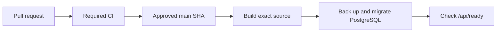

# Deploy Grafy from GitHub

This guide deploys one reviewed `main` commit to a single Linux host. PostgreSQL
runs inside the Grafy Compose project and stores its data in a dedicated Docker
volume. The database has no host port.

The first SQLite-to-PostgreSQL cutover starts with an empty database. Archive
the old SQLite volume unless the owner explicitly approved a complete data
reset. The current PostgreSQL role owns one dedicated database and has bootstrap
privileges inside the private Grafy container network.



## Prepare the host

Install Docker Engine, the Docker Compose plugin, Git, and `curl`. Clone the
repository at `/opt/graphy`, then create the production environment file:

```bash
sudo install -d -m 700 -o "$USER" /opt/graphy/.deployment
sudo install -m 600 -o "$USER" \
	/opt/graphy/infra/docker/.env.production.example \
	/opt/graphy/.deployment/grafy.env
```

Set the existing OIDC, public-origin, encryption, HMAC, and storage values in
`/opt/graphy/.deployment/grafy.env`. To put every verified `@ihpan.edu.pl`
login in one shared Workspace, add:

```dotenv
GRAFY_OIDC_DOMAIN_WORKSPACES=ihpan.edu.pl:ihpan:IHPAN
```

Add these PostgreSQL values:

```dotenv
GRAFY_POSTGRES_DB=grafy
GRAFY_POSTGRES_USER=grafy
GRAFY_POSTGRES_PASSWORD=<64 lowercase hexadecimal characters>
GRAFY_POSTGRES_VOLUME=grafy-postgres
GRAFY_POSTGRES_IMAGE=postgres@sha256:<approved-image-digest>
```

Generate the password with `openssl rand -hex 32`. Keep it hexadecimal because
the Compose override uses the same value as both a PostgreSQL password and a
URL password.

The PostgreSQL override constructs the database URL and supplies it to
`migrate`, `api`, and `publisher`. Pin `GRAFY_POSTGRES_IMAGE` to the digest that
you approved for the release. If the variable is absent, Compose uses the
current `postgres:17-alpine` image. A `GRAFY_DOCKER_DATABASE_URL` value affects
the base Compose file only; the PostgreSQL override ignores it.

To keep S3 or other site-specific Compose settings, put them in a separate
root-owned file. Set `GRAFY_STORAGE_COMPOSE_OVERRIDE` to its absolute path when
you run the deployment script.

## Perform the first cutover

Record the exact commit that passed CI. Use the 40-character SHA shown by
GitHub, not a branch name.

Stop the old deployment and save its volumes before you delete legacy data. If
the owner explicitly approved a complete reset, record that approval and skip
the legacy backup. The exact backup command depends on the old Compose project
and volume names. Confirm both names with `docker compose ls` and
`docker volume ls`.

Run the checked-in deployment script from `/opt/graphy`:

```bash
cd /opt/graphy
./scripts/deploy-production.sh <40-character-commit-sha>
```

The script accepts only a commit reachable from `origin/main`. It renders the
merged Compose configuration and builds the images before stopping API traffic.
It then creates a PostgreSQL dump and removes the previous one-shot `migrate`
container. Compose runs Alembic once before it starts the API, waits for every
long-lived service, and requests `/api/ready` through the configured loopback
gateway port. A migration failure leaves the gateway stopped.

On the first cutover, the dump contains the new empty PostgreSQL database. On
later deployments, the dump contains the pre-migration production database.
The script never removes the `grafy-postgres` or `grafy-data` volume.

Check the result through the public TLS endpoint. Sign in and run one small
graph before you remove the archived SQLite volume.

## Roll back a failed release

The script records the deployed and previous SHAs in `/opt/graphy/.deployment`.
Database dumps use the timestamp and previous SHA in their filenames.

If the release fails before Alembic changes the database, run the script with
the previous SHA. If Alembic changed the database, stop Grafy and restore the
matching dump before you start the previous commit. Do not run an older binary
against a newer schema.

Restore a dump only during a maintenance window:

```bash
docker compose \
	--project-name grafy \
	--env-file /opt/graphy/.deployment/grafy.env \
	-f infra/docker/compose.yaml \
	-f infra/docker/compose.postgres.yaml \
	stop gateway api

docker compose \
	--project-name grafy \
	--env-file /opt/graphy/.deployment/grafy.env \
	-f infra/docker/compose.yaml \
	-f infra/docker/compose.postgres.yaml \
	exec -T postgres dropdb --if-exists --username grafy grafy

docker compose \
	--project-name grafy \
	--env-file /opt/graphy/.deployment/grafy.env \
	-f infra/docker/compose.yaml \
	-f infra/docker/compose.postgres.yaml \
	exec -T postgres createdb --username grafy --owner grafy grafy

docker compose \
	--project-name grafy \
	--env-file /opt/graphy/.deployment/grafy.env \
	-f infra/docker/compose.yaml \
	-f infra/docker/compose.postgres.yaml \
	exec -T postgres pg_restore --clean --if-exists --no-owner \
		--username grafy --dbname grafy < /opt/graphy/.deployment/<backup>.dump
```

Check out the previous SHA, build it, and start the Compose project. Use the
database name and user from `/opt/graphy/.deployment/grafy.env` when they differ
from the defaults above.

## Add a manual GitHub deployment job

The current `.github/workflows/ci.yml` is the release gate. It applies every
Alembic migration to PostgreSQL, runs backend tests, checks Python and web code,
builds the production web application, and runs the disposable live HTTP test.
The workflow runs for pull requests and pushes to `main`.

Keep production deployment separate from CI until the host has a dedicated
self-hosted runner or a narrowly scoped SSH deployment account. Add a
`workflow_dispatch` workflow when that account exists. Configure the job as
follows:

1. Require the GitHub `production` environment and its reviewer approval.
2. Accept a 40-character commit SHA as input.
3. Verify that the SHA belongs to `origin/main` and that CI passed for it.
4. Send only the SHA to the host-side deployment command.
5. Run `/opt/graphy/scripts/deploy-production.sh <sha>` on the host.
6. Record the SHA and health-check result in the GitHub job summary.

Store the SSH key, host key, and connection details in GitHub environment
secrets. Keep `/opt/graphy/.deployment/grafy.env`, the PostgreSQL password,
OIDC client secret, encryption keys, and storage credentials on the host. The
GitHub job does not need those application secrets.

Protect `main`, require the existing CI jobs, and disable force pushes. The
manual job must deploy the approved SHA rather than whichever commit happens to
be at the tip of `main` when the job starts.

The host script computes `GRAFY_BUILD_DIGEST` as the SHA-256 digest of
`git archive <sha>` and passes it to the API container. This value identifies
the exact checked-in source used by built-in node implementations. The Git
commit SHA remains the release identifier used for checkout and rollback.
