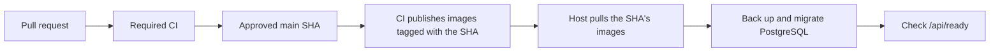

# Deploy Grafy from GitHub

This guide deploys one reviewed `main` commit to a single Linux host from
pre-built container images. Application deployment needs no Git checkout or host
build. Plugin publication is a separate operation that builds runtime images.
PostgreSQL runs inside the Grafy Compose project and stores its data in a
dedicated Docker volume. The database has no host port.

The first SQLite-to-PostgreSQL cutover starts with an empty database. Archive
the old SQLite volume unless the owner explicitly approved a complete data
reset. The current PostgreSQL role owns one dedicated database and has bootstrap
privileges inside the private Grafy container network.


```mermaid
flowchart LR
	PR["Pull request"] --> CI["Required CI"]
	CI --> SHA["Approved main SHA"]
	SHA --> Images["CI publishes images tagged with the SHA"]
	Images --> Pull["Host pulls the SHA's images"]
	Pull --> DB["Back up and migrate PostgreSQL"]
	DB --> Ready["Check /api/ready"]
```

## Release images

The `publish-images` job in `.github/workflows/ci.yml` runs only for pushes to
`main`, and only after every other CI job passes. It builds `linux/amd64`
images and pushes them to GitHub Container Registry, tagged with the full
40-character commit SHA:

| Image | Source | Used by |
| --- | --- | --- |
| `ghcr.io/artpods56/grafy-api` | `api.Dockerfile`, `api-release` target | `migrate`, `api` |
| `ghcr.io/artpods56/grafy-web` | `web.Dockerfile` | `web` |
| `ghcr.io/artpods56/grafy-gateway` | `gateway.Dockerfile` (nginx config baked in) | `gateway` |
| `ghcr.io/artpods56/grafy-publisher` | `api.Dockerfile`, `publisher` target | `publisher` profile |

Because images are pushed only after green CI on `main`, a SHA that has images
is an approved commit. `GRAFY_BUILD_DIGEST` is the SHA-256 digest of
`git archive <sha>`, computed by CI and baked into the API image. Do not set it
on the host: Compose would override or remove the baked value.

The first publish creates each package as private. Either make the four
packages public in the GitHub package settings, or run `docker login ghcr.io`
on the host with a token that has `read:packages`.

## Prepare the host

Install Docker Engine, the Docker Compose plugin, and `curl`. No repository
clone is needed. Create the deployment directory and download the example
environment file for the commit you are deploying:

```bash
sudo install -d -m 700 -o "$USER" /opt/graphy/.deployment
curl --fail --location \
	--output /opt/graphy/.deployment/grafy.env \
	https://raw.githubusercontent.com/artpods56/grafY/<40-character-commit-sha>/infra/docker/.env.production.example
chmod 600 /opt/graphy/.deployment/grafy.env
```

Download the deployment script once, from a commit you trust, and keep it on the
host:

```bash
curl --fail --location --output /opt/graphy/deploy-production.sh \
	https://raw.githubusercontent.com/artpods56/grafY/<40-character-commit-sha>/scripts/deploy-production.sh
chmod 700 /opt/graphy/deploy-production.sh
```

Set the existing OIDC, public-origin, encryption, HMAC, and storage values in
`/opt/graphy/.deployment/grafy.env`. To put every `@ihpan.edu.pl`
login in one shared Workspace, add:

```dotenv
GRAFY_OIDC_DOMAIN_WORKSPACES=ihpan.edu.pl:ihpan:IHPAN
```

Add these PostgreSQL values:

```dotenv
GRAFY_POSTGRES_DB=grafy
GRAFY_POSTGRES_USER=grafy
GRAFY_POSTGRES_PASSWORD=<64 lowercase hexadecimal characters>
GRAFY_POSTGRES_VOLUME=grafy-postgres
GRAFY_POSTGRES_IMAGE=postgres@sha256:<approved-image-digest>
```

Generate the password with `openssl rand -hex 32`. Keep it hexadecimal because
the Compose override uses the same value as both a PostgreSQL password and a
URL password.

The PostgreSQL override constructs the database URL and supplies it to
`migrate`, `api`, and `publisher`. Pin `GRAFY_POSTGRES_IMAGE` to the digest that
you approved for the release. If the variable is absent, Compose uses the
current `postgres:17-alpine` image. A `GRAFY_DOCKER_DATABASE_URL` value affects
the base Compose file only; the PostgreSQL override ignores it.

To keep S3 or other site-specific Compose settings, put them in a separate
root-owned file. Set `GRAFY_STORAGE_COMPOSE_OVERRIDE` to its absolute path when
you run the deployment script.

## Perform the first cutover

Record the exact commit that passed CI. Use the 40-character SHA shown by
GitHub, not a branch name.

Stop the old deployment and save its volumes before you delete legacy data. If
the owner explicitly approved a complete reset, record that approval and skip
the legacy backup. The exact backup command depends on the old Compose project
and volume names. Confirm both names with `docker compose ls` and
`docker volume ls`.

Run the deployment script:

```bash
/opt/graphy/deploy-production.sh <40-character-commit-sha>
```

The script downloads that commit's `compose.yaml` and `compose.postgres.yaml`
into `/opt/graphy/.deployment/releases/<sha>/`, renders the merged Compose
configuration, and pulls the active services' SHA-tagged images before stopping
API traffic. The publisher profile is inactive during application deployment.
Pull `ghcr.io/artpods56/grafy-publisher:<sha>` explicitly before Plugin publication.
A SHA without published images fails at the pull, while the previous release is
still serving. The script then creates a PostgreSQL dump and removes the previous one-shot `migrate`
container. Compose runs Alembic once before it starts the API, waits for every
long-lived service, and requests `/api/ready` through the configured loopback
gateway port. A migration failure leaves the gateway stopped.

On the first cutover, the dump contains the new empty PostgreSQL database. On
later deployments, the dump contains the pre-migration production database.
The script never removes the `grafy-postgres` or `grafy-data` volume.

Check the result through the public TLS endpoint. Sign in and run one small
graph before you remove the archived SQLite volume.

## Deploy another release to ai-ihpan

Choose the release before changing the host:

```bash
git fetch origin
gh run list --branch main --workflow CI --limit 10
gh run view <run-id>
```

For the newest published image, select the newest `main` run whose four
`Publish grafy-* image` jobs succeeded. A newer merge can still be queued or
building. If the request names the newest `main` commit, wait for that commit's
images instead. Record the full SHA and keep the target fixed during deployment.

Inspect the running release and its Compose file paths:

```bash
ssh ai-ihpan 'cat /opt/graphy/.deployment/current-revision'
ssh ai-ihpan 'docker inspect grafy-api-1 --format \
	"{{ index .Config.Labels \"com.docker.compose.project.config_files\" }}"'
```

Use the deployment's existing wrapper. On `ai-ihpan`,
`/opt/graphy/.deployment/current-deployment` identifies the directory containing
`deploy.sh`. That wrapper supplies the production environment and combined site
and runtime override. Preserve those paths instead of using the host checkout's
modified Compose files or replacing the environment with an example file.

Run the pinned release and capture the complete output:

```bash
ssh ai-ihpan bash -s <<'REMOTE'
set -euo pipefail
umask 077
revision='<40-character-commit-sha>'
deployment_dir="$(cat /opt/graphy/.deployment/current-deployment)"
operation_dir="/opt/graphy/.deployment/deploy-${revision:0:8}-$(date -u +%Y%m%dT%H%M%SZ)"
install -d -m 700 "$operation_dir"
cp /opt/graphy/.deployment/current-revision "$operation_dir/previous-revision"
"$deployment_dir/deploy.sh" "$revision" </dev/null >"$operation_dir/deploy.log" 2>&1
tail -20 "$operation_dir/deploy.log"
REMOTE
```

Keep `</dev/null` on the deployment command. A child Docker command can otherwise
consume the remaining script sent through SSH. Read the saved log after a
failure; do not pipe a running deployment into `head` or another command that
closes its input early.

If the release changes a Plugin, publish and promote its matching source after
the application is ready. Follow the
[native System Plugin publication guide](how-to-publish-native-system-plugins.md).
An application restart alone does not update an immutable Plugin release.
For a web-only change, retain the existing Plugin selections.

## Verify and record the deployment

Check the host and the public endpoint:

```bash
ssh ai-ihpan 'cat /opt/graphy/.deployment/current-revision'
ssh ai-ihpan 'docker ps --filter name=grafy --format "{{.Names}} {{.Image}} {{.Status}}"'
curl --fail --silent --show-error https://graphs.ihpan.edu.pl/api/ready
curl --fail --silent --show-error --output /dev/null \
	--write-out 'HTTP %{http_code}\n' https://graphs.ihpan.edu.pl/
```

Confirm that API, web, and gateway use the target SHA and report healthy.
Verify Plugin selections and catalog readiness in each affected Workspace.
If no Plugins changed, compare the exact selection rows before and after.
If Plugins changed, record their returned revisions and retain unrelated selections.

Verify the source digest when release identity needs an independent check:

```bash
git archive <sha> --output=/tmp/grafy-release.tar
shasum -a 256 /tmp/grafy-release.tar
ssh ai-ihpan 'docker exec grafy-api-1 .venv/bin/python -c \
	"import os; print(os.environ[\"GRAFY_BUILD_DIGEST\"])"'
```

Keep the SHA, previous SHA, database dump path, deployment log, Plugin revisions,
and verification results in the operation directory. Keep exported selections
and database dumps protected. Never include environment contents or bearer
credentials in the report. Health and catalog checks do not prove an
authenticated graph run; record whether you exercised that separately.

## Roll back a failed release

The script records the deployed and previous SHAs in `/opt/graphy/.deployment`.
Database dumps use the timestamp and previous SHA in their filenames.

If the release fails before Alembic changes the database, run the script with
the previous SHA. Rollback targets must have published images, so they must be
commits from after the images were introduced. If Alembic changed the database, stop Grafy and restore the
matching dump before you start the previous commit. Do not run an older binary
against a newer schema. If you also changed Plugin selections, restore compatible
selections for the old application. Retain the old immutable releases for this
rollback; do not rewrite their manifests.

Restore a dump only during a maintenance window:

```bash
docker compose \
	--project-name grafy \
	--env-file /opt/graphy/.deployment/grafy.env \
	-f /opt/graphy/.deployment/releases/<sha>/compose.yaml \
	-f /opt/graphy/.deployment/releases/<sha>/compose.postgres.yaml \
	stop gateway api

docker compose \
	--project-name grafy \
	--env-file /opt/graphy/.deployment/grafy.env \
	-f /opt/graphy/.deployment/releases/<sha>/compose.yaml \
	-f /opt/graphy/.deployment/releases/<sha>/compose.postgres.yaml \
	exec -T postgres dropdb --if-exists --username grafy grafy

docker compose \
	--project-name grafy \
	--env-file /opt/graphy/.deployment/grafy.env \
	-f /opt/graphy/.deployment/releases/<sha>/compose.yaml \
	-f /opt/graphy/.deployment/releases/<sha>/compose.postgres.yaml \
	exec -T postgres createdb --username grafy --owner grafy grafy

docker compose \
	--project-name grafy \
	--env-file /opt/graphy/.deployment/grafy.env \
	-f /opt/graphy/.deployment/releases/<sha>/compose.yaml \
	-f /opt/graphy/.deployment/releases/<sha>/compose.postgres.yaml \
	exec -T postgres pg_restore --clean --if-exists --no-owner \
		--username grafy --dbname grafy < /opt/graphy/.deployment/<backup>.dump
```

Run the deployment script with the previous SHA, and set the same
`GRAFY_*_IMAGE` variables the script exports if you restore by hand. Use the
database name and user from `/opt/graphy/.deployment/grafy.env` when they differ
from the defaults above.

## Add a manual GitHub deployment job

The current `.github/workflows/ci.yml` is the release gate. It applies every
Alembic migration to PostgreSQL, runs backend tests, checks Python and web code,
builds the production web application and runs the automated test suites.
The workflow runs for pull requests and pushes to `main`. On `main`, it ends by
publishing the release images.

Keep production deployment separate from CI until the host has a dedicated
self-hosted runner or a narrowly scoped SSH deployment account. Add a
`workflow_dispatch` workflow when that account exists. Configure the job as
follows:

1. Require the GitHub `production` environment and its reviewer approval.
2. Accept a 40-character commit SHA as input.
3. Verify that the SHA's images exist. They exist only for CI-green `main` commits.
4. Send only the SHA to the host-side deployment command.
5. Run `/opt/graphy/deploy-production.sh <sha>` on the host.
6. Record the SHA and health-check result in the GitHub job summary.

Store the SSH key, host key, and connection details in GitHub environment
secrets. Keep `/opt/graphy/.deployment/grafy.env`, the PostgreSQL password,
OIDC client secret, encryption keys, and storage credentials on the host. The
GitHub job does not need those application secrets.

Protect `main`, require the existing CI jobs, and disable force pushes. The
manual job must deploy the approved SHA rather than whichever commit happens to
be at the tip of `main` when the job starts.

The Git commit SHA remains the release identifier for image tags, Compose files,
and rollback.
