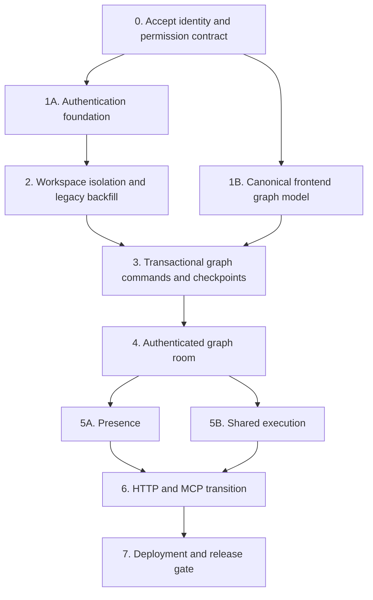
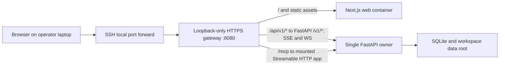

# Authentication, workspace, and collaboration implementation plan

- **Status:** Accepted; Phase 0–6 exit met; Phase 7 in progress.
  Automatable gate landed: one-owner fence, same-origin Compose gateway `:8080`,
  deploy DoD unit tests, and two-session API/WS acceptance
  (`tests/unit/api/test_collaboration_acceptance.py`). Remaining operator-only
  gates: live SSH/OIDC rehearsal and full backup/restore on realistic data.
  `executions:run` MCP tools deferred.
- **Date:** 2026-08-06
- **Audience:** Experienced contributors changing identity, persistence, API,
  Workbench, MCP, collaboration, execution, or deployment
- **Scope:** OpenID Connect identities, opaque server sessions, workspace-bound
  personal access tokens, personal and shared workspaces, graph sharing, and the
  dependency order for realtime collaboration
- **Related:** [Workbench feature architecture](../adr/0001-workbench-feature-architecture.md),
  [server-authoritative collaboration ADR](../adr/0002-server-authoritative-workbench-collaboration.md),
  [identity and workspace ADR](../adr/0003-authenticate-users-and-scope-collaboration-to-workspaces.md),
  [authentication and workspace tenancy design](../design/authentication-and-workspace-tenancy.md),
  [realtime collaboration design](../design/workbench-realtime-collaboration.md),
  [Workbench interaction plan](../workbench-interaction-plan.md), and
  [product vocabulary](../../CONTEXT.md)

## Outcome

Grafy will become a multi-user OpenID Connect relying party. A successful
Authorization Code flow with PKCE establishes an internal `User` and
`OidcIdentity`, after which the browser receives an opaque server session. A
user may create a workspace-bound personal access token for Streamable HTTP MCP.
Every persisted or staged Workbench resource belongs to exactly one workspace.

A workspace is the only collaboration boundary:

- a **personal workspace** has one owner and cannot accept other members;
- a **shared workspace** has one or more members with `viewer`, `editor`, or
  `owner` roles;
- a graph belongs to one workspace, and every member sees every graph in that
  workspace according to their role;
- there is no organization aggregate, team aggregate, graph ACL, public-link
  grant, or creator-owned exception in the first implementation.

“Team” and “organization” in product conversation both map to a shared
workspace. Do not introduce a second grouping concept until a concrete product
requirement cannot be expressed by workspace membership. [R41: No Speculative Extension Points]

The identity and workspace foundation is a prerequisite for durable
collaboration state. The browser-only canonical graph-model extraction may run
in parallel with authentication work, but collaborative heads, command journals,
rooms, presence, and shared execution must use trusted workspace and actor
identity from their first schema and protocol versions.



## Non-goals

- Public self-registration, email delivery, social-login-specific flows, SAML,
  or multiple identity-provider routing beyond the configured OIDC issuer.
- Local passwords, password reset, MFA, or recovery. Those remain with the OIDC
  provider.
- Per-graph invitations, public links, or exceptions to workspace membership.
- Moving a graph and all of its secrets, history, artifacts, and materialized
  outputs between workspaces. The first sharing operation copies only one exact
  synchronized collaborative head into a shared workspace.
- Offline-first graph editing or a general CRDT.
- Multiple API owners, workers, or replicas.
- Making unrelated Streamlit applications part of the Grafy OIDC session or
  workspace boundary.
- Workspace deletion. Graph deletion remains an owner-only workflow; deleting a
  workspace and all dependent state needs a separate lifecycle design.
- Billing, quotas, SCIM, organization hierarchy, or external identity-provider
  abstraction.

## Fixed domain and security decisions

### Identity and workspace model

Use UUID identities and UTC timestamps throughout.

| Object | Required state | Invariants |
| --- | --- | --- |
| `User` | id, profile email, display name, active flag, created/updated timestamps | Profile values are not authorization keys. A disabled user cannot authenticate or authorize. |
| `OidcIdentity` | user id, exact issuer, exact subject, profile timestamps | `(issuer, subject)` is unique and is the only automatic external-to-internal identity mapping key. Email never links identities. |
| `Workspace` | id, globally unique normalized slug, name, kind, optional personal owner id, timestamps | `personal` requires one personal owner; `shared` has no personal owner. |
| `WorkspaceMembership` | workspace id, user id, role, authorization version, revoked timestamp, created/updated timestamps | A personal workspace has only its owner membership. A normal shared workspace retains at least one active owner; the migrated `local` workspace is sealed until its bootstrap mapping is consumed. Removal revokes rather than deletes the row, and the version advances monotonically on role or membership-state change. |
| `OidcLoginTransaction` | public id, state digest, nonce digest, encrypted PKCE verifier and key version, return path, expiry, consumed timestamp | Single use and short lived. Callback replay, state mismatch, nonce mismatch, or expiry fails closed. Plain state, nonce, and verifier values are not persisted. |
| `AuthSession` | public id, user id, secret digest, CSRF digest, expiry, last-used and revoked timestamps | Raw session and CSRF secrets are never persisted. Expired, revoked, or disabled-user sessions fail closed. |
| `PersonalAccessToken` | public id/prefix, user id, workspace id, secret digest, label, scopes, expiry, last-used and revoked timestamps | The raw token is shown once. Effective permission is token scope intersected with current membership permission. Membership removal, role loss that leaves a token's scopes outside the member's remaining capabilities, and user disablement revoke the affected workspace-bound PATs in the same transaction as the membership or user mutation. |
| `SecurityAuditEvent` | timestamp, actor kind, optional user and non-secret credential reference, workspace/resource ids when applicable, operation, outcome, safe error code | Metadata only. Pre-authentication and system events use explicit actor kinds without copying submitted identity. It never contains credentials, provider payloads, command/configuration values, artifacts, secrets, or one-time URLs. |

Use dedicated identity domain types in
`libs/core/src/grafy_core/domain/identity.py` and the metadata-only audit
contract in `libs/core/src/grafy_core/domain/security_audit.py`. Keep OIDC discovery/JWK access,
authorization redirects, code exchange, PKCE, random credential generation,
cookies, bearer parsing, and constant-time digest verification at the API
security boundary. The core identity model must not import FastAPI, an OIDC SDK,
SQLAlchemy, HTTP clients, or cookie types.

Repository and unit-of-work protocols in
`libs/core/src/grafy_core/ports/identity.py` are justified by the existing
relational persistence boundary. Do not add provider, factory, or strategy
interfaces for the single configured OIDC integration. [R40: Real Interfaces Only]

Read operations authorize before loading a workspace-qualified resource.
Durable application workflows repeat the active-user, current-membership, and
capability check inside the same unit of work as the mutation; a route-level
dependency is defense in depth, not the commit-time authority.

### First-login provisioning and legacy-owner bootstrap

There is no Grafy signup or user-creation HTTP endpoint. A user is provisioned
only after a complete, valid OIDC callback from the configured issuer. In one
transaction the application maps exact `(issuer, subject)` to `OidcIdentity`,
creates `User` when the identity is new, and creates that user's personal
workspace and owner membership. Provider email and display name populate a
profile but never select or merge an existing identity.

Migration needs an explicit mapping for the first OIDC user who will own legacy
data. Add a `grafy-admin bootstrap-oidc-owner --issuer ... --subject ...`
command that writes one unconsumed bootstrap mapping for the deterministic
`local` shared workspace. It does not create a user or credential. The matching
identity's first valid OIDC callback consumes the mapping while it provisions
the user, personal workspace, and `local` owner membership in one transaction.
Another identity cannot consume it, and a consumed mapping cannot be replayed.
While the migrated `local` workspace has no owner and that mapping is pending,
a callback for any other identity fails closed without provisioning a user;
normal configured-issuer first-login provisioning begins only after bootstrap
consumption succeeds.

The same admin entry point may expose `disable-user` and the idempotent
`migrate-workspace-files` operation described below. It must not implement
`create-user`, local password, or password-reset commands.

Workspace owners add already provisioned active users to shared workspaces by
exact internal user UUID. The current-session UI exposes the signed-in user's
copyable UUID so it can be exchanged out of band; email and display name are
presentation hints and never resolve a membership target. Invitation email,
user-directory search, and provider group synchronization remain deferred.

### Authorization policy

Represent capabilities explicitly in the identity domain and map roles to them
in one policy. Routes ask whether a resolved membership grants a capability;
they do not reproduce role comparisons.

| Capability | Viewer | Editor | Owner |
| --- | :---: | :---: | :---: |
| List/open graphs and checkpoints | yes | yes | yes |
| View artifacts, materializations, history, and active execution | yes | yes | yes |
| Join a graph room and publish bounded presence | yes | yes | yes |
| Create graphs or copy a graph definition into the workspace | no | yes | yes |
| Submit durable commands and create checkpoints | no | yes | yes |
| Start or cancel a graph execution | no | yes | yes |
| Configure or remove node secrets | no | no | yes |
| Delete graphs | no | no | yes |
| Add, change, or remove workspace members | no | no | yes |
| Rename a shared workspace | no | no | yes |

All authenticated users may list and revoke their own server sessions. A user
may create a workspace-bound PAT only for a workspace they currently belong to;
the selected PAT scopes must be a subset of capabilities their role grants.
Membership and role changes take effect on the next HTTP request and trigger
post-commit invalidation for long-lived transports. Affected WebSocket and SSE
connections close and must establish a fresh authorization snapshot; handling-
time authorization still resolves any race with an in-flight operation. First-
delivery MCP uses stateless Streamable HTTP, so each request re-resolves the
PAT; there is no process-global or transport-session caller token to retain.

Removing a shared-workspace member sets `revoked_at` and increments
`authorization_version` rather than deleting attribution history. The same
membership transaction also revokes that user's workspace-bound PATs for the
affected workspace. A role change that leaves an existing PAT's scopes outside
the member's remaining capabilities likewise revokes those PATs before commit.
User disablement revokes all of that user's sessions and PATs in one
transaction. Re-adding a removed member reactivates the membership row and
increments the version again; it does not revive previously revoked PATs.
Ordinary authorization considers only an active membership.

Use these boundary outcomes consistently:

- no valid credential: `401`;
- valid user who is not a member, or a resource id presented under the wrong
  workspace: `404` so the resource's existence is not disclosed;
- member whose role lacks the requested capability: `403`;
- invalid resource within an authorized workspace: `404`;
- stale revision, room epoch, or collaboration sequence: `409` with the exact
  expected/current context.

Errors preserve operation, workspace, graph/resource identity, and original
cause where safe, without echoing credentials or secret-bearing input.
[R42: Errors Carry Context]

### Authentication mechanisms

FastAPI is the OIDC relying party. Browser login uses Authorization Code with
PKCE, state, and nonce. The login-start endpoint creates one short-lived
`OidcLoginTransaction`, stores only state and nonce digests plus the encrypted
verifier and validation state needed by the callback, and sends an opaque
transaction reference in a host-only, `Secure`, `HttpOnly`, `SameSite=Lax`
cookie with `Path=/api/v1/auth/oidc` and no `Domain`. Encrypt the verifier with AEAD under a
dedicated deployment-supplied auth wrapping key and include transaction identity
as associated data; store a key version for controlled rotation. Accept only a
validated same-origin relative `return_path` so neither login start nor callback
becomes an open redirect. The callback validates the exact configured
issuer, audience, signature, allowed algorithm, state, nonce, code verifier,
time claims, and one-time transaction before it provisions identity. Provider
access, refresh, and ID tokens never enter browser JavaScript and are discarded
after identity mapping when no later provider API use exists.

Provider discovery and JWK retrieval are bounded, cached, and fail closed. A
metadata/JWK refresh failure may use an unexpired previously validated cache but
must never accept an unknown signing key or downgrade issuer/audience checks.
The exact redirect URI is derived from the configured HTTPS public origin, not
from untrusted forwarded headers.

Rate-limit login start, callback failures, session/PAT verification failures,
and PAT creation; cap outstanding login transactions per browser; and delete
expired or consumed transactions on a bounded schedule. Abuse controls and
their audit events never record submitted codes, state, nonce, tokens, or
identity claims.

After callback, browser authentication uses an opaque, database-backed session
cookie, not a JWT. Use at least 256 bits of randomness for the session secret. A
cookie value contains a public lookup id and raw secret; the database stores
only a SHA-256 or server-keyed digest and verifies it in constant time. Set
`Secure`, `HttpOnly`, `SameSite=Lax`, `Path=/`, and no `Domain`. Rotate the
session at authentication, enforce idle and absolute expiry, and revoke it on
logout or user disable.

Every unsafe cookie-authenticated HTTP request carries an unguessable CSRF token
bound to the session in `X-CSRF-Token`. On session issuance, send that raw token
only in a separate host-only, `Secure`, `SameSite=Lax` cookie that browser code
may read; persist only its digest, mirror the cookie value into the header, and
clear it with the HttpOnly session cookie. Do not copy either token into web
storage. Validate the configured public `Origin` for unsafe HTTP requests and
every WebSocket handshake. CORS configuration does not replace either check.

Workspace-bound PATs use `Authorization: Bearer <token>` for `/mcp` and do not
use CSRF. Give them bounded scopes such as `graphs:read`, `graphs:write`, and
`executions:run`; do not grant membership, secret-management, user-management,
or workspace-deletion scopes in the first delivery. First-delivery MCP is
**stateless Streamable HTTP** mounted at `/mcp` under the same FastAPI
authority: resolve and authorize the bearer on every request, intersect scopes
with current user and membership state, and inject only a request-scoped actor.
Do not store a process-global or lifespan caller token, and do not accept a
token in an MCP tool argument.

Local development and browser acceptance tests use a configured OIDC provider
or protocol-level test issuer with the same discovery, JWK, state, nonce, PKCE,
and callback path. Do not add a trusted-header user, anonymous workspace, or
authentication-disable flag.

OIDC codes, state, nonce, PKCE verifiers, provider tokens, raw session/PAT/CSRF
secrets, node-secret material, and one-time URLs are sensitive serializable
state. Exclude or redact them from dataclass representations, Pydantic dumps,
exceptions, tracing, and structured logging. [R44: Sensitive Serializable State]

### Sharing semantics

A graph's `workspace_id` is its authorization owner. `created_by_user_id` is
nullable for migrated/system records and required for new user-created graphs,
but it never changes access.

To share an existing personal graph, copy one exact synchronized collaborative
head into a shared workspace. The request identifies the source workspace and
graph plus expected room epoch and collaboration sequence; the transaction
rejects a stale or unsynchronized source. The source user needs graph view
permission and editor permission in the target workspace. The target is created
through the normal sequence-1 bootstrap and receives a new graph id, revision 1,
target workspace id, and creator id. It copies only the head name and graph
document. It does not copy:

- node-secret ciphertext or configured status;
- collaboration commands or room epoch;
- execution history or idempotency receipts;
- materialized outputs, invocation-cache entries, staged uploads, or artifacts.

This is deliberately a copy rather than an ownership transfer. A later transfer
would need an explicit, atomic policy for all dependent sensitive and runtime
records.

### Terminology cleanup

The existing `Settings.workspace`, `PluginRuntimeContext.workspace`, and
“filesystem workspace” documentation describe the host data directory, not an
authorization workspace. Rename that concept to `data_root` in Python and docs,
add `GRAFY_DATA_ROOT`, and support `GRAFY_WORKSPACE` only as a documented
temporary environment alias during the transition. Update `CONTEXT.md` before
code begins so future changes do not confuse the two concepts.
[R23: Maintain The Rules]

Use `AuthSession` for the persisted browser credential and `GraphRoomSession`
for an ephemeral WebSocket connection. A graph-room session is bound to an
authenticated user but is never itself an identity or authorization grant.

## Repository ownership

Keep the work in the existing monolith and preserve inward dependency direction.

| Area | Ownership in this refactor |
| --- | --- |
| `libs/core/src/grafy_core/domain/identity.py` | User, workspace, membership, role/capability policy, authenticated actor ids, and invariants. |
| `libs/core/src/grafy_core/domain/security_audit.py` | Bounded audit actor kinds and metadata-only security events shared by authenticated and pre-authentication workflows. |
| `libs/core/src/grafy_core/application/identity.py` | Create shared workspace, add/change/remove membership, personal-workspace creation, graph-copy orchestration, and last-owner checks. |
| `libs/core/src/grafy_core/ports/identity.py` | Narrow repository/UoW contracts actually required by those workflows. |
| `libs/core/src/grafy_core/domain/saved_graphs.py` and existing runtime domains | Add workspace/creator identity where it is part of durable state; do not import the full `User` aggregate. |
| `libs/core/src/grafy_core/nodes.py` | Add required `workspace_id` to `NodeExecutionContext` so all persisted runtime output has tenant context. Never put an auth token or session object here. |
| `libs/persistence/src/grafy_persistence/schema.py` | Identity tables, tenant columns, composite constraints, collaboration tables, and indexes. |
| `libs/persistence/src/grafy_persistence/orm.py` | Imperative mappings for new domain records. |
| `libs/persistence/src/grafy_persistence/adapters/repositories.py` | Workspace-qualified identity, graph, artifact, cache, materialization, secret, execution, and collaboration queries. |
| `libs/persistence/src/grafy_persistence/unit_of_work.py` | Expose the concrete repository set through one task-local transaction; checkpoint workflows commit once. |
| `apps/api/src/grafy_api/v1/routes/auth/` | OIDC start/callback, current-session/logout, PAT HTTP models, dependencies, and concrete relying-party/session service. |
| `apps/api/src/grafy_api/v1/routes/workspaces/` | Workspace/member/list/copy HTTP presentation. |
| Existing API slices under `v1/routes/` | Add resolved actor/workspace dependencies and capability checks at each public operation. |
| `apps/api/src/grafy_api/v1/routes/collaboration/` | WebSocket protocol presentation and in-process room hub; no durable graph business rules. |
| `apps/api/src/grafy_api/main.py` | Composition, app state, route registration, security middleware, and startup deployment assertions. |
| `apps/api/src/grafy_api/settings.py` | HTTPS public origin, OIDC issuer/client/callback settings, auth-wrapping-key and command-HMAC-key versions, cookie security, session/PAT lifetimes, data-root alias, collaboration flag, and singleton assertion settings. |
| `apps/web/src/features/auth/` | Login/session UI and session expiry handling. |
| `apps/web/src/features/workspaces/` | Workspace selection and owner-facing membership management. |
| `apps/web/src/features/workbench/` | Workspace-aware graph authoring, room, presence, and execution behavior under ADR 0001. |
| `apps/web/src/lib/api/` | One concrete same-origin HTTP adapter and generated OpenAPI types. |
| `apps/mcp/src/grafy_mcp/` | Mountable Streamable HTTP MCP transport and tools receiving a request-scoped authenticated actor and injected application operations. |
| `infra/db/migrations/versions/` | Ordered identity, tenancy, and collaboration migrations. |
| `infra/docker/` | Same-origin gateway, loopback publication, health checks, migration ordering, and one-owner deployment. |

Do not add `helpers.py`, a generic authorization middleware that guesses a
resource's workspace, or one-call repository wrappers. Capability slices own
their orchestration, while the shared identity policy owns only identity and
permission decisions. [R01: Direct Ownership]

When a collaboration checkpoint coordinates graph mutation, secret
reconciliation, immutable revision creation, and head mapping, its application
service is the explicit orchestration boundary. Repositories only persist and
load; they do not call application services. [R18: One Layer Per Function]

Update `API_ROUTE_AREAS` and `API_SERVICE_AREAS` in
`tests/unit/architecture/test_import_boundaries.py` when adding the real `auth`,
`workspaces`, and `collaboration` capability slices.

## Target HTTP and room surface

All API and MCP tenant resources are addressed by stable workspace UUID. The
human-readable workspace slug exists only in browser URLs; the web application
resolves it to a permitted workspace id before calling the API. Resource ids
remain UUIDs, but a UUID never substitutes for workspace authorization.

| Surface | Target path |
| --- | --- |
| Start/callback OIDC | `GET /v1/auth/oidc/login`, `GET /v1/auth/oidc/callback` |
| Current/logout | `GET`, `DELETE /v1/auth/session` |
| List/revoke own sessions | `GET /v1/auth/sessions`, `DELETE /v1/auth/sessions/{session_id}` |
| List/create own PATs | `GET`, `POST /v1/workspaces/{workspace_id}/personal-access-tokens` |
| Revoke own PAT | `DELETE /v1/workspaces/{workspace_id}/personal-access-tokens/{token_id}` |
| List/create workspaces | `GET`, `POST /v1/workspaces` |
| Membership administration | `/v1/workspaces/{workspace_id}/members` |
| Node catalog, including graph modules | `/v1/workspaces/{workspace_id}/nodes` |
| Graph CRUD/history/materializations/secrets | `/v1/workspaces/{workspace_id}/graphs/...` |
| Diagnostic run and retained executions | `/v1/workspaces/{workspace_id}/runs` and `/executions/...` |
| Uploads | `/v1/workspaces/{workspace_id}/uploads` |
| Artifact content/query/render | `/v1/workspaces/{workspace_id}/artifacts/...` |
| Graph room | `WS /v1/workspaces/{workspace_id}/graphs/{graph_id}/room` |
| Streamable HTTP MCP | `/mcp` mounted under the FastAPI authority |

`/health`, OIDC login start, and the exact OIDC callback remain unauthenticated.
Health reports process health only and must not include user, workspace, schema,
credential, provider, or bootstrap details.

In the first delivery, `/v1` browser resource routes accept only the AuthSession
cookie, while `/mcp` accepts only a workspace-bound PAT. Supporting PATs as
general REST credentials is out of scope.

Remove the global `/v1/graphs`, `/v1/artifacts`, `/v1/uploads`, `/v1/runs`, and
related routes when their callers migrate. Do not retain an implicit `local`
workspace alias: it would become an ambient-authority bypass. This is an early
`v1` breaking change, so update browser, MCP, tests, OpenAPI, and docs in the same
release.

The browser boundary takes its workspace from the stable `/v1` route UUID. The
MCP boundary derives its workspace only from the PAT and rejects workspace as a
tool argument. Both perform these steps in order:

1. resolve and verify the credential allowed for that surface;
2. resolve the route workspace UUID or token-bound workspace; browser code
   separately resolves its route slug through the authenticated workspace list
   before making the call;
3. load current membership and intersect PAT scopes when applicable;
4. require the operation's capability;
5. load the resource using both workspace id and resource id;
6. call the application workflow with a typed actor/workspace context.

The client carries `workspace_id` only as the target path identity; the server
must resolve and authorize it rather than treating possession as proof. The
client never submits `actor_user_id`, membership role, or display color as a
trusted request field.

## Implementation phases

These phases are merge and verification gates, not independently safe production
releases. Do not deploy an intermediate state in which authentication exists but
legacy global resource routes remain reachable.

### Phase 0: Accept the contract

Before implementation:

1. Add and accept an identity/workspace ADR containing the fixed decisions in
   this plan.
2. Amend ADR 0002 so authentication is a prerequisite for collaboration
   persistence rather than a late retrofit.
3. Amend the realtime design so room keys and routes are
   `(workspace_id, graph_id)`, non-system journal entries require an actor, and
   its final phase is only the deployment/scaling gate.
4. Add `User`, `OidcIdentity`, `Workspace`, `Membership`, `OidcLoginTransaction`,
   `AuthSession`, `PAT`, `SecurityAuditEvent`, `GraphRoomSession`, and capability
   vocabulary to `CONTEXT.md`; rename the filesystem data root.
5. Record the role matrix, status-code policy, exact-head graph-copy semantics,
   first-login provisioning, and legacy-owner bootstrap mapping as accepted
   product behavior.
6. Record deployment inputs without committing secrets: exact issuer and client
   authentication method, client id, allowed signing algorithms, public origin,
   callback registration, idle/absolute session lifetimes, PAT maximum lifetime,
   login/session/PAT cleanup schedules, and security-audit retention.
7. Choose bounded participant, graph, room-message, presence-rate, queue, and
   MCP request/concurrency limits before fixing the first protocol version.

Exit when no identity or sharing decision needed by a migration is still open.

### Phase 1A: Build the authentication foundation

This phase may proceed in parallel with Phase 1B.

1. Add identity domain values, authorization policy, identity repositories, and
   application workflows in `libs/core`.
2. Add the identity and security-audit tables and adapters described in
   migration `0007` below. Record typed metadata-only events at the application
   boundary for authentication, credential lifecycle, membership changes, and
   protected-operation outcomes.
3. Add OIDC discovery and callback validation, PKCE/state/nonce transaction
   handling, opaque session/PAT generation, CSRF validation, and the `auth` and
   `workspaces` API slices.
4. Add the one-time `grafy-admin bootstrap-oidc-owner` mapping command and
   first-valid-login provisioning transaction.
5. Wire concrete services in `grafy_api.main.create_app`; keep `/health`
   available before bootstrap, but all `/v1` resource routes fail closed.
6. Add `features/auth` and `features/workspaces`; make session expiry return to
   login without retaining secret form values.

Phase exit criteria:

- the explicitly mapped first OIDC identity becomes owner of `local`, and every
  valid first-login identity receives a personal workspace atomically;
- OIDC code/state/nonce/verifier/provider tokens and raw session/PAT/CSRF secrets
  do not appear in ordinary database fields, responses, exceptions, or logs;
- invalid issuer, audience, signature, state, nonce, PKCE, expiry, or callback
  replay cannot establish a user or session;
- login rotates the session, logout/revocation is immediate, and disabling a
  user revokes all credentials;
- the role/capability table and last-owner/personal-workspace invariants pass
  domain/application tests;
- security audit events preserve stable attribution and bounded outcomes without
  copying request, command, configuration, provider, or secret payloads;
- no local-password, user-creation, public signup, or anonymous fallback route
  exists.

### Phase 1B: Extract the canonical frontend graph document

Implement Phase 1 of the realtime collaboration design without waiting for the
authentication persistence work:

1. move the canonical authored graph to a framework-independent module under
   `apps/web/src/features/workbench/model`;
2. translate React Flow changes into pure semantic graph commands;
3. keep selection, viewport, callbacks, private field drafts, presence, and
   runtime overlays out of the durable document;
4. retain the current HTTP save behavior until Phase 3 replaces its mutation
   boundary.

Do not create a second graph model. The new model replaces the transitional
React Flow-shaped durable contract under ADR 0001.

Phase exit criteria are the existing collaboration design's Phase 1 criteria,
including byte-semantic saved-graph round trips and real pointer drag,
connection, deletion, and field-editing browser behavior.

### Phase 2: Isolate all existing state by workspace

Apply migration `0008` before adding collaboration tables.

#### Persistence and runtime

- Add `workspace_id` to every directly addressed durable resource:
  `saved_graphs`, `saved_graph_revisions`, `artifact_objects`,
  `materialized_node_outputs`, `node_secrets`, and `graph_executions`.
- Make invocation cache identity `(workspace_id, key_sha256)`. An identical
  invocation in two workspaces is two cache entries even when its content hash
  is equal.
- Add a `staged_uploads` table with workspace, creator, safe storage key,
  original filename, byte size, and timestamp. Stop treating a filename on disk
  as authorization.
- Use composite workspace/graph foreign keys for revisions, materializations,
  secrets, executions, and later collaboration state. Globally unique UUIDs may
  remain primary identities, but repository lookups always include workspace.
- Add required `workspace_id` to `NodeExecutionContext`, execution history,
  retained `_RunExecutionRecord`, artifact creation, output writers, resolvers,
  materialization, cache, graph modules, and preflight. Do not put `User` or an
  auth credential in node/plugin contracts.
- Update artifact writers in core and `plugins/gis`, `plugins/ocr`, and other
  plugins that construct `ArtifactObject` directly. New object-store paths use
  a `workspaces/{workspace_id}/...` prefix.
- Scope staged files below `data_root/uploads/{workspace_id}/`. Update image and
  table upload nodes to resolve an upload id against the current execution
  workspace rather than accepting a client-selected relative path.
- Scope graph-module discovery and nested module resolution to the caller's
  workspace. A module graph id from another workspace behaves as not found.

Every core port and concrete repository method that loads tenant data receives
`workspace_id` explicitly. Do not use a context variable for authorization;
ambient tenant state makes background execution and tests unsafe.

#### API and web

- Move all resource routes to the target workspace paths and require the
  capability matrix.
- Remove `LOCAL_WORKSPACE_SLUG` as a route-validation restriction in
  `apps/web/src/features/workbench/routes.ts`.
- Resolve the browser-route workspace slug to a stable workspace UUID once, then
  make that UUID drive graph listing, catalog modules, uploads, artifacts, runs,
  and execution history through the concrete API adapter.
- Add workspace selection and owner-only membership management.
- Key frontend caches by user, workspace, graph, and room epoch where relevant;
  remount Workbench and clear protected cached data on identity/workspace change,
  membership removal, or `401` rather than retrying with stale authority.
- Drive controls from server capabilities for presentation, while keeping the
  server authoritative. Viewer mode disables mutation callbacks and shortcuts,
  and Artifact Viewer persistence includes user, workspace, and graph identity.
- Ensure content URLs, TileJSON URLs, SSE URLs, and every nested artifact URL
  retain the stable workspace UUID path.

Phase exit criteria:

- the legacy database backfills into `local` with no nullable tenant owner;
- a two-workspace direct-object-reference matrix proves isolation for every
  resource family;
- same cache key, upload id, graph id, execution id, artifact id, or module
  reference cannot cross a workspace boundary;
- a member sees all shared-workspace graphs permitted by their role and no
  personal-workspace graph;
- the old global resource routes no longer exist in FastAPI or OpenAPI;
- existing graph execution, artifact rendering, module execution, secrets,
  selected-run pins, and materialization tests still pass inside one workspace.

### Phase 3: Add transactional collaboration commands and checkpoints

Implement Phase 3 of the realtime collaboration design on top of workspace
isolation.

1. Add `domain/collaboration.py`, `ports/collaboration.py`, and one
   `application/collaboration.py` workflow that owns accepted commands,
   checkpointing, complete replacement, bootstrap, and delete coordination.
2. Add migration `0009` with workspace-qualified collaborative heads, command
   receipts/journal, checkpoint mappings, and execution idempotency/active-slot
   state.
3. Key every head, command, tombstone, checkpoint mapping, and lock by workspace
   and graph. Require `actor_user_id` for user commands; represent migration or
   bootstrap explicitly as `actor_kind=system` rather than a vaguely optional
   actor.
4. Compute persisted command and idempotency request digests with a versioned,
   deployment-supplied HMAC key. Plain digests of user-authored, low-entropy
   configuration are guessing oracles; never log either key or payload.
5. Restructure `SavedGraphService` so checkpoint coordination can apply graph
   aggregate validation and node-secret reconciliation within the caller-owned
   unit of work. The old independently committing replace path cannot be called
   from the checkpoint transaction.
6. Make HTTP create/replace/delete call the collaboration application workflow;
   they must not mutate the checkpoint while ignoring the live head.
7. Add the cross-workspace copy workflow here, after collaborative heads exist.
   It locks the source head, verifies the expected room epoch and synchronized
   sequence, checks source-view and target-edit capability in the transaction,
   sanitizes external references, and bootstraps the target at sequence 1 and
   revision 1 without copying runtime or secret state.

Phase exit criteria:

- command id, digest, sequence, head, journal, workspace, and actor commit once;
- checkpoint head mapping, saved graph row, immutable revision, and secret
  reconciliation commit or roll back together;
- workspace-qualified create, replace, checkpoint, delete, and graph-copy races
  leave no cross-workspace or partial state;
- pre-existing graphs initialize exactly one sequence-zero head;
- a new graph's first semantic command, revision 1, head, checkpoint, and receipt
  are one transaction;
- duplicate ids with another digest fail with `idempotency_mismatch`;
- operational journal entries contain only authorized semantic payload and are
  protected like the complete graph document; audit records, idempotency
  tombstones, logs, and traces contain no credential, secret value, artifact
  payload, semantic command/configuration value, or one-time URL.

### Phase 4: Add the authenticated graph room

Implement Phase 4 of the realtime design in
`apps/api/src/grafy_api/v1/routes/collaboration/` and the Workbench session
module.

- Authenticate the cookie before WebSocket acceptance, validate exact Origin,
  resolve workspace membership, and require graph view permission.
- Key the in-process hub by `(workspace_id, graph_id)` and bind each
  `GraphRoomSession` to server-derived user and membership identity.
- Use bounded server-derived display name/color; clients cannot claim another
  actor or arbitrary CSS presentation.
- Reauthorize each durable command, checkpoint, execution action, and secret
  mutation. WebSocket admission is not continuing edit authority.
- Let viewers receive the head, execution discovery, and presence but reject
  durable commands with a stable forbidden protocol result.
- Close connections on logout, user disable, membership or role change, graph
  deletion, or incompatible protocol version. A still-authorized user reconnects
  to receive a fresh capability snapshot.
- Persist before publication, bound outbound queues, drop presence before
  reliable messages, and recover through a complete head snapshot.

The graph room hub is an API-host adapter for ephemeral connections. It does not
belong in core and is not the durable source of truth. Do not add a broker port
until a second API owner is an accepted deployment target.

Phase exit criteria include two authenticated browser sessions converging after
interleaved commands, reconnect deduplication, no cross-workspace publication,
role-change close and rejoin, view-revocation purge, and safe epoch-reset
recovery.

### Phase 5A: Add presence

After the authenticated room is stable, implement cursors, remote selection,
editing activity, soft claims, and drag previews as described by the realtime
design.

- Presence may identify user id, room-session id, bounded display presentation,
  graph-coordinate cursor, selected ids, activity kind, and transient positions.
- It never carries graph configuration, secret status input, artifact data,
  execution progress, viewport/device details, URLs, HTML, or CSS.
- Viewer presence is allowed; it does not imply edit permission.
- A drag emits transient positions and exactly one durable `move_nodes` command
  on release.

### Phase 5B: Share execution

Phase 5B may proceed in parallel with Phase 5A after Phase 4.

- Replace client-submitted saved graph plans with graph-scoped server planning
  against the exact synchronized collaborative head identified by the expected
  room epoch and sequence; a persisted checkpoint is not a substitute for that
  concurrency precondition.
- Add workspace and initiating actor to durable `GraphExecution` and retained
  execution state.
- Enforce one queued/running/cancelling execution per workspace/graph in
  persistence, not only in the in-memory manager.
- Authorize editor start/cancel at handling time; viewers may observe.
- Reauthorize retained execution GET, SSE subscription, polling, history,
  materializations, and artifacts. Check membership on SSE heartbeat so
  revocation closes a long-lived stream within a bounded interval.
- Keep the existing per-execution SSE journal for progress. The room announces
  only active-execution discovery and lifecycle; it does not duplicate progress.
- Propagate workspace id through nested graph-module execution, cache,
  artifacts, and materialization.

Phase exit criteria are the realtime design's shared-execution criteria plus the
authorization matrix: a run started by an editor is discoverable by viewers and
other editors in the same workspace, invisible outside it, cancellable only by
an editor/owner, and attributed to the server-derived actor.

### Phase 6: Transition HTTP automation and MCP

The browser, REST, and MCP presentations must invoke the same application-owned
authorization and collaboration workflows without an internal loopback HTTP
client or ambient service credential.

1. First add an SDK compatibility gate using the versions pinned in
   `apps/mcp/pyproject.toml` and `uv.lock`—currently FastMCP 3.4.0 and MCP
   1.28.1. A focused integration test must prove
   that FastMCP's Streamable HTTP ASGI application can be mounted at `/mcp`
   under FastAPI in stateless mode; compose lifespans once; receive the request
   Authorization header; isolate actor context across concurrent requests
   without a process-global caller token; and work behind the gateway prefix.
   If the pinned SDK cannot meet this contract, stop the phase and make one
   reviewed SDK/lockfile upgrade. Do not hide an incompatible SDK behind a
   process-global shim.
2. Refactor `apps/mcp/src/grafy_mcp/server.py` to expose a mountable
   Streamable HTTP application. Remove the separately published MCP server from
   production topology and remove the stdio transport and entry point. Delete
   the standalone `GrafyApiClient` and process-level MCP API URL settings
   when no remaining caller owns them rather than leaving a second dormant
   authority path. [R17: Delete Dead Abstractions]
3. Mount that application at `/mcp` from `grafy_api.main` in **stateless**
   Streamable HTTP mode for the first delivery. The FastAPI composition root
   resolves the bearer PAT on every MCP request and injects a request-scoped
   actor plus concrete operations backed by the existing identity, graph,
   collaboration, catalog, and execution application services. Do not enable a
   stateful MCP transport session that carries caller identity across requests.
4. Keep token parsing in the API authority and persistence in the persistence
   adapter. The MCP transport may own a narrow operations contract required by
   its real delivery boundary, but it must not import SQLAlchemy repositories,
   FastAPI route modules, or construct another unit of work. Update the
   architecture test to enforce this intended dependency edge.
5. Derive workspace id and capability scopes only from the resolved PAT. Keep
   workspace and token out of MCP tool arguments so a model cannot switch
   authority or reveal the credential. Never retain Authorization in a global
   `httpx.AsyncClient`, lifespan dictionary, log, or MCP transport-session
   payload.
6. Expose workspace-scoped MCP tools for an explicit live-head read and semantic
   command submission. The read returns room epoch, head sequence, checkpoint
   sequence/revision, and the complete authorized head; the command carries the
   observed concurrency values and an idempotency key.
7. Make MCP create call the sequence-1 bootstrap workflow and replacement call
   the collaboration-aware epoch reset. Replacement rejects an uncheckpointed
   head and preserves revision/epoch conflict semantics. Publish committed MCP
   mutations to the graph room after commit.
8. Scope graph-module node search and every returned resource to the token's
   workspace. Map `401`, `403`, `404`, `409`, and `422` to bounded tool errors
   without credentials, response headers, or unsafe server bodies.
9. On PAT revocation, user disable, membership removal, role loss, or scope
   loss, the membership or user mutation transactionally revokes affected
   workspace-bound PATs where applicable, and the next MCP request fails closed
   from current credential state. Because first delivery is stateless, there is
   no retained MCP authorization session to close; reject any later request that
   presents a revoked or no-longer-authorized token.

Phase exit criteria:

- a read PAT can search/list/get but cannot create, replace, run, or mutate;
- a write PAT can author only within its bound workspace and current user role;
- PAT revocation, expiry, user disable, membership removal, or role loss takes
  effect on the next request because authorization is re-resolved per request
  and affected PATs are revoked in the membership/user transaction;
- MCP live-head reads, semantic commands, create/replace, and browser commands
  use one collaborative head and checkpoint history rather than parallel
  mutation paths;
- the mounted SDK compatibility test passes through the real FastAPI lifespan
  and same-origin gateway.

### Phase 7: Deployment and release gate

Identity is already mandatory by this phase. This gate covers safe topology,
operations, and final acceptance.

- Enable collaboration only with exactly one FastAPI application process: one
  replica and one Uvicorn/Gunicorn worker. A second owner must fail startup or
  leave graph-room and saved-graph execution traffic disabled.
- Keep database migration as a one-shot service before API startup.
- Put web, `/api/v1`, `/mcp`, SSE, and WebSocket behind one same-origin HTTPS
  gateway and verify the exact registered OIDC callback.
- Publish only the gateway on the host loopback address by default.
- Rehearse backup, migration, OIDC bootstrap mapping and first login,
  authenticated browser/MCP smoke, collaboration drain, and restore on a copy
  of realistic data.
- Run the complete verification suite and the two-session API/WS acceptance
  journey (`tests/unit/api/test_collaboration_acceptance.py`). Live two-browser
  smoke through the SSH-forwarded gateway remains an operator rehearsal.

Multiple API owners remain blocked on a separate accepted design for owner
leases/fencing, shared room publication, shared execution replay, cancellation
routing, owner-scoped recovery, and connection draining.

## Database migration and rollback

### Migration 0007: identity and workspace foundation

Add:

- `users`;
- `oidc_identities`;
- `oidc_login_transactions`;
- `oidc_bootstrap_owner_mappings`;
- `workspaces`;
- `workspace_memberships`;
- `auth_sessions`;
- `personal_access_tokens`;
- `security_audit_events`.

Insert one deterministic shared workspace with slug `local`. Do not create a
user, OIDC identity, session, PAT, or hidden anonymous owner in Alembic. Before
opening login, the operator runs `grafy-admin bootstrap-oidc-owner` with the
exact configured issuer and intended first owner's subject. That command writes
only the one-time mapping; the matching valid callback provisions and consumes
it.

Use database constraints for unique `(issuer, subject)`, normalized unique slug,
role/kind choices, login-transaction/session/token expiry lookup,
personal-owner shape, membership uniqueness, non-negative membership
authorization version, token public id/prefix, and bounded security-audit lookup
and retention indexes. Email is profile data and is not a unique identity-
linking key. Application transactions increment the authorization version on
every role or membership-state change. Enforce cross-row invariants such as
“last shared owner,” “no second personal member,” and “bootstrap mapping consumed
once” in the application transaction and behavioral tests.

### Migration 0008: tenant every existing resource

For SQLite, use Alembic batch table rebuilds. The migration must:

1. add nullable workspace columns in the rebuilt/select stage;
2. backfill every legacy graph and direct resource to deterministic `local`;
3. derive graph-child workspace ids through their graph/revision;
4. assign unlinked legacy artifacts and cache entries to `local`;
5. rebuild primary, unique, foreign-key, and lookup indexes with workspace
   columns;
6. make workspace columns non-null;
7. create `staged_uploads`;
8. leave `created_by_user_id` nullable only for migrated/system records.

Test backfill with seeded rows in every 0006-era table, including an execution
with node results, node secrets, materializations, artifacts, and an invocation
cache entry. Assert every relationship still resolves within `local` and no
cross-workspace composite foreign key can be inserted.

After the database upgrade and before API enablement, run the idempotent file
migration. It moves existing `data_root/uploads/<legacy-key>` files beneath
`data_root/uploads/<local-workspace-id>/` without changing the upload key stored
inside legacy graph config, records them in `staged_uploads`, and refuses name or
content collisions. Alembic must not mutate external files or object storage.

Existing artifact object keys may remain at their recorded locations because
database authorization now owns access. New objects use the workspace prefix.
Do not rewrite S3/local object keys in a relational migration.

### Migration 0009: workspace-qualified collaboration

Add the collaboration design's:

- collaborative graph heads;
- command journal and lifetime deduplication tombstones;
- sequence-to-checkpoint mappings;
- execution start idempotency records;
- one-active-execution persistence constraint.

Every table includes workspace identity or has an enforcing composite foreign
key to a workspace-qualified parent. Initialize existing heads from the current
saved graph revision at sequence zero in an idempotent backfill. Store the HMAC
key version with every retained command/request digest so rotation does not make
existing idempotency records unverifiable.

### Migration verification

Extend `tests/unit/persistence/test_migrations.py` to cover:

- fresh base-to-head upgrade, head-to-base downgrade, and another upgrade;
- `alembic check` with no schema drift;
- 0006-to-head legacy backfill with realistic rows;
- deterministic `local` workspace creation;
- exact OIDC bootstrap mapping persistence and single consumption;
- membership revocation/reactivation with monotonic authorization version;
- security-audit indexes, bounded content, and retention cleanup;
- head initialization exactly once;
- SQLite foreign keys and composite uniqueness;
- downgrade guards after multi-workspace or uncheckpointed collaboration data
  exists.

Tests validate observable migrated state rather than internal migration helper
calls. [R43: Tests Are Behavioral Contracts]

### Operational backup and disk headroom

Treat the tenant migration as a maintenance-window operation for SQLite.

Before migration:

1. stop gateway and API traffic, including the mounted MCP application, plus
   Prefect workers and any Streamlit code that might touch the Grafy data
   root;
2. confirm there is only one API owner and no active execution;
3. checkpoint/truncate the SQLite WAL and create a consistent SQLite backup with
   the SQLite backup API or a stopped-volume snapshot, not a live raw file copy;
4. back up the complete Grafy data volume: database, `-wal`/`-shm` state when
   applicable, uploads, local object storage, and migration markers;
5. separately protect the node-secret encryption key, auth wrapping key and
   version, command HMAC key and version, OIDC client secret when required, and
   other deployment secrets;
6. run `PRAGMA integrity_check` and restore the backup into a scratch location;
7. record the current Alembic revision and counts/sizes for every table and
   filesystem area.

SQLite batch migration may temporarily hold the original table, replacement
table, indexes, rollback journal/WAL, and backup at once. Require free space for
the full backup plus at least twice the live SQLite database and expected index
size, with an additional growth margin. A practical release gate is at least
`backup_size + 2 * database_size + 20%` free on the same volume; use more when
uploads/object storage are copied rather than snapshotted. Abort before migration
if the threshold is not met.

After migration, compare counts, run integrity and foreign-key checks, inspect
head/workspace backfills, run the file migration, write the exact OIDC bootstrap
mapping, complete and verify the matching first login, and take a new
post-migration backup before enabling collaboration.

### Rollback policy

Do not run the old pre-auth binary against a tenant-migrated database. It does
not understand workspace authorization and would expose global routes.

There are two rollback classes:

- **Application rollback after 0007/0008:** deploy a forward-compatible fixed
  binary against the migrated schema. If a full pre-auth rollback is unavoidable,
  stop all services and restore the verified pre-migration database and data-root
  snapshot together.
- **Collaboration rollback after 0009:** enter read-only draining mode, reject
  new commands and secret writes, wait for transactions, checkpoint every head,
  verify `collaboration_sequence == checkpoint_sequence`, close rooms, and
  disable collaboration. Leave collaboration tables unused. Schema downgrade is
  blocked while any head is uncheckpointed.

Downgrading 0008 is allowed only when all tenant-owned data belongs to `local`
and no additional workspace/user data would be merged or discarded. Otherwise
the migration raises with affected counts and the operator restores a backup.
Downgrades must never silently collapse multiple workspaces.

## OpenAPI, TypeScript, and protocol contracts

HTTP remains the generated contract boundary:

1. update FastAPI models and route registrations;
2. update the exact route inventory in `tests/unit/api/test_openapi.py`;
3. regenerate `apps/web/openapi/grafy.json` and
   `apps/web/src/lib/api/generated/grafy.ts` with
   `npm --prefix apps/web run generate:api`;
4. update stable aliases and the concrete adapter under
   `apps/web/src/lib/api/contract.ts` and `workbench.ts`;
5. update the mounted MCP tool input/output models and injected application
   operation mappings without duplicating REST transport DTOs;
6. run the FastMCP SDK compatibility/integration gate;
7. run `npm --prefix apps/web run check:api` and `just contract`.

In `apps/web/src/lib/api/client.ts`, use the relative same-origin `/api` base, set
`credentials: "same-origin"`, and attach `X-CSRF-Token` only to unsafe
cookie-authenticated requests. Never put a browser PAT in `localStorage`, a URL,
or generated client configuration.

OpenAPI does not describe the WebSocket protocol. Keep bounded Pydantic room
messages in the API slice and TypeScript protocol models in the Workbench
collaboration session module. Check versioned JSON fixtures in both Python and
TypeScript tests for `room.ready`, command envelope/receipt/rejection, presence,
execution announcement, and protocol close reasons. Do not create a second
general code generator solely for this one protocol.

After every route or signature change, construct the FastAPI app, regenerate the
client, run focused route tests, and then run the full suite.
[R20: Verify After Signature Changes]

## Same-origin gateway and SSH deployment

The browser should see one origin even though web and API remain separate
containers.



Add a small gateway service and checked configuration under `infra/docker/`.
The gateway owns the only host-published Grafy port, bound by default to
`127.0.0.1`. The web and API containers remain reachable only on the Compose
network. Route `/` and static assets to Next.js; route public `/api/v1/...` to
FastAPI `/v1/...` by stripping only `/api`; and route `/mcp` to the Streamable
HTTP MCP application mounted by FastAPI. Preserve WebSocket upgrade on graph-
room paths and disable proxy buffering for SSE. Keep read/idle timeouts longer
than room, SSE, and MCP request/idle windows.

Build the web app with `/api` as its relative API base. Derive WebSocket
`ws:`/`wss:` from `window.location` and the `/api` route, not a separately
configured API origin. Add one `GRAFY_PUBLIC_ORIGIN` HTTPS setting as the
exact source of truth for OIDC redirect URI, Origin checks, and host-only Secure
cookies. Trust forwarded host/proto data only from the known gateway address.

OIDC makes TLS a release requirement even over an SSH tunnel. Register the exact
callback
`https://<grafy-test-host>:8080/api/v1/auth/oidc/callback` with the provider,
configure the same public origin in Grafy, and serve a certificate trusted by
the operator browser for that hostname. If the hostname does not normally resolve
to loopback, use an explicit local hosts mapping while the tunnel is active; do
not change issuer or callback identity between sessions.

On `ai-test-ihpan`, bind gateway port 8080 only to remote loopback and connect
with:

```bash
ssh -N -L 8080:127.0.0.1:8080 ai-test-ihpan
```

Then open the exact registered HTTPS hostname and port, never an HTTP or
`127.0.0.1` alias. The tunnel protects the network hop, while TLS supplies the
stable OIDC origin and Secure-cookie contract. Keep API and Prefect ports private.
An MCP client uses `https://<grafy-test-host>:8080/mcp` through the same
forward and presents its workspace-bound PAT only in the Authorization header.

A separate Streamlit app may use another loopback-only forward, for example:

```bash
ssh -N \
  -L 8080:127.0.0.1:8080 \
  -L 8501:127.0.0.1:8501 \
  ai-test-ihpan
```

It does not share Grafy OIDC callback, cookies, sessions, PATs, or database
access unless a separate integration is explicitly designed.

## Verification and acceptance matrix

Each invariant has one primary test owner. Domain tests exhaust policy choices;
API tests exhaust authorization/resource combinations; protocol tests cover
long-lived transport behavior; browser tests cover representative user journeys.
Do not repeat every command permutation in every layer.

| Gate | Primary area | Required acceptance |
| --- | --- | --- |
| Identity invariants | `tests/unit/core/test_identity.py`, `tests/unit/application/test_identity.py` | Exact issuer/subject identity, slug normalization, personal workspace, last shared owner, role-to-capability map, exact-head graph-copy policy. |
| OIDC and sessions | `tests/unit/api/test_auth.py` | Discovery/JWK failure, issuer/audience/signature/algorithm/time validation, PKCE/state/nonce, callback replay, transaction/rate bounds, first-login provisioning/bootstrap consumption, session rotation/expiry/logout, CSRF and Origin rejection. |
| PAT and MCP authentication | Auth and mounted MCP integration tests | Workspace/scope intersection, expiry/revocation, disabled user, concurrent request actor isolation, transactional PAT revoke on membership removal/role loss/user disable, stateless per-request actor injection, no process-global credential. |
| Sensitive-state sentinel | Auth, collaboration, execution integration tests | Sentinel OIDC code/verifier/provider token, PAT/session/CSRF secret, and node secret appear in no generic dump, repr, unrelated response, command, presence, error, audit log, or captured log. The only raw-secret delivery is session/CSRF `Set-Cookie` at issuance and the PAT creation response once. |
| Identity persistence | New persistence tests | Unique normalized identities, token digest lookup, revocation, monotonic membership authorization version, membership transactions, composite workspace constraints, and indexed audit retention. |
| Security audit | Identity/collaboration persistence tests | Authenticated, unauthenticated, and system actor kinds; safe attribution and outcomes; accepted-mutation atomicity; retention cleanup; no submitted identity, credential, provider, command, configuration, artifact, secret, or one-time URL values. |
| Migration | `tests/unit/persistence/test_migrations.py` | Fresh lifecycle, no drift, 0006 realistic backfill, deterministic local workspace, file-migration idempotency, guarded downgrade. |
| Tenant IDOR matrix | `tests/unit/api/test_workspace_authorization.py` | Two users/two workspaces across graphs, revisions, modules, secrets, executions, SSE, artifacts, uploads, materializations, history, cache: `401`/`404`/`403` policy is consistent. |
| Existing runtime regression | Existing API/core/persistence suites | All current graph, artifact, module, secret, execution, materialization, and cache behavior works inside one workspace. |
| Transactional commands | New collaboration application/persistence tests | Workspace/actor provenance, atomic head+journal, checkpoint+revision+secret transaction, idempotency, races, rollback injection. |
| WebSocket protocol | New API protocol tests | Cookie and Origin admission, room isolation, viewer read-only behavior, mid-session revocation, reconnect/epoch recovery, bounded queues. |
| Presence | Protocol/model tests | Rate/size bounds, TTL expiry, graph coordinates, independent selection, one durable command per drag, no sensitive payload. |
| Shared execution | Execution API/persistence tests | Role checks, durable active slot, actor attribution, cross-workspace invisibility, late SSE recovery, cancellation and startup recovery. |
| MCP SDK and tools | `tests/unit/mcp/` plus FastAPI mount integration | Pinned SDK ASGI/lifespan compatibility, stateless per-request actor injection, read/write scope, post-revocation fail-closed requests, safe errors, no persistence dependency. |
| Generated contract | `tests/unit/api/test_openapi.py`, web contract check | Exact target routes and generated JSON/TS are current; the browser adapter agrees with FastAPI; mounted MCP tool schemas and injected-operation fixtures are current. |
| Browser journey | `tests/unit/api/test_collaboration_acceptance.py` (API/WS stand-in); live two-browser contexts remain an operator rehearsal | Owner adds editor/viewer; editor and owner converge and share a run; viewer observes but cannot mutate; removal closes room; personal graph remains invisible. |
| Deployment | Container smoke/release check plus operator rehearsal | Same-origin cookie/CSRF, WebSocket and SSE through gateway/SSH, one API owner, second-owner rejection, backup/restore rehearsal. |

Add real in-memory adapters only for repository ports already required by
production workflows. Do not add factory layers or widen types to `Any` merely
to make identity tests convenient. [R06: No Any To Make Tests Easy]
[R19: No Test-Seam Architecture]

Suggested verification order for each phase:

```bash
uv run pytest tests/unit/core tests/unit/application
uv run pytest tests/unit/persistence/test_migrations.py tests/unit/persistence
uv run pytest tests/unit/api
uv run pytest tests/unit/mcp
npm --prefix apps/web test
npm --prefix apps/web run check:api
just lint
just typecheck
just build
just check
```

Run the smallest focused suite first during development. `just check` and the
two-browser acceptance suite are mandatory before the deployment gate.

## Definition of done

The refactor is complete only when all of the following are true:

- The identity/workspace ADR and amended collaboration ADR are accepted, and
  `CONTEXT.md` uses unambiguous identity-workspace versus data-root vocabulary.
- The one-time issuer/subject bootstrap mapping is consumed only by the intended
  first valid OIDC login and creates the legacy `local` owner without a local
  credential or anonymous fallback.
- OIDC identities and first-login provisioning, personal/shared workspaces,
  viewer/editor/owner membership, opaque sessions, CSRF, and workspace-bound
  PATs satisfy the fixed invariants.
- No public resource route, repository lookup, runtime record, artifact writer,
  upload, cache entry, graph module, execution, SSE stream, or collaboration room
  relies on ambient `local` scope or UUID possession.
- Sharing through shared-workspace membership works, and personal graph copy
  creates a clean definition without secrets or runtime state.
- Collaboration heads and journals are workspace/actor qualified from their
  first migration; authenticated sessions converge, reconnect, and respond to
  revocation correctly.
- Presence remains ephemeral and free of configuration, credential, artifact,
  and execution payloads.
- Shared execution is durable, one-at-a-time per workspace/graph, observable by
  permitted collaborators, exact-revision scoped, and invisible across
  workspaces.
- REST, browser, and mounted Streamable HTTP MCP use the same
  workspace-qualified application workflows and request-scoped actors; no
  legacy global mutation path, separate MCP authority, or ambient MCP token
  remains.
- OpenAPI JSON, generated TypeScript, MCP models, and WebSocket fixtures are
  current and checked in CI.
- The pinned FastMCP/MCP SDK compatibility gate proves mounted-ASGI lifespan,
  stateless request-scoped actor isolation, reverse-proxy path behavior, and
  immediate fail-closed behavior after PAT revocation.
- The same-origin HTTPS gateway carries `/`, `/api/v1`, `/mcp`, SSE, and WebSocket
  traffic over the exact registered OIDC origin; the tested SSH-forwarded
  deployment publishes only loopback port 8080.
- Startup and release checks enforce one API owner.
- A realistic database/data-root backup, migration, first-owner bootstrap,
  post-migration validation, collaboration drain, and full restore have been
  rehearsed with documented disk headroom.
- The parameterized authorization matrix, sensitive-state sentinel, existing
  regression suites, `just check`, and two-browser acceptance journey all pass.
