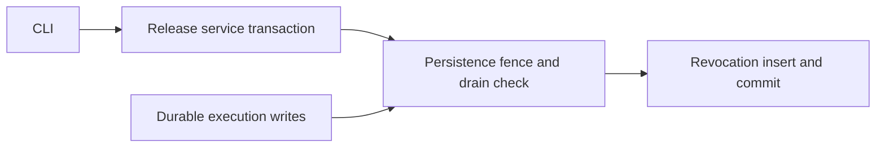
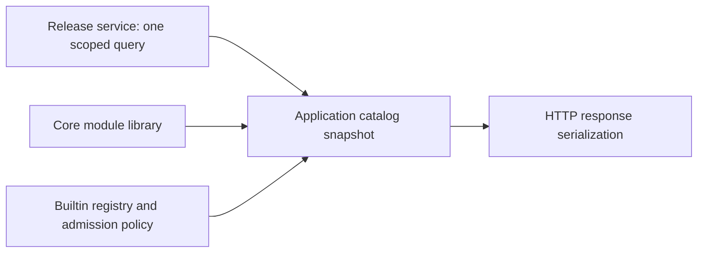

# Backend cleanup implementation checklist

This is the working checklist for the active goal: implement all remaining findings from this thread's backend structure audit. The full original review is preserved in [original-audit.md](original-audit.md). Do not mark a whole finding complete when only its file movement or easiest subtask is done.

Worktree: `/Users/user/Work/grafY-worktrees/backend-safe-cleanup`
Branch: `codex/backend-safe-cleanup`
Original implementation base: `2013e7f`.
Keep unrelated worktrees untouched. Each completed batch needs a commit and verification evidence. Preserve features, public compatibility tools, historical stored data, and supported SDK contracts. Changes to incorrect authorization/concurrency behavior need regression tests.

## Completed checkpoints

- [x] Remove unread CompiledNode execution-target field and compiler bookkeeping. Commit `f4b8eda`.
- [x] Remove four uncalled catalog conversion methods, retaining wire models. Commit `366f599`.
- [x] Group publication tooling and extract independent runtime profiles. Commit `9735cc2`. Adopted owner: `grafy_api/plugins/publication` and `plugins/profiles.py`.
- Evidence for these checkpoints: 516 API/client and selected integration tests passed; OpenAPI and CLI help unchanged; wheel imports passed. Live Docker tests were collected, not run.
- Existing debt is not a passing gate: API-wide Pyright had 520 diagnostics and Ruff had 5 before/after the publication move. Earlier module/OpenAPI tests had eight reproducible baseline failures. Revalidate when affected.

## 1. Workspace authorization

- [x] Replace duplicated collaboration policy with canonical transaction-local authorization while retaining rejection audits.
- [x] Replace SavedGraphService's duplicate capability policy.
- [x] Authorize multi-workspace copies in deterministic lock order.
- [x] Prove target-bound PAT cannot copy from another workspace even when its user belongs to both; verify rejection audit and no target graph.
- [x] Verify browser cross-workspace copies, disabled users, revoked membership, and role checks still behave correctly.
- Completed in the authorization consolidation batch below.

## 2. Checkpointed graph creation

- [x] Share graph/revision/head/initial-checkpoint staging across collaboration bootstrap, template instantiation, and module import within caller transactions.
- [x] Prove immediate checkpoint after template/module creation creates no redundant revision.
- [x] Migrate ordinary fixtures off redundant SavedGraphService create/replace/delete paths.
- [x] Remove redundant create/replace/delete mutators after fixture and behavioral-test migration.
- [x] Remove the runtime head-initialization workaround; preserve historical-state migration coverage.

## 3. Publication consistency

- [x] Carry reviewed base revision/generation into the committing release operation and enforce it transactionally.
- [x] Preserve source re-verification and test concurrent publication after review.
- [x] Move System revocation's SQL consistency rule from API workflow to the release transaction and persistence adapter.
- [x] Fence durable queue admission against the System revocation drain check and commit.
- [ ] Include transient executions in System revocation fencing; runs without saved-graph context currently have no durable execution row.
- [ ] Prove active execution/revocation races cannot violate that fence.

## 4. Plugin ownership and compatibility

- [x] Publication package and independent profiles, commit `9735cc2`.
- [x] Group runtime admission, Docker invocation, and artifact staging under application Plugin hosting.
- [ ] Move SQL System cutover/baseline operations to persistence; keep command parsing/files/reporting in operator tooling.
- [ ] Give the egress broker a dedicated executable application owner.
- [ ] Relocate old host loader/builder/bindings as explicit compatibility tooling; retain CLI commands and historical policies.
- [ ] Remove unused active-runtime host binding/admission state, consistent with ADR 0007.

## 5. Execution ownership

- [x] Move compilation, scheduling, cancellation, caching, and node execution out of v1/routes.
- [x] Split execution history, materialization, and HTTP presentation by owner.
- [x] Move execution request/plan contracts while preserving queued recovery serialization.
- [x] Move the portable persistent invocation-cache adapter beside core cache semantics.
- [x] Verify recovery, MAP ordering, cancellation, history, imports, and HTTP contracts.

## 6. Execution preparation duplication

- [x] Resolve immutable exact-release facts once across preflight and compilation, removing duplicate lookup/cache/traversal.
- [x] Preserve missing-secret-context failure before saved-graph/module lookup.
- [x] Share saved-graph and nested-module request derivation.
- [x] Retain preflight validation of submitted topology against saved revisions.

## 7. Catalog ownership

- [x] Move catalog policy assembly from NodeRegistryResponse into a validated application snapshot.
- [x] Gather release/selection/revocation state in one concrete transaction-scoped query.
- [x] Use ModuleLibraryService directly; retire GraphModuleCatalog and its fallback validation.
- [x] Remove unused UnavailableGraphModule and boundary detector while retaining public empty response fields.
- [x] Verify collision diagnostics, readiness, query counts, module behavior, and OpenAPI compatibility.

## 8. Graph document contracts

- [ ] Reuse SavedGraphDocument internally through one compatibility transport adapter.
- [ ] Remove repeated graph validators and conversion logic without losing aliases.
- [ ] Migrate clients toward collaboration metadata plus canonical document.
- [ ] Make the versioned compatibility decision explicit before retiring flattened public fields and mirrored schemas.
- [ ] Verify graph round trips, old/new transport compatibility, generated clients, and OpenAPI.

## 9. Artifact availability

- [x] Extract exact artifact resolution/storage availability from HTTP ArtifactService into a concrete application owner.
- [ ] Batch resolution and reuse format-specific object enumeration.
- [ ] Remove repeated reads during materialization checks.
- [x] Preserve the distinction between availability and stronger cache content-integrity checks.

## 10. Spatial contracts and reads

- [ ] Share dependency-light persisted spatial contracts in core while preserving stored schema and HTTP defaults.
- [ ] Share feature-collection reconstruction and logical-byte integrity checks.
- [ ] Keep GDAL, network requests, tile serving, and HTTP render responses with deployment owners.
- [ ] Verify existing stored fixtures, API schemas, and GIS round trips.

## 11. Persistence cleanup

- [ ] Consolidate four Pydantic JSON and eleven string-enum decorators with typed implementations and named column types.
- [ ] Preserve SQL metadata and malformed-value behavior; retain specialized datetime/output/enum-collection semantics.
- [ ] Split repository/table ownership into identity, graphs, execution, plugins, and library, with one metadata bootstrap.
- [ ] Reuse bulk node hydration for queued/interrupted execution history, preserving ordering.
- [ ] Verify SQLite and PostgreSQL behavior and migration metadata.

## 12. Artifact contracts and in-memory persistence

- [ ] Move artifact repository contracts to ports/artifacts and concrete in-memory implementations to a production core runtime owner.
- [ ] Share lifecycle-only transaction protocol across feature protocols while keeping repository requirements explicit.
- [ ] Declare materialized-output dependency in saved-graph transaction contract and remove reflective fallback.
- [ ] Preserve task isolation, cloning, rollback, guest execution, and supported SDK imports.

## 13. Cross-feature host infrastructure

- [ ] Move GraphRoomHub and post-commit publisher to application realtime ownership.
- [ ] Move operation audit metadata out of workspace views into HTTP diagnostics near registration.
- [ ] Delegate malformed OIDC transaction cleanup to authentication.
- [ ] Give workspace transport models their own owner and return complete application results without route-side transaction reopening.
- [ ] Move cohesive NodeSecretService outside routes.
- [ ] Rename ImageUploadService to StagedUploadService; share staging/domain results and preserve batch rollback.

## 14. Composition and remaining reductions

- [ ] Retain the runtime bundle in AppResources instead of duplicating its fields; preserve lifecycle/shutdown order.
- [x] Remove unused compiled execution target, commit `f4b8eda`.
- [ ] Remove test-only wait_for_events wrapper; test production subscription behavior.
- [ ] Inline sole-production-caller storage selection, preserving supported package compatibility.
- [ ] Share stored-model integrity readers used by collections and tables.
- [ ] Consolidate PluginRegistry state into immutable family declarations plus needed indexes; preserve ordering, freeze behavior, collisions.
- [ ] Replace InstalledPluginRelease forwarding properties with explicit release/installation access while preserving pair invariants.

## Architecture contract and completion gates

- [ ] Replace tests enforcing route-folder service placement with dependency rules for application/runtime, HTTP transport, and ADR 0007 hosting.
- [ ] Update stale backend architecture reference as actual ownership changes land.
- [ ] Preserve real distinctions: release/installation/selection, Module/Template, coordinator/node/scalar runtime, raw/validated cache, Local/S3, and host/guest validation.
- [ ] For every audit item, inspect final source and relevant behavioral evidence before checking completion.
- [ ] Complete broad regression and packaging checks with every remaining limitation recorded. No whole-goal completion while any required item is unresolved.

## Batch log

Append completed batches here with changed owners, commit, exact test scope, outcome, and remaining gaps. Baseline failures must not be represented as passing checks.

### Workspace authorization consolidation, f44925c

- Replaced the collaboration policy copy and removed SavedGraphService's private policy implementation. Both call canonical transaction-local authorization.
- Graph copies authorize Workspace requirements in sorted ID order while retaining collaboration rejection audits.
- Reproduced the cross-Workspace PAT defect through HTTP before the fix: the forbidden copy returned 201. The regression now proves 404, one source-Workspace rejection audit, and no new target graph; browser cross-Workspace copy still works.
- Added both-direction lock-order checks and revoked-membership/disabled-user mutation checks.
- Validation: 109 application and graph/auth/collaboration integration tests passed; 516 API/client/catalog/execution-route tests passed. Ruff passed for all four changed Python files. Pyright passed for both changed application modules and the HTTP regression module.
- These checks do not cover the separate credential capability-ceiling and live-session revocation concerns from other reviews. They prove this audit's duplicated-policy and Workspace-binding finding.
- Next: checkpointed graph staging for template instantiation and module import, followed by retirement of redundant graph mutation paths.

### Shared checkpointed graph creation, 4f15f4f

- Added application-owned `graph_creation.stage_checkpointed_graph`, used by collaboration bootstrap, exact-head copy, template instantiation, and module import. It stages graph, revision, head, and initial mapping through repositories supplied by the caller; it never commits.
- Preserved initial collaboration sequence 1 for bootstrap/copy and 0 for template/import. Authorization, receipts, folder assignment, module publication, sanitization, and commits remain with each workflow.
- Both HTTP regressions failed on the original source because an immediate checkpoint produced revision 2. They now verify revision 1 after checkpointing new template/module graphs.
- Added a rollback regression proving a failed initial mapping leaves no graph, revision, head, receipt, mapping, or success audit.
- Validation: 633 tests passed across application, API, client, templates, saved graphs, collaboration, workspace authorization, catalog, execution routes, and the module-import checkpoint regression. Focused Ruff passed; Pyright passed for all four changed application modules.
- Remaining finding 2 work: migrate ordinary fixtures away from redundant SavedGraphService mutators and retire those mutators plus the historical head-initialization workaround. This batch does not claim that retirement is complete.

### Remaining graph lifecycle migration inventory, after 4f15f4f

A bounded caller review found no production callers of `SavedGraphService.create`,
`replace`, `delete`, or `CollaborationService.initialize_head_for_existing_graph`.
Keep `SavedGraphService.apply_replacement_in_unit_of_work`: collaboration uses it
for checkpoint/replacement, secret reconciliation, and materialization carry-forward.
Also retain `verify_every_graph_has_head`, which checks startup integrity.

Next migration scope:

1. Move legacy mutator behavior coverage in `tests/unit/application/test_saved_graphs.py`
   to collaboration operations, retaining read-side and revision tests.
2. Migrate ordinary setup in node-secret integration tests, execution-history tests,
   and materialized-output tests to checkpointed graph staging in their test transaction.
3. Replace saved-graph integration calls to the head initializer with canonical head
   reads. Those graphs were already created through HTTP.
4. Replace runtime initializer tests with explicit historical-state migration/backfill
   coverage and fail-closed startup verification. Do not preserve the production
   workaround just to construct test state.
5. Remove the obsolete methods after rechecking all references and preserving the
   existing revision-conflict, secret, history, and materialization behavioral coverage.

### Retired runtime head initialization

- Removed `CollaborationService.initialize_head_for_existing_graph` after confirming no production callers and migrating every test reference.
- Saved-graph HTTP tests now read the heads created by canonical HTTP operations. The node-secret route fixture stages a checkpointed graph directly in its test transaction.
- Replaced runtime repair tests with canonical-head read stability and startup verification tests. Missing heads remain a fail-closed condition; no automatic repair is introduced.
- Preserved and ran `test_collaboration_head_migration_backfills_exactly_one_sequence_zero_head`, which verifies exact historical revisions, one head per graph, and no orphan rows.
- Fixed an existing node-secret route fixture collision: its test family was registered both as builtin code and as a synthetic published Plugin. The route fixture now uses only its intended builtin registration. All secret metadata, redaction, configuration, revision, and deletion assertions remain and execute successfully.
- Validation: 49 focused collaboration, saved-graph HTTP, node-secret HTTP, and historical migration tests passed. Ruff passed for all four changed Python files; collaboration Pyright passed. No code references to the retired method remain.
- Remaining finding 2 work: retire the legacy SavedGraphService create/replace/delete paths and migrate their ordinary fixtures and behavioral tests.

### Retired redundant graph mutators

- Removed `SavedGraphService.create`, `replace`, and `delete`. Production already uses `CollaborationService` for these mutations. The deleted wrappers had no production callers.
- Retained `apply_replacement_in_unit_of_work`, including secret reconciliation and compatible materialization carry-forward. Collaboration owns authorization, head coordination, audits, and the surrounding commit.
- Migrated node-secret fixtures to `stage_checkpointed_graph` and their document changes to `CollaborationService.replace_complete_document`. Each replacement checks that the head and saved revision agree.
- Migrated interrupted-execution setup into one transaction that stages a complete graph checkpoint and the running execution. The fixture keeps collaboration sequence 1.
- Moved creation, replacement, deletion, and conflict behavior assertions to canonical collaboration operations. Commit-failure tests verify restoration of the graph, revision, head, mappings, receipts, and audits. Read-side and transaction-level secret reconciliation coverage remain with `SavedGraphService`.
- Fixture guidance: stage ordinary persisted graphs through `stage_checkpointed_graph`. Direct orphan graph rows belong only in explicit historical migration or startup-integrity tests. Test graph edits through collaboration so checkpoint consistency is exercised.
- Focused validation: 75 tests passed. Application-wide Pyright reported zero errors. Changed-file Ruff and formatting checks passed.
- Broader validation: 788 passed, two existing catalog failures. The run covered application/API/client units; templates, saved graphs, collaboration, workspace authorization, catalog, execution routes/history, node secrets, artifacts, module-import checkpointing, and historical head migration.
- Baseline verification: both `test_registry_declares_scalar_arithmetic_nodes_and_test_compound_projections` and `test_registry_derives_nested_json_scalar_projections` fail with catalog HTTP 500 on an untouched `a15beca` archive too. The baseline subprocess verified it imported core and API packages from that archive. These remain catalog follow-up work, not passing checks.
- Local evidence: `/tmp/grafy-mutators-regression.log`, `/tmp/grafy-mutators-baseline.log`, and `/tmp/grafy-mutators-pyright.log`.
- Finding 2 is complete. No database migration, public HTTP contract change, or automatic repair was introduced. Remaining audit findings stay open.

### Transactional publication review checks

- `PluginPublicationWorkflow` passes the reviewed base revision into `PluginReleaseService.publish`. Removed its earlier release-list check, which ran before image construction and could become stale.
- The core service authorizes the publisher through the canonical Workspace policy before reading release state. That policy holds the existing Workspace lock through commit. This also covers first publication, when no selection row exists to lock.
- The service compares the reviewed revision with the selected revision inside that transaction, before saving source or inserting releases and installations. It reuses the selection for the existing generation-checked update.
- `PluginReleaseHeadConflictError` records the Workspace, family, expected revision, and actual revision. The workflow preserves its existing `PluginPublicationConflictError` boundary and retains the original cause.
- Source re-verification and source-digest review checks remain. Unreviewed CLI publication and idempotent release reuse retain their behavior.

- Regression evidence: two tests reproduced the original failure by publishing a competing release during a paused image build. They now reject stale first publication and stale publication over an existing release.
- Two further SQLite integration tests pause source storage inside the first publication transaction and wait for the second transaction's lock attempt. Exactly one reviewed publication commits; the other reports the new revision without writing a source archive. These cover absent and existing selections.
- Validation: 656 tests passed across application/API/client tests, release domain and persistence tests, catalog, authorization, saved graphs, and collaboration. Changed-file Ruff passed. Core application/domain and publication-workflow Pyright checks reported zero errors.
- Local evidence: `/tmp/grafy-publication-race-before.log`, `/tmp/grafy-publication-transaction-race.log`, `/tmp/grafy-publication-regression.log`, and `/tmp/grafy-publication-pyright.log`.
- Remaining finding 3 work: move System revocation's drain check into its committing owner and share a fence with execution admission. The publication Workspace lock does not provide that global System fence.

### Durable System revocation fence

- Removed `SystemPluginRevocationWorkflow` and its API-owned SQL. The CLI calls `PluginReleaseService.revoke_system` directly and renders domain revocation errors at the CLI boundary.
- The release service now enforces the durable execution drain invariant for every System revocation caller. Previously, direct service calls bypassed the workflow's check.
- `SqlPluginReleaseRepository.lock_system_revocation` acquires the database fence before reading active executions. SQLite uses `BEGIN IMMEDIATE`. PostgreSQL locks revocations, then executions, in the same relative order as System cutover. Execution inserts and status updates acquire conflicting write locks through the database.
- The fence remains held through the revocation insert and commit, including when the active set is empty. Unsupported database dialects fail closed.
- `ActiveGraphExecution` carries only the execution identity and active status. The domain drain error retains the target release and active execution details without loading submitted requests.
- Three regressions reproduced direct-service revocation while queued, running, or cancelling executions existed. All now reject. Additional SQLite tests cover a queued insert winning the race and a revocation transaction blocking a new insert until commit. CLI error rendering and unsupported-dialect rejection are covered.
- Focused validation: 33 tests passed. Changed-file Ruff passed. Core application/domain/port, publication workflow, and persistence adapter type checks reported zero errors.
- Broad validation: 693 passed, five native subprocess failures, and two skips. The untouched `de84244` archive produced the same five failures and two skips, with 687 tests passing. All three core/API/persistence import paths were verified to point into the archive.
- The five failures are the live Docker egress test and four local guest-protocol cases. Their subprocesses crash with SIGSEGV in macOS Network.framework fork handling on both revisions. They are recorded failures, not passing validation.
- Evidence: `/tmp/grafy-revocation-before.log`, `/tmp/grafy-revocation-focused.log`, `/tmp/grafy-revocation-regression.log`, `/tmp/grafy-revocation-baseline.log`, and `/tmp/grafy-revocation-persistence-pyright.log`.

This completes only the durable queue portion of finding 3. `RunExecutionManager.start`
records history only when both graph identity and revision are present. Transient runs
remain process-local, so the database drain query cannot see them. The compiler checks
revocation while resolving release facts, but that check alone does not protect an
already compiled transient run. Keep the remaining execution/revocation race item open
until those runs participate in a durable admission and completion protocol.

Maintenance guidance: take the shared fence before querying active work and retain it
through the maintenance commit. Locking only rows returned by an empty-queue query does
not prevent a concurrent execution from appearing.

### Execution and Plugin runtime ownership

- Moved the execution engine from `v1/routes/executions/runtime` to `grafy_api/execution`, preserving compilation, scheduling, MAP behavior, cancellation, and error propagation.
- Split execution history and materialization into `execution/history.py` and `execution/materializations.py`. `RunResultPresenter` and HTTP response models remain beside the routes.
- Moved durable request definitions to `execution/requests.py` and event definitions to `execution/events.py`. The HTTP models module re-exports the same classes for existing Python clients. Their serialized shapes and validation bodies are unchanged.
- Grouped Plugin admission, artifact staging, Docker invocation, sandbox scope, egress coordination, and network policy under `plugins/runtime`. Hosting has no dependency on graph execution.
- Moved `PersistentInvocationCache` to `grafy_core/runtime/persistent_invocation_cache.py`; it depends only on core contracts. Updated application wiring, tests, E2E bootstrap, and operational documentation to use the owning modules directly.
- No forwarding modules remain for the old internal runtime paths. The intentional HTTP request/event re-exports retain public import compatibility.
- Verified all 189 captured class/function ASTs against the pre-move source: none changed or disappeared. OpenAPI is exactly unchanged.
- Validation: 611 API/client/architecture and selected integration tests passed, followed by 397 application/core/persistence/template/module tests. The initial 169 execution-runtime tests also passed and are included in the 611 count.
- Ruff passes across all 77 changed Python files. API/core-cache Pyright reported no new diagnostic messages. Existing diagnostics dropped from 520 to 445 after request annotations gained their missing SavedGraph/SavedGraphRevision imports; this is not a claim that API typing is clean.
- Built API and core wheels and verified imports and OpenAPI from their extracted contents. The first wheel inspection caught stale deleted modules retained in setuptools build output. Clean builds exclude all retired paths. Execution package documentation now requires checking wheel contents after moves.
- Evidence: `/tmp/grafy-execution-ownership/` contains before/after OpenAPI and typing reports, the AST comparison, test logs, wheels, and packaged import checks.
- Finding 5 is complete. Artifact access, catalog lookup, collaboration hub ownership, shared transport contracts, and transient-run revocation coordination remain tracked under their original findings.

### Shared execution preparation

- Preflight and compilation share request-local exact-release contracts through `execution/releases.py`. The Workspace, scope, slug, and revision form the cache key. Operator contracts are indexed once per resolved release.
- Selection and revocation remain fresh compilation reads. No admission decision is cached across runs. Standalone compiler callers retain direct resolution.
- Removed duplicate release lookup/error handling and operator catalog traversal from preflight and compilation. Missing-secret-context checks still precede saved-graph/module access; submitted topology validation remains intact.
- `RunNodeRequest.from_saved_node` and `RunEdgeRequest.from_saved_edge` now own conversions reused by saved-graph and nested-module preparation. Workflow-specific filtering stays with each caller. Enabled edges, optional module inputs, connected plugs, pins, artifact bindings, projections, conversion paths, and collection modes retain their existing behavior.
- The full host-to-plugin RunGraph test first reproduced two release reads; it now asserts one read and retains its actual input/output assertions. Additional tests cover revocation after preflight, Workspace isolation, and fresh preparation on repeated runs.
- Split the existing optional-module-input test into independent catalog and execution contracts, retaining every assertion. The execution contract covers absent and supplied optional inputs plus disabled edges without requiring catalog discovery first.
- Validation: 222 focused runtime, saved-graph, execution HTTP/history/cache, and optional-module tests passed. The broader module run passed nine other module cases, including nested MAP event paths, nested secrets, and cycle errors.
- Seven catalog-dependent module cases fail with the same catalog discovery HTTP 500 on the untouched `451c06a` archive (9 passed, 7 failed) and the edited tree. These failures remain recorded; this batch does not fix catalog ownership.
- Changed-file Ruff and `git diff --check` pass. OpenAPI exactly matches the previous batch. API/core-cache Pyright has no new diagnostic messages (442 existing errors, down from 445); API typing is not globally clean.
- Evidence: `/tmp/grafy-release-preparation-before.log`, `/tmp/grafy-release-preparation-final.log`, `/tmp/grafy-release-preparation-regression.log`, `/tmp/grafy-release-preparation-baseline.log`, and `/tmp/grafy-preparation-pyright.json`.
- Finding 6 is complete. The transient execution/revocation fence remains open under finding 3. The execution package README records the rule that shared contract preparation must not cache mutable selection or revocation state.

### Direct module-library ownership

- Removed the 162-line `GraphModuleCatalog` adapter, its duplicate fallback validation, `UnavailableGraphModule`, the unused boundary detector, and intermediate listing/entry dataclasses.
- Catalog responses consume the existing `ModuleLibraryService.catalog_definitions` result directly. Module metadata, current-release visibility, duplicate-operator checks, and the public empty `unavailable_modules` field remain intact.
- Compilation resolves module definitions through `ModuleLibraryService.resolve_definition`. The execution boundary retains contextual missing/invalid-module errors. Lightweight component graphs now explicitly supply a module library when they execute modules; production already supplies it.
- Module list/detail/deprecation routes use the injected module library for both metadata and definition resolution. Removed the duplicate resolver from application state and composition.
- Folded optional-input validation into `ModuleLibraryService`, removing the former dual-caller helper, the obsolete revision-reader protocol, and the return-None/raise compatibility adapter. Repository reads and nested-target validation now share the service transaction.
- Updated the architecture assertion that required every catalog slice to contain a services file. Route layout checks remain; a deleted adapter no longer needs an empty replacement.
- Module-focused validation passed 42 tests, including nested execution, optional inputs, secrets, cycles, and core contracts. Seven catalog-discovery failures remain identical to the recorded baseline; finding 7 stays open for catalog assembly and release-state query ownership.
- OpenAPI is unchanged. A fresh API wheel omits the retired catalog services module; imports and OpenAPI also pass from the extracted wheel.
- API/core-cache typing remains at 442 pre-existing diagnostics. The changed catalog call reports the same unknown workspace argument under `catalog_definitions` instead of the former `list` method; no new type issue was introduced by that call rename.
- Evidence: `/tmp/grafy-module-owner-tests.log`, `/tmp/grafy-module-owner-validation.log`, `/tmp/grafy-module-owner-final.log`, `/tmp/grafy-module-owner-pyright.json`, `/tmp/grafy-module-owner-core-types.log`, and `/tmp/grafy-module-owner-wheel.log`.
- Final regression: 594 API/domain/architecture/execution-history/saved-graph/secret tests passed. Changed-file Ruff and diff whitespace checks pass. The core module service has zero Pyright errors or warnings.

### Bulk catalog release state

- Added `PluginReleaseService.list_catalog`, backed by one SQL statement joining selected releases, namespace-specific installations, selections, and optional installation revocations.
- The query returns System entries followed by Workspace entries, each ordered by slug. It includes withdrawn/deprecated selections for readiness handling and excludes unselected releases and other Workspaces.
- `PluginCatalogRelease` validates that selection and revocation identities match the exact installed release. The result contains release facts, not HTTP response models or presentation policy.
- The catalog route now consumes this transaction-scoped result instead of opening two release-list transactions plus per-release selection and revocation transactions. Module lookup and HTTP response serialization retain their existing behavior.
- Real SQLite service tests verify exactly one SQL statement for zero, one, and five families. They cover historical System selection alongside a newer Workspace selection, unselected installed revisions, withdrawn selections, and revocations of a foreign installation sharing the local release identity.
- Added explicit rejection tests for a mismatched selection and a foreign-installation revocation. Updated the existing test deployment to implement the actual service read contract.
- OpenAPI is unchanged; changed-file Ruff and diff whitespace checks pass. Evidence: `/tmp/grafy-catalog-snapshot-query.log`, `/tmp/grafy-catalog-snapshot-regression.log`, and `/tmp/grafy-catalog-snapshot-types.log`. The query-only log records the initial missing-import failure; the regression log includes the corrected database tests.
- Catalog policy extraction and its remaining collision/readiness verification remain open under finding 7.
- Final validation: 535 persistence, release-service, API, architecture, and execution-route tests passed. Changed core domain/application/port and persistence modules have zero Pyright errors or warnings.

### Application-owned catalog policy

- Added `grafy_api.catalog.CatalogSnapshot` as the owner of namespace, family, operator, module, artifact, and canonical-conversion collision checks and node/family readiness. The snapshot has tuple collections and read-only readiness indexes.
- `NodeRegistryResponse.from_snapshot` now serializes an already-validated result. It no longer decides catalog policy or reads execution admission state. Readiness types and functions live with the application owner.
- Module identity validation uses its domain operator key instead of constructing an executable module node. HTTP schema generation still constructs the module's transport schemas when serializing it.
- The snapshot carries declarative conversion contracts instead of callable conversion implementations. Removed the redundant artifact-owner list and repeated search for each owned artifact contract.
- Existing catalog tests now construct the snapshot before serializing. Added direct checks for duplicate selected families in each scope and duplicate module identities without an executor.
- Resolved the previously recorded seven module and two artifact catalog failures by correcting their test fixtures. Those fixtures registered extensions as builtins and simultaneously supplied published releases with the same slugs. They now use the explicit builtin registry already used by their execution requests; production collision rejection remains unchanged. The registry helper documents this configuration rule.
- The focused run passed 112 module, artifact, readiness, and admission-parity tests, including all nine formerly failing catalog cases. OpenAPI exactly matches the pre-cleanup schema. The application catalog owner has zero Pyright errors or warnings.
- Evidence: `/tmp/grafy-catalog-policy-focused.log`, `/tmp/grafy-catalog-policy-regression.log`, `/tmp/grafy-catalog-policy-full.log`, and `/tmp/grafy-catalog-policy-types.log`.

- Final validation: 661 API, architecture, module, artifact, and execution-route tests passed. Changed-file Ruff and diff whitespace checks pass. The built API wheel contains the new catalog owner, omits the retired adapter, and produces identical OpenAPI. Finding 7 is complete.

### Runtime artifact availability ownership

- Added concrete `grafy_api.artifact_availability.ArtifactAvailability` for exact reference resolution and storage-presence checks. Removed `ArtifactService.validate_refs` and `ArtifactService.is_accessible` from the HTTP reader.
- Execution materialization now depends on the application owner. Composition shares that owner with HTTP materialization presentation; table/download/render handling remains in the HTTP artifact reader.
- Reference sequences use one `get_many` operation instead of opening one transaction per item. Validation preserves missing/mismatched-reference messages, item indices, ordering, repeated references, and Workspace filtering.
- Pinned-output resolution reuses the resolved artifact rows for storage checks, removing the second repository read for every item.
- Table and JSON-collection availability continue to use their existing format-specific functions. Ordinary inline objects remain available; stored objects require a present bucket/key and a successful stat. No hashing or full content read was added to availability.
- New tests verify one transaction for a ten-artifact sequence with a repeated item, sequence error context, foreign Workspace exclusion, exact hash-reference mismatch, and storage deletion. A deliberate stored-content/hash mismatch remains available, demonstrating that availability does not claim cache-integrity verification.
- Focused validation: 303 runtime and artifact tests passed. The availability and materialization owners have zero Pyright errors or warnings. Changed-file Ruff passes.
- Evidence: `/tmp/grafy-availability-tests.log`, `/tmp/grafy-availability-regression.log`, `/tmp/grafy-availability-final.log`, and `/tmp/grafy-availability-types.log`.
- Finding 9 remains open: migrate the spatial exact-reference adapter to the shared owner, consolidate format-specific object enumeration where needed, and examine sharing across separate outputs and materialization phases. This batch removes duplicate reads within each pinned output; it does not claim one read for the entire execution preparation pipeline.
- Final validation: 549 API, architecture, execution-route/history, and materialization tests passed. OpenAPI is unchanged; the built wheel includes the new application owner.

### Shared spatial reference resolution

- Spatial rendering now delegates exact row lookup and reference matching to `ArtifactAvailability.resolve_refs`. The HTTP adapter retains its expected spatial type/version checks and translates failures to its existing public error messages.
- Added `ArtifactReferenceError` with the rejected reference, a missing/mismatch reason, and optional sequence index. Runtime sequence messages are unchanged; spatial callers can translate the error without parsing text or repeating repository lookup.
- The resolver accepts ordinary reference lists as well as runtime scalar/sequence values. It preserves ordering and repeated references and uses the same Workspace-scoped batch query.
- Application composition injects the same concrete availability owner into the HTTP artifact reader, execution materialization, and result presentation. Test construction uses the explicit owner as well.
- Extended reference regressions to verify structured error context and ordered list resolution. The focused run passed 198 availability, streaming, runtime, GIS, and table tests, including stale map references, ordered map layers, raster tiles, and WMS address pinning.
- Evidence: `/tmp/grafy-spatial-refs-tests.log`, `/tmp/grafy-spatial-refs-regression.log`, and `/tmp/grafy-spatial-refs-types.log`.
- Finding 9 still tracks sharing across separate outputs/materialization phases and format-specific object enumeration. The exact-reference ownership item is now complete.
- Final validation: 659 API, architecture, artifact, and execution-route/history tests passed. Availability and materialization type checks report zero errors or warnings. OpenAPI is unchanged; changed-file Ruff and whitespace checks pass.
