# Backend cleanup implementation checklist

This is the working checklist for the active goal: implement all remaining findings from this thread's backend structure audit. The full original review is preserved in [original-audit.md](original-audit.md). Do not mark a whole finding complete when only its file movement or easiest subtask is done.

Worktree: `/Users/user/Work/grafY-worktrees/backend-safe-cleanup`
Branch: `codex/backend-safe-cleanup`
Original implementation base: `2013e7f`.
Keep unrelated worktrees untouched. Each completed batch needs a commit and verification evidence. Preserve features, public compatibility tools, historical stored data, and supported SDK contracts. Changes to incorrect authorization/concurrency behavior need regression tests.

## Completed checkpoints

- [x] Remove unread CompiledNode execution-target field and compiler bookkeeping. Commit `f4b8eda`.
- [x] Remove four uncalled catalog conversion methods, retaining wire models. Commit `366f599`.
- [x] Group publication tooling and extract independent runtime profiles. Commit `9735cc2`. Adopted owner: `grafy_api/plugins/publication` and `plugins/profiles.py`.
- Evidence for these checkpoints: 516 API/client and selected integration tests passed; OpenAPI and CLI help unchanged; wheel imports passed. Live Docker tests were collected, not run.
- Existing debt is not a passing gate: API-wide Pyright had 520 diagnostics and Ruff had 5 before/after the publication move. Earlier module/OpenAPI tests had eight reproducible baseline failures. Revalidate when affected.

## 1. Workspace authorization

- [x] Replace duplicated collaboration policy with canonical transaction-local authorization while retaining rejection audits.
- [x] Replace SavedGraphService's duplicate capability policy.
- [x] Authorize multi-workspace copies in deterministic lock order.
- [x] Prove target-bound PAT cannot copy from another workspace even when its user belongs to both; verify rejection audit and no target graph.
- [x] Verify browser cross-workspace copies, disabled users, revoked membership, and role checks still behave correctly.
- Completed in the authorization consolidation batch below.

## 2. Checkpointed graph creation

- [x] Share graph/revision/head/initial-checkpoint staging across collaboration bootstrap, template instantiation, and module import within caller transactions.
- [x] Prove immediate checkpoint after template/module creation creates no redundant revision.
- [x] Migrate ordinary fixtures off redundant SavedGraphService create/replace/delete paths.
- [x] Remove redundant create/replace/delete mutators after fixture and behavioral-test migration.
- [x] Remove the runtime head-initialization workaround; preserve historical-state migration coverage.

## 3. Publication consistency

- [x] Carry reviewed base revision/generation into the committing release operation and enforce it transactionally.
- [x] Preserve source re-verification and test concurrent publication after review.
- [x] Move System revocation's SQL consistency rule from API workflow to the release transaction and persistence adapter.
- [x] Fence durable queue admission against the System revocation drain check and commit.
- [ ] Include transient executions in System revocation fencing; runs without saved-graph context currently have no durable execution row.
- [ ] Prove active execution/revocation races cannot violate that fence.

## 4. Plugin ownership and compatibility

- [x] Publication package and independent profiles, commit `9735cc2`.
- [x] Group runtime admission, Docker invocation, and artifact staging under application Plugin hosting.
- [ ] Move SQL System cutover/baseline operations to persistence; keep command parsing/files/reporting in operator tooling.
- [ ] Give the egress broker a dedicated executable application owner.
- [ ] Relocate old host loader/builder/bindings as explicit compatibility tooling; retain CLI commands and historical policies.
- [ ] Remove unused active-runtime host binding/admission state, consistent with ADR 0007.

## 5. Execution ownership

- [x] Move compilation, scheduling, cancellation, caching, and node execution out of v1/routes.
- [x] Split execution history, materialization, and HTTP presentation by owner.
- [x] Move execution request/plan contracts while preserving queued recovery serialization.
- [x] Move the portable persistent invocation-cache adapter beside core cache semantics.
- [x] Verify recovery, MAP ordering, cancellation, history, imports, and HTTP contracts.

## 6. Execution preparation duplication

- [x] Resolve immutable exact-release facts once across preflight and compilation, removing duplicate lookup/cache/traversal.
- [x] Preserve missing-secret-context failure before saved-graph/module lookup.
- [x] Share saved-graph and nested-module request derivation.
- [x] Retain preflight validation of submitted topology against saved revisions.

## 7. Catalog ownership

- [x] Move catalog policy assembly from NodeRegistryResponse into a validated application snapshot.
- [x] Gather release/selection/revocation state in one concrete transaction-scoped query.
- [x] Use ModuleLibraryService directly; retire GraphModuleCatalog and its fallback validation.
- [x] Remove unused UnavailableGraphModule and boundary detector while retaining public empty response fields.
- [x] Verify collision diagnostics, readiness, query counts, module behavior, and OpenAPI compatibility.

## 8. Graph document contracts

- [ ] Reuse SavedGraphDocument internally through one compatibility transport adapter.
- [ ] Remove repeated graph validators and conversion logic without losing aliases.
- [ ] Migrate clients toward collaboration metadata plus canonical document.
- [ ] Make the versioned compatibility decision explicit before retiring flattened public fields and mirrored schemas.
- [ ] Verify graph round trips, old/new transport compatibility, generated clients, and OpenAPI.

## 9. Artifact availability

- [x] Extract exact artifact resolution/storage availability from HTTP ArtifactService into a concrete application owner.
- [x] Batch resolution and reuse format-specific object enumeration.
- [x] Remove repeated reads during materialization checks.
- [x] Preserve the distinction between availability and stronger cache content-integrity checks.

## 10. Spatial contracts and reads

- [ ] Share dependency-light persisted spatial contracts in core while preserving stored schema and HTTP defaults.
- [ ] Share feature-collection reconstruction and logical-byte integrity checks.
- [ ] Keep GDAL, network requests, tile serving, and HTTP render responses with deployment owners.
- [ ] Verify existing stored fixtures, API schemas, and GIS round trips.

## 11. Persistence cleanup

- [x] Consolidate four Pydantic JSON and eleven string-enum decorators with typed implementations and named column types.
- [x] Preserve SQL metadata and malformed-value behavior; retain specialized datetime/output/enum-collection semantics.
- [x] Split repository ownership into identity, graphs, artifacts, execution, plugins, and library.
- [x] Split table ownership by the same features, with one metadata bootstrap.
- [x] Reuse bulk node hydration for queued/interrupted execution history, preserving ordering.
- [x] Verify SQLite and PostgreSQL behavior and migration metadata.

## 12. Artifact contracts and in-memory persistence

- [x] Move artifact repository contracts to ports/artifacts and concrete in-memory implementations to a production core runtime owner.
- [x] Share lifecycle-only transaction protocol across feature protocols while keeping repository requirements explicit.
- [x] Declare materialized-output dependency in saved-graph transaction contract and remove reflective fallback.
- [x] Preserve task isolation, cloning, rollback, guest execution, and supported SDK imports.

## 13. Cross-feature host infrastructure

- [x] Move GraphRoomHub and post-commit publisher to application realtime ownership.
- [x] Move operation audit metadata out of workspace views into HTTP diagnostics near registration.
- [x] Delegate malformed OIDC transaction cleanup to authentication.
- [x] Give workspace transport models their own owner and return complete application results without route-side transaction reopening.
- [x] Move cohesive NodeSecretService outside routes.
- [x] Rename ImageUploadService to StagedUploadService; share staging/domain results and preserve batch rollback.

## 14. Composition and remaining reductions

- [ ] Retain the runtime bundle in AppResources instead of duplicating its fields; preserve lifecycle/shutdown order.
- [x] Remove unused compiled execution target, commit `f4b8eda`.
- [ ] Remove test-only wait_for_events wrapper; test production subscription behavior.
- [ ] Inline sole-production-caller storage selection, preserving supported package compatibility.
- [ ] Share stored-model integrity readers used by collections and tables.
- [ ] Consolidate PluginRegistry state into immutable family declarations plus needed indexes; preserve ordering, freeze behavior, collisions.
- [ ] Replace InstalledPluginRelease forwarding properties with explicit release/installation access while preserving pair invariants.

## Architecture contract and completion gates

- [ ] Replace tests enforcing route-folder service placement with dependency rules for application/runtime, HTTP transport, and ADR 0007 hosting.
- [ ] Update stale backend architecture reference as actual ownership changes land.
- [ ] Preserve real distinctions: release/installation/selection, Module/Template, coordinator/node/scalar runtime, raw/validated cache, Local/S3, and host/guest validation.
- [ ] For every audit item, inspect final source and relevant behavioral evidence before checking completion.
- [ ] Complete broad regression and packaging checks with every remaining limitation recorded. No whole-goal completion while any required item is unresolved.

## Batch log

Append completed batches here with changed owners, commit, exact test scope, outcome, and remaining gaps. Baseline failures must not be represented as passing checks.

### Workspace authorization consolidation, f44925c

- Replaced the collaboration policy copy and removed SavedGraphService's private policy implementation. Both call canonical transaction-local authorization.
- Graph copies authorize Workspace requirements in sorted ID order while retaining collaboration rejection audits.
- Reproduced the cross-Workspace PAT defect through HTTP before the fix: the forbidden copy returned 201. The regression now proves 404, one source-Workspace rejection audit, and no new target graph; browser cross-Workspace copy still works.
- Added both-direction lock-order checks and revoked-membership/disabled-user mutation checks.
- Validation: 109 application and graph/auth/collaboration integration tests passed; 516 API/client/catalog/execution-route tests passed. Ruff passed for all four changed Python files. Pyright passed for both changed application modules and the HTTP regression module.
- These checks do not cover the separate credential capability-ceiling and live-session revocation concerns from other reviews. They prove this audit's duplicated-policy and Workspace-binding finding.
- Next: checkpointed graph staging for template instantiation and module import, followed by retirement of redundant graph mutation paths.

### Shared checkpointed graph creation, 4f15f4f

- Added application-owned `graph_creation.stage_checkpointed_graph`, used by collaboration bootstrap, exact-head copy, template instantiation, and module import. It stages graph, revision, head, and initial mapping through repositories supplied by the caller; it never commits.
- Preserved initial collaboration sequence 1 for bootstrap/copy and 0 for template/import. Authorization, receipts, folder assignment, module publication, sanitization, and commits remain with each workflow.
- Both HTTP regressions failed on the original source because an immediate checkpoint produced revision 2. They now verify revision 1 after checkpointing new template/module graphs.
- Added a rollback regression proving a failed initial mapping leaves no graph, revision, head, receipt, mapping, or success audit.
- Validation: 633 tests passed across application, API, client, templates, saved graphs, collaboration, workspace authorization, catalog, execution routes, and the module-import checkpoint regression. Focused Ruff passed; Pyright passed for all four changed application modules.
- Remaining finding 2 work: migrate ordinary fixtures away from redundant SavedGraphService mutators and retire those mutators plus the historical head-initialization workaround. This batch does not claim that retirement is complete.

### Remaining graph lifecycle migration inventory, after 4f15f4f

A bounded caller review found no production callers of `SavedGraphService.create`,
`replace`, `delete`, or `CollaborationService.initialize_head_for_existing_graph`.
Keep `SavedGraphService.apply_replacement_in_unit_of_work`: collaboration uses it
for checkpoint/replacement, secret reconciliation, and materialization carry-forward.
Also retain `verify_every_graph_has_head`, which checks startup integrity.

Next migration scope:

1. Move legacy mutator behavior coverage in `tests/unit/application/test_saved_graphs.py`
   to collaboration operations, retaining read-side and revision tests.
2. Migrate ordinary setup in node-secret integration tests, execution-history tests,
   and materialized-output tests to checkpointed graph staging in their test transaction.
3. Replace saved-graph integration calls to the head initializer with canonical head
   reads. Those graphs were already created through HTTP.
4. Replace runtime initializer tests with explicit historical-state migration/backfill
   coverage and fail-closed startup verification. Do not preserve the production
   workaround just to construct test state.
5. Remove the obsolete methods after rechecking all references and preserving the
   existing revision-conflict, secret, history, and materialization behavioral coverage.

### Retired runtime head initialization

- Removed `CollaborationService.initialize_head_for_existing_graph` after confirming no production callers and migrating every test reference.
- Saved-graph HTTP tests now read the heads created by canonical HTTP operations. The node-secret route fixture stages a checkpointed graph directly in its test transaction.
- Replaced runtime repair tests with canonical-head read stability and startup verification tests. Missing heads remain a fail-closed condition; no automatic repair is introduced.
- Preserved and ran `test_collaboration_head_migration_backfills_exactly_one_sequence_zero_head`, which verifies exact historical revisions, one head per graph, and no orphan rows.
- Fixed an existing node-secret route fixture collision: its test family was registered both as builtin code and as a synthetic published Plugin. The route fixture now uses only its intended builtin registration. All secret metadata, redaction, configuration, revision, and deletion assertions remain and execute successfully.
- Validation: 49 focused collaboration, saved-graph HTTP, node-secret HTTP, and historical migration tests passed. Ruff passed for all four changed Python files; collaboration Pyright passed. No code references to the retired method remain.
- Remaining finding 2 work: retire the legacy SavedGraphService create/replace/delete paths and migrate their ordinary fixtures and behavioral tests.

### Retired redundant graph mutators

- Removed `SavedGraphService.create`, `replace`, and `delete`. Production already uses `CollaborationService` for these mutations. The deleted wrappers had no production callers.
- Retained `apply_replacement_in_unit_of_work`, including secret reconciliation and compatible materialization carry-forward. Collaboration owns authorization, head coordination, audits, and the surrounding commit.
- Migrated node-secret fixtures to `stage_checkpointed_graph` and their document changes to `CollaborationService.replace_complete_document`. Each replacement checks that the head and saved revision agree.
- Migrated interrupted-execution setup into one transaction that stages a complete graph checkpoint and the running execution. The fixture keeps collaboration sequence 1.
- Moved creation, replacement, deletion, and conflict behavior assertions to canonical collaboration operations. Commit-failure tests verify restoration of the graph, revision, head, mappings, receipts, and audits. Read-side and transaction-level secret reconciliation coverage remain with `SavedGraphService`.
- Fixture guidance: stage ordinary persisted graphs through `stage_checkpointed_graph`. Direct orphan graph rows belong only in explicit historical migration or startup-integrity tests. Test graph edits through collaboration so checkpoint consistency is exercised.
- Focused validation: 75 tests passed. Application-wide Pyright reported zero errors. Changed-file Ruff and formatting checks passed.
- Broader validation: 788 passed, two existing catalog failures. The run covered application/API/client units; templates, saved graphs, collaboration, workspace authorization, catalog, execution routes/history, node secrets, artifacts, module-import checkpointing, and historical head migration.
- Baseline verification: both `test_registry_declares_scalar_arithmetic_nodes_and_test_compound_projections` and `test_registry_derives_nested_json_scalar_projections` fail with catalog HTTP 500 on an untouched `a15beca` archive too. The baseline subprocess verified it imported core and API packages from that archive. These remain catalog follow-up work, not passing checks.
- Local evidence: `/tmp/grafy-mutators-regression.log`, `/tmp/grafy-mutators-baseline.log`, and `/tmp/grafy-mutators-pyright.log`.
- Finding 2 is complete. No database migration, public HTTP contract change, or automatic repair was introduced. Remaining audit findings stay open.

### Transactional publication review checks

- `PluginPublicationWorkflow` passes the reviewed base revision into `PluginReleaseService.publish`. Removed its earlier release-list check, which ran before image construction and could become stale.
- The core service authorizes the publisher through the canonical Workspace policy before reading release state. That policy holds the existing Workspace lock through commit. This also covers first publication, when no selection row exists to lock.
- The service compares the reviewed revision with the selected revision inside that transaction, before saving source or inserting releases and installations. It reuses the selection for the existing generation-checked update.
- `PluginReleaseHeadConflictError` records the Workspace, family, expected revision, and actual revision. The workflow preserves its existing `PluginPublicationConflictError` boundary and retains the original cause.
- Source re-verification and source-digest review checks remain. Unreviewed CLI publication and idempotent release reuse retain their behavior.

- Regression evidence: two tests reproduced the original failure by publishing a competing release during a paused image build. They now reject stale first publication and stale publication over an existing release.
- Two further SQLite integration tests pause source storage inside the first publication transaction and wait for the second transaction's lock attempt. Exactly one reviewed publication commits; the other reports the new revision without writing a source archive. These cover absent and existing selections.
- Validation: 656 tests passed across application/API/client tests, release domain and persistence tests, catalog, authorization, saved graphs, and collaboration. Changed-file Ruff passed. Core application/domain and publication-workflow Pyright checks reported zero errors.
- Local evidence: `/tmp/grafy-publication-race-before.log`, `/tmp/grafy-publication-transaction-race.log`, `/tmp/grafy-publication-regression.log`, and `/tmp/grafy-publication-pyright.log`.
- Remaining finding 3 work: move System revocation's drain check into its committing owner and share a fence with execution admission. The publication Workspace lock does not provide that global System fence.

### Durable System revocation fence

- Removed `SystemPluginRevocationWorkflow` and its API-owned SQL. The CLI calls `PluginReleaseService.revoke_system` directly and renders domain revocation errors at the CLI boundary.
- The release service now enforces the durable execution drain invariant for every System revocation caller. Previously, direct service calls bypassed the workflow's check.
- `SqlPluginReleaseRepository.lock_system_revocation` acquires the database fence before reading active executions. SQLite uses `BEGIN IMMEDIATE`. PostgreSQL locks revocations, then executions, in the same relative order as System cutover. Execution inserts and status updates acquire conflicting write locks through the database.
- The fence remains held through the revocation insert and commit, including when the active set is empty. Unsupported database dialects fail closed.
- `ActiveGraphExecution` carries only the execution identity and active status. The domain drain error retains the target release and active execution details without loading submitted requests.
- Three regressions reproduced direct-service revocation while queued, running, or cancelling executions existed. All now reject. Additional SQLite tests cover a queued insert winning the race and a revocation transaction blocking a new insert until commit. CLI error rendering and unsupported-dialect rejection are covered.
- Focused validation: 33 tests passed. Changed-file Ruff passed. Core application/domain/port, publication workflow, and persistence adapter type checks reported zero errors.
- Broad validation: 693 passed, five native subprocess failures, and two skips. The untouched `de84244` archive produced the same five failures and two skips, with 687 tests passing. All three core/API/persistence import paths were verified to point into the archive.
- The five failures are the live Docker egress test and four local guest-protocol cases. Their subprocesses crash with SIGSEGV in macOS Network.framework fork handling on both revisions. They are recorded failures, not passing validation.
- Evidence: `/tmp/grafy-revocation-before.log`, `/tmp/grafy-revocation-focused.log`, `/tmp/grafy-revocation-regression.log`, `/tmp/grafy-revocation-baseline.log`, and `/tmp/grafy-revocation-persistence-pyright.log`.

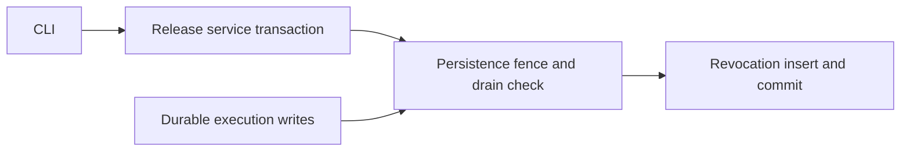

This completes only the durable queue portion of finding 3. `RunExecutionManager.start`
records history only when both graph identity and revision are present. Transient runs
remain process-local, so the database drain query cannot see them. The compiler checks
revocation while resolving release facts, but that check alone does not protect an
already compiled transient run. Keep the remaining execution/revocation race item open
until those runs participate in a durable admission and completion protocol.

Maintenance guidance: take the shared fence before querying active work and retain it
through the maintenance commit. Locking only rows returned by an empty-queue query does
not prevent a concurrent execution from appearing.

### Execution and Plugin runtime ownership

- Moved the execution engine from `v1/routes/executions/runtime` to `grafy_api/execution`, preserving compilation, scheduling, MAP behavior, cancellation, and error propagation.
- Split execution history and materialization into `execution/history.py` and `execution/materializations.py`. `RunResultPresenter` and HTTP response models remain beside the routes.
- Moved durable request definitions to `execution/requests.py` and event definitions to `execution/events.py`. The HTTP models module re-exports the same classes for existing Python clients. Their serialized shapes and validation bodies are unchanged.
- Grouped Plugin admission, artifact staging, Docker invocation, sandbox scope, egress coordination, and network policy under `plugins/runtime`. Hosting has no dependency on graph execution.
- Moved `PersistentInvocationCache` to `grafy_core/runtime/persistent_invocation_cache.py`; it depends only on core contracts. Updated application wiring, tests, E2E bootstrap, and operational documentation to use the owning modules directly.
- No forwarding modules remain for the old internal runtime paths. The intentional HTTP request/event re-exports retain public import compatibility.
- Verified all 189 captured class/function ASTs against the pre-move source: none changed or disappeared. OpenAPI is exactly unchanged.
- Validation: 611 API/client/architecture and selected integration tests passed, followed by 397 application/core/persistence/template/module tests. The initial 169 execution-runtime tests also passed and are included in the 611 count.
- Ruff passes across all 77 changed Python files. API/core-cache Pyright reported no new diagnostic messages. Existing diagnostics dropped from 520 to 445 after request annotations gained their missing SavedGraph/SavedGraphRevision imports; this is not a claim that API typing is clean.
- Built API and core wheels and verified imports and OpenAPI from their extracted contents. The first wheel inspection caught stale deleted modules retained in setuptools build output. Clean builds exclude all retired paths. Execution package documentation now requires checking wheel contents after moves.
- Evidence: `/tmp/grafy-execution-ownership/` contains before/after OpenAPI and typing reports, the AST comparison, test logs, wheels, and packaged import checks.
- Finding 5 is complete. Artifact access, catalog lookup, collaboration hub ownership, shared transport contracts, and transient-run revocation coordination remain tracked under their original findings.

### Shared execution preparation

- Preflight and compilation share request-local exact-release contracts through `execution/releases.py`. The Workspace, scope, slug, and revision form the cache key. Operator contracts are indexed once per resolved release.
- Selection and revocation remain fresh compilation reads. No admission decision is cached across runs. Standalone compiler callers retain direct resolution.
- Removed duplicate release lookup/error handling and operator catalog traversal from preflight and compilation. Missing-secret-context checks still precede saved-graph/module access; submitted topology validation remains intact.
- `RunNodeRequest.from_saved_node` and `RunEdgeRequest.from_saved_edge` now own conversions reused by saved-graph and nested-module preparation. Workflow-specific filtering stays with each caller. Enabled edges, optional module inputs, connected plugs, pins, artifact bindings, projections, conversion paths, and collection modes retain their existing behavior.
- The full host-to-plugin RunGraph test first reproduced two release reads; it now asserts one read and retains its actual input/output assertions. Additional tests cover revocation after preflight, Workspace isolation, and fresh preparation on repeated runs.
- Split the existing optional-module-input test into independent catalog and execution contracts, retaining every assertion. The execution contract covers absent and supplied optional inputs plus disabled edges without requiring catalog discovery first.
- Validation: 222 focused runtime, saved-graph, execution HTTP/history/cache, and optional-module tests passed. The broader module run passed nine other module cases, including nested MAP event paths, nested secrets, and cycle errors.
- Seven catalog-dependent module cases fail with the same catalog discovery HTTP 500 on the untouched `451c06a` archive (9 passed, 7 failed) and the edited tree. These failures remain recorded; this batch does not fix catalog ownership.
- Changed-file Ruff and `git diff --check` pass. OpenAPI exactly matches the previous batch. API/core-cache Pyright has no new diagnostic messages (442 existing errors, down from 445); API typing is not globally clean.
- Evidence: `/tmp/grafy-release-preparation-before.log`, `/tmp/grafy-release-preparation-final.log`, `/tmp/grafy-release-preparation-regression.log`, `/tmp/grafy-release-preparation-baseline.log`, and `/tmp/grafy-preparation-pyright.json`.
- Finding 6 is complete. The transient execution/revocation fence remains open under finding 3. The execution package README records the rule that shared contract preparation must not cache mutable selection or revocation state.

### Direct module-library ownership

- Removed the 162-line `GraphModuleCatalog` adapter, its duplicate fallback validation, `UnavailableGraphModule`, the unused boundary detector, and intermediate listing/entry dataclasses.
- Catalog responses consume the existing `ModuleLibraryService.catalog_definitions` result directly. Module metadata, current-release visibility, duplicate-operator checks, and the public empty `unavailable_modules` field remain intact.
- Compilation resolves module definitions through `ModuleLibraryService.resolve_definition`. The execution boundary retains contextual missing/invalid-module errors. Lightweight component graphs now explicitly supply a module library when they execute modules; production already supplies it.
- Module list/detail/deprecation routes use the injected module library for both metadata and definition resolution. Removed the duplicate resolver from application state and composition.
- Folded optional-input validation into `ModuleLibraryService`, removing the former dual-caller helper, the obsolete revision-reader protocol, and the return-None/raise compatibility adapter. Repository reads and nested-target validation now share the service transaction.
- Updated the architecture assertion that required every catalog slice to contain a services file. Route layout checks remain; a deleted adapter no longer needs an empty replacement.
- Module-focused validation passed 42 tests, including nested execution, optional inputs, secrets, cycles, and core contracts. Seven catalog-discovery failures remain identical to the recorded baseline; finding 7 stays open for catalog assembly and release-state query ownership.
- OpenAPI is unchanged. A fresh API wheel omits the retired catalog services module; imports and OpenAPI also pass from the extracted wheel.
- API/core-cache typing remains at 442 pre-existing diagnostics. The changed catalog call reports the same unknown workspace argument under `catalog_definitions` instead of the former `list` method; no new type issue was introduced by that call rename.
- Evidence: `/tmp/grafy-module-owner-tests.log`, `/tmp/grafy-module-owner-validation.log`, `/tmp/grafy-module-owner-final.log`, `/tmp/grafy-module-owner-pyright.json`, `/tmp/grafy-module-owner-core-types.log`, and `/tmp/grafy-module-owner-wheel.log`.
- Final regression: 594 API/domain/architecture/execution-history/saved-graph/secret tests passed. Changed-file Ruff and diff whitespace checks pass. The core module service has zero Pyright errors or warnings.

### Bulk catalog release state

- Added `PluginReleaseService.list_catalog`, backed by one SQL statement joining selected releases, namespace-specific installations, selections, and optional installation revocations.
- The query returns System entries followed by Workspace entries, each ordered by slug. It includes withdrawn/deprecated selections for readiness handling and excludes unselected releases and other Workspaces.
- `PluginCatalogRelease` validates that selection and revocation identities match the exact installed release. The result contains release facts, not HTTP response models or presentation policy.
- The catalog route now consumes this transaction-scoped result instead of opening two release-list transactions plus per-release selection and revocation transactions. Module lookup and HTTP response serialization retain their existing behavior.
- Real SQLite service tests verify exactly one SQL statement for zero, one, and five families. They cover historical System selection alongside a newer Workspace selection, unselected installed revisions, withdrawn selections, and revocations of a foreign installation sharing the local release identity.
- Added explicit rejection tests for a mismatched selection and a foreign-installation revocation. Updated the existing test deployment to implement the actual service read contract.
- OpenAPI is unchanged; changed-file Ruff and diff whitespace checks pass. Evidence: `/tmp/grafy-catalog-snapshot-query.log`, `/tmp/grafy-catalog-snapshot-regression.log`, and `/tmp/grafy-catalog-snapshot-types.log`. The query-only log records the initial missing-import failure; the regression log includes the corrected database tests.
- Catalog policy extraction and its remaining collision/readiness verification remain open under finding 7.
- Final validation: 535 persistence, release-service, API, architecture, and execution-route tests passed. Changed core domain/application/port and persistence modules have zero Pyright errors or warnings.

### Application-owned catalog policy

- Added `grafy_api.catalog.CatalogSnapshot` as the owner of namespace, family, operator, module, artifact, and canonical-conversion collision checks and node/family readiness. The snapshot has tuple collections and read-only readiness indexes.
- `NodeRegistryResponse.from_snapshot` now serializes an already-validated result. It no longer decides catalog policy or reads execution admission state. Readiness types and functions live with the application owner.
- Module identity validation uses its domain operator key instead of constructing an executable module node. HTTP schema generation still constructs the module's transport schemas when serializing it.
- The snapshot carries declarative conversion contracts instead of callable conversion implementations. Removed the redundant artifact-owner list and repeated search for each owned artifact contract.
- Existing catalog tests now construct the snapshot before serializing. Added direct checks for duplicate selected families in each scope and duplicate module identities without an executor.
- Resolved the previously recorded seven module and two artifact catalog failures by correcting their test fixtures. Those fixtures registered extensions as builtins and simultaneously supplied published releases with the same slugs. They now use the explicit builtin registry already used by their execution requests; production collision rejection remains unchanged. The registry helper documents this configuration rule.
- The focused run passed 112 module, artifact, readiness, and admission-parity tests, including all nine formerly failing catalog cases. OpenAPI exactly matches the pre-cleanup schema. The application catalog owner has zero Pyright errors or warnings.
- Evidence: `/tmp/grafy-catalog-policy-focused.log`, `/tmp/grafy-catalog-policy-regression.log`, `/tmp/grafy-catalog-policy-full.log`, and `/tmp/grafy-catalog-policy-types.log`.

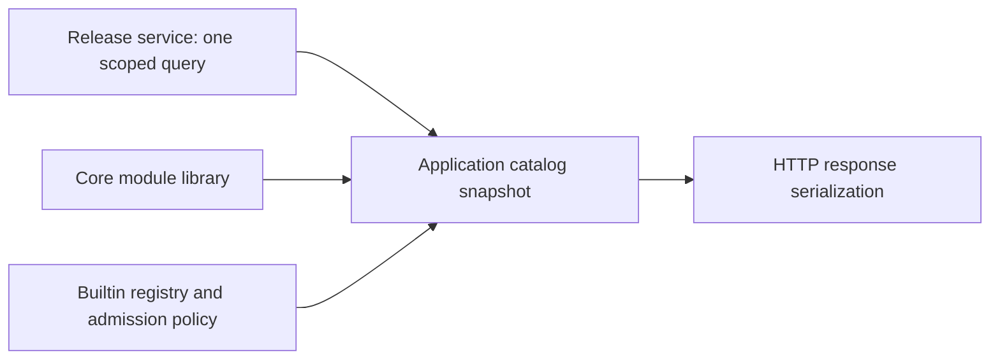

- Final validation: 661 API, architecture, module, artifact, and execution-route tests passed. Changed-file Ruff and diff whitespace checks pass. The built API wheel contains the new catalog owner, omits the retired adapter, and produces identical OpenAPI. Finding 7 is complete.

### Runtime artifact availability ownership

- Added concrete `grafy_api.artifact_availability.ArtifactAvailability` for exact reference resolution and storage-presence checks. Removed `ArtifactService.validate_refs` and `ArtifactService.is_accessible` from the HTTP reader.
- Execution materialization now depends on the application owner. Composition shares that owner with HTTP materialization presentation; table/download/render handling remains in the HTTP artifact reader.
- Reference sequences use one `get_many` operation instead of opening one transaction per item. Validation preserves missing/mismatched-reference messages, item indices, ordering, repeated references, and Workspace filtering.
- Pinned-output resolution reuses the resolved artifact rows for storage checks, removing the second repository read for every item.
- Table and JSON-collection availability continue to use their existing format-specific functions. Ordinary inline objects remain available; stored objects require a present bucket/key and a successful stat. No hashing or full content read was added to availability.
- New tests verify one transaction for a ten-artifact sequence with a repeated item, sequence error context, foreign Workspace exclusion, exact hash-reference mismatch, and storage deletion. A deliberate stored-content/hash mismatch remains available, demonstrating that availability does not claim cache-integrity verification.
- Focused validation: 303 runtime and artifact tests passed. The availability and materialization owners have zero Pyright errors or warnings. Changed-file Ruff passes.
- Evidence: `/tmp/grafy-availability-tests.log`, `/tmp/grafy-availability-regression.log`, `/tmp/grafy-availability-final.log`, and `/tmp/grafy-availability-types.log`.
- Finding 9 remains open: migrate the spatial exact-reference adapter to the shared owner, consolidate format-specific object enumeration where needed, and examine sharing across separate outputs and materialization phases. This batch removes duplicate reads within each pinned output; it does not claim one read for the entire execution preparation pipeline.
- Final validation: 549 API, architecture, execution-route/history, and materialization tests passed. OpenAPI is unchanged; the built wheel includes the new application owner.

### Shared spatial reference resolution

- Spatial rendering now delegates exact row lookup and reference matching to `ArtifactAvailability.resolve_refs`. The HTTP adapter retains its expected spatial type/version checks and translates failures to its existing public error messages.
- Added `ArtifactReferenceError` with the rejected reference, a missing/mismatch reason, and optional sequence index. Runtime sequence messages are unchanged; spatial callers can translate the error without parsing text or repeating repository lookup.
- The resolver accepts ordinary reference lists as well as runtime scalar/sequence values. It preserves ordering and repeated references and uses the same Workspace-scoped batch query.
- Application composition injects the same concrete availability owner into the HTTP artifact reader, execution materialization, and result presentation. Test construction uses the explicit owner as well.
- Extended reference regressions to verify structured error context and ordered list resolution. The focused run passed 198 availability, streaming, runtime, GIS, and table tests, including stale map references, ordered map layers, raster tiles, and WMS address pinning.
- Evidence: `/tmp/grafy-spatial-refs-tests.log`, `/tmp/grafy-spatial-refs-regression.log`, and `/tmp/grafy-spatial-refs-types.log`.
- Finding 9 still tracks sharing across separate outputs/materialization phases and format-specific object enumeration. The exact-reference ownership item is now complete.
- Final validation: 659 API, architecture, artifact, and execution-route/history tests passed. Availability and materialization type checks report zero errors or warnings. OpenAPI is unchanged; changed-file Ruff and whitespace checks pass.

### Availability batches across outputs

- `ArtifactAvailability.load` now resolves all supplied scalar/sequence values with one Workspace-scoped `get_many` operation. Its concrete `ArtifactAvailabilityBatch` holds read-only rows, exact-reference validation, and memoized storage-presence results for that operation.
- Latest-pin validation, pinned-output resolution, materialization presentation, and run-result presentation each load one batch across their outputs. Pinned outputs preserve endpoint order, sequence indices, and repeated references.
- Result presentation builds summaries from the already-loaded rows instead of reopening the artifact repository for every summary. The asynchronous single-port presenter remains the live-route boundary; its shared rendering code performs no repository IO.
- Spatial lookup uses the same batch owner, retaining its existing type checks and error translation.
- Format-specific enumeration remains with `table_artifact_is_accessible` and `json_collections_artifact_is_accessible`. These functions already own their manifests and chunk layouts; batches reuse each result once per artifact, without duplicating those loops in API or execution code. Cache content-integrity logic remains independent.
- Batches are deliberately fresh across application operations and execution-preparation phases. They are never retained on the service. This avoids carrying a prior presence result across later requests or the intervening work between validation phases.
- Tests now cover eleven output ports sharing a ten-artifact sequence, with repeated item ordering and one repository transaction. A separate presentation test covers six outputs sharing a stored artifact: one transaction and one stat, followed by a fresh operation after deletion that performs another transaction/stat and hides all unavailable outputs.
- Focused validation: 304 runtime/artifact tests passed. Availability and materialization have zero Pyright errors or warnings; changed-file Ruff passes.
- Evidence: `/tmp/grafy-availability-batch-focused.log`, `/tmp/grafy-availability-batch-regression.log`, `/tmp/grafy-availability-batch-final.log`, and `/tmp/grafy-availability-batch-types.log`.

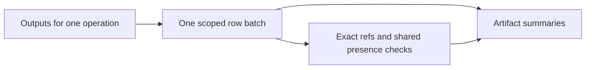

- Final validation: 677 API, architecture, artifact, nested-module, and execution-route/history tests passed. OpenAPI is unchanged. Finding 9 is complete; batches remain operation-local by design.

### Shared persistence column serialization

- Four Pydantic JSON and eleven string-enum column types now reuse two typed implementations in `grafy_persistence.column_types`. Named types, their import paths, SQL lengths, null handling, and Pydantic validation remain unchanged. Specialized datetime, artifact-output, and enum-collection codecs remain separate.
- Each named subclass retains explicit `cache_ok = True`: SQLAlchemy reads that flag from the concrete class dictionary, so inheriting it alone would disable statement caching. This is a framework requirement, not redundant configuration. [R11: Framework Constraints Must Be Explicit]
- Forty-five contract tests passed before and after consolidation. They cover both dialect processors, every enum value, malformed stored values, model validation, nulls, and real SQLite round trips with cache warnings treated as errors.
- Generated SQLite and PostgreSQL table/index DDL exactly matches the baseline for all 32 tables. No migration is required.
- Regression validation: 205 persistence, application, and architecture tests passed. The live PostgreSQL migration test was skipped because its disposable database URL is not configured. Shared types, schema, and new tests have zero Pyright errors or warnings; Ruff passes.
- Evidence: `/tmp/grafy-column-types-before.json`, `/tmp/grafy-column-types-baseline.log`, `/tmp/grafy-column-types-focused.log`, `/tmp/grafy-column-types-regression.log`, and `/tmp/grafy-column-types-types.log`.
- Finding 11 remains open for repository/table ownership, bulk recovery hydration, and live PostgreSQL verification.

### Batched execution history recovery

- `SqlGraphExecutionHistoryRepository._hydrate_executions` now owns ordered node hydration for queue recovery, restart interruption, history pages, individual detail/idempotency reads, and immutable-request checks during updates. Removed the duplicated page loop and per-execution recovery queries.
- Node queries match exact `(workspace_id, execution_id)` pairs in batches of 400. Two bound values per pair keep each node query below SQLite's older 999-variable ceiling. Empty input performs no node query.
- Hydration preserves caller record order, stored request-node position, empty node sets, submitted request data, and Workspace identity. Interruption still returns pre-update execution records and persists the same failed status, timestamp, and error.
- Added queue/interruption regressions for 0, 1, 5, and 401 executions across two Workspaces. Equal creation times test the existing UUID tie-break; reversed insertion and nonalphabetical node names expose accidental ordering changes. Both 401-execution cases use three SELECTs, down from 402, and interruption checks every persisted result.
- Validation: 17 focused history tests passed. Separate regression processes passed 213 persistence/application/architecture tests and 204 runtime/core-history/execution-route tests. One live PostgreSQL migration test remains skipped without its disposable database URL. The entire persistence package passes strict Pyright; Ruff and diff whitespace checks pass.
- The existing history test file has two Pyright diagnostics at its un-narrowed artifact union assertion, unchanged by this batch. New test code introduces none.
- A combined run produced seven missing-log assertion failures after migration tests. `infra/db/migrations/env.py` calls `fileConfig` with its default disabling of existing loggers; all 204 runtime tests pass in a fresh process. Follow-up: migration tests should restore process logging state after running Alembic, and a combined-run regression should verify subsequent log capture. This is a test-isolation gap outside the persistence read change. [R23: Maintain The Rules]
- Evidence: `/tmp/grafy-history-batch-focused.log`, `/tmp/grafy-history-batch-regression.log`, `/tmp/grafy-history-batch-runtime.log`, `/tmp/grafy-history-batch-database.log`, `/tmp/grafy-history-batch-types.log`, and `/tmp/grafy-persistence-types.log`.

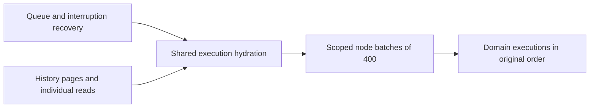

- Finding 11 remains open for repository/table ownership and live PostgreSQL verification. These two persistence batches remove 221 production lines overall without a schema migration.

### Feature-owned SQL repositories

- Replaced the 2,571-line `adapters/repositories.py` with a package containing identity, graphs, artifacts, execution, plugins, and library owners. Graph persistence includes collaboration and node secrets; artifact persistence includes staged uploads. The unit of work still composes all adapters into one transaction.
- The package exports all thirteen named repository classes at their existing import path. No compatibility wrapper, factory, or additional interface was introduced.
- Compared parsed syntax trees before and after the move: every repository class is identical. Only imports and the location of the execution-status constant changed.
- Validation: 213 persistence/application/architecture tests and 520 API/execution-route tests passed in separate processes. The live PostgreSQL migration test remains skipped without a disposable database URL. The entire persistence package has zero Pyright errors or warnings; Ruff and whitespace checks pass.
- Built and extracted the persistence wheel. All six owner modules are present, the retired flat module is absent, old class imports resolve, and ORM initialization registers the same 32 tables from the packaged installation.
- Evidence: `/tmp/grafy-repositories-before.py`, `/tmp/grafy-repository-owners-types.log`, `/tmp/grafy-repository-owners-database.log`, `/tmp/grafy-repository-owners-api.log`, and `/tmp/grafy-repository-owners-wheel.log`.
- Table ownership remains open. Inspection confirms that the 32 table declarations use named foreign-key references without direct dependencies on other table variables, which allows a separate move around one shared metadata instance.

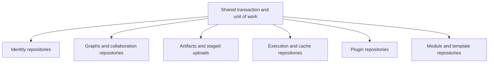

### Feature-owned SQL schema

- Replaced `schema.py` with identity, graphs, artifacts, execution, plugins, and library table modules. `schema.base` creates the only metadata instance and naming convention; `schema.__init__` loads the complete schema and preserves prior named table/type imports. ORM mapping and Alembic still consume the same bootstrap.
- Feature-specific model/enum types live beside their tables. Shared datetime, artifact-output, and graph-document types live in `column_types.py`; graph documents are used by both saved graphs and library snapshots. Table modules do not import other feature table modules.
- All nineteen concrete column-type class syntax trees are unchanged. Every previous named type/table export resolves, and complete SQLite/PostgreSQL table/index DDL exactly matches the baseline for all 32 tables. No migration is needed.
- Regression validation: 213 persistence/application/architecture tests and 520 API/execution-route tests passed in separate processes. Full persistence and column-contract test typing has zero errors or warnings; Ruff and whitespace checks pass.
- Found an available local PostgreSQL 15 Docker image and ran the previously skipped fresh-database upgrade/downgrade test successfully. Added an optional asyncpg round-trip test for all four model types and eleven enum types, including every enum member, null values, exact result types, and repeated statement execution. Its tables are connection-local temporary tables.
- Live PostgreSQL validation passed 47 column-contract and migration tests. The disposable database used temporary storage, a loopback-only random port, and no project mounts. Both validation containers were removed afterward. The ordinary regression run still skips the optional migration test when its database URL is absent; that skip is supplemented by the successful live run.
- The built/extracted wheel contains all schema modules, omits the old flat module, initializes the shared metadata, and compiles exactly the same SQLite/PostgreSQL DDL independently of editable source imports.
- Evidence: `/tmp/grafy-schema-owners-before.py`, `/tmp/grafy-schema-owners-before.json`, `/tmp/grafy-schema-owners-types.log`, `/tmp/grafy-schema-owners-database.log`, `/tmp/grafy-schema-owners-api.log`, `/tmp/grafy-schema-owners-postgres.log`, and `/tmp/grafy-schema-owners-wheel.log`.
- Finding 11's ownership work is complete. Its broader cross-database verification remains open: migration and column behavior now have live PostgreSQL evidence, while the new execution-recovery batching still needs a PostgreSQL repository-level run.

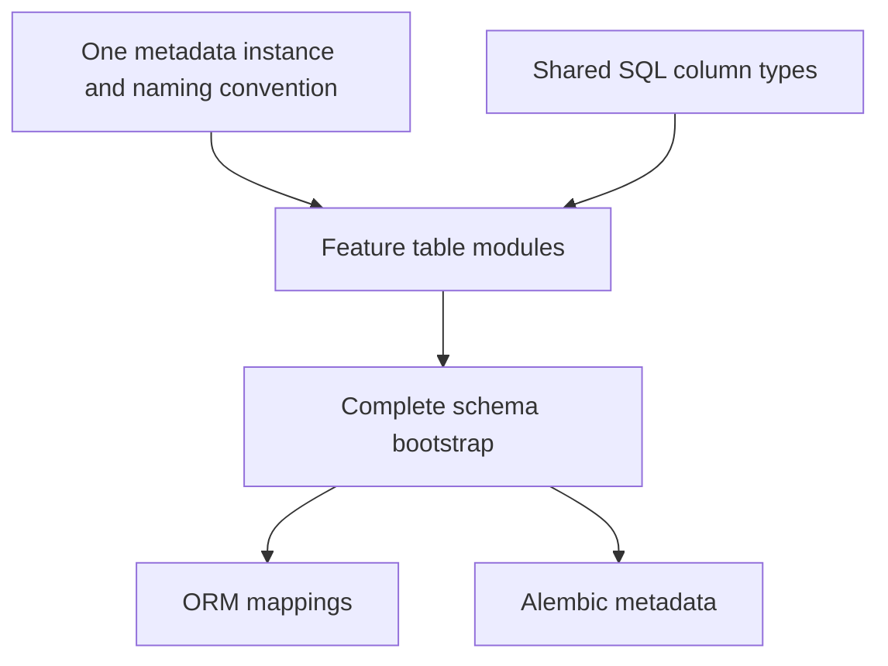

### PostgreSQL execution recovery verification

- Parameterized the existing execution-history repository suite for SQLite and PostgreSQL. PostgreSQL cases use a unique schema and per-connection search path, create the real metadata, and remove the schema after disposing test connections. The fixture requires an explicitly configured asyncpg test URL and skips PostgreSQL cases when it is absent.
- All seventeen existing contracts now run on both databases, including queue ordering/conditional claims, immutable requests, pagination, cross-Workspace history, active-execution uniqueness, partial/completion ordering, deletion, interruption, and batches of 0/1/5/401 executions.
- The live run passed 81 tests: 34 history cases across both databases, 46 column-type contracts, and the PostgreSQL migration upgrade/downgrade test. The 401-execution PostgreSQL queue and interruption cases each satisfy the same three-SELECT budget as SQLite.
- Used a disposable PostgreSQL 15 container with temporary storage and a loopback-only port; it was removed after the run. No project database or mounted project files were used.
- Ruff and whitespace checks pass. The test file retains only its two previously recorded diagnostics at the unchanged artifact-union assertion; the new fixture introduces none.
- Evidence: `/tmp/grafy-history-postgres-sqlite.log`, `/tmp/grafy-history-postgres-live.log`, and `/tmp/grafy-history-postgres-types.log`.
- Finding 11 is complete: shared typed serializers, repository and table ownership, shared recovery hydration, unchanged migration metadata, SQLite regression, and live PostgreSQL migration/storage/recovery checks all have evidence. Other original findings and final whole-backend gates remain open.

### Artifact ports and in-memory runtime ownership

- Moved `ArtifactRepositoryPort` and the artifact-bearing `UnitOfWorkPort` to `ports/artifacts.py`. Moved the concrete store, repositories, task-local transaction state, and cloning implementation to `runtime/in_memory.py`. `artifacts.py` retains artifact models and supported SDK exports.
- Internal production and test callers import ports and memory implementations directly from their owners. The standalone plugin example retains its old public import because its frozen source bundle carries an older SDK wheel. Publication tests caught this boundary before commit; no bundled SDK or plugin behavior was changed.
- Legacy SDK exports use module-level lazy attribute resolution. Eager exports re-entered the domain package before `GraphModuleDefinition` existed; the lazy boundary removes that cycle while preserving object identity and wildcard imports. This local-import exception has a demonstrated initialization reason. [R05: Top-Level Imports By Default]
- All 27 original class/function syntax trees are identical after extraction. Locking, task isolation, cloning, commit/rollback, stored history, staged uploads, and cache behavior remain unchanged.
- Added five fresh-process import-order tests covering artifact, domain, ports, memory runtime, and plugin entry points. They verify explicit/wildcard SDK exports resolve to the same objects and unknown attributes raise `AttributeError`. The extracted core wheel passes the same entry-point checks.
- Validation passed 535 core/application/persistence/architecture tests, 520 API/execution-route tests, 102 plugin/storage tests, 79 workbench tests, and 5 import tests, totaling 1,241 passing tests. Nineteen optional PostgreSQL cases were skipped in this run; the preceding live PostgreSQL evidence remains valid because implementations are unchanged.
- Ruff and whitespace checks pass. Targeted Pyright reports the same eight pre-existing untyped-dict-factory diagnostics as the saved pre-move artifact module, now distributed between models and memory state. No new diagnostics were introduced.
- Evidence: `/tmp/grafy-artifact-owners-before.py`, `/tmp/grafy-artifact-owners-core.log`, `/tmp/grafy-artifact-owners-api.log`, `/tmp/grafy-artifact-owners-plugins.log`, `/tmp/grafy-artifact-owners-workbench.log`, `/tmp/grafy-artifact-owners-imports.log`, `/tmp/grafy-artifact-owners-baseline-types.log`, `/tmp/grafy-artifact-owners-types.log`, and `/tmp/grafy-artifact-owners-wheel.log`.
- Finding 12 remains open for shared lifecycle-only transaction contracts and explicit saved-graph materialization requirements. Reusable compatibility lesson: when a source example contains a pinned SDK wheel, migrate its imports only alongside that SDK version, or retain the supported public imports. [R23: Maintain The Rules]

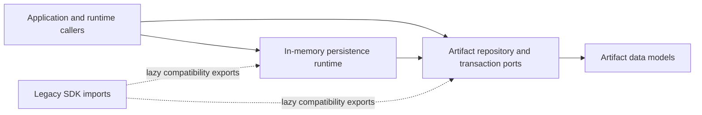

### Shared transaction lifecycle and required materialization

- Added repository-free `TransactionPort` with async enter/exit, commit, and rollback. Nine feature transaction protocols inherit it instead of repeating lifecycle signatures. Artifact, identity, graph, secret, collaboration, plugin, module, template, and upload contracts retain their explicit repository requirements; existing execution/workbench specialization remains intact.
- Saved-graph and collaboration transaction contracts now require `materialized_outputs`. SavedGraphService uses that property directly instead of an attribute lookup and runtime protocol check that could silently skip carry-forward. SQL composition already provides this repository.
- Adapted saved-graph and collaboration test transactions to use the production in-memory materialization repository. Their transaction snapshots include this state so failed commits cannot leave materializations on uncommitted revisions.
- Extended the checkpoint failure contract with an existing node materialization. A failed checkpoint preserves the original revision's output and leaves the new revision empty; retrying successfully carries the same workflow result to the new revision. Existing HTTP tests also verify carry-forward after compatible layout changes.
- Validation: 556 core/application/persistence/architecture/materialization tests, 520 API/execution-route tests, and 181 plugin/storage/workbench tests passed, totaling 1,257. Nineteen optional PostgreSQL cases were skipped in this run; no persistence implementation or SQL changed.
- Targeted typing of the new lifecycle, artifact/saved-graph/collaboration contracts, SavedGraphService, and the complete persistence package reports zero errors or warnings. The broader ports directory retains its existing `JsonValue` re-export diagnostic in `ports/__init__.py`; this batch does not alter that export. Changed-file Ruff and whitespace checks pass.
- The extracted core wheel contains the shared lifecycle module, imports SQL composition, preserves legacy artifact SDK imports, and completes a real in-memory commit/read/remove/rollback cycle.
- Evidence: `/tmp/grafy-transactions-regression.log`, `/tmp/grafy-transactions-api.log`, `/tmp/grafy-transactions-runtime.log`, `/tmp/grafy-transactions-types.log`, and `/tmp/grafy-transactions-wheel.log`.
- Finding 12 is complete. Its previous ownership move and import-order/packaging checks, together with this batch's lifecycle and materialization contracts, cover task isolation, cloning, rollback, guest callers, and supported SDK imports. Other original findings and final whole-backend gates remain open.

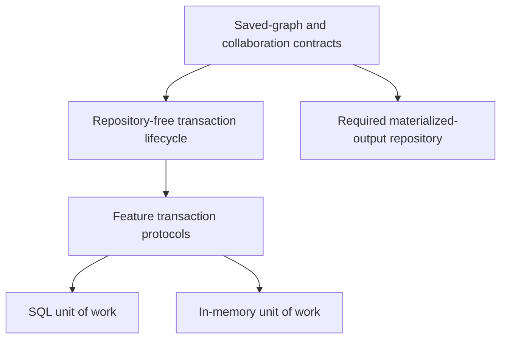

### Application-owned realtime rooms

- Moved `GraphRoomHub`, its session/presence state, and post-commit publication to `grafy_api.realtime`. Execution management and app composition now depend on this owner instead of collaboration routes.
- Room protocol models live in `realtime.protocol`. Shared graph transport contracts live in `graph_contracts.py`, so room messages and graph HTTP endpoints use the same class objects without realtime importing route modules. Existing route-model modules retain explicit compatibility exports.
- Publication functions accept a concrete hub, not a FastAPI request. HTTP routes resolve the hub through application resources after the domain operation succeeds. Removed the redundant request-to-hub helper from publication. Idempotent command suppression, epoch rehydration, deleted-graph closure, permission-change closure, actor presentation, and wire messages retain their behavior.
- Hub and room/graph model class/function syntax trees are unchanged. OpenAPI exactly matches the pre-move snapshot, including from the extracted API wheel. The wheel contains the new owners and excludes the retired route hub/publisher modules; compatibility model imports preserve class identity.
- Updated the route-layout assertion that required hub and publisher files in the collaboration route folder. Added a dependency check prohibiting realtime/shared graph contracts from importing route modules and prohibiting publisher app-resource lookup.
- Validation: 520 API/execution-route tests, 41 architecture/room tests, and 76 saved-graph/module/template/materialization/node-secret integration tests passed, totaling 637. The first combined run had one stale layout assertion failure; the final architecture/room run verifies its replacement.
- Targeted typing reports ten diagnostics, exactly matching the saved pre-move implementations under equivalent import resolution. These are existing model default-factory, optional room, and nullable email diagnostics. Changed-file Ruff and whitespace checks pass.
- Evidence: `/tmp/grafy-realtime-before-openapi.json`, `/tmp/grafy-realtime-tests.log`, `/tmp/grafy-realtime-final-tests.log`, `/tmp/grafy-realtime-graph-tests.log`, `/tmp/grafy-realtime-types.log`, `/tmp/grafy-realtime-baseline-types-final.log`, and `/tmp/grafy-realtime-wheel.log`.
- Finding 13 remains open for audit metadata, auth cleanup, workspace results/models, node secrets, and staged uploads. Finding 8 remains open: moving shared graph transport classes does not eliminate their compatibility conversion layer or resolve versioned client migration.

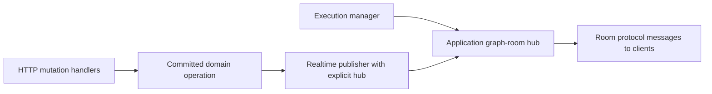

### HTTP failure metadata and authentication cleanup

- Moved the route-to-audit-operation map, descriptor, and resolver from workspace views into `http_errors.py`, their sole caller and the owner of global HTTP failure registration. The moved syntax trees are identical, preserving route names, resource identities, invalid-UUID handling, and unaudited-route behavior.
- `AuthService.cleanup_malformed_callback` now owns callback rate-limit accounting, consumption of the pending login transaction, and release of its outstanding-login reservation. The HTTP validation handler receives the rate-limit decision and retains response formatting, diagnostic scope, security audit invocation, and cookie clearing. Operation order is unchanged.
- The error handler no longer imports workspace views or knows the OIDC transaction-cookie name and reservation-cleanup sequence. No additional metadata registry or forwarding module was added.
- Focused validation passed 66 auth, diagnostics, and saved-graph tests. Existing callback coverage checks consumed transactions, released reservations, validation versus rate-limit status, redacted errors, audit events, and transaction-cookie clearing. Broader API/architecture/room/execution regression passed 561 tests; these suites overlap in diagnostics coverage.
- Both changed HTTP/auth owners pass targeted Pyright with zero errors or warnings. Ruff and whitespace checks pass. OpenAPI is unchanged, including from the extracted API wheel, which resolves the metadata and callback cleanup from their new owners.
- Evidence: `/tmp/grafy-http-audit-before.py`, `/tmp/grafy-http-ownership-openapi.json`, `/tmp/grafy-http-ownership-focused.log`, `/tmp/grafy-http-ownership-regression.log`, `/tmp/grafy-http-ownership-types.log`, and `/tmp/grafy-http-ownership-wheel.log`.
- Finding 13 remains open for workspace result/model ownership, node secrets, and staged uploads.

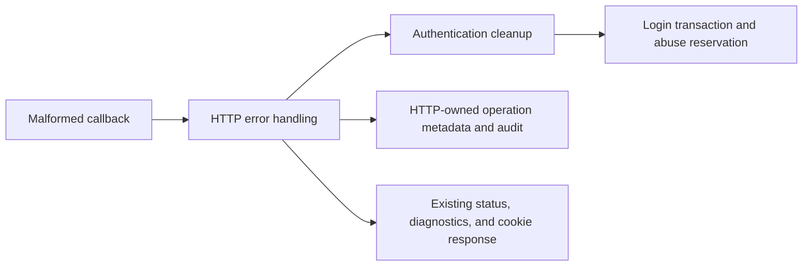

### Application-owned node secrets and staged uploads

- Moved `NodeSecretService` and its configuration/contracts to `grafy_api.node_secrets`. The complete parsed module is identical to its pre-move source. Composition, route dependencies, execution/module tests, and transport model typing import the application owner.
- Moved upload staging to `grafy_api.staged_uploads` and renamed its service/dependency to `StagedUploadService`/`StagedUploadDependency`, reflecting support for arbitrary files. Retired both route service modules.
- Removed the temporary `ImageUploadItem` dataclass. Single uploads and sample batches construct the actual `StagedUpload` records, persist those same objects in one transaction, and return them. HTTP serialization reads `original_filename` while retaining the public `filename` field and existing response-model names.
- Domain construction and file stat for a single upload remain inside the file-cleanup exception boundary. Sample creation retains one batch commit and removal of every staged path on failure. Domain records now receive their default timestamps when constructed during staging, before entering the persistence transaction.
- Added regression checks that exact-limit uploads return their persisted domain record, including Workspace and creator identity; domain validation removes staged files; and failed commits remove files and rows for both a single upload and a three-sample batch.
- Replaced the layout requirement for node-secret/upload route services with the application-owner dependency check. Both owners are prohibited from importing route modules.
- Validation: 604 API, architecture, node-secret, upload, module, room, and execution tests passed. A final 15-test architecture run includes both new owner boundaries. Targeted Pyright reports zero errors or warnings for both services and the staging tests; Ruff and whitespace checks pass.
- OpenAPI is unchanged. The clean built/extracted API wheel contains the application owners, omits both retired route service modules, and imports with identical OpenAPI.
- Evidence: `/tmp/grafy-node_secrets-before.py`, `/tmp/grafy-uploads-before.py`, `/tmp/grafy-secrets-staging-openapi.json`, `/tmp/grafy-staging-rollback.log`, `/tmp/grafy-secrets-staging-focused.log`, `/tmp/grafy-secrets-staging-regression.log`, `/tmp/grafy-secrets-staging-architecture.log`, `/tmp/grafy-secrets-staging-types.log`, and `/tmp/grafy-secrets-staging-wheel.log`.
- Finding 13 remains open for workspace transport models and complete application results without route-side transaction reopening.

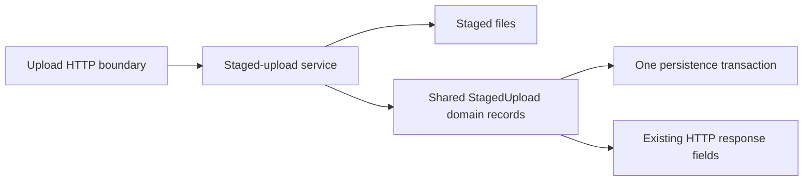

### Workspace transport and complete mutation results

- Moved workspace, membership, invitation, and personal-access-token transport models from authentication into `v1/routes/workspaces/models.py`. Authentication retains `SessionResponse` and explicit compatibility exports of the moved classes. Production workspace routes and test clients use the owning module. [R01: Direct Ownership]
- Invitation acceptance returns `WorkspaceInvitationAcceptance`, including the workspace already locked by the transaction. Role changes return `WorkspaceMemberResult`, including the target user loaded before mutation commits. Both routes serialize these complete results without opening a second transaction or querying persistence. Missing records are rejected before committing the mutation. These are internal application return-type changes; HTTP contracts are unchanged.
- `WorkspaceResponse.from_membership` and `WorkspaceMemberResponse.from_membership` consolidate repeated transport conversion at the owning model. Shared-workspace creation retains its existing capability ordering. Role changes still close existing user rooms after commit. [R08: Model-Owned Serialization]
- Application tests verify accepted invitations include their workspace and persisted membership. New parameterized tests verify role-change results match committed membership state and preserve support for both active and inactive target users. Compatibility tests verify all sixteen moved model exports retain object identity.
- Verification: 25 identity/architecture contracts passed. Broader API, authentication, collaboration, module, and execution regression had 610 passes, two skips, and five native subprocess failures. All five are the previously baseline-reproduced Docker/local-guest SIGSEGV cases documented in the publication-fencing batch; they remain limitations, not passing checks. No migration tests were mixed into the logging-sensitive API run.
- Strict Pyright reports zero errors or warnings for the changed application service and route/model files. Changed-file Ruff and whitespace checks pass. OpenAPI exactly matches the pre-change snapshot. Built and extracted API/core wheels import their new owners, retain model compatibility, and register the same OpenAPI.
- Evidence: `/tmp/grafy-workspace-results-contracts.log`, `/tmp/grafy-workspace-results-regression.log`, `/tmp/grafy-workspace-results-types.log`, `/tmp/grafy-workspace-results-openapi.json`, and `/tmp/grafy-workspace-results-build.log`. The earlier focused log includes the initial test-only positional-argument error, corrected before the final contract run.
- Finding 13 is complete across its five recorded batches. Findings 3, 4, 8, 10, 14, and the final whole-backend gates remain open.

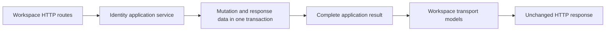
