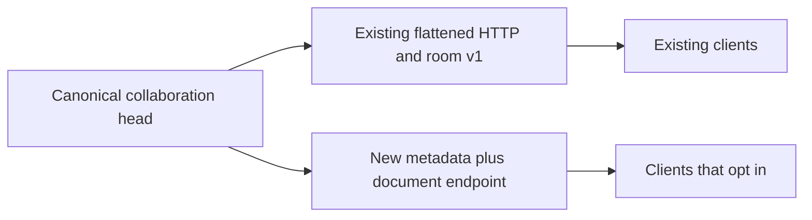
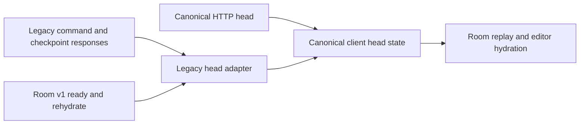

# Graph transport migration

## Compatibility decision

Clients may opt into `GET /v1/workspaces/{workspace_id}/graphs/{graph_id}/head/document`. The response contains `graph_id`, `room_epoch`, `collaboration_sequence`, `checkpoint_sequence`, `checkpoint_revision`, `name`, `updated_at`, and the canonical `SavedGraphDocument` under `document`.

The document keeps its own `schema_version` (currently 6). Nodes use `plugin_release_pin`. Collaboration metadata describes the live head, including uncheckpointed changes. The read uses the same workspace capability check and collaboration authorization as the existing head endpoint.

Keep existing v1 flattened fields and schemas supported. Do not rename `plugin_release` in existing head responses, add mandatory fields to existing requests, or change room protocol v1 messages in place. Strict response parsers also depend on the current JSON shape. A compatible serializer alone does not preserve their input contract.

The additive HTTP route allows staged migration without requiring a simultaneous frontend or room protocol deployment. It is an intermediate transport, not completion of the document consolidation.

## Implemented client migration

The frontend reads `/head/document` directly. Its `CollaborativeHead` type derives from that endpoint's generated response. Shared session state, room replay, checkpoint reconciliation, and editor hydration now carry metadata plus `SavedGraphDocument`.

The API client and room parser share `collaborativeHeadFromLegacy`. It normalizes v1 heads, including the `plugin_release` field and optional collections, before they enter shared state. Command and checkpoint responses retain their receipt and revision metadata. The room command bridge no longer converts canonical pins back into legacy head nodes. [R08: Model-Owned Serialization]

Room wire messages still use protocol v1. Internal client normalization does not require a new protocol version. Changing the wire payload later requires explicit versioning or capability negotiation. Existing clients remain supported; no legacy removal date is set.

## Remaining work

1. Consolidate the backend internal compatibility adapter and remove repeated graph validation after mapping acceptance differences. Keep legacy normalization where old clients or stored data require it.
2. Verify full graph round trips, old/new transport compatibility, generated clients, and OpenAPI after backend consolidation.
3. Complete the final runtime browser verification alongside the whole cleanup audit.
4. Retire legacy transport only through a separately reviewed compatibility decision with evidence that supported clients have migrated.

## Verification

The canonical endpoint batch covered exact canonical content, unchanged legacy reads, matching missing and unauthorized graph handling, and uncheckpointed collaboration metadata. Existing OpenAPI paths and schemas compared equal to the pre-change snapshot. The extracted API wheel generated the checked-in schema, and TypeScript generation was consistent.

The client migration passes 607 frontend tests in 90 files and a full TypeScript check. The production Next build passes. Tests exercise HTTP refresh, v1 ready/rehydrate parsing, command/checkpoint normalization, room replay, and mounted session/lifecycle hooks. They check exact release pins, presentation, uncheckpointed metadata, runtime-field exclusion, optional legacy collections, and rejection of non-object graph members. This batch did not change generated schemas and did not include a manual browser smoke test.
