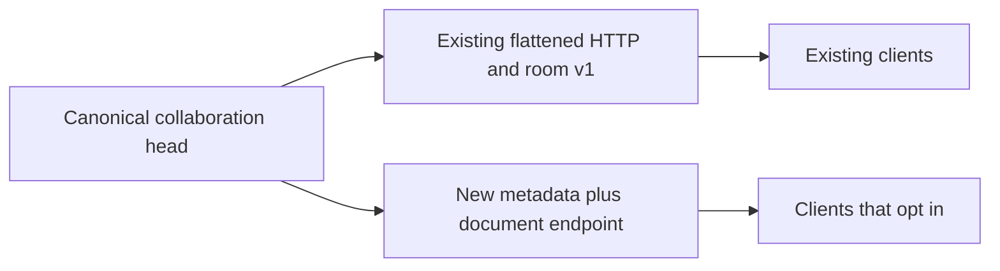

# Graph transport migration

## Compatibility decision

Clients may opt into `GET /v1/workspaces/{workspace_id}/graphs/{graph_id}/head/document`. The response contains `graph_id`, `room_epoch`, `collaboration_sequence`, `checkpoint_sequence`, `checkpoint_revision`, `name`, `updated_at`, and the canonical `SavedGraphDocument` under `document`.

The document keeps its own `schema_version` (currently 6). Nodes use `plugin_release_pin`. Collaboration metadata describes the live head, including uncheckpointed changes. The read uses the same workspace capability check and collaboration authorization as the existing head endpoint.

Keep existing v1 flattened fields and schemas supported. Do not rename `plugin_release` in existing head responses, add mandatory fields to existing requests, or change room protocol v1 messages in place. Strict response parsers also depend on the current JSON shape. A compatible serializer alone does not preserve their input contract.

The additive HTTP route allows staged migration without requiring a simultaneous frontend or room protocol deployment. It is an intermediate transport, not completion of the document consolidation.

## Remaining work

1. Migrate a complete frontend read flow, including graph cache and head-to-editor conversion, to the canonical document. Verify pin handling, presentation, and uncheckpointed edits through that flow.
2. Choose and implement an explicit room protocol version or negotiated capability before changing room-ready and epoch-reset payloads. Keep existing clients supported during the transition.
3. Migrate command/checkpoint response consumers consistently with room and HTTP reads. Verify JSON parsing as well as server serialization.
4. Consolidate the internal compatibility adapter and remove repeated graph validation only after mapping the acceptance differences. Keep legacy normalization where old clients or stored data require it.
5. Retire legacy transport only through a separately reviewed compatibility decision with evidence that supported clients have migrated. This batch sets no removal date.

## Verification for this batch

HTTP contracts cover exact canonical content, unchanged legacy reads, matching missing and unauthorized graph handling, and uncheckpointed collaboration metadata. Existing OpenAPI paths and schemas compare equal to the pre-change snapshot. The extracted API wheel generates the checked-in schema, and TypeScript generation is consistent. Frontend and room consumers remain on their existing contracts.
