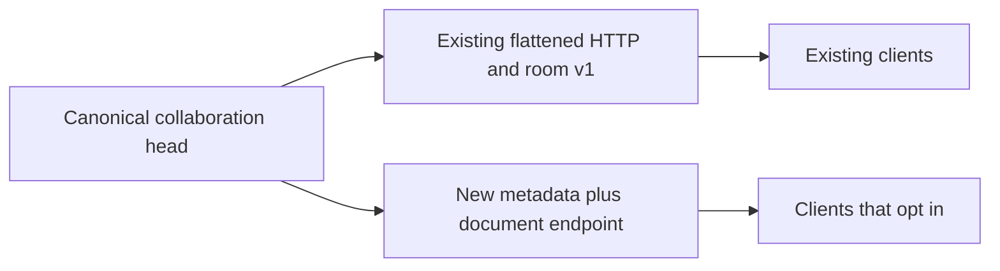
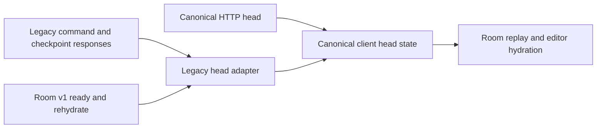

# Graph transport migration

## Compatibility decision

Clients may opt into `GET /v1/workspaces/{workspace_id}/graphs/{graph_id}/head/document`. The response contains `graph_id`, `room_epoch`, `collaboration_sequence`, `checkpoint_sequence`, `checkpoint_revision`, `name`, `updated_at`, and the canonical `SavedGraphDocument` under `document`.

The document keeps its own `schema_version` (currently 6). Nodes use `plugin_release_pin`. Collaboration metadata describes the live head, including uncheckpointed changes. The read uses the same workspace capability check and collaboration authorization as the existing head endpoint.

Keep existing v1 flattened fields and schemas supported. Do not rename `plugin_release` in existing head responses, add mandatory fields to existing requests, or change room protocol v1 messages in place. Strict response parsers also depend on the current JSON shape. A compatible serializer alone does not preserve their input contract.

The additive HTTP route allows staged migration without requiring a simultaneous frontend or room protocol deployment. It is an intermediate transport, not completion of the document consolidation.

## Implemented client migration

The frontend reads `/head/document` directly. Its `CollaborativeHead` type derives from that endpoint's generated response. Shared session state, room replay, checkpoint reconciliation, and editor hydration now carry metadata plus `SavedGraphDocument`.

The API client and room parser share `collaborativeHeadFromLegacy`. It normalizes v1 heads, including the `plugin_release` field and optional collections, before they enter shared state. Command and checkpoint responses retain their receipt and revision metadata. The room command bridge no longer converts canonical pins back into legacy head nodes. [R08: Model-Owned Serialization]

Room wire messages still use protocol v1. Internal client normalization does not require a new protocol version. Changing the wire payload later requires explicit versioning or capability negotiation. Existing clients remain supported; no legacy removal date is set.

## Backend migration implementation

Collaboration commands and head state use `SavedGraphDocument`. `CollaborativeHeadResponse.from_head` is the single backend compatibility adapter for legacy HTTP and room responses. It serializes the canonical envelope/document and renames each node's pin field. Per-node, per-edge, and presentation conversion wrappers have been removed.

Substantive shared validation rules now have canonical ownership. The acceptance table below records the distinctions retained at legacy parsing boundaries. Mirrored response schema declarations remain to preserve the published OpenAPI and room v1 contracts; they no longer define a second internal graph representation.

## Remaining verification and future compatibility

Complete runtime browser verification and the whole-cleanup source/behavior audit before marking the overall goal complete. The backend and frontend migration implementation is complete; evidence is recorded below and in the checklist.

Retire legacy transport only through a separately reviewed compatibility decision with evidence that supported clients have migrated. No removal date is set, and this cleanup does not remove v1 support.

## Verification

The canonical endpoint batch covered exact canonical content, unchanged legacy reads, matching missing and unauthorized graph handling, and uncheckpointed collaboration metadata. Existing OpenAPI paths and schemas compared equal to the pre-change snapshot. The extracted API wheel generated the checked-in schema, and TypeScript generation was consistent.

The client migration passes 607 frontend tests in 90 files and a full TypeScript check. The production Next build passes. Tests exercise HTTP refresh, v1 ready/rehydrate parsing, command/checkpoint normalization, room replay, and mounted session/lifecycle hooks. They check exact release pins, presentation, uncheckpointed metadata, runtime-field exclusion, optional legacy collections, and rejection of non-object graph members. This batch did not change generated schemas and did not include a manual browser smoke test.

## Backend acceptance differences

Source comparison on 2026-09-09 found these constraints on replacing the mirrored transport classes:

| Concern | Canonical graph values | Legacy transport values | Consolidation constraint |
| --- | --- | --- | --- |
| Edge conversion alias | Accepts singular `conversion`, rejects both forms, emits `conversion_path` | Same rule | Now registered from one domain-owned normalizer |
| Node layout | Requires at least one dimension and enforces axis bounds | Same rules | Now shares domain-owned completeness validation and the layout ceiling; schema names and mutable transport values remain unchanged |
| Configuration and collections | Frozen models, recursively frozen JSON configuration, tuples | Mutable models, dictionaries and lists | Do not inherit immutable field types and override them with incompatible mutable types |
| Release pin | `plugin_release_pin`; rejects surrounding slug whitespace; revision uses normal integer validation | `plugin_release`; strips slug whitespace; revision is strict integer | Preserve transport acceptance and explicit name conversion |
| Node binding uniqueness | Rejects duplicate variables with a saved-graph-specific error | Same decision with a different error message | Share the decision only if each boundary keeps its existing diagnostic |
| Presentation IDs | Enforces viewer, link, binding, and annotation prefixes | Only identifier constraints | Keep canonical validation at conversion into domain state |
| Annotation content | Normalizes legacy colors and hex case; rejects text on non-text shapes | Hex color constraint and text length only | Direct substitution would change accepted inputs and normalization |
| Presentation relationships | Checks IDs, endpoints, unique effects and single incoming viewer links | Shape validation only | Do not silently introduce domain relationship checks into legacy shape parsing |

The shared edge normalizer stays in `grafy_core.domain.saved_graphs`, alongside the canonical edge. Both models register that function with Pydantic's before-model validator decorator, so neither duplicates the migration algorithm or calls the other model's private validation machinery. [R01: Direct Ownership]

Layout completeness and the node-kind/release-pin requirement now live beside the canonical values and are called by both Pydantic model boundaries. The boundary methods retain validation order and return their own model instance. The canonical graph identifier constraint and layout dimension ceiling also supply the legacy schema declarations. This shares rules without changing collection mutability or pin parsing. [R01: Direct Ownership]

The duplicate-binding comparison remains inline in each model because it is one expression with a boundary-specific error message. Sharing that expression would introduce a helper without removing meaningful complexity. [R32: Anemic Functions]

The final backend adapter batch passes 696 API/core/application/collaboration/saved-graph/module tests. OpenAPI and generated TypeScript remain byte-for-byte unchanged. API and core wheels build offline; 96 tests pass after asserting imports resolve to the extracted wheels and comparing their OpenAPI with the checked-in schema.
