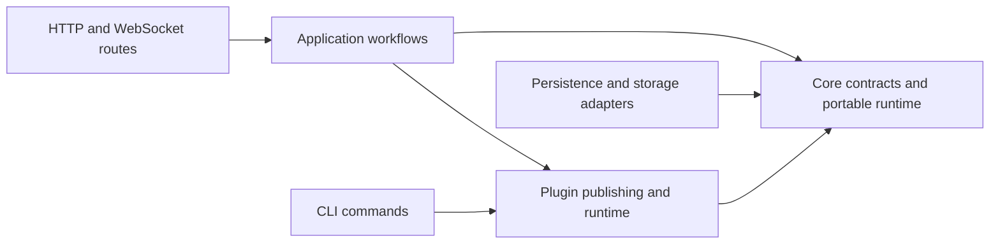

# Original backend structure audit

Recorded from this thread's read-only audit. Source locations describe the audit baseline; implementation progress is tracked in README.md.

The strongest cleanup opportunities are **shared ownership of authorization, graph creation, release resolution, and graph serialization**. Moving the plugin files will improve navigation, but consolidating those repeated policies is where substantial code reduction comes from.

I mapped 212 production Python files across the API and its backend libraries, totaling 63,572 lines, and traced the main workflows, callers, contracts, and tests in five parallel audits. **This audit made no edits.**

Two findings deserve attention before broad file movement: authorization implementations disagree, and graph creation paths establish different checkpoint state.

The proposed dependency direction is below. Application and deployment modules would sit outside the versioned route tree. [R26: Diagram Structural Explanations]

These are the findings I would act on, in priority order.

1. **Consolidate workspace authorization. The copies have already drifted.**

   The canonical [authorize_workspace](/Users/user/Work/grafY/libs/core/src/grafy_core/application/identity.py:44) checks credential-to-workspace binding, locks the workspace, and verifies the user, membership, and capability. [CollaborationService._authorize](/Users/user/Work/grafY/libs/core/src/grafy_core/application/collaboration.py:892) repeats only part of that policy. `SavedGraphService._require_capability` contains another copy.

   This reaches an exposed operation. The [graph-copy route](/Users/user/Work/grafY/apps/api/src/grafy_api/v1/routes/saved_graphs/views.py:264) authorizes the target workspace, accepts an independent source workspace in the body, and checks that source through the weaker collaboration helper. A target-bound PAT can therefore reach a source check that omits its workspace binding. This is a verified static path; I did not run a live reproduction.

   Use the canonical authorization functions inside the mutation transaction. Multi-workspace operations should use `authorize_workspaces` for deterministic lock ordering, with collaboration retaining its rejection audit behavior. Delete the duplicated policy implementations. [R01: Direct Ownership]

   The first regression test should cover a target-bound PAT whose user belongs to both workspaces. Copying from the other workspace must fail and remain audited.

2. **Give creation of a checkpointed graph one owner.**

   [Normal graph bootstrap](/Users/user/Work/grafY/libs/core/src/grafy_core/application/collaboration.py:207) stages the graph, revision, collaborative head, checkpoint mapping, and receipt. [Template instantiation](/Users/user/Work/grafY/libs/core/src/grafy_core/application/templates.py:196) and [module import](/Users/user/Work/grafY/libs/core/src/grafy_core/application/modules.py:297) independently construct similar state but omit the checkpoint mapping.

   Checkpointing looks for that mapping to recognize an already-checkpointed state. Without it, an immediate checkpoint can create revision 2 despite no document change.

   Extract one meaningful operation that stages the graph, revision, head, and initial checkpoint mapping inside the caller’s transaction. Keep template sanitization, module publication, folders, receipts, and audit with their respective workflows. This removes duplicated persistence sequencing across three real callers. [R18: One Layer Per Function]

   There is further retirement work here: production HTTP mutations already use collaboration, while older `SavedGraphService.create/replace/delete` paths remain heavily used by test setup. Migrate those fixtures to the canonical lifecycle, then remove the redundant mutators and head-initialization workaround. Preserve migration tests that deliberately construct historical state. [R10: Tests Must Not Justify Bad Design]

3. **Put publication consistency checks in the transaction that commits the change.**

   [Reviewed plugin publication](/Users/user/Work/grafY/apps/api/src/grafy_api/plugin_publication.py:238) checks the reviewed base revision, may build an OCI image, and then calls the release service to publish. The committing operation does not receive the expected base revision. A concurrent publication can move the selection between the check and write.

   Pass the reviewed revision or generation into the owning release operation and enforce it transactionally. Keep source re-verification, which protects a different invariant.

   [System revocation](/Users/user/Work/grafY/apps/api/src/grafy_api/plugin_publication.py:277) similarly checks active executions through API-owned SQL, closes that session, then revokes through another transaction. Its maintenance-drain guarantee needs a fence shared with execution admission.

   Moving these checks into their owning operations removes scattered SQL and check-then-command orchestration. It also makes the consistency rules testable as complete operations. These concurrency consequences were assessed statically.

4. **Separate plugin operator tooling, runtime hosting, and migration compatibility.**

   The API root contains **7,370 lines** across `plugin_*.py` and `system_*.py`. Those files have several distinct owners. I would start with the following structure; separate distributions are unnecessary for the initial cleanup.

   | Current code | Proposed owner |
   |---|---|
   | Authoring, verification, publication, OCI building | `grafy_api/operator/plugins/` |
   | Runtime admission, profiles, Docker invocation, artifact staging | `grafy_api/plugin_host/` |
   | SQL-backed System cutover and baseline generation | `grafy_persistence/cutover/` |
   | Cutover command parsing, files, reports | `grafy_api/operator/cutover/` |
   | Egress broker executable | A dedicated broker app |
   | Old host deployment loader/builder/bindings | Explicit operator compatibility package |

   One concrete dependency cleanup is to move runtime profile values out of [plugin_oci.py](/Users/user/Work/grafY/apps/api/src/grafy_api/plugin_oci.py:37), so runtime startup does not import image-building tooling.

   There is also removable active-runtime scaffolding. [Composition](/Users/user/Work/grafY/apps/api/src/grafy_api/services/composition.py:114) still accepts host bindings, and [admission](/Users/user/Work/grafY/apps/api/src/grafy_api/plugin_admission.py:149) carries unused host fields. Current startup loads builtins and isolated plugins, consistent with ADR 0007.

   **Preserve the public compatibility tools.** The [CLI still exposes host deployment commands and inputs](/Users/user/Work/grafY/apps/api/src/grafy_api/cli.py:709). Their loader/builder/binding cluster is approximately 1,265 lines, but that is relocation scope, not safe deletion. Keep persisted historical policy values readable as well. [R17: Delete Dead Abstractions]

5. **Move execution out of `v1/routes`, while preserving its useful internal divisions.**

   `v1/routes/executions/runtime` contains **8,559 lines** implementing compilation, scheduling, cancellation, caching, node execution, and plugin hosting. [Application composition imports that engine from the route package](/Users/user/Work/grafY/apps/api/src/grafy_api/services/composition.py:45).

   Move application execution into `grafy_api/execution/`, with plugin hosting in the package above. Split [executions/services.py](/Users/user/Work/grafY/apps/api/src/grafy_api/v1/routes/executions/services.py:52) into execution history, materialization, and HTTP presentation. The presenter belongs beside the route.

   Move durable execution request and plan contracts with execution, preserving their serialized form because queued-run recovery uses it. Keep genuinely HTTP-specific models in `v1`.

   A wholesale move into `grafy_core` would carry host dependencies inward. Start with ownership inside the application package. The persistent invocation-cache adapter is an exception: it already depends only on core contracts and can move beside core cache semantics. [R01: Direct Ownership]

6. **Resolve release facts once and derive execution input through one path.**

   [Preflight](/Users/user/Work/grafY/apps/api/src/grafy_api/v1/routes/executions/runtime/preflight.py:81) loads exact releases and scans their contracts. [Compilation](/Users/user/Work/grafY/apps/api/src/grafy_api/v1/routes/executions/runtime/compiler.py:499) loads and scans them again.

   Pass immutable resolved release facts through the existing preflight-to-compilation sequence. This can remove duplicate lookups, caches, and traversal.

   Preserve that sequence. [Tests explicitly require missing secret context to fail before saved-graph lookup](/Users/user/Work/grafY/tests/unit/api/runtime/test_graph_preflight.py:504). Running full compilation first would change observable behavior and could load modules earlier.

   Graph conversion has a similar duplication. [RunRequest.from_saved_graph](/Users/user/Work/grafY/apps/api/src/grafy_api/v1/routes/executions/models.py:152) and [nested module execution](/Users/user/Work/grafY/apps/api/src/grafy_api/v1/routes/executions/runtime/run_graph.py:130) reconstruct nodes, plugs, bindings, pins, and edges separately. Centralize that derivation under execution input ownership. Retain preflight’s comparison against the saved revision; sharing derivation must not remove validation of submitted topology.

7. **Make catalog assembly an application operation and delete `GraphModuleCatalog`.**

   [NodeRegistryResponse.from_registry](/Users/user/Work/grafY/apps/api/src/grafy_api/v1/routes/catalog/models.py:684) contains roughly 320 lines of ownership checks, collisions, readiness decisions, conversion validation, and catalog composition. Those rules should produce a validated catalog snapshot before HTTP serialization begins. [R18: One Layer Per Function]

   The [catalog route](/Users/user/Work/grafY/apps/api/src/grafy_api/v1/routes/catalog/views.py:34) also performs two release-list reads followed by selection and revocation reads for every release. Introduce a concrete release-state query that gathers those facts within one unit of work, then let one application catalog module combine releases, builtins, Modules, and admission results.

   A separate deletion is well supported: [GraphModuleCatalog](/Users/user/Work/grafY/apps/api/src/grafy_api/v1/routes/catalog/services.py:64) wraps the already-canonical [ModuleLibraryService.resolve_definition](/Users/user/Work/grafY/libs/core/src/grafy_core/application/modules.py:389). Production always supplies that service; the alternative path supports lightweight tests.

   Use `ModuleLibraryService` directly and remove the wrapper, fallback validation, unused `UnavailableGraphModule`, and unused boundary detector. Keep public response fields such as `unavailable_modules: []` where compatibility requires them. [R19: No Test-Seam Architecture]

8. **Unify the graph document model through a staged wire-contract migration.**

   Ordinary graph endpoints already use `SavedGraphDocument`. Collaboration defines **17 parallel API models** in [saved_graphs/models.py](/Users/user/Work/grafY/apps/api/src/grafy_api/v1/routes/saved_graphs/models.py:67), including repeated validators, legacy conversion handling, and extensive presentation mapping.

   The two shapes even name the same pin differently: `plugin_release_pin` in the canonical document and `plugin_release` in the collaboration response. Clients and test fixtures compensate for this difference.

   Reuse the canonical document internally. A cleaner eventual response is collaboration metadata plus `document: SavedGraphDocument`. During migration, preserve the existing flattened fields and aliases through one transport adapter, migrate clients, then retire the old shape under a versioned compatibility decision.

   This is one of the largest code-reduction opportunities, but the full reduction depends on that migration. [OpenAPI tests currently assert the mirrored schemas](/Users/user/Work/grafY/tests/integration/ops/test_openapi.py:434). [R08: Model-Owned Serialization]

9. **Extract runtime artifact availability from the HTTP artifact reader.**

   [ArtifactService](/Users/user/Work/grafY/apps/api/src/grafy_api/v1/routes/artifacts/services.py:365) combines downloads, tables, map rendering, tiles, WMS access, and reference availability. Execution imports this route-owned class to validate pins and materialized outputs.

   Give exact artifact-reference resolution and storage availability a concrete application owner. Batch row resolution, then share format-specific object enumeration. [Materialization currently validates references and checks accessibility separately](/Users/user/Work/grafY/apps/api/src/grafy_api/v1/routes/executions/services.py:361), causing repeated artifact reads.

   Preserve two distinct guarantees: object accessibility and verified content integrity. [Invocation-cache validation](/Users/user/Work/grafY/apps/api/src/grafy_api/v1/routes/executions/runtime/invocation_cache.py:83) deliberately performs stronger checks for some formats.

   After this extraction, HTTP content and spatial readers can remain cohesive concrete modules. A generic renderer registry would add machinery without a demonstrated need. [R41: No Speculative Extension Points]

10. **Share the persisted spatial contract and reconstruction logic.**

    [API spatial models](/Users/user/Work/grafY/apps/api/src/grafy_api/v1/routes/artifacts/models.py:282) duplicate [GIS plugin models](/Users/user/Work/grafY/plugins/gis/src/grafy_plugin_gis/models.py:220), including references, styles, bounds, and stored projection metadata. Their validators and defaults have already diverged.

    Put the shared, producer-neutral stored contracts in a dependency-light `grafy_core.spatial_contracts`, following the existing table and prompt contract pattern. Keep GDAL, network requests, tile serving, and HTTP render responses with their current deployment owners. This preserves plugin independence.

    The API and GIS resolver also repeat feature-collection reconstruction and logical-byte integrity checks. One shared spatial storage reader can remove that duplication, while each caller translates failures into its own contextual error.

    Preserve stored schema compatibility and OpenAPI defaults. Shared persisted models do not require identical HTTP response models.

11. **Reduce persistence serialization boilerplate, then split by feature ownership.**

    [schema.py](/Users/user/Work/grafY/libs/persistence/src/grafy_persistence/schema.py:67) repeats essentially the same Pydantic JSON decorator four times and string-enum decorator eleven times. Two small typed implementations, retaining named concrete column types, could remove substantial boilerplate.

    Keep specialized handling for UTC datetimes, artifact outputs, and enum collections, whose semantics differ. The verification requirement is unchanged SQL metadata and round-trip behavior, including malformed stored values. [R08: Model-Owned Serialization]

    Then split [repositories.py](/Users/user/Work/grafY/libs/persistence/src/grafy_persistence/adapters/repositories.py:121) and the table declarations into a small number of cohesive slices: identity, graphs, execution, plugins, and library. Keep one metadata/bootstrap aggregator.

    There are useful reductions within those slices. Execution-history listing already batch-hydrates requested nodes, while queue listing and interruption hydrate them per execution. Reuse the bulk operation while preserving queue and node ordering.

    These changes do not justify a generic repository base or separate concrete unit-of-work class for every feature. The shared transaction is doing real work. [R40: Real Interfaces Only]

12. **Separate artifact contracts from concrete in-memory persistence.**

    [grafy_core/artifacts.py](/Users/user/Work/grafY/libs/core/src/grafy_core/artifacts.py:268) owns artifact values, repository protocols, transaction protocols, and hundreds of lines of in-memory repositories for several features. Its [late imports explicitly acknowledge circular dependencies](/Users/user/Work/grafY/libs/core/src/grafy_core/artifacts.py:917).

    Move artifact repository contracts into `ports/artifacts.py`, and concrete in-memory implementations into a cohesive core runtime module. The in-memory unit of work has a production consumer in the isolated plugin guest, so it must remain production code.

    Extract a lifecycle-only transaction protocol for context entry, commit, and rollback. Eight feature protocols currently repeat that contract. Keep feature-specific repository requirements explicit.

    This also exposes an existing typing problem: saved-graph replacement accesses materialized outputs through reflective optional checks because its declared transaction contract omits that dependency. Declare the real requirement and remove the fallback.

    Preserve task isolation, clone/rollback behavior, and supported SDK import compatibility during these moves.

13. **Move cross-feature HTTP-host infrastructure to its actual owner.**

    Several smaller placement problems reinforce each other:

    - [GraphRoomHub](/Users/user/Work/grafY/apps/api/src/grafy_api/v1/routes/collaboration/hub.py:79) and the post-commit publisher are process-level infrastructure used by execution, workspaces, and saved graphs. Move them to `grafy_api/realtime/`.
    - [Generic error handling imports workspace views](/Users/user/Work/grafY/apps/api/src/grafy_api/http_errors.py:20) to obtain audit metadata. That metadata includes graph-folder, archive, and star operations. Move it to HTTP diagnostics, preferably attaching operation metadata beside route registration.
    - The same error handler owns malformed OIDC transaction cleanup. Delegate that workflow to the authentication adapter.
    - Workspace response models live under auth, and workspace routes reopen SQLAlchemy transactions to finish response assembly. Return complete typed application results and project them in the workspace transport module.
    - `NodeSecretService` belongs outside routes, but its encryption, binding, status, and resolution behavior should stay together.
    - `ImageUploadService` stages opaque files used by several families. Rename it `StagedUploadService`, reuse the domain result, and share staging logic while preserving sample-upload batch rollback.

    These are focused ownership changes. They do not require a universal service hierarchy. [R01: Direct Ownership]

14. **Remove duplicate composition state and proven dead scaffolding.**

    [WorkbenchComponents](/Users/user/Work/grafY/apps/api/src/grafy_api/services/composition.py:78) contains 14 fields that [startup copies into AppResources](/Users/user/Work/grafY/apps/api/src/grafy_api/main.py:177). Each dependency change must be reflected in both containers and the forwarding constructor.

    Give that runtime bundle one owner, for example by retaining it inside application resources instead of flattening its fields. Place its lifecycle cleanup with that owner. Keep construction explicit and preserve shutdown order.

    Other bounded candidates are:

    | Candidate | Recommended cleanup |
    |---|---|
    | [CompiledNode.execution_target](/Users/user/Work/grafY/apps/api/src/grafy_api/v1/routes/executions/runtime/models.py:41) | Remove the unread field, compiler map, and tuple plumbing. |
    | [RunExecutionManager.wait_for_events](/Users/user/Work/grafY/apps/api/src/grafy_api/v1/routes/executions/runtime/manager.py:637) | Remove the test-only forwarding method; test the production subscription interface. |
    | [Storage factory](/Users/user/Work/grafY/libs/storage/src/grafy_storage/factory.py:11) | Inline backend selection into its sole production caller, `configured_file_storage`. |
    | Duplicate stored-model loaders | Share the integrity reader used by artifact collections and table storage. |
    | [PluginRegistry parallel containers](/Users/user/Work/grafY/libs/core/src/grafy_core/plugins.py:629) | Store one immutable per-family declaration snapshot plus the indexes actually needed for lookup and collisions. |
    | [InstalledPluginRelease forwarding properties](/Users/user/Work/grafY/libs/core/src/grafy_core/domain/plugin_installations.py:133) | Prefer explicit access to the release or installation; retain behavior enforcing their pair invariant. |

    The first items are small deletions. Registry state consolidation deserves its own behavioral change because ordering, collision diagnostics, and freeze behavior must remain exact. [R17: Delete Dead Abstractions]

Several existing divisions should survive this cleanup: release versus installation versus selection; Module versus Template; coordinator versus node execution versus scalar runtime; raw cache persistence versus validated cache access; Local versus S3 adapters; and host versus guest validation. Their responsibilities are distinct. Collapsing them would move complexity into callers or weaken guarantees.

For implementation, I would start with authorization and graph-creation regression tests, then consolidate those policies. Follow with the internal deletions, catalog assembly, and execution relocation. Schedule graph wire-model and frozen plugin-contract consolidation separately because they require compatibility work.

The existing tests provide substantial protection for release admission, preflight ordering, MAP behavior, cancellation, cache integrity, spatial reads, uploads, and OpenAPI. Add focused coverage for the identified gaps: cross-workspace PAT copies, initial checkpoint idempotency, publication concurrency, and batch-query behavior.

The architecture rules need an accompanying correction. [Current structural tests require services to remain inside route folders](/Users/user/Work/grafY/tests/unit/architecture/test_import_boundaries.py:77), while the [backend reference still describes retired host execution and engine classes](/Users/user/Work/grafY/docs/design/backend-architecture.md:293). Replace directory-shape assertions with dependency rules: application and runtime modules must not import `v1.routes`; HTTP adapters perform transport conversion; current plugin hosting follows ADR 0007. This is a proposed documentation/rule update only. [R23: Maintain The Rules]

Verification was read-only. All **11 existing static architecture checks passed**, executed without starting the application or running pytest. Runtime and concurrency findings remain unverified by execution. The reviewed production source was at `2e56c06`; separate deployment and migration edits appeared during the audit and were left untouched.
