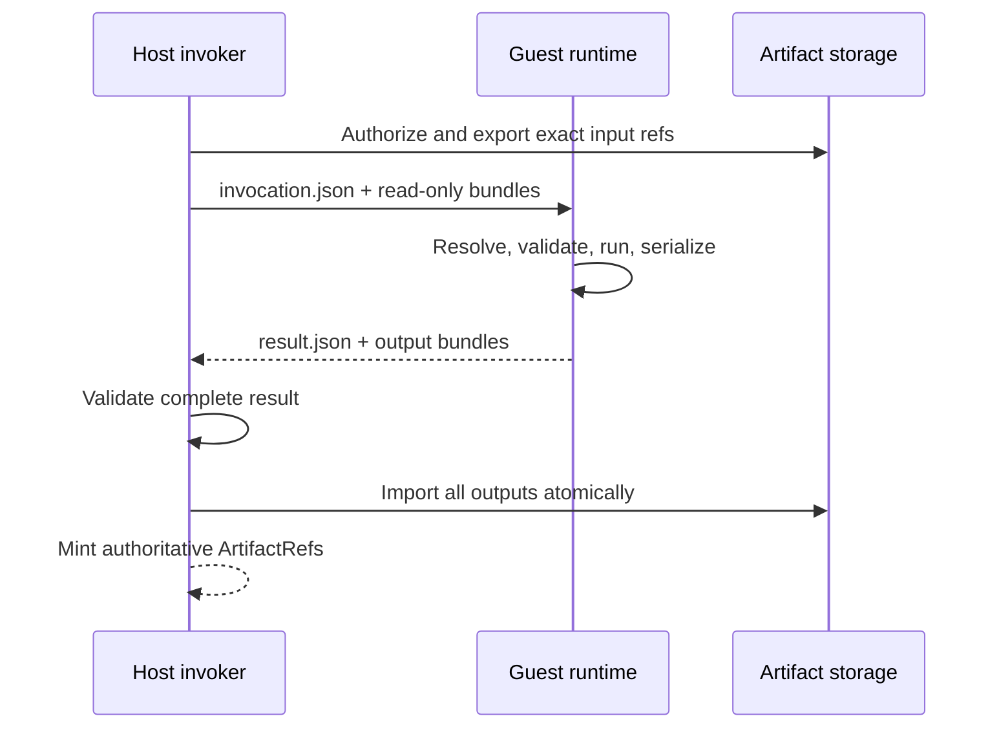

# Slice 3: Artifact invocation protocol

- **Status:** Complete
- **Updated:** 2026-08-24
- **Depends on:** [Slice 2](02-exact-release-pins.md)
- **Outcome:** A provider-neutral, typed host/guest protocol stages authorized
  input artifacts, executes one scalar Plugin invocation, atomically imports
  output bundles, and returns host-minted artifact references

## Why this slice exists

An `ArtifactRef` is an identity and type envelope, not content a networkless
container can read. Giving Plugin code database or object-store credentials to
resolve it would widen authorization and couple the guest to host persistence.

The artifact exchange contract is therefore the load-bearing execution
boundary. It should be implemented and contract-tested before Docker lifecycle
details obscure its behavior.

## Scope

- Versioned typed invocation, result, and failure envelopes.
- Host authorization and input staging.
- Relative-path artifact bundle manifests.
- Inline JSON-compatible artifact materialization and persistence.
- Plugin-owned input resolvers and output writers inside the guest boundary.
- Host validation, atomic multi-output import, and authoritative ref creation.
- Bounded logs, errors, byte counts, and file counts.
- Protocol tests using temporary directories or a local subprocess adapter.

## Non-goals

- Docker or OCI lifecycle.
- `table.data` and other large core formats.
- Secrets or outbound network access.
- Plugin-owned cross-Plugin codecs or conversions.
- Direct database/object-store access from the guest.
- Invocation caching.

## Fixed decisions

The host owns authorization and durable persistence. The guest owns Plugin
model validation, input resolution, computation, and output serialization.

The guest may propose bytes, type metadata, and output port bindings. It never
chooses authoritative artifact IDs, Workspace ownership, storage keys, or
database rows.

All transport paths are relative to an invocation root. Domain models must not
contain Docker mount paths or arbitrary host paths.

## Protocol shape

The current envelope is `grafy-plugin-invocation@2`. Version 2 adds explicit
Table row, column, and chunk ceilings to the invocation limits. Because the
models reject unknown fields, adding those fields to v1 would break immutable
v1 images; retained v1 releases therefore fail readiness compatibility checks
instead of receiving an envelope they cannot parse.

The request contains:

- protocol version;
- invocation, execution-scope, node, and optional MAP identities;
- exact Plugin release and operator identity;
- JSON configuration;
- input port bindings with type/version, cardinality, content digest, and
  relative bundle paths;
- declared output contracts;
- wall-time, input, output, file-count, and log limits.

The result needs:

- protocol version and invocation identity;
- success or a typed failure envelope;
- output port bindings with type/version, cardinality, content digest, byte
  count, and relative bundle paths;
- bounded structured progress or captured log references where supported.

## Expected ownership

- Invocation models and caller-owned port in core, near the Workspace release
  proxy rather than in Docker infrastructure
- Host artifact export/import adapter in the API artifact execution boundary
- Guest protocol entrypoint in a dedicated runtime package or image-owned
  module
- Existing artifact service/repositories for authorization and final
  persistence
- `OutputPersister` pass-through validation for returned refs

## Implementation checklist

### Typed protocol

- [x] Define a narrow protocol version constant with explicit compatibility
      errors.
- [x] Define typed invocation, artifact binding, limit, result, and failure
      models.
- [x] Reject unknown fields, absolute paths, traversal, and duplicate port
      bindings during model validation.
- [x] Keep transport models free of Docker, SQLAlchemy, FastAPI, storage
      clients, and live Python model classes.
- [x] Define bounded error codes for contract failure, materialization failure,
      operator failure, output validation, timeout, cancellation, and internal
      adapter failure.
- [x] Preserve execution, node, invocation, operator, and release context in
      failures without serializing sensitive payloads.

### Host input staging

- [x] Authorize each input `ArtifactRef` against the active Workspace before
      reading storage.
- [x] Reject inaccessible, missing, type-mismatched, or stale refs before guest
      execution.
- [x] Create one private invocation directory with separate input and output
      subdirectories.
- [x] Export only referenced input content and required metadata.
- [x] Use read-only links or copies without exposing the canonical object root.
- [x] Write a canonical invocation manifest after all staged inputs are
      complete.
- [x] Enforce aggregate input byte and file-count limits before execution.

### Guest execution

- [x] Load the exact release declaration and requested operator through the
      fixed import convention.
- [x] Verify invocation protocol and release/operator identity before running
      Plugin code.
- [x] Validate config and input models with the Plugin's Pydantic models.
- [x] Resolve inline input bundles through release-owned resolvers.
- [x] Execute one scalar invocation.
- [x] Serialize every output through release-owned writers into an empty
      output directory.
- [x] Produce a canonical result manifest only after all output bundles are
      complete.
- [x] Cap stdout, stderr, progress, output files, and total output bytes.

### Host output import

- [x] Treat all guest paths and metadata as untrusted.
- [x] Validate output ports, cardinality, type/version, path containment,
      regular-file status, sizes, and SHA-256 digests.
- [x] Validate the complete output set before exposing any result.
- [x] Import all output bundles through one commit-like application workflow.
- [x] Mint artifact IDs and storage keys on the host.
- [x] Commit artifact rows and output bindings atomically where the current UoW
      supports it.
- [x] Remove staged/imported-but-uncommitted content after failure.
- [x] Return only validated host-minted refs to the proxy node.
- [x] Remove invocation scratch links and files without mutating canonical
      stored objects.

### Initial inline format

- [x] Define the canonical inline JSON bundle format and schema version.
- [x] Preserve existing inline artifact canonicalization and content hashes.
- [x] Support scalar and sequence cardinality as declared by the port contract.
- [x] Reject host-unknown executable/Python metadata in an inline bundle.

## Verification checklist

- [x] Protocol models round-trip deterministically without Docker.
- [x] An invocation cannot reference `../`, an absolute path, a symlink, or an
      undeclared input file.
- [x] A Plugin cannot read an artifact from another Workspace.
- [x] A Plugin cannot mint an artifact ID or choose a canonical storage key.
- [x] Tampered input and output hashes are rejected.
- [x] Missing, duplicate, extra, wrong-type, and wrong-cardinality outputs are
      rejected.
- [x] A failure on the second output leaves no first output visible.
- [x] Oversized output, excessive files, and oversized logs fail predictably.
- [x] Scratch cleanup preserves canonical objects when links are used.
- [x] ONCE and MAP invocations return valid refs through the proxy.
- [x] Contract tests run with a fake or local subprocess invoker and no Docker.

## Exit criteria

- [x] The provider-neutral invocation protocol is stable and versioned.
- [x] Inline JSON artifacts execute end to end without host credentials in the
      guest.
- [x] Multi-output import is atomic from graph execution's perspective.
- [x] Host authorization and ref minting remain authoritative.
- [x] Docker can be added as an adapter without changing protocol semantics.
- [x] Catalog nodes remained fail-closed until the Docker adapter and complete
      declared artifact contracts became available.

## Agent handoff

- **Owner:** Codex
- **Branch or PR:** —
- **Implementation evidence:** Provider-neutral models in
  `libs/core/src/grafy_core/runtime/plugin_protocol.py`; the release-pinned proxy
  request in `plugin_invocation.py`; the fixed-convention guest in
  `plugin_guest.py`; and host authorization, staging, validation, and atomic
  import in
  `apps/api/src/grafy_api/plugins/runtime/artifacts.py`.
- **Verification evidence:** `uv run pytest tests/unit/core/test_plugin_protocol.py
  tests/unit/api/runtime/test_plugin_artifacts.py
  tests/integration/executions/test_workspace_plugin_protocol.py -q` (27 passed
  before the final duplicate-binding assertion; 9 protocol tests pass after
  that assertion); the wider execution/persistence regression selection passed
  154 non-subprocess tests, and the three subprocess tests passed in isolation.
  Focused Ruff and basedpyright checks report no findings, `create_app()`
  constructs successfully, and `git diff --check` is clean.
- **Compatibility note:** Slice 5 advanced the envelope to
  `grafy-plugin-invocation@2` for Table-specific limits. The protocol digest and
  frozen example SDK wheel advanced together; catalog readiness keeps v1
  releases visible but non-runnable.
- **Open decisions or blockers:** The local subprocess runner is intentionally a
  test/development adapter, not a production sandbox. Slice 4 owns OCI build,
  Docker isolation, cancellation escalation, and production composition.
