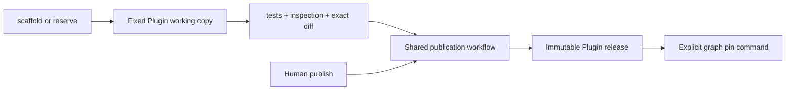

# Slice 7: Coding-agent authoring unification

- **Status:** Complete
- **Updated:** 2026-08-24
- **Depends on:** [Slice 1](01-source-freeze-and-convention.md),
  [Slice 2](02-exact-release-pins.md),
  [Slice 5](05-table-artifact-support.md), and
  [Slice 6](06-local-execution-queue.md)
- **Outcome:** Human publication and coding-agent authoring converge on the
  same fixed Plugin project and verified release workflow; graph release pins
  move only through an explicit, revisioned authoring command

## Scope correction

The original slice assumed a Canvas Generate product and legacy
`generated.node.<uuid>` catalog rows. Neither exists in this codebase. Building
that product solely to satisfy this slice would introduce a speculative second
authoring system. The delivered agent boundary is therefore the `grafy plugin`
CLI used by a coding agent in the deployment workspace. It scaffolds and
reserves a real Plugin working copy, produces a bounded review, and can publish
only the reviewed bytes through the ordinary publication workflow.

There are likewise no persisted synthetic generated-node rows to migrate.
The legacy agent origin value was unused and has been removed. An unknown historical
operator already follows the generic compatibility policy: preserve its saved
bytes and handles as inert, fail compilation closed, and require an explicit
copy into an ordinary Plugin before it can run.

## Fixed workflow

The deployment owns the authoring root, allowlisted roots, SDK source, runtime
profile, capability policy, database, and object store. The agent supplies a
stable Plugin slug, one operator slug, source edits, and an authorized actor.

Reservations are deployment-local `.grafy/authoring.json` files created with
exclusive file creation and mode `0600`. The descriptor carries the exact
Workspace, actor, session, path, source digest, reviewed digest, and reviewed
release head. It is control state, not part of the frozen Plugin archive.

## Implementation checklist

### Working copy and project output

- [x] Use a deterministic `<authoring-root>/<plugin-slug>` working-copy path.
- [x] Require the authoring root and every publication target to remain below
      deployment-allowlisted Plugin roots.
- [x] Fence one active authoring session with an exclusive reservation file.
- [x] Scaffold `pyproject.toml`, `uv.lock`, `src/grafy_plugin/`, tests, and
      `grafy_plugin.PLUGIN` using stable Plugin/operator slugs.
- [x] Build the deployment-owned `grafy-core` SDK in an isolated temporary copy
      and vendor the resulting wheel into the Plugin.
- [x] Keep cross-Plugin dependencies at artifact-contract boundaries.
- [x] Keep the first agent-authored executable flow on an empty capability set.

### Review and publication

- [x] Authorize the actor before executing Plugin tests or building an image.
- [x] Compare the verified frozen source archive with the latest retained
      release and return an exact, bounded source diff.
- [x] Report source, lock, node contract, artifact contract, capabilities, and
      runtime-profile changes.
- [x] Store the reviewed source digest and base release revision as publication
      fences.
- [x] Reject publication if either the working copy or release head changed
      after review.
- [x] Run human and reviewed-agent publication through
      `PluginPublicationWorkflow`, including snapshot tests, inspection,
      capability policy, OCI construction, and append-only release creation.
- [x] Release the authoring reservation only after successful publication or
      an explicit release command.

### Exact graph pins and compatibility

- [x] Preserve an existing exact pin while authoring, review, and publication
      are pending.
- [x] Show an explicit upgrade action only when the current catalog release is
      newer than the saved pin.
- [x] Apply release movement through the typed
      `update_node_plugin_release` graph command so collaboration creates an
      ordinary graph revision and invalidates only the affected execution
      descendants.
- [x] Keep all other nodes and graphs unchanged.
- [x] Preserve rollback: retained releases remain resolvable by exact revision,
      and the same typed pin command accepts an older retained revision.
- [x] Remove the unused synthetic agent catalog origin and document unknown
      historical operators as inert, copy-by-value compatibility records.

## Verification checklist

- [x] Human and reviewed-agent publication use the same application workflow
      and return the same immutable release for identical inputs.
- [x] An unauthorized actor is rejected before verification or image build.
- [x] A second reservation cannot overwrite the first authoring session.
- [x] Editing source after review leaves the catalog and graph unchanged.
- [x] A successful reviewed publication records the actor and releases the
      reservation.
- [x] A generated one-node project uses ordinary Plugin layout and never emits
      `generated.node` identity.
- [x] The graph document test proves exact pin movement changes only the chosen
      node and invalidates its execution descendants.
- [x] The node UI test proves the old pin remains until the explicit upgrade
      action is clicked.
- [x] Exact older releases remain compiler-resolvable after a newer publish;
      no latest-release retargeting occurs.
- [x] Unknown saved operators retain read-only compatibility rendering and fail
      execution closed.

## Exit criteria

- [x] Human and coding-agent authoring share one project convention and one
      publisher.
- [x] Agent review/publication has no authorization, test, inspection, image,
      capability, or repository bypass.
- [x] No synthetic agent Plugin origin or generated operator namespace remains.
- [x] Graph pin changes are explicit, exact, collaboration-aware, and
      revisioned.
- [x] Historical unknown-node behavior has a tested fail-closed transition
      policy.

## Agent handoff

- **Owner:** Codex
- **Branch or PR:** —
- **Implementation evidence:** `plugins/publication/authoring.py` owns fixed scaffolding,
  reservation, review diff, and review/head fences. `plugins/publication/workflow.py` is
  the shared human/agent verified publication boundary. `PluginReleaseService`
  owns the `publish_plugin` authorization check and append-only release write.
  The Workbench uses the typed `update_node_plugin_release` authoring command.
- **Verification evidence:** `test_plugin_authoring.py` exercises SDK vendoring,
  scaffold, reservation conflict, full review, stale-review rejection, shared
  publication, actor attribution, and cleanup. Focused publication/pin tests
  pass 29/29. Graph document, room bridge, and node UI tests pass 37/37 with
  TypeScript typecheck and regenerated OpenAPI contracts.
- **Open decisions or blockers:** None. A richer Canvas authoring experience and
  a release-history chooser are separate product work; they must call these
  existing boundaries rather than create another release path.
