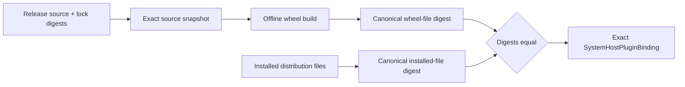

# Work packet 04: Frozen source to installed host-byte attestation

- **Status:** Substantially implemented; audit and verification incomplete
- **Parent slices:** [Slice 9](../09-system-catalog-and-runtime.md) and
  [Slice 12](../12-compatibility-cutover.md)
- **Outcome:** A host binding is emitted only when the installed distribution's
  executable files equal a wheel rebuilt from the exact staged release source

## Problem

The deployment builder previously verified the repository source against the
release, then independently hashed whatever distribution happened to be
installed. Matching catalogs did not prove that installed host code came from
the frozen source.

The attestation must form one continuous chain:



The immutable release remains a source/contract/OCI fact. The host digest is a
deployment attestation and belongs in `SystemHostPluginBinding`, not as mutable
release metadata.

## Required invariants

1. Repository project resolution is confined beneath the explicit repository
   root; symlink and traversal escapes fail closed.
2. The deterministic source archive and raw `uv.lock` digests exactly match the
   staged release before any host binding is considered.
3. The wheel is built from a reconstructed copy of that verified snapshot.
   The build uses only the pinned backend wheel in the snapshot's `wheels/`
   directory. Network access, package indexes, and ambient caches are disabled.
4. Wheel inspection rejects traversal, duplicate paths, encrypted entries,
   symlinks, non-regular entries, excessive file counts/bytes, and distribution
   name mismatch.
5. Wheel and installed distributions use one canonical digest domain and the
   same inclusion rules. Exclude only installer-generated files such as
   `RECORD`, `INSTALLER`, `REQUESTED`, `direct_url.json`, bytecode, and cache
   metadata.
6. The installed loader module must be one of the regular files covered by the
   installed distribution digest.
7. The binding carries exact release ID, scoped identity, revision, descriptor,
   source, contract, retained OCI archive, selection generation, loader target,
   catalog, and host build digest.
8. Startup recomputes the installed digest and refuses any mismatch. No fallback
   to ambient discovery or a different loaded implementation is allowed.
9. Failure occurs before writing/replacing the deployment manifest.

## Current partial state

The interrupted implementation has added:

- source and lock verification in `system_plugin_deployment.py`;
- an offline `uv build --wheel` from a temporary reconstructed snapshot;
- `wheel_distribution_build_digest()` in `system_plugin_loader.py`;
- canonical wheel/installed distribution file hashing;
- installed-vs-rebuilt digest comparison before binding;
- tests for source drift, project symlink escape, lock mismatch, installed tamper,
  generation behavior, and isolated-only omission.

The targeted files compile, but the focused deployment/loader suites were not run
to completion after the final edit. Treat the code as partial.

## Owned files

- `apps/api/src/grafy_api/plugins/compatibility/deployment.py`
- `apps/api/src/grafy_api/plugins/compatibility/loader.py`
- `tests/unit/api/test_system_plugin_deployment.py`
- `tests/unit/api/test_system_plugin_loader.py`
- `infra/docker/api.Dockerfile` only if a real test proves the production image
  installs host packages in a form that cannot satisfy the attestation

Do not change release persistence, OCI guest loading, publication authority, or
promotion policy in this packet.

## Implementation steps

1. Audit the partial canonical inclusion rules. The wheel and installed paths
   must produce identical logical names for identical package bytes.
2. Sanitize the wheel-build subprocess environment. Preserve only the minimum
   platform variables required to find `uv` and create temporary files. Use
   `--offline`, `--no-cache`, `--no-index`, and the snapshot's `wheels/`
   directory. Keep the bounded timeout, bounded diagnostics, and closed file
   descriptors [R09: Narrow IO Boundaries].
3. Translate `SystemPluginDeploymentError`, build timeout, and subprocess failure
   into a contextual `SystemPluginDeploymentBuildError` without losing the cause.
4. Verify that a real current host-eligible package rebuilt from its exact source
   matches the installed distribution. If the API image installs it editably or
   adds unowned files, fix the image installation rather than weakening the
   digest.
5. Keep manifest construction typed and atomic; do not serialize an ad hoc dict
   [R08: Model-Owned Serialization].

## Behavioral acceptance tests

Add or finish tests proving:

- a real exact source package produces a binding and survives loader revalidation;
- changing implementation bytes without changing the catalog is rejected;
- changing installed package bytes is rejected;
- a wheel with traversal, duplicate path, symlink, encrypted entry, or wrong
  distribution metadata is rejected;
- installer-generated metadata differences do not create a false mismatch;
- a loader module outside the hashed distribution is rejected;
- a failed comparison does not create or replace the output manifest;
- isolated-only releases are verified for source/OCI facts but omitted from host
  bindings.

At least one test must use a real built wheel and real installed-distribution
fingerprint. Mock-only equality does not prove the chain [R43: Tests Are
Behavioral Contracts].

## Focused gate

```bash
uv run pytest -q -o log_cli=false \
  tests/unit/api/test_system_plugin_deployment.py \
  tests/unit/api/test_system_plugin_loader.py

uv run ruff check \
  apps/api/src/grafy_api/plugins/compatibility/deployment.py \
  apps/api/src/grafy_api/plugins/compatibility/loader.py \
  tests/unit/api/test_system_plugin_deployment.py \
  tests/unit/api/test_system_plugin_loader.py

uv run basedpyright \
  apps/api/src/grafy_api/plugins/compatibility/deployment.py \
  apps/api/src/grafy_api/plugins/compatibility/loader.py
```

## Definition of done

- A binding cannot be produced for unrelated or tampered installed bytes, even
  when the loaded Plugin exposes the expected catalog.
- Startup rehashes the same canonical file set and validates the loader target.
- A real exact package passes the complete source→wheel→installed→binding chain.
- Focused tests, Ruff, type checking, and `git diff --check` pass.
- Implementation evidence is appended below.

Current implementations live under `grafy_api.plugins.compatibility`; old module
paths retain public re-exports. Historical evidence below keeps the paths used by
those original runs.

## Implementation evidence

Files changed (relative to HEAD):

- `apps/api/src/grafy_api/system_plugin_deployment.py` (new) — the deployment manifest builder, including this completion's additions:
  - the offline `uv build` subprocess runs with a sanitized environment. It also uses `--no-cache`, `--no-index`, and `--find-links <snapshot>/wheels`, so the rebuild cannot read the user's uv cache or a package index;
  - every host-eligible Plugin pins `setuptools==84.0.0` and carries the reviewed `setuptools-84.0.0-py3-none-any.whl` in its frozen source. The wheel SHA-256 is `51a52592b3b99e102b609654876bd65f19f999935166d1352678931132b0c670`;
  - build diagnostics are captured and bounded (tail of `stderr`/`stdout`, `_WHEEL_BUILD_DIAGNOSTIC_MAX_CHARS = 4096`) inside the `SystemPluginDeploymentBuildError` message;
  - `SystemPluginDeploymentError` from wheel inspection or installed-distribution fingerprinting is translated into a contextual `SystemPluginDeploymentBuildError` with the original exception preserved as the cause (`from exc`), alongside the existing timeout/subprocess-failure translation;
  - the pre-existing contract verified here: the host/installed digest mismatch is rejected before the output manifest is written, and the output manifest is created only after every byte-level check passes.
- `apps/api/src/grafy_api/system_plugin_loader.py` (new) — canonical wheel/installed-distribution digest domain (shared file enumeration, installer-generated entries such as `RECORD` ignored, unsafe paths, duplicate paths, symlink entries, encrypted entries, and wrong distribution `METADATA` rejected).
- `tests/unit/api/test_system_plugin_deployment.py` (new) — 10 tests using a real built wheel chain for the idempotent-manifest and generation tests; this completion fixed the two stale tests: `test_builder_rejects_installed_distribution_tamper` now expects the typed message `installed distribution does not match the wheel rebuilt from staged revision 1` and asserts the output manifest is not created; `test_builder_all_mode_uses_latest_staged_revision_per_inventory_entry` monkeypatches `wheel_distribution_build_digest` consistently with `installed_distribution_build_digest` so the test stays focused on revision selection.
- `tests/unit/api/test_system_plugin_loader.py` (new) — 19 tests, including this completion's three wheel-inspection tests: `test_wheel_digest_rejects_unsafe_or_nonregular_entries` (traversal, duplicate path, symlink, encrypted ZIP entry), `test_wheel_digest_rejects_wrong_distribution_metadata`, `test_wheel_and_installed_digests_share_one_canonical_domain` (installer-generated files such as `RECORD` produce no false mismatch).

Focused gates (all green):

- `uv run pytest -q -o log_cli=false tests/unit/api/test_system_plugin_deployment.py tests/unit/api/test_system_plugin_loader.py` → 29 passed.
- `uv run ruff check apps/api/src/grafy_api/system_plugin_deployment.py apps/api/src/grafy_api/system_plugin_loader.py tests/unit/api/test_system_plugin_deployment.py tests/unit/api/test_system_plugin_loader.py` → All checks passed.
- `uv run basedpyright apps/api/src/grafy_api/system_plugin_deployment.py apps/api/src/grafy_api/system_plugin_loader.py` → 0 errors.
- `git diff --check` → clean.

Deliberately unsupported states: wheel rebuilds are strictly offline and use only the build backend in the verified source snapshot. No network egress, package index, uv cache, or ambient uv configuration can influence the attested build. Isolated-only releases are attested for source and OCI facts but never host-bound.

Remaining blockers: none.
