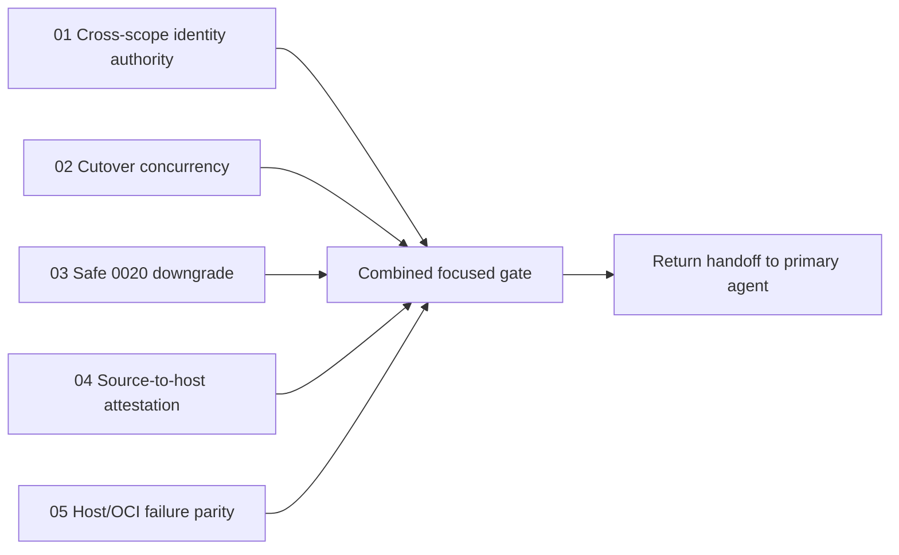

# Focused correctness handoff

- **Status:** Paused for lower-cost model handoff
- **Prepared:** 2026-08-24
- **Audience:** An autonomous coding agent working in the existing dirty worktree
- **Goal:** Finish the five correctness items below without expanding into the
  remaining Workspace Plugin plan, package refresh, documentation reconciliation,
  Git, or pull-request work

## Start here

The previous implementation agents were interrupted deliberately. Their partial
edits remain in the worktree. Do not reset, revert, or replace them. Read the live
diff before editing and preserve unrelated work [R01: Direct Ownership].



The work packets are independent enough to run in parallel when each worker owns
only its listed files:

1. [Cross-scope release identity authority](01-cross-scope-release-identity-authority.md)
2. [Cutover concurrency and atomicity](02-cutover-concurrency-and-atomicity.md)
3. [Safe migration 0020 downgrade](03-safe-0020-downgrade.md)
4. [Frozen source to installed host-byte attestation](04-source-to-host-byte-attestation.md)
5. [Typed host/OCI execution failure parity](05-host-oci-failure-parity.md)

## Current worktree checkpoint

- All prior subagents are stopped.
- The worktree is intentionally very dirty because it contains the implementation
  of Slices 8–12. Treat every unrelated change as user-owned.
- The targeted production files in these five packets currently compile with
  `python -m py_compile`.
- The cross-scope catalog query/check and source-wheel comparison are partially
  implemented but were interrupted before their focused gates completed.
- The cutover lock/CAS work and the 0020 downgrade guard had not landed when the
  agents were stopped.
- The failure-parity production boundary is partially implemented. At this
  checkpoint, `test_system_adapter_parity.py` reports `2 passed, 1 failed`; the
  remaining failure still expects `PluginInvocationError`, while production now
  raises the provider-neutral `NodeRunError`.

These notes describe the snapshot, not acceptance evidence. Re-read the code; do
not assume a partial edit is correct.

## Operating constraints

- Work only on the five packets. Do not update Slice statuses, rebuild vendored
  wheels, regenerate all locks, run the live egress acceptance, commit, push, or
  modify the pull request.
- Use `apply_patch` for file edits. Do not use destructive Git commands.
- Add behavior tests at the public service, migration, deployment, or execution
  boundary. Do not create test-only production seams [R43: Tests Are Behavioral
  Contracts].
- Keep domain/application decisions inward and persistence, subprocess, and
  database-dialect details in their adapters [R01: Direct Ownership].
- Preserve the original exception as `__cause__` whenever an error is translated,
  and include release/operator identifiers in the rendered message [R42: Errors
  Carry Context].
- After every signature or protocol change, run an import/construction check plus
  the focused tests [R20: Verify After Signature Changes].
- If the live code contradicts a packet, stop and report the contradiction rather
  than silently broadening scope.

## Combined focused gate

Run each packet's smaller gate first. When all five are green, run:

```bash
uv run pytest -q -o log_cli=false \
  tests/unit/application/test_plugin_release_catalog.py \
  tests/unit/persistence/test_plugin_release_persistence.py \
  tests/unit/persistence/test_migrations.py \
  tests/unit/persistence/test_system_cutover.py \
  tests/unit/api/test_system_plugin_deployment.py \
  tests/unit/api/test_system_plugin_loader.py \
  tests/unit/api/runtime/test_system_adapter_parity.py \
  tests/unit/api/runtime/test_graph_execution_coordinator.py

uv run ruff check \
  libs/core/src/grafy_core/application/plugin_releases.py \
  libs/core/src/grafy_core/ports/plugin_releases.py \
  libs/core/src/grafy_core/runtime/execution.py \
  libs/persistence/src/grafy_persistence/adapters/repositories.py \
  infra/db/migrations/versions/0020_plugin_release_selections.py \
  libs/persistence/src/grafy_persistence/system_cutover.py \
  apps/api/src/grafy_api/system_plugin_deployment.py \
  apps/api/src/grafy_api/system_plugin_loader.py \
  apps/api/src/grafy_api/execution/coordinator.py \
  apps/api/src/grafy_api/execution/models.py \
  tests/unit/application/test_plugin_release_catalog.py \
  tests/unit/persistence/test_plugin_release_persistence.py \
  tests/unit/persistence/test_migrations.py \
  tests/unit/persistence/test_system_cutover.py \
  tests/unit/api/test_system_plugin_deployment.py \
  tests/unit/api/test_system_plugin_loader.py \
  tests/unit/api/runtime/test_system_adapter_parity.py \
  tests/unit/api/runtime/test_graph_execution_coordinator.py

uv run basedpyright \
  libs/core/src/grafy_core/application/plugin_releases.py \
  libs/core/src/grafy_core/ports/plugin_releases.py \
  libs/core/src/grafy_core/runtime/execution.py \
  libs/persistence/src/grafy_persistence/adapters/repositories.py \
  libs/persistence/src/grafy_persistence/system_cutover.py \
  apps/api/src/grafy_api/system_plugin_deployment.py \
  apps/api/src/grafy_api/system_plugin_loader.py \
  apps/api/src/grafy_api/execution/coordinator.py \
  apps/api/src/grafy_api/execution/models.py

git diff --check
```

If a listed test path has been renamed by another live edit, locate it with `rg
--files` and record the replacement in the packet instead of deleting coverage.

## Handoff format

For each completed packet, append a short `Implementation evidence` section with:

- the exact files changed;
- the exact focused commands and pass counts;
- any deliberately unsupported state;
- any remaining blocker.

Do not mark a packet complete from code inspection alone [R24: Code Evidence In
Summaries].
