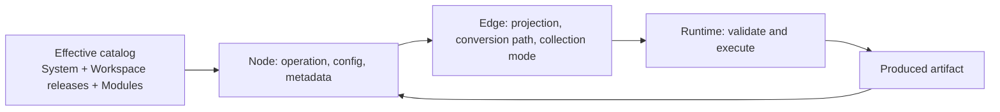

# Workbench interaction plan

## Purpose

This document records the interaction and runtime decisions for the first usable
Grafy workbench. It is an implementation plan for contributors, not a list of
possible features. A task belongs in the committed slice only when its acceptance
criteria appear below.

The visual thesis is a restrained graph canvas where **nodes own operations** and
**edges own transport semantics**. Configuration and produced artifacts stay on
the node. Projection, declared conversion, collection mapping, and removal stay
on the edge. Run controls act on either the complete canvas or the user's current
selection.

## Status

- **Done** — implemented and retained.
- **In progress** — part of the current implementation slice.
- **Deferred** — deliberately excluded until the current contract is proven.

## Confirmed model

An artifact type and schema version are the nominal compatibility boundary. A
Python class is the runtime representation of that contract, not an alternative
graph-level compatibility system. A declared field projection lets an edge take
a nested value from a compound artifact without introducing a boilerplate
adapter node. A declared, versioned artifact conversion lets the same edge
materialize one nominal artifact type as another. Projection selects a value;
conversion changes its representation. Installed conversions form a directed
graph, while each edge persists one bounded, acyclic path through that graph.
The fixed edge order is projection, conversion path, then collection handling;
the runtime validates and replays the stored path instead of rediscovering it.

Collection behavior follows the same ownership rule. An operator declares the
value shape it handles for one call. An incoming edge decides whether to pass a
collection directly or invoke the target once for each item. The runtime may use
an internal invocation model, but invocation is not user-owned node state.

## Retained foundation

These capabilities already work and must remain intact during the interaction
rewrite:

| Capability | Status | Why it stays |
| --- | --- | --- |
| Node configuration generated from backend JSON Schema | Done | A plugin can add configuration without adding a hand-written web form. |
| Configuration rendered directly on each node | Done | The canvas remains the place where a workflow is understood and edited; no configuration sidebar is needed. |
| Produced-artifact appendix after execution | Done | Results remain associated with the operation that produced them and can expose their content links. |
| Nominal artifact types, schema versions, and declared projections | Done | Compatibility is deterministic and can be validated before execution. |
| Declared, versioned artifact conversions | Done | Canonical representation changes such as integer to text remain explicit without requiring boilerplate nodes. |
| Scoped immutable Plugin releases | Done | The effective catalog combines selected global System releases, selected releases owned by the requested Workspace, and published Modules as a separate entry kind. Every newly inserted Plugin node carries an exact scoped release pin. |
| Explicit catalog and execution policy | Done | Scope, System distribution, and execution policy are separate facts. One shared admission selects an exact bound System host adapter or retained OCI and reports stable disabled reasons. |
| Generic Image, Sequence, Arithmetic, Text, Schema, and Prompt System families | Done | Bundled System catalog families admit only producer-neutral artifacts and broadly reusable, deterministic, dependency-light nodes; Schema is one recursive builder rather than a canvas-level algebra of schema tokens. |
| Optional provider-backed families | Done | Provider dependencies remain package-owned. Their remaining entry-point loading and origin-shaped grouping are compatibility behavior pending immutable System baselines and saved-pin backfill in Slice 12. |

The retained Plugin model follows
[ADR 0004](adr/0004-unify-system-and-workspace-plugin-releases.md). Compatibility
origin fields and generic host entry-point discovery are not product concepts
and remain removable only through the guarded Slice 12 cutover.

## Current implementation tasks

### T1. Make edge transport the public execution contract — Done

**Description.** Replace node-owned `once`/`map` request state with an edge
collection mode:

- `direct` forwards the value as produced and requires compatible effective
  source and target shapes;
- `map` accepts a sequence from the source and drives one target invocation per
  item on the connected item port;
- each edge independently stores its optional projection path;
- at most one mapped edge drives a target node in this first contract.

The runtime can continue to use `NodeInvocation` internally, but the API derives
it from incoming edges instead of accepting it on every node.

**Justification.** Projection and mapping describe how one produced value travels
through one connection. Keeping them on the source or target node prevents two
outgoing connections from making independent choices and makes the canvas lie
about what an existing connection will do.

**Acceptance criteria.**

- Run-node payloads contain operator identity, version, and configuration but no
  invocation selection.
- Run-edge payloads contain projection and `direct`/`map` collection mode.
- Invalid direct or mapped cardinalities fail during graph validation with edge
  and port context.
- The existing internal once/map execution tests remain behavioral contracts.

### T2. Put projection, mapping, editing, and deletion on the edge — Done

**Description.** Render a custom edge with a compact midpoint control. The
control displays the selected field path and whether items are mapped. It opens
an editor for those values and provides a visible remove action. Output ports no
longer store an "emit as" draft.

**Justification.** A setting must be edited where its effect is visible. This
also lets two nested fields leave the same compound output port on different
edges without overwriting one another.

**Acceptance criteria.**

- An existing edge can change its field projection and immediately updates its
  label and run payload.
- An edge can switch between passing a whole compatible value and mapping its
  items when both choices are valid.
- Every edge has a visible delete affordance.
- Multiple outgoing edges retain independent settings.

### T3. Simplify node controls — Done

**Description.** Remove the Invocation row. Add a compact remove button in the
top-right of the node and a help button that reveals the node description. Keep
schema-driven configuration and produced artifacts in the node body.

**Justification.** Node chrome should explain and control the operation itself.
Always-visible prose and a transport-policy dropdown consume space while hiding
the controls that users actually need during graph editing.

**Acceptance criteria.**

- Removing a node also removes its incident edges.
- The node description is available from the help control and is not permanently
  rendered in the body.
- No Invocation control remains on the node.

### T4. Run the current selection — Done

**Description.** Add `Run selected` alongside `Run all`. Selected execution uses
the selected nodes, their internal edges, and incoming edges that cross from an
unselected upstream node. It does not silently add or execute upstream nodes.
For every crossing edge, the client pins the exact `ArtifactRef` or
`ArtifactRefSequence` from the materialized binding for the current graph id,
graph revision, upstream node id, and source port. The edge still owns and
applies its projection and `direct`/`map` collection mode. If that exact binding
is absent, `Run selected` refuses to submit; the server never substitutes a
fuzzy lookup for the latest artifact.

**Justification.** Building a workflow is iterative. Re-running unrelated OCR or
other expensive branches just to test a small arithmetic or text fragment makes
the workbench slow and unpredictable. Exact selection also keeps the action
faithful to what the user highlighted.

**Acceptance criteria.**

- Drag-selecting nodes and choosing `Run selected` submits only those nodes,
  their internal edges, and their incoming crossing edges; upstream source nodes
  remain unexecuted.
- Each incoming crossing edge carries the exact revision-scoped upstream
  `ArtifactRef` or `ArtifactRefSequence` as a run-scoped pin.
- Projection and `direct`/`map` semantics continue to be applied by the crossing
  edge after its source value is pinned.
- A selected fragment whose crossing edge has no current upstream output reports
  a useful error with run-upstream and `Run with dependencies` guidance instead
  of executing additional nodes or asking the server to discover a "latest"
  artifact.
- Results and running state outside the selected fragment remain untouched.
- Pins and live running state remain transient. Revision-scoped materialized
  outputs are durable runtime records outside the saved graph aggregate.
- `Run all` preserves the existing whole-graph behavior.

### T5. Derive useful metadata from node definitions — Done

**Description.** Keep plugin slug and title on `Plugin`, expose node title,
description, and plugin slug on Plugin declarations, derive the description
from the class docstring, and serialize port titles/descriptions from
`Annotated`/Pydantic metadata into the release catalog contract.

**Justification.** A node definition should be the source of truth. Duplicating
display metadata in FastAPI or the web app makes release-backed Plugins
incomplete and causes descriptions to drift from implementation.

**Acceptance criteria.**

- The API does not hand-author node descriptions or port labels.
- Decorated classes expose the same identity and descriptive metadata as their
  serialized release contracts.
- Port metadata reaches the node UI through the effective catalog response.

### T6. Remove superseded state and update vocabulary — Done

**Description.** Delete dead output-treatment and node-invocation UI code, update
generated API types, and amend `CONTEXT.md` and the README so durable vocabulary
matches edge-owned mapping.

**Justification.** Leaving both models in the repository would make the old one
look supported and invite new code to depend on it. Dead abstractions should be
removed when their owner disappears. [R17: Delete Dead Abstractions]

**Acceptance criteria.**

- Searches find no user-facing node invocation or output-treatment ownership.
- Public documentation describes edge-owned collection mapping.
- Generated OpenAPI and TypeScript contracts match the server.

### T7. Verify the contract at its real boundaries — Done

**Description.** Add focused runtime/API tests for direct and mapped edges and
selected-fragment validation where practical, then run Python tests, lint, type
checks, generated-client verification, a production web build, and a live canvas
smoke test.

**Justification.** Registration and generated-client failures often appear at
framework construction rather than in isolated functions. Tests should assert
public graph behavior, while the live smoke test checks the actual controls the
user sees. [R20: Verify After Signature Changes] [R43: Tests Are Behavioral Contracts]

**Completed verification (2026-07-13).**

- `just check` passed 100 Python tests, Ruff, ESLint, basedpyright, TypeScript,
  generated OpenAPI client verification, and the production Next.js build.
- A browser smoke test changed an edge projection, connected a mapped node's
  effective `many` output to a collection input, removed an edge, and removed a
  node together with its incident edges and stale artifacts.
- The whole arithmetic example ran and displayed each produced artifact on its
  node.
- At that date, drag selection executed the then-current exact-fragment contract.
  Upstream output pinning was implemented later; no additional verification
  result is recorded here.

### T8. Persist exact graph materializations — Done

**Description.** Record each successful saved-graph output as runtime state keyed
by graph id, graph revision, node id, and output port. Loading a saved graph
restores only bindings for that exact revision whose artifact references are
accessible through the active runtime. This does not add execution results to
the saved graph document.

Default `Run selected` reuses these exact bindings for unselected crossing
sources. `Run with dependencies` is a separate action: it computes the full
upstream closure of the selection and executes the expanded graph instead of
quietly changing the meaning of the default action.

**Justification.** Durable revision-scoped bindings let users continue work after
reloading a saved graph without making graph structure depend on runtime state.
The exact key prevents outputs from another revision, node, or port from being
treated as "latest", while explicit dependency expansion keeps execution scope
predictable.

**Acceptance criteria.**

- Successful outputs for saved runs are stored separately from saved graph
  structure and canvas layout.
- "Latest" resolves only by graph id, graph revision, node id, and output port;
  there is no type-wide or producer-wide fallback.
- Loading materializations returns only bindings whose references are accessible
  through the active runtime.
- Default selected execution reuses exact bindings and blocks when a required
  binding is missing, with guidance to run upstream or run with dependencies.
- `Run with dependencies` expands and executes the selection's full upstream
  closure.

### T9. Put canonical artifact conversions on edges — Done

**Description.** Let plugins register a stable conversion key, source artifact
type, target artifact type, display title, source runtime type, and pure
conversion callable. Run and saved edges store an ordered, bounded path of exact
conversion keys. The runtime applies an optional field projection first,
composes every stored conversion in memory, materializes the final target
artifact, then applies the edge's `direct` or `map` collection handling.

The first declared conversion is `scalar.integer@1` to `scalar.text@1`. Drawing
that connection should select the conversion automatically when it is the only
compatible route, while the resulting edge label and editor continue to show
the choice explicitly. Declarations `X -> Y` and `Y -> Z` also make an
`X -> Z` route available without adding a visible adapter node.

**Justification.** Canonical, context-free representation changes do not earn a
visible operation node, but silently coercing Python values would bypass the
nominal artifact contract and make saved graphs depend on the currently
installed registry. A persisted conversion key keeps authoring concise and
execution deterministic.

**Acceptance criteria.**

- Registry metadata exposes active conversion keys, source and target artifact
  contracts, versions, and titles; duplicate or dangling declarations fail
  during registry construction.
- Run and saved edges round-trip their ordered conversion path, while legacy
  singular conversion input migrates to a one-step path.
- Graph validation rejects unknown, discontinuous, cyclic, or excessive paths
  and source/target mismatches before any node executes.
- Runtime order is projection, conversion path, collection handling; projection
  plus multi-hop conversion and item-wise sequence conversion are covered
  behaviorally, and only the final converted artifact is materialized.
- A unique compatible shortest path is selected automatically during a real
  pointer-drag connection and remains visibly labeled on the edge.
- Saving, reopening, and running the graph preserve the selected conversion.
- Generated OpenAPI and TypeScript contracts match the server.

**Completed verification (2026-07-15).**

- `just check` passed 205 Python tests, 7 web conversion-route tests, Ruff,
  ESLint, basedpyright, TypeScript, generated OpenAPI client verification, and
  the production Next.js build.
- Focused graph tests covered direct and transitive conversion, projection before
  every conversion step, full-path conversion of ordered sequences, final-only
  materialization, exact persisted-path replay, ambiguity and traversal bounds,
  registry runtime-type composability, and pre-execution rejection of invalid
  paths. [R20: Verify After Signature Changes] [R43: Tests Are Behavioral Contracts]
- A real browser pointer drag from a Number output to a Replace text input
  selected the sole declared route and displayed `value → As text`; the edge
  editor exposed `builtin.scalar.integer_to_text@1`.
- Saving and reloading preserved the conversion key and label, and the reloaded
  graph ran successfully from `9` to the displayed text output `nine` with no
  browser-console errors.

### T10. Derive structural scalar projections from artifact schemas — Done

**Description.** Let a canonical scalar artifact declare the JSON value type it
materializes. When the plugin registry freezes, derive projections for nested
object fields whose JSON Schema type is `string` or `integer`. A string field can
then connect directly to `scalar.text@1`; an integer field first projects to
`scalar.integer@1` and can continue through the declared integer-to-text
conversion path. The edge persists the exact field path and conversion path.

Text nodes operate on raw Python strings. `TextValue` remains the compatibility
name for the persisted `{ "value": ... }` payload model, so existing artifacts
and their schema identity remain stable while the wrapper no longer leaks into
node execution.

**Justification.** Selecting a runtime scalar from a structured API response is
transport behavior, not a user-visible operation. Deriving the mechanical cases
from the registered schema removes boilerplate projection declarations without
weakening nominal artifact compatibility or adding implicit runtime coercion.

**Acceptance criteria.**

- Nested object `string` and `integer` leaves, including local JSON Schema
  references, become deterministic field projections at registry freeze time.
- Explicit declarations win at the same path and remain available for
  plugin-owned semantics; invalid, duplicate, dangling, cyclic, or incompatible
  declarations fail with artifact and path context.
- Arrays and schema-less dynamic values are not guessed. Plugins must declare
  those projections explicitly.
- Runtime order remains projection, conversion path, collection handling, and
  saved graphs replay the exact persisted route.
- Projection traversal and conversion paths are bounded, and conversion runtime
  types use conservative composability rules that cannot admit a chain rejected
  by strict runtime validation.
- Text persistence keeps the existing inline payload, hashes, provenance, and
  public payload schema while node inputs, outputs, and conversions use `str`.

**Completed verification (2026-07-15).**

- `just check` passed 284 Python tests, 31 web tests, Ruff, ESLint,
  basedpyright, TypeScript, generated OpenAPI client verification, and the
  production Next.js build. [R20: Verify After Signature Changes]
- Focused API tests executed a nested JSON string directly as text and a nested
  integer through `scalar.integer@1 -> scalar.text@1`, then verified the
  resulting artifact content. Registry tests cover local references, explicit
  overrides, invalid canonical targets, cycles, depth/count limits, and strict
  runtime-type composability. [R43: Tests Are Behavioral Contracts]
- Browser and runtime verification covered two nested integer fields flowing
  from one compound output through independently selected projection routes.
  Ongoing automated coverage uses `test.compound_result@1`; production
  arithmetic nodes now expose `scalar.integer@1` results directly.

### T11. Collect any homogeneous artifact type — Done

**Description.** Add the generic `sequence.collect@1` operation with one shared
artifact-type variable, `T`. Each Collect node instance persists one concrete
binding for `T`; its ordered input plugs accept either one `T` artifact or one
sequence of `T`, and its output is one sequence of `T`. Execution expands source
sequences exactly one level in plug order and preserves the existing artifact
references.

The first compatible connection binds an unbound Collect instance. The edge
continues to own any field projection and artifact conversion path used to reach
that bound type. Removing edges does not silently discard the binding. Once all
incident edges are gone, the user can explicitly reset the node to `Any artifact`
and bind it again.

**Justification.** Collection changes cardinality, not domain meaning. Keeping a
separate collector for text, images, and every future artifact type duplicates
the same ordering behavior and prevents users from composing heterogeneous
shapes of the same type. A node-owned generic binding keeps the operation
homogeneous and executable while allowing the existing edge conversion system
to remain the one representation-change boundary. [R01: Direct Ownership]

**Acceptance criteria.**

- Registry contracts distinguish a concrete artifact type from a named
  artifact-type variable without encoding variables as fake artifact ids.
- One Collect instance accepts scalar and sequence inputs of its bound type,
  flattens one level in saved plug order, and rejects a different artifact type.
- Connecting a compatible concrete endpoint binds an unbound Collect; unique
  projection/conversion routes can establish the binding as part of the same
  connection.
- The concrete binding is included in run requests and saved graph documents,
  survives reloads and restarts, and participates in exact saved-fragment
  validation.
- The binding can be reset only when the node has no incident edges.
- A selected Collect-only run can reuse accessible materialized scalar and
  sequence outputs from its unselected upstream nodes.
- Image-sequence merge and text-specific collection nodes are retired; generic
  `Collect<T>` is the single built-in collection operation.
- Count, Slice, and Pick item work over the same bound homogeneous sequence
  contract without introducing artifact-specific variants.
- The Image family owns the producer-neutral `image.raster@1` contract and
  `image.decode@1`; legacy Sources operator and artifact identities are rejected
  explicitly rather than silently rewritten.

**Completed browser verification (2026-07-15).**

- Connecting an image-sequence edge bound a generic Collect instance to
  `image.raster@1`; save and reload retained that binding and its
  materialized previews.
- Running only Collect reused the persisted upstream image output. Adding a
  second ordered input preserved the upstream run and flattened both inputs to
  two output images.
- Removing an input edge retained the concrete binding. Reset remained disabled
  until the final incident edge was removed, then explicitly returned the node
  to `Any artifact`.
- Automated verification passed: 277 Python tests, 35 web tests, Ruff, ESLint,
  basedpyright, TypeScript, OpenAPI contract drift, and the Next.js production
  build.

**Historical pre-release-cutover catalog and Image-contract verification
(2026-07-16).**

- Runtime and API tests cover Count on empty and populated sequences, Slice
  reference and index-key preservation, Pick item identity, strict configuration
  validation, and contextual unordered/out-of-range errors.
- The then-current compatibility catalog exposed 21 nodes: 17 host-loaded nodes
  grouped as Image 1, Sequence 4, Arithmetic 6, Text 4, Schema 1, and Prompt 1,
  plus one registered LLM node and three OCR nodes in a separate origin-based
  group. That grouping records a historical
  smoke result; it is not the System/Workspace release taxonomy or target
  catalog architecture.
- A saved Image upload retained exactly two ordered
  `{upload_key, filename, byte_size}` records, with no connector identity,
  absolute URI, selection wrapper, or duplicate order index. Reload restored the
  Upload images and Collect previews in `page-002.png`, `page-001.png` order.
- A continuous real pointer drag from Upload images to a second unbound Collect
  created a second edge and bound `T` from `Any artifact` to `image.raster@1`.
  React Flow handle measurement completed before the concrete edge was
  published; the fresh browser console contained no errors or warnings.
- The seeded scalar-arithmetic canvas opened with five disconnected nodes. A real
  pointer drag from Number 9 to the Left input of Add integers created the visible
  edge and changed the canvas status from zero to one connection; the browser
  console contained no errors or warnings.
- Clean-break API tests reject the retired `source.local_upload.images@1`
  operator and `source.page_image@1` artifact binding instead of silently
  rewriting saved graphs.
- Automated verification passed: 342 Python tests, 36 web tests, Ruff, ESLint,
  basedpyright, TypeScript, OpenAPI contract drift, the Next.js production build,
  and the OCR-backed workbench smoke workflow. [R20: Verify After Signature Changes]
  [R43: Tests Are Behavioral Contracts]

### T12. Reuse exact node invocations — Done

**Description.** Add a global invocation cache that is separate from
revision-scoped materialized output bindings. Node declarations default to
`never`; deterministic built-ins opt into `exact`. The versioned fingerprint
includes validated config defaults, operator identity, stable node/module
identity, invocation mode and mapped item index, artifact-type bindings, exact
ordered input refs with SHA-256 values, and opaque secret revisions. Mapping
looks up and publishes each item independently and persists each miss before
continuing.

**Justification.** Materialized bindings answer “what did this saved graph node
last produce?” They cannot safely answer “has this exact computation already
been performed?” A separate digest-keyed record permits reuse across restarts
and unrelated graph revisions without weakening graph output identity. Provider
nodes remain fail-closed until their declaration can account for
every mutable dependency and credential revision. [R01: Direct Ownership]
[R44: Sensitive Serializable State]

**Acceptance criteria.**

- Pure Arithmetic, Text, Sequence, Schema, Prompt, and module-output operations
  explicitly use exact caching; uploads, module wrappers, OCR, and LLM nodes do
  not cache by default.
- A config, operator version, stable node/module identity, mapped index, type
  binding, input ref/container, content hash, or opaque secret revision change
  creates a miss.
- Successful ONCE invocations reuse their persisted artifact refs. MAP reuses
  completed items in order, persists new items immediately, and never caches a
  failed item.
- Cache rows publish first-writer-wins and stale deletion is conditional on the
  observed generation.
- A hit validates every referenced artifact row and stored object. Missing or
  mismatched artifacts evict the entry; a storage outage preserves it and
  reports contextual failure.
- SQLite/PostgreSQL persistence is created by Alembic migration
  `0005_invocation_cache` and survives a fresh workbench service.

**Completed verification (2026-07-16).**

- The full Python suite passed 465 tests. Focused contracts cover canonical
  fingerprints, policy inventory, ONCE reuse, mixed MAP hits/misses, partial
  failure resume, SQL first-writer-wins publication, generation-safe deletion,
  stale artifact eviction, storage-outage preservation, service restart, module
  execution, and migration/schema drift. [R43: Tests Are Behavioral Contracts]
- Ruff, basedpyright, and diff checks passed for the implementation. [R20: Verify After Signature Changes]

## Deliberately deferred

### Concurrent cold-miss coalescing — Deferred

Cache publication is atomic and first-writer-wins, but simultaneous cold misses
may both execute before either result is published. A lease or single-flight
coordinator belongs in a separate change when provider nodes have an explicit
exact-cache policy and production measurements justify the added failure and
timeout states. The current cache avoids duplicate work on subsequent runs and
resumes completed mapped items after partial failure. [R41: No Speculative Extension Points]

### Zip, Cartesian, and multi-driver mapping — Deferred

The initial mapping contract has exactly one driver. Additional collection
algebra needs explicit ordering, length-mismatch, and output-shape semantics; it
must not emerge accidentally from multiple mapped edges.

### Filesystem workspaces and remote plugin runtimes — Deferred

Python package entry points solve the current plugin registration and dependency
boundary. Workspace discovery or isolated remote runtimes should be introduced
only when an actual deployment or development workflow requires them. This does
not include saved-graph persistence: graph documents are stored in the active
workbench's migrated SQLite database, while discovery of multiple filesystem
workspaces remains deferred. The web route
`/workspaces/{workspace_slug}/graphs/{graph_uuid}` is the canonical address for that
single active workbench; its `local` segment does not imply tenant isolation or
workspace-scoped authorization.
